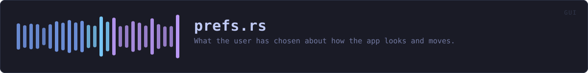
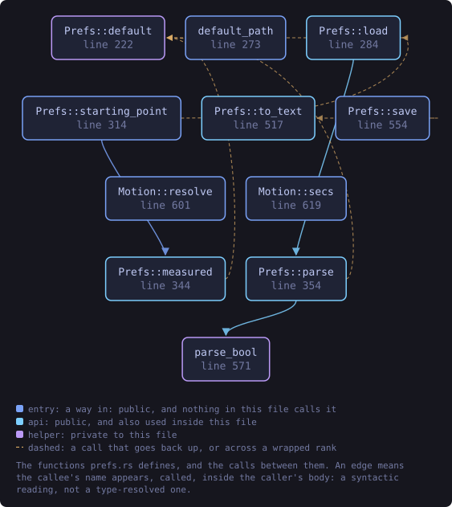
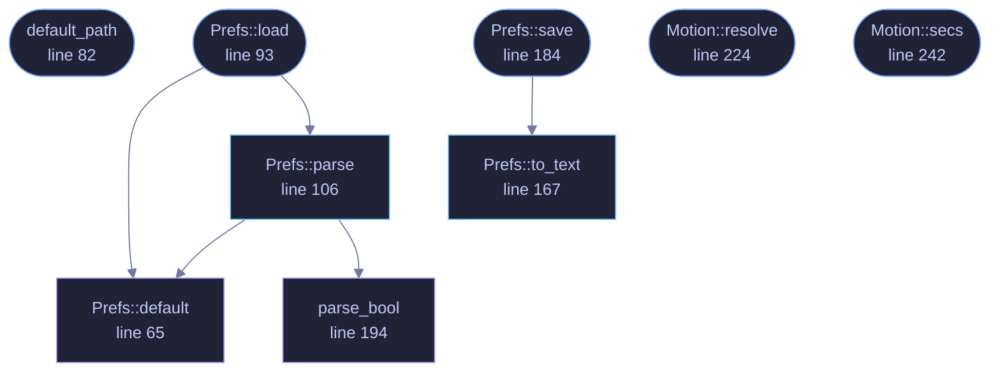

<!-- SPDX-License-Identifier: GPL-3.0-or-later -->
<!-- GENERATED by tools/docs/generate.py from the doc comments in the
     source. Do not edit this file: edit the `//!` and `///` comments in
     the .rs files and run the generator again. CI verifies it with
         python tools/docs/generate.py --check
-->

  

# `crates/veilvoice-gui/src/prefs.rs`

[`veilvoice-gui`](../../../crates/veilvoice-gui/README.md) &middot; 405 lines &middot; [read the source](https://github.com/tilas01/veilvoice/blob/main/crates/veilvoice-gui/src/prefs.rs)

## Contents

- [Nothing here is secret, and nothing here is required](#nothing-here-is-secret-and-nothing-here-is-required)
- [The format](#the-format)
- [Animations](#animations)
  - [What this file contains](#what-this-file-contains)
  - [What calls what](#what-calls-what)
  - [Items](#items)

What the user has chosen about how the app looks and moves.

# Nothing here is secret, and nothing here is required

Preferences are a convenience. Every field has a working default, a missing
file is not an error, and a corrupt one is not either -- it falls back to
the defaults and says so in the settings panel rather than refusing to
start. An app that will not open because its preferences file has a stray
byte in it has turned a cosmetic setting into an outage.

This is deliberately *not* written through
`veilvoice_crypto::privatefile`. That module exists for files whose
contents are sensitive, and using it here would blur a distinction worth
keeping: your choice of colour scheme is not a secret, and treating it like
one would make the real protections look like decoration.

# The format

One `key = value` per line, ASCII, with `#` comments -- readable and
editable with any text editor, for the same reason the integrity manifest
is a text format. No parser dependency, and no way for a malformed file to
do anything more interesting than be ignored.

# Animations

On by default, and switchable off in two places: the settings panel, and
the `VEILVOICE_NO_ANIMATION` environment variable, which wins over the file
so that a machine which struggles with them can be fixed without opening
the UI that is struggling.

The system's own "reduce motion" setting is honoured above both. Someone who
has told their operating system they do not want movement has already
answered this question, and a privacy tool asking again -- and defaulting to
yes -- would be ignoring them.

## What this file contains

405 lines defining **9 functions** (7 public), **2 types** and **0 constants**. Everything below is read out of the source, so it cannot disagree with the code.

**The types it owns.**

- `struct Prefs` (line 41) -- Everything the user can choose about presentation.
- `struct Motion` (line 212) -- Whether movement is allowed, and how much.

**What happens when it runs.** These are the ways in: public, and nothing else in this file calls them, so they are what an outside caller reaches first.

- `default_path` (line 82) -- Where preferences live: beside the app lock, in this platform's config directory.
- `Prefs::load` (line 93) -- Read preferences from path.
  - reaches: `default`, `parse`, `parse_bool`
- `Prefs::save` (line 184) -- Write preferences to path, creating the directory if needed.
  - reaches: `to_text`
- `Motion::resolve` (line 224) -- Resolve for this frame.
- `Motion::secs` (line 242) -- A duration scaled by whether motion is allowed.

## What calls what

The functions this file defines, and the calls between them. Both
are read out of the source: an edge means the callee's name appears,
called, inside the caller's body. It is a syntactic reading, not a
type-resolved one, so a call made through a trait object or a macro
will not appear.

_Colour key: **entry** -- a way in: public, and nothing in this file calls it; **api** -- public, and also used inside this file; **helper** -- private to this file._

  

The same graph as Mermaid source

## Items

| Item | Line | Documentation |
|---|---:|---|
| `Prefs` pub struct | [41](https://github.com/tilas01/veilvoice/blob/main/crates/veilvoice-gui/src/prefs.rs#L41) | Everything the user can choose about presentation. |
| `Prefs::default` fn | [65](https://github.com/tilas01/veilvoice/blob/main/crates/veilvoice-gui/src/prefs.rs#L65) |  |
| `default_path` pub fn | [82](https://github.com/tilas01/veilvoice/blob/main/crates/veilvoice-gui/src/prefs.rs#L82) | Where preferences live: beside the app lock, in this platform's config directory. |
| `Prefs::load` pub fn | [93](https://github.com/tilas01/veilvoice/blob/main/crates/veilvoice-gui/src/prefs.rs#L93) | Read preferences from path. |
| `Prefs::parse` pub fn | [106](https://github.com/tilas01/veilvoice/blob/main/crates/veilvoice-gui/src/prefs.rs#L106) | Parse the key = value format. |
| `Prefs::to_text` pub fn | [167](https://github.com/tilas01/veilvoice/blob/main/crates/veilvoice-gui/src/prefs.rs#L167) | Serialise to the text format. |
| `Prefs::save` pub fn | [184](https://github.com/tilas01/veilvoice/blob/main/crates/veilvoice-gui/src/prefs.rs#L184) | Write preferences to path, creating the directory if needed. |
| `parse_bool` fn | [194](https://github.com/tilas01/veilvoice/blob/main/crates/veilvoice-gui/src/prefs.rs#L194) |  |
| `Motion` pub struct | [212](https://github.com/tilas01/veilvoice/blob/main/crates/veilvoice-gui/src/prefs.rs#L212) | Whether movement is allowed, and how much. |
| `Motion::resolve` pub fn | [224](https://github.com/tilas01/veilvoice/blob/main/crates/veilvoice-gui/src/prefs.rs#L224) | Resolve for this frame. |
| `Motion::secs` pub fn | [242](https://github.com/tilas01/veilvoice/blob/main/crates/veilvoice-gui/src/prefs.rs#L242) | A duration scaled by whether motion is allowed. |

---

Generated from `crates/veilvoice-gui/src/prefs.rs`. On the website: [`website/reference/veilvoice-gui/prefs.html`](../../../website/reference/veilvoice-gui/prefs.html).

Signing key fingerprint `8101FB3BB28D02FB239E0CDF9CC1C7E7A9B5833A`.
