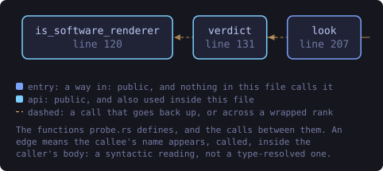
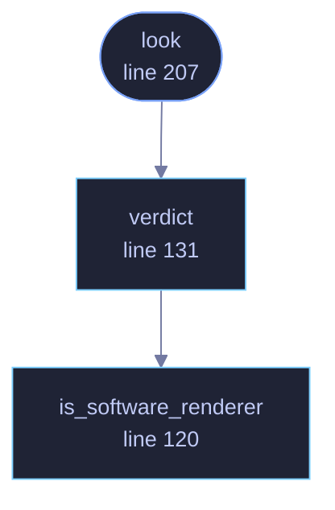

<!-- SPDX-License-Identifier: GPL-3.0-or-later -->
<!-- GENERATED by tools/docs/generate.py from the doc comments in the
     source. Do not edit this file: edit the `//!` and `///` comments in
     the .rs files and run the generator again. CI verifies it with
         python tools/docs/generate.py --check
-->

  

# `crates/veilvoice-gui/src/probe.rs`

[`veilvoice-gui`](../../../crates/veilvoice-gui/README.md) &middot; 426 lines &middot; [read the source](https://github.com/tilas01/veilvoice/blob/main/crates/veilvoice-gui/src/probe.rs)

## Contents

- [The difference this draws](#the-difference-this-draws)
- [What it asks, and what it costs](#what-it-asks-and-what-it-costs)
- [It decides where to start, and never what is allowed](#it-decides-where-to-start-and-never-what-is-allowed)
- [Finding a device is not proof it works](#finding-a-device-is-not-proof-it-works)
- [In plain words](#in-plain-words)
  - [What this file contains](#what-this-file-contains)
  - [What calls what](#what-calls-what)
  - [Items](#items)

What this machine answers, so the settings it starts on were measured here.

# The difference this draws

A default is a decision taken on behalf of somebody who has not been asked.
There are two ways to take one. It can be written down, which means it was
decided once by somebody who has never seen the machine it will run on, or
it can be measured, which means the machine was asked and answered.

Most of VeilVoice's starting values are already the second kind and were
not described that way. The frame rate is `0`, which means the display's
own rate, and `crate::pace` measures it from the intervals between frames
rather than assuming sixty. Whether anything animates is resolved every
frame against the operating system's own reduce-motion setting, which
`crate::reduced_motion` reads from the platform. Neither of those is a
number somebody chose.

The drawing path was the one that was still written down: hardware
acceleration was asked for on every machine, because asking is the safe
direction and a machine that cannot give a hardware context is given a
software one instead. That is true and it is not free. On a machine whose
only graphics device is a software renderer, the request is made, refused
and fallen back from on every single launch, and the answer was never in
doubt: there is no hardware there to ask for.

So this module asks.

# What it asks, and what it costs

One question, through `veilvoice_video::accel::look`, which lists the
graphics devices this system reports: `lspci` on Linux, the management
interface on Windows, the system profiler on macOS. That is a subprocess,
and a subprocess on the path that decides how the window is made would be a
poor trade if it ran every launch.

It does not. The answer is wanted exactly once, on the run that has no
settings file to read, and it is written into that file with everything
else. Every later launch reads it back. Within a single process it is
cached in a `OnceLock` as well, because the window is created in `main`
before `crate::settings::Settings::load` runs and both want the answer.

# It decides where to start, and never what is allowed

**Roadmap item 170.** Every value here stays a setting. The probe moves the
point a first run begins from; it removes nothing, and the Settings tab and
the first-run card both show what was found and let it be overridden. A
measurement that could not be taken says so and falls back to asking for
hardware, which is what every build before this one did on every machine.

# Finding a device is not proof it works

The same caveat `veilvoice_video::accel::Adapter::caveat` states about
encoders applies here, in one direction only. A machine that lists a real
graphics card may still have a driver that accepts a hardware context and
then draws badly, which from inside the process looks exactly like success
and which nothing here can detect. That is why the setting exists and why
the first-run card names the symptom. What the probe can establish is the
other direction: a machine that lists *no* hardware at all will not produce
any, and asking it to is a request that can only be refused.

# In plain words

The first time you open VeilVoice it looks at what your computer has,
instead of assuming. If your machine has no graphics hardware, it does not
spend every launch asking for some. It writes down what it found, so it
only has to look once, and you can change any of it afterwards.

## What this file contains

426 lines defining **3 functions** (3 public), **1 type** and **1 constant**. Everything below is read out of the source, so it cannot disagree with the code.

**The types it owns.**

- `struct Machine` (line 77) -- What was asked of this machine, and what it said.

**What happens when it runs.** These are the ways in: public, and nothing else in this file calls them, so they are what an outside caller reaches first.

- `look` (line 207) -- Ask this machine, once per process.
  - reaches: `verdict`, `is_software_renderer`

## What calls what

The functions this file defines, and the calls between them. Both
are read out of the source: an edge means the callee's name appears,
called, inside the caller's body. It is a syntactic reading, not a
type-resolved one, so a call made through a trait object or a macro
will not appear.

_Colour key: **entry** -- a way in: public, and nothing in this file calls it; **api** -- public, and also used inside this file._

  

The same graph as Mermaid source

## Items

| Item | Line | Documentation |
|---|---:|---|
| `Machine` pub struct | [77](https://github.com/tilas01/veilvoice/blob/main/crates/veilvoice-gui/src/probe.rs#L77) | What was asked of this machine, and what it said. |
| `SOFTWARE_RENDERERS` const | [103](https://github.com/tilas01/veilvoice/blob/main/crates/veilvoice-gui/src/probe.rs#L103) | Names a graphics device has when it is a renderer running on the processor. |
| `is_software_renderer` pub fn | [120](https://github.com/tilas01/veilvoice/blob/main/crates/veilvoice-gui/src/probe.rs#L120) | Whether a device name is one of the processor renderers. |
| `verdict` pub fn | [131](https://github.com/tilas01/veilvoice/blob/main/crates/veilvoice-gui/src/probe.rs#L131) | Read a list of graphics devices and decide what to ask the driver for. |
| `look` pub fn | [207](https://github.com/tilas01/veilvoice/blob/main/crates/veilvoice-gui/src/probe.rs#L207) | Ask this machine, once per process. |

---

Generated from `crates/veilvoice-gui/src/probe.rs`. On the website: [`website/reference/veilvoice-gui/probe.html`](../../../website/reference/veilvoice-gui/probe.html).

Signing key fingerprint `8101FB3BB28D02FB239E0CDF9CC1C7E7A9B5833A`.
