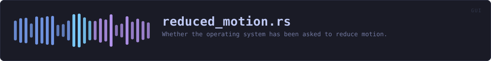
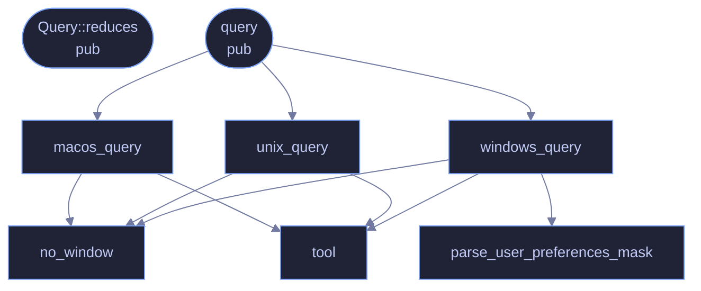

<!-- SPDX-License-Identifier: GPL-3.0-or-later -->
<!-- GENERATED by tools/docs/generate.py from the doc comments in the
     source. Do not edit this file: edit the `//!` and `///` comments in
     the .rs files and run the generator again. CI verifies it with
         python tools/docs/generate.py --check
-->

  

# `crates/veilvoice-gui/src/reduced_motion.rs`

[`veilvoice-gui`](../../../crates/veilvoice-gui/README.md) &middot; 324 lines &middot; [read the source](https://github.com/tilas01/veilvoice/blob/main/crates/veilvoice-gui/src/reduced_motion.rs)

## Contents

- [Why this exists rather than an egui call](#why-this-exists-rather-than-an-egui-call)
- [Read once, at startup](#read-once-at-startup)
- [Absolute paths, always](#absolute-paths-always)
- [When it cannot tell](#when-it-cannot-tell)
  - [What calls what](#what-calls-what)
  - [Items](#items)

Whether the operating system has been asked to reduce motion.

# Why this exists rather than an egui call

egui does not surface the platform's accessibility preference, so it has to
be read here. The website gets this for free -- CSS has
`prefers-reduced-motion` and the browser answers it -- and it would be odd
for the desktop app to be the one front-end that ignores the setting.

# Read once, at startup

Every platform answers this through a subprocess, and a subprocess per
frame would be indefensible in a paint loop. It is read once when the app
starts and cached for the session. Someone who changes the setting while
VeilVoice is open sees it on the next launch, which is the same behaviour
most applications have.

# Absolute paths, always

`Command::new("defaults")` is a *search*, and on Windows that search
includes the current working directory -- which is precisely the defect
(F-13) this project fixed in `veilvoice-watch` and `veilvoice-guard`. Every
tool here is named by absolute path, and an unfound tool answers "I do not
know" rather than falling back to a search.

# When it cannot tell

`Query::Unknown` means the platform was not asked or did not answer, and
the caller treats that as "no reduction requested" -- because defaulting to
*off* would silently disable animation for everybody on a platform this
cannot read, which is a worse failure than missing the preference for the
few who set it. The settings panel only claims the system asked for reduced
motion when it actually saw it say so.

## What calls what

The functions this file defines, and the calls between them. Both
are read out of the source: an edge means the callee's name appears,
called, inside the caller's body. It is a syntactic reading, not a
type-resolved one, so a call made through a trait object or a macro
will not appear.

## Items

| Item | Line | Documentation |
|---|---:|---|
| `no_window` fn | [52](https://github.com/tilas01/veilvoice/blob/main/crates/veilvoice-gui/src/reduced_motion.rs#L52) | Spawn without a console window. |
| `Query` pub enum | [64](https://github.com/tilas01/veilvoice/blob/main/crates/veilvoice-gui/src/reduced_motion.rs#L64) | What the platform said. |
| `Query::reduces` pub fn | [77](https://github.com/tilas01/veilvoice/blob/main/crates/veilvoice-gui/src/reduced_motion.rs#L77) | Whether to treat this as a request to reduce motion. |
| `tool` fn | [83](https://github.com/tilas01/veilvoice/blob/main/crates/veilvoice-gui/src/reduced_motion.rs#L83) | Resolve a tool to an absolute path. |
| `query` pub fn | [97](https://github.com/tilas01/veilvoice/blob/main/crates/veilvoice-gui/src/reduced_motion.rs#L97) | Ask the operating system. |
| `windows_query` fn | [121](https://github.com/tilas01/veilvoice/blob/main/crates/veilvoice-gui/src/reduced_motion.rs#L121) | Windows: "Show animations in Windows" lives in the UserPreferencesMask under HKCU\Control Panel\Desktop. |
| `parse_user_preferences_mask` fn | [151](https://github.com/tilas01/veilvoice/blob/main/crates/veilvoice-gui/src/reduced_motion.rs#L151) | Pull the mask out of reg query output and read the animation bit. |
| `macos_query` fn | [175](https://github.com/tilas01/veilvoice/blob/main/crates/veilvoice-gui/src/reduced_motion.rs#L175) | macOS: the Accessibility "Reduce motion" switch. |
| `unix_query` fn | [200](https://github.com/tilas01/veilvoice/blob/main/crates/veilvoice-gui/src/reduced_motion.rs#L200) | Linux and the BSDs: GNOME's enable-animations, which the other major desktops have largely adopted as the common key. |

---

Generated from `crates/veilvoice-gui/src/reduced_motion.rs`. On the website: [`website/reference/veilvoice-gui/reduced_motion.html`](../../../website/reference/veilvoice-gui/reduced_motion.html).

Signing key fingerprint `8101FB3BB28D02FB239E0CDF9CC1C7E7A9B5833A`.
