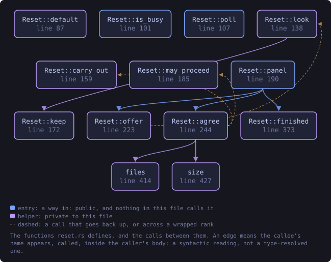
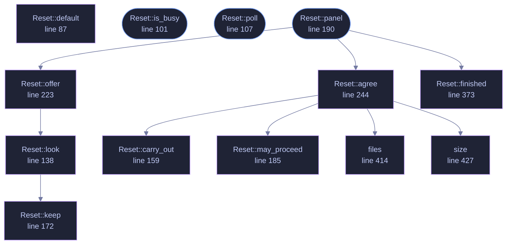

<!-- SPDX-License-Identifier: GPL-3.0-or-later -->
<!-- GENERATED by tools/docs/generate.py from the doc comments in the
     source. Do not edit this file: edit the `//!` and `///` comments in
     the .rs files and run the generator again. CI verifies it with
         python tools/docs/generate.py --check
-->

  

# `crates/veilvoice-gui/src/reset.rs`

[`veilvoice-gui`](../../../crates/veilvoice-gui/README.md) &middot; 576 lines &middot; [read the source](https://github.com/tilas01/veilvoice/blob/main/crates/veilvoice-gui/src/reset.rs)

## Contents

- [Two steps, always, and never one](#two-steps-always-and-never-one)
- [Off the drawing thread](#off-the-drawing-thread)
- [What it does not do](#what-it-does-not-do)
- [In plain words](#in-plain-words)
  - [What this file contains](#what-this-file-contains)
  - [What calls what](#what-calls-what)
  - [Items](#items)

Starting again from the window: what would go, then going.

# Two steps, always, and never one

Look, then agree. `veilvoice_crypto::reset::plan` answers what is in the
folder and how much of it there is, that answer is drawn, and only then is
there a button that removes anything. There is no path through this module
that deletes on one press, because "reset" is a word people press before
they have finished reading it.

Where the plan holds something nothing can put back -- recordings, colour
schemes somebody wrote -- the word `RESET` has to be typed, exactly as
`veilvoice reset` asks for it at a terminal and for the same reason: a button
is a thing a hand does and a word is a thing a person does.

# Off the drawing thread

Both halves go to a worker. Counting a vault means walking a directory and
removing one means unlinking every file in it, and a window that stops
answering in the middle of deleting somebody's recordings is a window they
will assume has broken. The same shape `crate::integrity` uses, and the
thread is detached for the same reason: there is nothing to join.

# What it does not do

It does not close VeilVoice by itself. The report is the part worth reading
and a window that vanishes as the last file goes has thrown it away, so
closing is a button underneath it. Until that is pressed the window is
holding settings that no longer exist on disk, which is harmless and is
exactly why the button says what it says.

# In plain words

Puts VeilVoice back to how it was when you installed it. It shows you
everything it is about to remove, with how big it is, before it removes any
of it, and it can leave your password and the key to your recordings alone.

## What this file contains

576 lines defining **13 functions** (3 public), **3 types** and **1 constant**. Everything below is read out of the source, so it cannot disagree with the code.

**The types it owns.**

- `enum State` (line 51) -- Where the reset is up to.
- `enum Answer` (line 67) -- What a worker sends back.
- `struct Reset` (line 75) -- The reset, as the window holds it.

**What happens when it runs.** These are the ways in: public, and nothing else in this file calls them, so they are what an outside caller reaches first.

- `Reset::is_busy` (line 101) -- Whether a worker is running, so the window keeps repainting.
- `Reset::poll` (line 107) -- Collect a finished worker.
- `Reset::panel` (line 190) -- Draw it.
  - reaches: `agree`, `finished`, `offer`, `carry_out`, `files`, `may_proceed`, `size`, `look`, `keep`

## What calls what

The functions this file defines, and the calls between them. Both
are read out of the source: an edge means the callee's name appears,
called, inside the caller's body. It is a syntactic reading, not a
type-resolved one, so a call made through a trait object or a macro
will not appear.

_Colour key: **entry** -- a way in: public, and nothing in this file calls it; **helper** -- private to this file._

  

The same graph as Mermaid source

## Items

| Item | Line | Documentation |
|---|---:|---|
| `TYPED` pub const | [48](https://github.com/tilas01/veilvoice/blob/main/crates/veilvoice-gui/src/reset.rs#L48) | The word somebody types where the plan cannot be undone. |
| `State` enum | [51](https://github.com/tilas01/veilvoice/blob/main/crates/veilvoice-gui/src/reset.rs#L51) | Where the reset is up to. |
| `Answer` enum | [67](https://github.com/tilas01/veilvoice/blob/main/crates/veilvoice-gui/src/reset.rs#L67) | What a worker sends back. |
| `Reset` pub struct | [75](https://github.com/tilas01/veilvoice/blob/main/crates/veilvoice-gui/src/reset.rs#L75) | The reset, as the window holds it. |
| `Reset::default` fn | [87](https://github.com/tilas01/veilvoice/blob/main/crates/veilvoice-gui/src/reset.rs#L87) |  |
| `Reset::is_busy` pub fn | [101](https://github.com/tilas01/veilvoice/blob/main/crates/veilvoice-gui/src/reset.rs#L101) | Whether a worker is running, so the window keeps repainting. |
| `Reset::poll` pub fn | [107](https://github.com/tilas01/veilvoice/blob/main/crates/veilvoice-gui/src/reset.rs#L107) | Collect a finished worker. |
| `Reset::look` fn | [138](https://github.com/tilas01/veilvoice/blob/main/crates/veilvoice-gui/src/reset.rs#L138) | Ask a worker what is there. |
| `Reset::carry_out` fn | [159](https://github.com/tilas01/veilvoice/blob/main/crates/veilvoice-gui/src/reset.rs#L159) | Ask a worker to carry out a plan it has been shown. |
| `Reset::keep` fn | [172](https://github.com/tilas01/veilvoice/blob/main/crates/veilvoice-gui/src/reset.rs#L172) | Which reset the checkbox is currently asking for. |
| `Reset::may_proceed` fn | [185](https://github.com/tilas01/veilvoice/blob/main/crates/veilvoice-gui/src/reset.rs#L185) | Whether the plan on screen may be carried out yet. |
| `Reset::panel` pub fn | [190](https://github.com/tilas01/veilvoice/blob/main/crates/veilvoice-gui/src/reset.rs#L190) | Draw it. |
| `Reset::offer` fn | [223](https://github.com/tilas01/veilvoice/blob/main/crates/veilvoice-gui/src/reset.rs#L223) | The offer, before anything has been counted. |
| `Reset::agree` fn | [244](https://github.com/tilas01/veilvoice/blob/main/crates/veilvoice-gui/src/reset.rs#L244) | The plan, and the decision. |
| `Reset::finished` fn | [373](https://github.com/tilas01/veilvoice/blob/main/crates/veilvoice-gui/src/reset.rs#L373) | What happened, and the way out. |
| `files` fn | [414](https://github.com/tilas01/veilvoice/blob/main/crates/veilvoice-gui/src/reset.rs#L414) | "one file" or "nine files". |
| `size` fn | [427](https://github.com/tilas01/veilvoice/blob/main/crates/veilvoice-gui/src/reset.rs#L427) | A size somebody can judge at a glance. |

---

Generated from `crates/veilvoice-gui/src/reset.rs`. On the website: [`website/reference/veilvoice-gui/reset.html`](../../../website/reference/veilvoice-gui/reset.html).

Signing key fingerprint `8101FB3BB28D02FB239E0CDF9CC1C7E7A9B5833A`.
