<!-- SPDX-License-Identifier: GPL-3.0-or-later -->
<!-- GENERATED by tools/docs/generate.py from the doc comments in the
     source. Do not edit this file: edit the `//!` and `///` comments in
     the .rs files and run the generator again. CI verifies it with
         python tools/docs/generate.py --check
-->

  

# `crates/veilvoice-gui/src/security.rs`

[`veilvoice-gui`](../../../crates/veilvoice-gui/README.md) &middot; 1030 lines &middot; [read the source](https://github.com/tilas01/veilvoice/blob/main/crates/veilvoice-gui/src/security.rs)

## Contents

- [Two passwords, and why](#two-passwords-and-why)
- [What the lock is worth](#what-the-lock-is-worth)
- [A limitation of typing a password into a window](#a-limitation-of-typing-a-password-into-a-window)
  - [What this file contains](#what-this-file-contains)
  - [What calls what](#what-calls-what)
  - [Items](#items)

The application lock, and the at-rest encryption of what VeilVoice writes.

# Two passwords, and why

There are two, deliberately:

- the **app lock**, which decides whether VeilVoice will open at all, and
- the **recording passphrase**, which encrypts the files it produces.

Collapsing them into one would mean that unlocking the app also unseals
every recording it has ever written, which is the opposite of what a lock is
for. `veilvoice_crypto::lock` additionally domain-separates its verifier,
so even a user who types the same string in both places does not end up with
two copies of one value.

# What the lock is worth

Not much against an attacker with the disk, and the UI says so in
`veilvoice_crypto::lock::SCOPE`, shown on the unlock screen itself rather
than buried in an about page. It stops the person who picks up your unlocked
laptop. It does not stop someone who takes the drive.

# A limitation of typing a password into a window

A text field owns a `String`, so a passphrase exists as ordinary heap bytes
while it is being typed. That window cannot be removed — something has to
receive the keystrokes — but it can be kept short, and it is:

- the typing buffer is wiped the moment the passphrase is confirmed;
- the confirmed passphrase is held only as a `veilvoice_crypto::Secret`,
page-locked and zeroized on drop, for the rest of the session;
- locking the app, or changing the passphrase, wipes both.

It used to be kept as a plain `String` for the whole session, which was a
much larger window for no benefit.

None of this defends against someone who can read this process's memory. If
they can, they have already won, and `docs/WHITEPAPER.md` §7 says so rather
than implying otherwise. What it does is stop a passphrase lingering in a
heap allocation long after it was needed, where a core dump or a swapped
page could pick it up.

## What this file contains

1030 lines defining **25 functions** (13 public), **4 types** and **1 constant**. Everything below is read out of the source, so it cannot disagree with the code.

**The types it owns.**

- `enum Sealing` (line 67) -- How the recording that comes out of a job is protected.
- `enum Op` (line 76) -- What a background lock operation was trying to do.
- `struct Security` (line 87) -- Everything about locking the app and sealing its output.
- `enum Plan` (line 731) -- What a finished job should do with its bytes.

**What happens when it runs.** These are the ways in: public, and nothing else in this file calls them, so they are what an outside caller reaches first.

- `Security::load` (line 167) -- Read the lock file for this machine and start locked if one is set.
  - reaches: `default`
- `Security::is_locked` (line 195) -- Whether the unlock screen should be shown instead of the app.
- `Security::blocked_reason` (line 241) -- Why a job cannot start yet, for the button's tooltip.
  - reaches: `ready_to_write`
- `Security::plan` (line 255) -- How the next job should protect its output.
- `Security::is_busy` (line 343) -- Whether a lock operation is running, so the window keeps repainting and the spinner actually spins.
  - reaches: `busy`
- `Security::unlock_screen` (line 348) -- The full-window unlock screen.
  - reaches: `busy`, `poll`, `spawn`, `wipe_form`, `run_op`, `reopen`
- `Security::tab` (line 447) -- The security tab: manage the lock, and see what it is worth.
  - reaches: `busy`, `has_lock`, `lock_now`, `password_row`, `poll`, `spawn`, `wipe_secrets`, `wipe_form`, `run_op`, `reopen`
- `Security::recording_controls` (line 572) -- The at-rest controls that sit inside the file tab.
  - reaches: `into_secret`, `password_row`
- `Security::disable_dialogue` (line 679) -- The dialogue shown when the user turns at-rest encryption off.
- `Plan::write` (line 756) -- Seal wav if the plan says to, and write it.

## What calls what

The functions this file defines, and the calls between them. Both
are read out of the source: an edge means the callee's name appears,
called, inside the caller's body. It is a syntactic reading, not a
type-resolved one, so a call made through a trait object or a macro
will not appear.

_22 of 25 functions are drawn; the diagram is bounded at 22 so it
stays readable. The full list is in the table below._

_Colour key: **entry** -- a way in: public, and nothing in this file calls it; **api** -- public, and also used inside this file; **helper** -- private to this file._

```mermaid
%%{init: {"theme":"base","themeVariables":{"background":"#1a1b26","primaryColor":"#1f2335","primaryTextColor":"#c0caf5","primaryBorderColor":"#7aa2f7","secondaryColor":"#16161e","tertiaryColor":"#16161e","lineColor":"#737aa2","textColor":"#c0caf5","mainBkg":"#1f2335","nodeBorder":"#7aa2f7","clusterBkg":"#16161e","clusterBorder":"#2f3549","fontFamily":"ui-monospace, SFMono-Regular, Consolas, monospace","fontSize":"14px"}}}%%
flowchart TD
    n_into_secret["into_secret<br/>line 58"]
    n_default["Security::default<br/>line 135"]
    n_drop["Security::drop<br/>line 160"]
    n_load(["Security::load<br/>line 167"])
    n_is_locked(["Security::is_locked<br/>line 195"])
    n_has_lock["Security::has_lock<br/>line 200"]
    n_lock_now["Security::lock_now<br/>line 205"]
    n_wipe_secrets["Security::wipe_secrets<br/>line 213"]
    n_ready_to_write["Security::ready_to_write<br/>line 230"]
    n_blocked_reason(["Security::blocked_reason<br/>line 241"])
    n_plan(["Security::plan<br/>line 255"])
    n_spawn["Security::spawn<br/>line 274"]
    n_poll["Security::poll<br/>line 289"]
    n_wipe_form["Security::wipe_form<br/>line 331"]
    n_busy["Security::busy<br/>line 337"]
    n_is_busy(["Security::is_busy<br/>line 343"])
    n_unlock_screen(["Security::unlock_screen<br/>line 348"])
    n_tab(["Security::tab<br/>line 447"])
    n_recording_controls(["Security::recording_controls<br/>line 572"])
    n_run_op["run_op<br/>line 802"]
    n_reopen["reopen<br/>line 850"]
    n_password_row["password_row<br/>line 854"]
    n_blocked_reason --> n_ready_to_write
    n_drop --> n_wipe_secrets
    n_is_busy --> n_busy
    n_load --> n_default
    n_lock_now --> n_wipe_secrets
    n_poll --> n_wipe_form
    n_recording_controls --> n_into_secret
    n_recording_controls --> n_password_row
    n_run_op --> n_reopen
    n_spawn --> n_run_op
    n_tab --> n_busy
    n_tab --> n_has_lock
    n_tab --> n_lock_now
    n_tab --> n_password_row
    n_tab --> n_poll
    n_tab --> n_spawn
    n_unlock_screen --> n_busy
    n_unlock_screen --> n_poll
    n_unlock_screen --> n_spawn
    click n_into_secret href "https://github.com/tilas01/veilvoice/blob/main/crates/veilvoice-gui/src/security.rs#L58" "open the source"
    click n_default href "https://github.com/tilas01/veilvoice/blob/main/crates/veilvoice-gui/src/security.rs#L135" "open the source"
    click n_drop href "https://github.com/tilas01/veilvoice/blob/main/crates/veilvoice-gui/src/security.rs#L160" "open the source"
    click n_load href "https://github.com/tilas01/veilvoice/blob/main/crates/veilvoice-gui/src/security.rs#L167" "open the source"
    click n_is_locked href "https://github.com/tilas01/veilvoice/blob/main/crates/veilvoice-gui/src/security.rs#L195" "open the source"
    click n_has_lock href "https://github.com/tilas01/veilvoice/blob/main/crates/veilvoice-gui/src/security.rs#L200" "open the source"
    click n_lock_now href "https://github.com/tilas01/veilvoice/blob/main/crates/veilvoice-gui/src/security.rs#L205" "open the source"
    click n_wipe_secrets href "https://github.com/tilas01/veilvoice/blob/main/crates/veilvoice-gui/src/security.rs#L213" "open the source"
    click n_ready_to_write href "https://github.com/tilas01/veilvoice/blob/main/crates/veilvoice-gui/src/security.rs#L230" "open the source"
    click n_blocked_reason href "https://github.com/tilas01/veilvoice/blob/main/crates/veilvoice-gui/src/security.rs#L241" "open the source"
    click n_plan href "https://github.com/tilas01/veilvoice/blob/main/crates/veilvoice-gui/src/security.rs#L255" "open the source"
    click n_spawn href "https://github.com/tilas01/veilvoice/blob/main/crates/veilvoice-gui/src/security.rs#L274" "open the source"
    click n_poll href "https://github.com/tilas01/veilvoice/blob/main/crates/veilvoice-gui/src/security.rs#L289" "open the source"
    click n_wipe_form href "https://github.com/tilas01/veilvoice/blob/main/crates/veilvoice-gui/src/security.rs#L331" "open the source"
    click n_busy href "https://github.com/tilas01/veilvoice/blob/main/crates/veilvoice-gui/src/security.rs#L337" "open the source"
    click n_is_busy href "https://github.com/tilas01/veilvoice/blob/main/crates/veilvoice-gui/src/security.rs#L343" "open the source"
    click n_unlock_screen href "https://github.com/tilas01/veilvoice/blob/main/crates/veilvoice-gui/src/security.rs#L348" "open the source"
    click n_tab href "https://github.com/tilas01/veilvoice/blob/main/crates/veilvoice-gui/src/security.rs#L447" "open the source"
    click n_recording_controls href "https://github.com/tilas01/veilvoice/blob/main/crates/veilvoice-gui/src/security.rs#L572" "open the source"
    click n_run_op href "https://github.com/tilas01/veilvoice/blob/main/crates/veilvoice-gui/src/security.rs#L802" "open the source"
    click n_reopen href "https://github.com/tilas01/veilvoice/blob/main/crates/veilvoice-gui/src/security.rs#L850" "open the source"
    click n_password_row href "https://github.com/tilas01/veilvoice/blob/main/crates/veilvoice-gui/src/security.rs#L854" "open the source"
    classDef entry fill:#1f2335,stroke:#7aa2f7,color:#c0caf5
    class n_load,n_is_locked,n_blocked_reason,n_plan,n_is_busy,n_unlock_screen,n_tab,n_recording_controls entry
    classDef api fill:#1f2335,stroke:#7dcfff,color:#c0caf5
    class n_has_lock,n_lock_now,n_ready_to_write api
    classDef helper fill:#1f2335,stroke:#bb9af7,color:#c0caf5
    class n_into_secret,n_default,n_drop,n_wipe_secrets,n_spawn,n_poll,n_wipe_form,n_busy,n_run_op,n_reopen,n_password_row helper
```

## Items

| Item | Line | Documentation |
|---|---:|---|
| `into_secret` fn | [58](https://github.com/tilas01/veilvoice/blob/main/crates/veilvoice-gui/src/security.rs#L58) | Move a typed passphrase out of its String and into page-locked storage, wiping the buffer it came from. |
| `Sealing` pub enum | [67](https://github.com/tilas01/veilvoice/blob/main/crates/veilvoice-gui/src/security.rs#L67) | How the recording that comes out of a job is protected. |
| `Op` enum | [76](https://github.com/tilas01/veilvoice/blob/main/crates/veilvoice-gui/src/security.rs#L76) | What a background lock operation was trying to do. |
| `OpResult` type | [84](https://github.com/tilas01/veilvoice/blob/main/crates/veilvoice-gui/src/security.rs#L84) | A finished lock operation: the store as it now stands, and how it went. |
| `Security` pub struct | [87](https://github.com/tilas01/veilvoice/blob/main/crates/veilvoice-gui/src/security.rs#L87) | Everything about locking the app and sealing its output. |
| `Security::default` fn | [135](https://github.com/tilas01/veilvoice/blob/main/crates/veilvoice-gui/src/security.rs#L135) | The safe state, and deliberately free of I/O so tests and VeilVoiceApp::default() never touch the real lock file. |
| `Security::drop` fn | [160](https://github.com/tilas01/veilvoice/blob/main/crates/veilvoice-gui/src/security.rs#L160) |  |
| `Security::load` pub fn | [167](https://github.com/tilas01/veilvoice/blob/main/crates/veilvoice-gui/src/security.rs#L167) | Read the lock file for this machine and start locked if one is set. |
| `Security::is_locked` pub fn | [195](https://github.com/tilas01/veilvoice/blob/main/crates/veilvoice-gui/src/security.rs#L195) | Whether the unlock screen should be shown instead of the app. |
| `Security::has_lock` pub fn | [200](https://github.com/tilas01/veilvoice/blob/main/crates/veilvoice-gui/src/security.rs#L200) | Whether a lock is configured at all. |
| `Security::lock_now` pub fn | [205](https://github.com/tilas01/veilvoice/blob/main/crates/veilvoice-gui/src/security.rs#L205) | Lock the app now, wiping the session passphrase with it. |
| `Security::wipe_secrets` fn | [213](https://github.com/tilas01/veilvoice/blob/main/crates/veilvoice-gui/src/security.rs#L213) | Wipe every plaintext secret this struct is holding. |
| `Security::ready_to_write` pub fn | [230](https://github.com/tilas01/veilvoice/blob/main/crates/veilvoice-gui/src/security.rs#L230) | Whether a job may start: either encryption is off, or there is something to encrypt with. |
| `Security::blocked_reason` pub fn | [241](https://github.com/tilas01/veilvoice/blob/main/crates/veilvoice-gui/src/security.rs#L241) | Why a job cannot start yet, for the button's tooltip. |
| `Security::plan` pub fn | [255](https://github.com/tilas01/veilvoice/blob/main/crates/veilvoice-gui/src/security.rs#L255) | How the next job should protect its output. |
| `Security::spawn` fn | [274](https://github.com/tilas01/veilvoice/blob/main/crates/veilvoice-gui/src/security.rs#L274) |  |
| `Security::poll` fn | [289](https://github.com/tilas01/veilvoice/blob/main/crates/veilvoice-gui/src/security.rs#L289) | Collect a finished lock operation. |
| `Security::wipe_form` fn | [331](https://github.com/tilas01/veilvoice/blob/main/crates/veilvoice-gui/src/security.rs#L331) |  |
| `Security::busy` fn | [337](https://github.com/tilas01/veilvoice/blob/main/crates/veilvoice-gui/src/security.rs#L337) |  |
| `Security::is_busy` pub fn | [343](https://github.com/tilas01/veilvoice/blob/main/crates/veilvoice-gui/src/security.rs#L343) | Whether a lock operation is running, so the window keeps repainting and the spinner actually spins. |
| `Security::unlock_screen` pub fn | [348](https://github.com/tilas01/veilvoice/blob/main/crates/veilvoice-gui/src/security.rs#L348) | The full-window unlock screen. |
| `Security::tab` pub fn | [447](https://github.com/tilas01/veilvoice/blob/main/crates/veilvoice-gui/src/security.rs#L447) | The security tab: manage the lock, and see what it is worth. |
| `Security::recording_controls` pub fn | [572](https://github.com/tilas01/veilvoice/blob/main/crates/veilvoice-gui/src/security.rs#L572) | The at-rest controls that sit inside the file tab. |
| `Security::disable_dialogue` pub fn | [679](https://github.com/tilas01/veilvoice/blob/main/crates/veilvoice-gui/src/security.rs#L679) | The dialogue shown when the user turns at-rest encryption off. |
| `DISABLE_WARNING` pub const | [718](https://github.com/tilas01/veilvoice/blob/main/crates/veilvoice-gui/src/security.rs#L718) | What the user is told before recordings stop being encrypted. |
| `Plan` pub enum | [731](https://github.com/tilas01/veilvoice/blob/main/crates/veilvoice-gui/src/security.rs#L731) | What a finished job should do with its bytes. |
| `Plan::write` pub fn | [756](https://github.com/tilas01/veilvoice/blob/main/crates/veilvoice-gui/src/security.rs#L756) | Seal wav if the plan says to, and write it. |
| `Plan::fmt` fn | [791](https://github.com/tilas01/veilvoice/blob/main/crates/veilvoice-gui/src/security.rs#L791) |  |
| `run_op` fn | [802](https://github.com/tilas01/veilvoice/blob/main/crates/veilvoice-gui/src/security.rs#L802) | Run one lock operation, off the UI thread. |
| `reopen` fn | [850](https://github.com/tilas01/veilvoice/blob/main/crates/veilvoice-gui/src/security.rs#L850) |  |
| `password_row` fn | [854](https://github.com/tilas01/veilvoice/blob/main/crates/veilvoice-gui/src/security.rs#L854) |  |

---

Generated from `crates/veilvoice-gui/src/security.rs`. On the website: [`website/reference/veilvoice-gui/security.html`](../../../website/reference/veilvoice-gui/security.html).

Signing key fingerprint `8101FB3BB28D02FB239E0CDF9CC1C7E7A9B5833A`.
