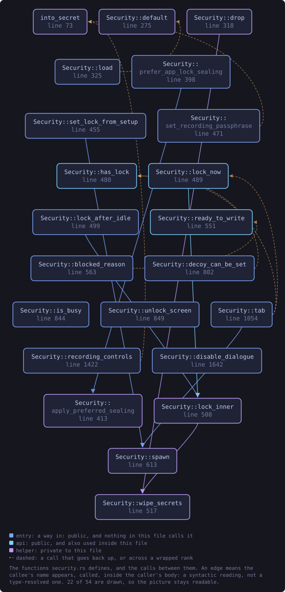

<!-- SPDX-License-Identifier: GPL-3.0-or-later -->
<!-- GENERATED by tools/docs/generate.py from the doc comments in the
     source. Do not edit this file: edit the `//!` and `///` comments in
     the .rs files and run the generator again. CI verifies it with
         python tools/docs/generate.py --check
-->

  

# `crates/veilvoice-gui/src/security.rs`

[`veilvoice-gui`](../../../crates/veilvoice-gui/README.md) &middot; 3170 lines &middot; [read the source](https://github.com/tilas01/veilvoice/blob/main/crates/veilvoice-gui/src/security.rs)

## Contents

- [Two passwords, and why](#two-passwords-and-why)
- [What the lock is worth](#what-the-lock-is-worth)
- [A limitation of typing a password into a window](#a-limitation-of-typing-a-password-into-a-window)
- [In plain words](#in-plain-words)
  - [What this file contains](#what-this-file-contains)
  - [What calls what](#what-calls-what)
  - [Items](#items)

The application lock, and the at-rest encryption of what VeilVoice writes.

# Two passwords, and why

There are two, deliberately:

- the **app lock**, which decides whether VeilVoice will open at all, and
- the **recording passphrase**, which encrypts the files it produces.

Collapsing them into one would mean that unlocking the app also unseals
every recording it has ever written, which is the opposite of what a lock is
for. `veilvoice_crypto::lock` additionally domain-separates its verifier,
so even a user who types the same string in both places does not end up with
two copies of one value.

# What the lock is worth

Not much against an attacker with the disk, and the UI says so in
`veilvoice_crypto::lock::SCOPE`, shown on the unlock screen itself rather
than buried in an about page. It stops the person who picks up your unlocked
laptop. It does not stop someone who takes the drive.

# A limitation of typing a password into a window

A text field owns a `String`, so a passphrase exists as ordinary heap bytes
while it is being typed. That window cannot be removed, because something has
to receive the keystrokes, but it can be kept short, and it is:

- the typing buffer is wiped the moment the passphrase is confirmed;
- the confirmed passphrase is held only as a `veilvoice_crypto::Secret`,
page-locked and zeroized on drop, for the rest of the session;
- locking the app, or changing the passphrase, wipes both.

It used to be kept as a plain `String` for the whole session, which was a
much larger window for no benefit.

None of this defends against someone who can read this process's memory. If
they can, they have already won, and `docs/WHITEPAPER.md` §7 says so rather
than implying otherwise. What it does is stop a passphrase lingering in a
heap allocation long after it was needed, where a core dump or a swapped
page could pick it up.

# In plain words

The lock on the window, and the encryption of the files VeilVoice writes.

There are two passphrases and they do different jobs. One opens the
application. The other encrypts a recording, and it is asked for separately
because they protect different things and losing one should not mean losing the
other.

The panel says what the lock is worth and what it is not: it stops somebody who
picks up your unlocked computer, and it does not stop somebody who has the
disk. Encrypting the recording is what protects the recording.

## What this file contains

3170 lines defining **54 functions** (29 public), **4 types** and **3 constants**. Everything below is read out of the source, so it cannot disagree with the code.

**The types it owns.**

- `enum Sealing` (line 82) -- How the recording that comes out of a job is protected.
- `enum Op` (line 107) -- What a background lock operation was trying to do.
- `struct Security` (line 142) -- Everything about locking the app and sealing its output.
- `enum Plan` (line 1700) -- What a finished job should do with its bytes.

**What happens when it runs.** These are the ways in: public, and nothing else in this file calls them, so they are what an outside caller reaches first.

- `Security::load` (line 325) -- Read the lock file for this machine and start locked if one is set.
  - reaches: `default`
- `Security::take_unlock_passphrase` (line 368) -- Take the passphrase that just opened the lock, once.
- `Security::take_unlock_store_key` (line 377) -- Collect the obfuscated store's key from the unlock that just happened.
- `Security::prefer_app_lock_sealing` (line 398) -- Start in Sealing::AppLock, because the user asked for that last time.
  - reaches: `apply_preferred_sealing`
- `Security::app_lock_sealing_is_waiting` (line 426) -- Whether the stored preference is still waiting for a lock to apply to.
- `Security::seals_with_app_lock` (line 432) -- Whether the app-lock sealing mode is currently chosen, so the window can have the choice remembered.
- `Security::tampered` (line 440) -- Whether the lock reported having been interfered with.
- `Security::is_locked` (line 445) -- Whether the unlock screen should be shown instead of the app.
- `Security::set_lock_from_setup` (line 455) -- Whether a lock is configured at all.
  - reaches: `spawn`, `run_op`, `decoy_store`, `reopen`
- `Security::has_recording_passphrase` (line 462) -- Whether a recording passphrase is held for this session.
- `Security::set_recording_passphrase` (line 471) -- Take a recording passphrase from the first-run setup.
  - reaches: `into_secret`
- `Security::lock_after_idle` (line 499) -- Lock because nobody has touched the window for a while.
  - reaches: `lock_inner`, `wipe_secrets`
- `Security::blocked_reason` (line 563) -- Why a job cannot start yet, for the button's tooltip.
  - reaches: `ready_to_write`
- `Security::plan` (line 581) -- How the next job should protect its output.
- `Security::opened_with_decoy` (line 793) -- Whether this session was opened with the decoy passphrase.
- `Security::decoy_can_be_set` (line 802) -- Whether a decoy could be set on this machine.
  - reaches: `has_lock`
- `Security::is_busy` (line 844) -- Whether a lock operation is running, so the window keeps repainting and the indicator beside the field keeps moving.
  - reaches: `busy`
- `Security::unlock_screen` (line 849) -- The full-window unlock screen.
  - reaches: `begin_unlock`, `busy`, `poll`, `unlock_row`, `spawn`, `apply_preferred_sealing`, `finish_unlock`, `refresh_decoy_state`, `wipe_form`, `run_op`, `into_secret`, `decoy_store`
- `Security::tab` (line 1054) -- The security tab: manage the lock, and see what it is worth.
  - reaches: `busy`, `button_column`, `decoy_panel`, `has_lock`, `interference_banner`, `lock_now`, `password_row`, `poll`, `spawn`, `refresh_decoy_state`, `lock_inner`, `apply_preferred_sealing`
- `Security::load_mandate` (line 1374) -- Read the baseline from disk and apply it to the checkbox.
- `Security::mandate_requires_app_lock` (line 1389) -- Whether the baseline insists on the app lock.
- `Security::mandate_requires_encryption` (line 1394) -- Whether the baseline insists on encryption at rest.
- `Security::mandate_history` (line 1399) -- The change log, for the panel that shows it.
- `Security::recording_controls` (line 1422) -- The at-rest controls that sit inside the file tab.
  - reaches: `into_secret`, `mandate_history_panel`, `password_row`, `record`, `mandate_history_rows`
- `Security::disable_dialogue` (line 1642) -- The dialogue shown when the user turns at-rest encryption off.
  - reaches: `record`
- `Plan::write` (line 1725) -- Seal wav if the plan says to, and write it.

## What calls what

The functions this file defines, and the calls between them. Both
are read out of the source: an edge means the callee's name appears,
called, inside the caller's body. It is a syntactic reading, not a
type-resolved one, so a call made through a trait object or a macro
will not appear.

_22 of 54 functions are drawn; the diagram is bounded at 22 so it
stays readable. The full list is in the table below._

_Colour key: **entry** -- a way in: public, and nothing in this file calls it; **api** -- public, and also used inside this file; **helper** -- private to this file._

  

The same graph as Mermaid source

```mermaid
%%{init: {"theme":"base","themeVariables":{"background":"#1a1b26","primaryColor":"#1f2335","primaryTextColor":"#c0caf5","primaryBorderColor":"#7aa2f7","secondaryColor":"#16161e","tertiaryColor":"#16161e","lineColor":"#737aa2","textColor":"#c0caf5","mainBkg":"#1f2335","nodeBorder":"#7aa2f7","clusterBkg":"#16161e","clusterBorder":"#2f3549","fontFamily":"ui-monospace, SFMono-Regular, Consolas, monospace","fontSize":"14px"}}}%%
flowchart TD
    n_into_secret["into_secret<br/>line 73"]
    n_default["Security::default<br/>line 275"]
    n_drop["Security::drop<br/>line 318"]
    n_load(["Security::load<br/>line 325"])
    n_prefer_app_lock_sealing(["Security::<br/>prefer_app_lock_sealing<br/>line 398"])
    n_apply_preferred_sealing["Security::<br/>apply_preferred_sealing<br/>line 413"]
    n_set_lock_from_setup(["Security::set_lock_from_setup<br/>line 455"])
    n_set_recording_passphrase(["Security::<br/>set_recording_passphrase<br/>line 471"])
    n_has_lock["Security::has_lock<br/>line 480"]
    n_lock_now["Security::lock_now<br/>line 489"]
    n_lock_after_idle(["Security::lock_after_idle<br/>line 499"])
    n_lock_inner["Security::lock_inner<br/>line 508"]
    n_wipe_secrets["Security::wipe_secrets<br/>line 517"]
    n_ready_to_write["Security::ready_to_write<br/>line 551"]
    n_blocked_reason(["Security::blocked_reason<br/>line 563"])
    n_spawn["Security::spawn<br/>line 613"]
    n_decoy_can_be_set(["Security::decoy_can_be_set<br/>line 802"])
    n_is_busy(["Security::is_busy<br/>line 844"])
    n_unlock_screen(["Security::unlock_screen<br/>line 849"])
    n_tab(["Security::tab<br/>line 1054"])
    n_recording_controls(["Security::recording_controls<br/>line 1422"])
    n_disable_dialogue(["Security::disable_dialogue<br/>line 1642"])
    n_blocked_reason --> n_ready_to_write
    n_decoy_can_be_set --> n_has_lock
    n_drop --> n_wipe_secrets
    n_load --> n_default
    n_lock_after_idle --> n_lock_inner
    n_lock_inner --> n_wipe_secrets
    n_lock_now --> n_lock_inner
    n_prefer_app_lock_sealing --> n_apply_preferred_sealing
    n_recording_controls --> n_into_secret
    n_set_lock_from_setup --> n_spawn
    n_set_recording_passphrase --> n_into_secret
    n_tab --> n_has_lock
    n_tab --> n_lock_now
    n_tab --> n_spawn
    click n_into_secret href "https://github.com/tilas01/veilvoice/blob/main/crates/veilvoice-gui/src/security.rs#L73" "open the source"
    click n_default href "https://github.com/tilas01/veilvoice/blob/main/crates/veilvoice-gui/src/security.rs#L275" "open the source"
    click n_drop href "https://github.com/tilas01/veilvoice/blob/main/crates/veilvoice-gui/src/security.rs#L318" "open the source"
    click n_load href "https://github.com/tilas01/veilvoice/blob/main/crates/veilvoice-gui/src/security.rs#L325" "open the source"
    click n_prefer_app_lock_sealing href "https://github.com/tilas01/veilvoice/blob/main/crates/veilvoice-gui/src/security.rs#L398" "open the source"
    click n_apply_preferred_sealing href "https://github.com/tilas01/veilvoice/blob/main/crates/veilvoice-gui/src/security.rs#L413" "open the source"
    click n_set_lock_from_setup href "https://github.com/tilas01/veilvoice/blob/main/crates/veilvoice-gui/src/security.rs#L455" "open the source"
    click n_set_recording_passphrase href "https://github.com/tilas01/veilvoice/blob/main/crates/veilvoice-gui/src/security.rs#L471" "open the source"
    click n_has_lock href "https://github.com/tilas01/veilvoice/blob/main/crates/veilvoice-gui/src/security.rs#L480" "open the source"
    click n_lock_now href "https://github.com/tilas01/veilvoice/blob/main/crates/veilvoice-gui/src/security.rs#L489" "open the source"
    click n_lock_after_idle href "https://github.com/tilas01/veilvoice/blob/main/crates/veilvoice-gui/src/security.rs#L499" "open the source"
    click n_lock_inner href "https://github.com/tilas01/veilvoice/blob/main/crates/veilvoice-gui/src/security.rs#L508" "open the source"
    click n_wipe_secrets href "https://github.com/tilas01/veilvoice/blob/main/crates/veilvoice-gui/src/security.rs#L517" "open the source"
    click n_ready_to_write href "https://github.com/tilas01/veilvoice/blob/main/crates/veilvoice-gui/src/security.rs#L551" "open the source"
    click n_blocked_reason href "https://github.com/tilas01/veilvoice/blob/main/crates/veilvoice-gui/src/security.rs#L563" "open the source"
    click n_spawn href "https://github.com/tilas01/veilvoice/blob/main/crates/veilvoice-gui/src/security.rs#L613" "open the source"
    click n_decoy_can_be_set href "https://github.com/tilas01/veilvoice/blob/main/crates/veilvoice-gui/src/security.rs#L802" "open the source"
    click n_is_busy href "https://github.com/tilas01/veilvoice/blob/main/crates/veilvoice-gui/src/security.rs#L844" "open the source"
    click n_unlock_screen href "https://github.com/tilas01/veilvoice/blob/main/crates/veilvoice-gui/src/security.rs#L849" "open the source"
    click n_tab href "https://github.com/tilas01/veilvoice/blob/main/crates/veilvoice-gui/src/security.rs#L1054" "open the source"
    click n_recording_controls href "https://github.com/tilas01/veilvoice/blob/main/crates/veilvoice-gui/src/security.rs#L1422" "open the source"
    click n_disable_dialogue href "https://github.com/tilas01/veilvoice/blob/main/crates/veilvoice-gui/src/security.rs#L1642" "open the source"
    classDef entry fill:#1f2335,stroke:#7aa2f7,color:#c0caf5
    class n_load,n_prefer_app_lock_sealing,n_set_lock_from_setup,n_set_recording_passphrase,n_lock_after_idle,n_blocked_reason,n_decoy_can_be_set,n_is_busy,n_unlock_screen,n_tab,n_recording_controls,n_disable_dialogue entry
    classDef api fill:#1f2335,stroke:#7dcfff,color:#c0caf5
    class n_has_lock,n_lock_now,n_ready_to_write api
    classDef helper fill:#1f2335,stroke:#bb9af7,color:#c0caf5
    class n_into_secret,n_default,n_drop,n_apply_preferred_sealing,n_lock_inner,n_wipe_secrets,n_spawn helper
```

## Items

| Item | Line | Documentation |
|---|---:|---|
| `into_secret` fn | [73](https://github.com/tilas01/veilvoice/blob/main/crates/veilvoice-gui/src/security.rs#L73) | Move a typed passphrase out of its String and into page-locked storage, wiping the buffer it came from. |
| `Sealing` pub enum | [82](https://github.com/tilas01/veilvoice/blob/main/crates/veilvoice-gui/src/security.rs#L82) | How the recording that comes out of a job is protected. |
| `Op` enum | [107](https://github.com/tilas01/veilvoice/blob/main/crates/veilvoice-gui/src/security.rs#L107) | What a background lock operation was trying to do. |
| `OpResult` type | [130](https://github.com/tilas01/veilvoice/blob/main/crates/veilvoice-gui/src/security.rs#L130) | A finished lock operation: the store as it now stands, and how it went. |
| `Security` pub struct | [142](https://github.com/tilas01/veilvoice/blob/main/crates/veilvoice-gui/src/security.rs#L142) | Everything about locking the app and sealing its output. |
| `Security::default` fn | [275](https://github.com/tilas01/veilvoice/blob/main/crates/veilvoice-gui/src/security.rs#L275) | The safe state, and deliberately free of I/O so tests and VeilVoiceApp::default() never touch the real lock file. |
| `Security::drop` fn | [318](https://github.com/tilas01/veilvoice/blob/main/crates/veilvoice-gui/src/security.rs#L318) |  |
| `Security::load` pub fn | [325](https://github.com/tilas01/veilvoice/blob/main/crates/veilvoice-gui/src/security.rs#L325) | Read the lock file for this machine and start locked if one is set. |
| `Security::take_unlock_passphrase` pub fn | [368](https://github.com/tilas01/veilvoice/blob/main/crates/veilvoice-gui/src/security.rs#L368) | Take the passphrase that just opened the lock, once. |
| `Security::take_unlock_store_key` pub fn | [377](https://github.com/tilas01/veilvoice/blob/main/crates/veilvoice-gui/src/security.rs#L377) | Collect the obfuscated store's key from the unlock that just happened. |
| `Security::prefer_app_lock_sealing` pub fn | [398](https://github.com/tilas01/veilvoice/blob/main/crates/veilvoice-gui/src/security.rs#L398) | Start in Sealing::AppLock, because the user asked for that last time. |
| `Security::apply_preferred_sealing` fn | [413](https://github.com/tilas01/veilvoice/blob/main/crates/veilvoice-gui/src/security.rs#L413) | Turn the remembered preference into the sealing mode, once. |
| `Security::app_lock_sealing_is_waiting` pub fn | [426](https://github.com/tilas01/veilvoice/blob/main/crates/veilvoice-gui/src/security.rs#L426) | Whether the stored preference is still waiting for a lock to apply to. |
| `Security::seals_with_app_lock` pub fn | [432](https://github.com/tilas01/veilvoice/blob/main/crates/veilvoice-gui/src/security.rs#L432) | Whether the app-lock sealing mode is currently chosen, so the window can have the choice remembered. |
| `Security::tampered` pub fn | [440](https://github.com/tilas01/veilvoice/blob/main/crates/veilvoice-gui/src/security.rs#L440) | Whether the lock reported having been interfered with. |
| `Security::is_locked` pub fn | [445](https://github.com/tilas01/veilvoice/blob/main/crates/veilvoice-gui/src/security.rs#L445) | Whether the unlock screen should be shown instead of the app. |
| `Security::set_lock_from_setup` pub fn | [455](https://github.com/tilas01/veilvoice/blob/main/crates/veilvoice-gui/src/security.rs#L455) | Whether a lock is configured at all. |
| `Security::has_recording_passphrase` pub fn | [462](https://github.com/tilas01/veilvoice/blob/main/crates/veilvoice-gui/src/security.rs#L462) | Whether a recording passphrase is held for this session. |
| `Security::set_recording_passphrase` pub fn | [471](https://github.com/tilas01/veilvoice/blob/main/crates/veilvoice-gui/src/security.rs#L471) | Take a recording passphrase from the first-run setup. |
| `Security::has_lock` pub fn | [480](https://github.com/tilas01/veilvoice/blob/main/crates/veilvoice-gui/src/security.rs#L480) | Whether an app lock is configured on this machine. |
| `Security::lock_now` pub fn | [489](https://github.com/tilas01/veilvoice/blob/main/crates/veilvoice-gui/src/security.rs#L489) | Lock the app now, wiping the session passphrase with it. |
| `Security::lock_after_idle` pub fn | [499](https://github.com/tilas01/veilvoice/blob/main/crates/veilvoice-gui/src/security.rs#L499) | Lock because nobody has touched the window for a while. |
| `Security::lock_inner` fn | [508](https://github.com/tilas01/veilvoice/blob/main/crates/veilvoice-gui/src/security.rs#L508) | Lock, remembering whether the person did it or the idle timer did. |
| `Security::wipe_secrets` fn | [517](https://github.com/tilas01/veilvoice/blob/main/crates/veilvoice-gui/src/security.rs#L517) | Wipe every plaintext secret this struct is holding. |
| `Security::ready_to_write` pub fn | [551](https://github.com/tilas01/veilvoice/blob/main/crates/veilvoice-gui/src/security.rs#L551) | Whether a job may start: either encryption is off, or there is something to encrypt with. |
| `Security::blocked_reason` pub fn | [563](https://github.com/tilas01/veilvoice/blob/main/crates/veilvoice-gui/src/security.rs#L563) | Why a job cannot start yet, for the button's tooltip. |
| `Security::plan` pub fn | [581](https://github.com/tilas01/veilvoice/blob/main/crates/veilvoice-gui/src/security.rs#L581) | How the next job should protect its output. |
| `Security::spawn` fn | [613](https://github.com/tilas01/veilvoice/blob/main/crates/veilvoice-gui/src/security.rs#L613) | Run a lock operation on a thread, so the window keeps drawing. |
| `Security::begin_unlock` fn | [638](https://github.com/tilas01/veilvoice/blob/main/crates/veilvoice-gui/src/security.rs#L638) | Check what was typed into the unlock field, on a worker. |
| `Security::poll` fn | [643](https://github.com/tilas01/veilvoice/blob/main/crates/veilvoice-gui/src/security.rs#L643) | Collect a finished lock operation. |
| `Security::finish_unlock` fn | [758](https://github.com/tilas01/veilvoice/blob/main/crates/veilvoice-gui/src/security.rs#L758) | Open the window after an unlock, with the decoy taken into account. |
| `Security::opened_with_decoy` pub fn | [793](https://github.com/tilas01/veilvoice/blob/main/crates/veilvoice-gui/src/security.rs#L793) | Whether this session was opened with the decoy passphrase. |
| `Security::decoy_can_be_set` pub fn | [802](https://github.com/tilas01/veilvoice/blob/main/crates/veilvoice-gui/src/security.rs#L802) | Whether a decoy could be set on this machine. |
| `Security::refresh_decoy_state` fn | [813](https://github.com/tilas01/veilvoice/blob/main/crates/veilvoice-gui/src/security.rs#L813) | Read what is on disk, once, so the tab does not open a file per frame. |
| `Security::wipe_form` fn | [827](https://github.com/tilas01/veilvoice/blob/main/crates/veilvoice-gui/src/security.rs#L827) | Clear what was typed, so a passphrase does not sit in a field after use. |
| `Security::busy` fn | [838](https://github.com/tilas01/veilvoice/blob/main/crates/veilvoice-gui/src/security.rs#L838) | Whether an operation is in flight, so the panel can refuse a second one. |
| `Security::is_busy` pub fn | [844](https://github.com/tilas01/veilvoice/blob/main/crates/veilvoice-gui/src/security.rs#L844) | Whether a lock operation is running, so the window keeps repainting and the indicator beside the field keeps moving. |
| `Security::unlock_screen` pub fn | [849](https://github.com/tilas01/veilvoice/blob/main/crates/veilvoice-gui/src/security.rs#L849) | The full-window unlock screen. |
| `Security::interference_banner` fn | [998](https://github.com/tilas01/veilvoice/blob/main/crates/veilvoice-gui/src/security.rs#L998) | The standing report that the lock file was interfered with. |
| `Security::tab` pub fn | [1054](https://github.com/tilas01/veilvoice/blob/main/crates/veilvoice-gui/src/security.rs#L1054) | The security tab: manage the lock, and see what it is worth. |
| `Security::decoy_panel` fn | [1244](https://github.com/tilas01/veilvoice/blob/main/crates/veilvoice-gui/src/security.rs#L1244) | The decoy passphrase, set, changed and removed from the window. |
| `Security::load_mandate` pub fn | [1374](https://github.com/tilas01/veilvoice/blob/main/crates/veilvoice-gui/src/security.rs#L1374) | Read the baseline from disk and apply it to the checkbox. |
| `Security::mandate_requires_app_lock` pub fn | [1389](https://github.com/tilas01/veilvoice/blob/main/crates/veilvoice-gui/src/security.rs#L1389) | Whether the baseline insists on the app lock. |
| `Security::mandate_requires_encryption` pub fn | [1394](https://github.com/tilas01/veilvoice/blob/main/crates/veilvoice-gui/src/security.rs#L1394) | Whether the baseline insists on encryption at rest. |
| `Security::mandate_history` pub fn | [1399](https://github.com/tilas01/veilvoice/blob/main/crates/veilvoice-gui/src/security.rs#L1399) | The change log, for the panel that shows it. |
| `Security::record` fn | [1409](https://github.com/tilas01/veilvoice/blob/main/crates/veilvoice-gui/src/security.rs#L1409) | Record a change to the baseline, and write it down. |
| `Security::recording_controls` pub fn | [1422](https://github.com/tilas01/veilvoice/blob/main/crates/veilvoice-gui/src/security.rs#L1422) | The at-rest controls that sit inside the file tab. |
| `Security::mandate_history_panel` fn | [1612](https://github.com/tilas01/veilvoice/blob/main/crates/veilvoice-gui/src/security.rs#L1612) | The log of every time a requirement was turned off or back on. |
| `Security::mandate_history_rows` fn | [1631](https://github.com/tilas01/veilvoice/blob/main/crates/veilvoice-gui/src/security.rs#L1631) | One coloured line per change, newest concern last: green for a requirement put back, yellow for one turned off. |
| `Security::disable_dialogue` pub fn | [1642](https://github.com/tilas01/veilvoice/blob/main/crates/veilvoice-gui/src/security.rs#L1642) | The dialogue shown when the user turns at-rest encryption off. |
| `DISABLE_WARNING` pub const | [1684](https://github.com/tilas01/veilvoice/blob/main/crates/veilvoice-gui/src/security.rs#L1684) | What the user is told before recordings stop being encrypted. |
| `Plan` pub enum | [1700](https://github.com/tilas01/veilvoice/blob/main/crates/veilvoice-gui/src/security.rs#L1700) | What a finished job should do with its bytes. |
| `Plan::write` pub fn | [1725](https://github.com/tilas01/veilvoice/blob/main/crates/veilvoice-gui/src/security.rs#L1725) | Seal wav if the plan says to, and write it. |
| `Plan::fmt` fn | [1772](https://github.com/tilas01/veilvoice/blob/main/crates/veilvoice-gui/src/security.rs#L1772) |  |
| `decoy_store` fn | [1786](https://github.com/tilas01/veilvoice/blob/main/crates/veilvoice-gui/src/security.rs#L1786) | The decoy store that sits beside the lock file at path. |
| `run_op` fn | [1793](https://github.com/tilas01/veilvoice/blob/main/crates/veilvoice-gui/src/security.rs#L1793) | Run one lock operation, off the UI thread. |
| `reopen` fn | [1908](https://github.com/tilas01/veilvoice/blob/main/crates/veilvoice-gui/src/security.rs#L1908) | Re-open the lock store from disk, or None when there is nothing to open. |
| `PASSWORD_LABEL_WIDTH` const | [1915](https://github.com/tilas01/veilvoice/blob/main/crates/veilvoice-gui/src/security.rs#L1915) | The width every passphrase label is given, so every field starts level. |
| `PASSWORD_FIELD_WIDTH` const | [1920](https://github.com/tilas01/veilvoice/blob/main/crates/veilvoice-gui/src/security.rs#L1920) | How wide every passphrase field is drawn, on this tab and on the lock screen. |
| `button_column` fn | [1954](https://github.com/tilas01/veilvoice/blob/main/crates/veilvoice-gui/src/security.rs#L1954) | One labelled passphrase field, with the field in the same place every time. |
| `password_row` fn | [1969](https://github.com/tilas01/veilvoice/blob/main/crates/veilvoice-gui/src/security.rs#L1969) | One passphrase field with its label, at the shared width. |
| `unlock_row` fn | [2014](https://github.com/tilas01/veilvoice/blob/main/crates/veilvoice-gui/src/security.rs#L2014) | The password row on the lock screen: the label, the field and the button. |

---

Generated from `crates/veilvoice-gui/src/security.rs`. On the website: [`website/reference/veilvoice-gui/security.html`](../../../website/reference/veilvoice-gui/security.html).

Signing key fingerprint `8101FB3BB28D02FB239E0CDF9CC1C7E7A9B5833A`.
