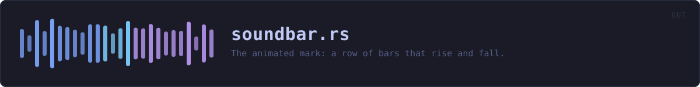
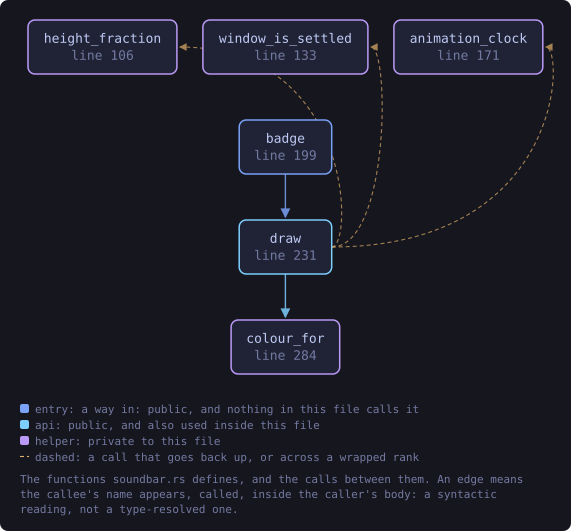
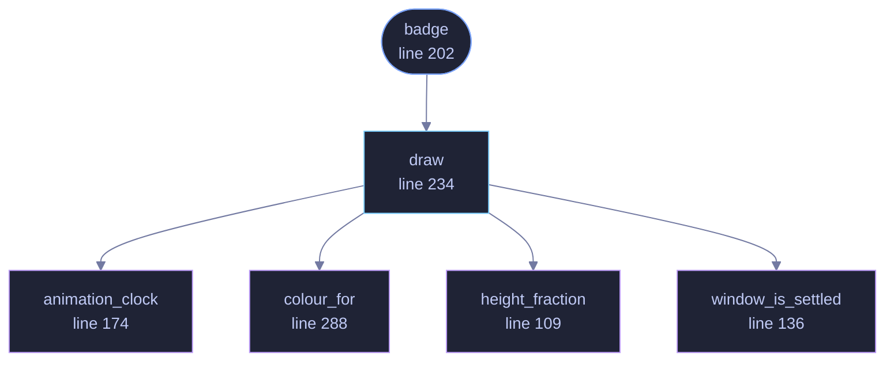

<!-- SPDX-License-Identifier: GPL-3.0-or-later -->
<!-- GENERATED by tools/docs/generate.py from the doc comments in the
     source. Do not edit this file: edit the `//!` and `///` comments in
     the .rs files and run the generator again. CI verifies it with
         python tools/docs/generate.py --check
-->

  

# `crates/veilvoice-gui/src/soundbar.rs`

[`veilvoice-gui`](../../../crates/veilvoice-gui/README.md) &middot; 766 lines &middot; [read the source](https://github.com/tilas01/veilvoice/blob/main/crates/veilvoice-gui/src/soundbar.rs)

## Contents

- [The same mark as the website](#the-same-mark-as-the-website)
- [Why it is drawn rather than rendered from a GIF](#why-it-is-drawn-rather-than-rendered-from-a-gif)
- [Cost when it is switched off](#cost-when-it-is-switched-off)
- [Cost when it is switched on, which is the interesting one](#cost-when-it-is-switched-on-which-is-the-interesting-one)
- [In plain words](#in-plain-words)
  - [What this file contains](#what-this-file-contains)
  - [What calls what](#what-calls-what)
  - [Items](#items)

The animated mark: a row of bars that rise and fall.

# The same mark as the website

`website/index.html` draws this in CSS as `.veil` -- a row of ``s with
`@keyframes pulse` taking each between 16% and 82% of the height over
1.9 seconds, each with its own delay so the row ripples rather than pumping
in unison. The left half is drawn in the accent colour and the right half in
the "veiled" secondary, which is the product in one picture and matches the
icon.

This is that, in egui, with the same period, the same height range and the
same delays. Two front-ends showing visibly different marks would be worse
than one showing none.

# Why it is drawn rather than rendered from a GIF

An animated image would be a committed binary blob, and this project's
artwork is generated from source precisely so that nothing in the repository
has to be taken on trust. Sixty lines of shape drawing is auditable; a GIF
is not.

# Cost when it is switched off

With motion disabled the bars are drawn once, at rest, and **no repaint is
requested**. That is the part that matters: an "off" switch that still
schedules a frame every 16 ms has turned the animation off visually and left
the battery cost behind. The caller decides by passing a `Motion`, and the
only way to animate is to ask for it.

# Cost when it is switched on, which is the interesting one

Motion is on by default, and this is the only thing in the application that
moves without being asked to. Everything else draws when something happens.
So with the default settings, on the file tab, doing nothing, the window was
redrawing about sixty times a second for ever, and it was this: measured
with `Context::repaint_causes`, which named line 117 of this file as the
reason for 559 of 566 frames.

An animated logo is not worth a permanently busy window, and two of the
costs are ones a user actually notices rather than ones a profiler does.
A laptop lid left open at this screen never lets the processor idle. And a
window being dragged is competing, every frame, with a full redraw it did
not need, which is what "it lags when I move it" is made of.

So the mark now moves in the three circumstances where somebody can see it
moving, and rests otherwise:

- **Not while the window is unfocused.** A background window is still.
- **Not while the window is being moved or resized.** Detected from the
window's own rectangle changing between frames, and resumed a quarter of
a second after it stops. This is the drag case specifically.
- **Not faster than `FRAMES_PER_SECOND`.** The cycle is 1.9 seconds long
and eased; twenty frames a second is indistinguishable from thirty here,
and costs two thirds as much.

Resting is not the same as resetting. Freezing at the midpoint would make
every click into another window snap the row flat, so a paused mark holds
the shape it had when it paused and picks the cycle up from there.

# In plain words

The little row of bars in the corner that rises and falls.

It is the same mark the website uses, drawn rather than loaded as a picture, so
it takes the colours of whichever scheme you have chosen.

It stops moving if your system is set to reduce motion. That setting is a
request from somebody who has a reason for making it, and animation that
ignores it is animation that makes an application unusable for them.

## What this file contains

766 lines defining **6 functions** (2 public), **0 types** and **6 constants**. Everything below is read out of the source, so it cannot disagree with the code.

**What happens when it runs.** These are the ways in: public, and nothing else in this file calls them, so they are what an outside caller reaches first.

- `badge` (line 202) -- Draw the mark at size, returning the response so it can carry a tooltip.
  - reaches: `draw`, `animation_clock`, `colour_for`, `height_fraction`, `window_is_settled`

## What calls what

The functions this file defines, and the calls between them. Both
are read out of the source: an edge means the callee's name appears,
called, inside the caller's body. It is a syntactic reading, not a
type-resolved one, so a call made through a trait object or a macro
will not appear.

_Colour key: **entry** -- a way in: public, and nothing in this file calls it; **api** -- public, and also used inside this file; **helper** -- private to this file._

  

The same graph as Mermaid source

## Items

| Item | Line | Documentation |
|---|---:|---|
| `PERIOD` const | [78](https://github.com/tilas01/veilvoice/blob/main/crates/veilvoice-gui/src/soundbar.rs#L78) | Seconds for one full rise and fall. |
| `FRAMES_PER_SECOND` pub const | [86](https://github.com/tilas01/veilvoice/blob/main/crates/veilvoice-gui/src/soundbar.rs#L86) | How often the mark is redrawn while it is moving. |
| `SETTLE` const | [94](https://github.com/tilas01/veilvoice/blob/main/crates/veilvoice-gui/src/soundbar.rs#L94) | How long the window must hold still before the mark starts moving again. |
| `DELAYS` const | [99](https://github.com/tilas01/veilvoice/blob/main/crates/veilvoice-gui/src/soundbar.rs#L99) | Per-bar phase offsets in seconds, matching the animation-delay values in website/index.html. |
| `MIN_FRACTION` const | [104](https://github.com/tilas01/veilvoice/blob/main/crates/veilvoice-gui/src/soundbar.rs#L104) | Height as a fraction of the available box, matching 16% and 82%. |
| `MAX_FRACTION` const | [105](https://github.com/tilas01/veilvoice/blob/main/crates/veilvoice-gui/src/soundbar.rs#L105) |  |
| `height_fraction` fn | [109](https://github.com/tilas01/veilvoice/blob/main/crates/veilvoice-gui/src/soundbar.rs#L109) | How far along its cycle a bar is, in 0..=1, eased the way CSS ease-in-out eases. |
| `window_is_settled` fn | [136](https://github.com/tilas01/veilvoice/blob/main/crates/veilvoice-gui/src/soundbar.rs#L136) | Whether the window is holding still enough for the mark to move. |
| `animation_clock` fn | [174](https://github.com/tilas01/veilvoice/blob/main/crates/veilvoice-gui/src/soundbar.rs#L174) | The clock the bars are drawn against, which is not always the real one. |
| `badge` pub fn | [202](https://github.com/tilas01/veilvoice/blob/main/crates/veilvoice-gui/src/soundbar.rs#L202) | Draw the mark at size, returning the response so it can carry a tooltip. |
| `draw` pub fn | [234](https://github.com/tilas01/veilvoice/blob/main/crates/veilvoice-gui/src/soundbar.rs#L234) | Draw the mark at size, returning the response so it can carry a tooltip. |
| `colour_for` fn | [288](https://github.com/tilas01/veilvoice/blob/main/crates/veilvoice-gui/src/soundbar.rs#L288) | The left half in the accent colour, the right in the veiled secondary -- the same split the website and the icon use. |

---

Generated from `crates/veilvoice-gui/src/soundbar.rs`. On the website: [`website/reference/veilvoice-gui/soundbar.html`](../../../website/reference/veilvoice-gui/soundbar.html).

Signing key fingerprint `8101FB3BB28D02FB239E0CDF9CC1C7E7A9B5833A`.
