<!-- SPDX-License-Identifier: GPL-3.0-or-later -->
<!-- GENERATED by tools/docs/generate.py from the doc comments in the
     source. Do not edit this file: edit the `//!` and `///` comments in
     the .rs files and run the generator again. CI verifies it with
         python tools/docs/generate.py --check
-->

  

# `crates/veilvoice-gui/src/studio.rs`

[`veilvoice-gui`](../../../crates/veilvoice-gui/README.md) &middot; 1263 lines &middot; [read the source](https://github.com/tilas01/veilvoice/blob/main/crates/veilvoice-gui/src/studio.rs)

## Contents

- [Two tabs, one vault](#two-tabs-one-vault)
- [The vault needs both passphrases, and asks for both here](#the-vault-needs-both-passphrases-and-asks-for-both-here)
- [What is recorded is what comes out, never what went in](#what-is-recorded-is-what-comes-out-never-what-went-in)
- [In plain words](#in-plain-words)
  - [What this file contains](#what-this-file-contains)
  - [What calls what](#what-calls-what)
  - [Items](#items)

The Recording Studio and the Recording Browser.

# Two tabs, one vault

The Studio records; the Browser is what is in the vault afterwards. They are
one module because they are one vault, and a vault opened in two places is
two chances to get the unlocking wrong.

# The vault needs both passphrases, and asks for both here

`veilvoice_crypto::studio::StudioKey` is derived from the app lock **and**
the at-rest passphrase, and from neither alone. That is the whole point of
it: a laptop stolen while VeilVoice is unlocked opens nothing, because the
at-rest passphrase was never typed.

So this tab asks for both, every time, rather than reaching into whatever
the rest of the application happens to be holding. That is a deliberate
inconvenience:

- The app-lock secret is only kept for the session when
[`Sealing::AppLock`](crate::security::Sealing::AppLock) is chosen. Reading
it when it happens to be there, and prompting when it is not, would make
the vault's strength depend on an unrelated setting, and nobody would
know which they had.
- Prompting for both, always, is the only version of this whose security is
the same on every run.

Neither passphrase is stored. Both typing buffers are wiped the moment the
key is derived, and the derived key lives in page-locked memory for as long
as the vault is open. Locking the window closes the vault.

# What is recorded is what comes out, never what went in

The Studio records through
`veilvoice_audio::LiveSession::start_recording`,
which is the same path the command line uses, so the samples that reach the
recorder are the **veiled** ones. There is no code path here that captures
the microphone before the engine has been through it, because a path that
existed would eventually be taken, and the file it produced would be a
recording of somebody's real voice sitting in a vault they believed was
safe.

The recording is assembled inside a `veilvoice_crypto::Secret` and
handed straight to the vault to be sealed. It is never a plain file, not
even briefly.

# In plain words

Record here, and what you record is kept locked up. Opening the cupboard
needs both of your passwords at once, every time, which is what makes it
worth having.

## What this file contains

1263 lines defining **30 functions** (10 public), **4 types** and **0 constants**. Everything below is read out of the source, so it cannot disagree with the code.

**The types it owns.**

- `enum Phase` (line 83) -- What the Studio is doing.
- `struct Studio` (line 99) -- The Studio and the Browser.
- `enum Render` (line 1061) -- What a take is to be turned into.
- `enum Act` (line 1129) -- Something a browser row asked for.

**What happens when it runs.** These are the ways in: public, and nothing else in this file calls them, so they are what an outside caller reaches first.

- `Studio::is_open` (line 143) -- Whether the vault is open.
- `Studio::is_recording` (line 151) -- Whether a recording is running.
- `Studio::close` (line 170) -- Shut the vault and forget the key.
  - reaches: `finish_take`, `length`
- `Studio::tab` (line 586) -- The Recording Studio tab.
  - reaches: `finish_take`, `length`, `phase`, `say`, `shut_panel`, `start_take`, `take_form`, `unlock`, `default_dir`, `into_secret`
- `Studio::browser` (line 673) -- The Recording Browser tab.
  - reaches: `apply`, `counted`, `export`, `length`, `made_on`, `say`, `shut_panel`, `size`, `play`, `refresh`, `plan_for`, `run_ffmpeg`

## What calls what

The functions this file defines, and the calls between them. Both
are read out of the source: an edge means the callee's name appears,
called, inside the caller's body. It is a syntactic reading, not a
type-resolved one, so a call made through a trait object or a macro
will not appear.

_22 of 30 functions are drawn; the diagram is bounded at 22 so it
stays readable. The full list is in the table below._

_Colour key: **entry** -- a way in: public, and nothing in this file calls it; **api** -- public, and also used inside this file; **helper** -- private to this file._

  

The same graph as Mermaid source

```mermaid
%%{init: {"theme":"base","themeVariables":{"background":"#1a1b26","primaryColor":"#1f2335","primaryTextColor":"#c0caf5","primaryBorderColor":"#7aa2f7","secondaryColor":"#16161e","tertiaryColor":"#16161e","lineColor":"#737aa2","textColor":"#c0caf5","mainBkg":"#1f2335","nodeBorder":"#7aa2f7","clusterBkg":"#16161e","clusterBorder":"#2f3549","fontFamily":"ui-monospace, SFMono-Regular, Consolas, monospace","fontSize":"14px"}}}%%
flowchart TD
    n_into_secret["into_secret<br/>line 67"]
    n_default_dir["default_dir<br/>line 77"]
    n_phase["Studio::phase<br/>line 156"]
    n_close(["Studio::close<br/>line 170"])
    n_unlock["Studio::unlock<br/>line 190"]
    n_start_take["Studio::start_take<br/>line 247"]
    n_finish_take["Studio::finish_take<br/>line 279"]
    n_play["Studio::play<br/>line 373"]
    n_export["Studio::export<br/>line 419"]
    n_write_page["Studio::write_page<br/>line 527"]
    n_refresh["Studio::refresh<br/>line 570"]
    n_tab(["Studio::tab<br/>line 586"])
    n_browser(["Studio::browser<br/>line 673"])
    n_shut_panel["Studio::shut_panel<br/>line 894"]
    n_take_form["Studio::take_form<br/>line 954"]
    n_say["Studio::say<br/>line 975"]
    n_apply["Studio::apply<br/>line 986"]
    n_wav_shape["wav_shape<br/>line 1086"]
    n_counted["counted<br/>line 1144"]
    n_made_on["made_on<br/>line 1157"]
    n_length["length<br/>line 1246"]
    n_size["size<br/>line 1252"]
    n_apply --> n_play
    n_apply --> n_refresh
    n_browser --> n_apply
    n_browser --> n_counted
    n_browser --> n_export
    n_browser --> n_length
    n_browser --> n_made_on
    n_browser --> n_say
    n_browser --> n_shut_panel
    n_browser --> n_size
    n_close --> n_finish_take
    n_export --> n_wav_shape
    n_export --> n_write_page
    n_finish_take --> n_length
    n_play --> n_wav_shape
    n_shut_panel --> n_unlock
    n_tab --> n_finish_take
    n_tab --> n_length
    n_tab --> n_phase
    n_tab --> n_say
    n_tab --> n_shut_panel
    n_tab --> n_start_take
    n_tab --> n_take_form
    n_unlock --> n_default_dir
    n_unlock --> n_into_secret
    click n_into_secret href "https://github.com/tilas01/veilvoice/blob/main/crates/veilvoice-gui/src/studio.rs#L67" "open the source"
    click n_default_dir href "https://github.com/tilas01/veilvoice/blob/main/crates/veilvoice-gui/src/studio.rs#L77" "open the source"
    click n_phase href "https://github.com/tilas01/veilvoice/blob/main/crates/veilvoice-gui/src/studio.rs#L156" "open the source"
    click n_close href "https://github.com/tilas01/veilvoice/blob/main/crates/veilvoice-gui/src/studio.rs#L170" "open the source"
    click n_unlock href "https://github.com/tilas01/veilvoice/blob/main/crates/veilvoice-gui/src/studio.rs#L190" "open the source"
    click n_start_take href "https://github.com/tilas01/veilvoice/blob/main/crates/veilvoice-gui/src/studio.rs#L247" "open the source"
    click n_finish_take href "https://github.com/tilas01/veilvoice/blob/main/crates/veilvoice-gui/src/studio.rs#L279" "open the source"
    click n_play href "https://github.com/tilas01/veilvoice/blob/main/crates/veilvoice-gui/src/studio.rs#L373" "open the source"
    click n_export href "https://github.com/tilas01/veilvoice/blob/main/crates/veilvoice-gui/src/studio.rs#L419" "open the source"
    click n_write_page href "https://github.com/tilas01/veilvoice/blob/main/crates/veilvoice-gui/src/studio.rs#L527" "open the source"
    click n_refresh href "https://github.com/tilas01/veilvoice/blob/main/crates/veilvoice-gui/src/studio.rs#L570" "open the source"
    click n_tab href "https://github.com/tilas01/veilvoice/blob/main/crates/veilvoice-gui/src/studio.rs#L586" "open the source"
    click n_browser href "https://github.com/tilas01/veilvoice/blob/main/crates/veilvoice-gui/src/studio.rs#L673" "open the source"
    click n_shut_panel href "https://github.com/tilas01/veilvoice/blob/main/crates/veilvoice-gui/src/studio.rs#L894" "open the source"
    click n_take_form href "https://github.com/tilas01/veilvoice/blob/main/crates/veilvoice-gui/src/studio.rs#L954" "open the source"
    click n_say href "https://github.com/tilas01/veilvoice/blob/main/crates/veilvoice-gui/src/studio.rs#L975" "open the source"
    click n_apply href "https://github.com/tilas01/veilvoice/blob/main/crates/veilvoice-gui/src/studio.rs#L986" "open the source"
    click n_wav_shape href "https://github.com/tilas01/veilvoice/blob/main/crates/veilvoice-gui/src/studio.rs#L1086" "open the source"
    click n_counted href "https://github.com/tilas01/veilvoice/blob/main/crates/veilvoice-gui/src/studio.rs#L1144" "open the source"
    click n_made_on href "https://github.com/tilas01/veilvoice/blob/main/crates/veilvoice-gui/src/studio.rs#L1157" "open the source"
    click n_length href "https://github.com/tilas01/veilvoice/blob/main/crates/veilvoice-gui/src/studio.rs#L1246" "open the source"
    click n_size href "https://github.com/tilas01/veilvoice/blob/main/crates/veilvoice-gui/src/studio.rs#L1252" "open the source"
    classDef entry fill:#1f2335,stroke:#7aa2f7,color:#c0caf5
    class n_close,n_tab,n_browser entry
    classDef api fill:#1f2335,stroke:#7dcfff,color:#c0caf5
    class n_default_dir,n_counted,n_made_on,n_length,n_size api
    classDef helper fill:#1f2335,stroke:#bb9af7,color:#c0caf5
    class n_into_secret,n_phase,n_unlock,n_start_take,n_finish_take,n_play,n_export,n_write_page,n_refresh,n_shut_panel,n_take_form,n_say,n_apply,n_wav_shape helper
```

## Items

| Item | Line | Documentation |
|---|---:|---|
| `into_secret` fn | [67](https://github.com/tilas01/veilvoice/blob/main/crates/veilvoice-gui/src/studio.rs#L67) | Move a typed passphrase into page-locked storage and wipe the buffer. |
| `default_dir` pub fn | [77](https://github.com/tilas01/veilvoice/blob/main/crates/veilvoice-gui/src/studio.rs#L77) | Where the vault lives: beside the lock file, in this platform's config directory. |
| `Phase` enum | [83](https://github.com/tilas01/veilvoice/blob/main/crates/veilvoice-gui/src/studio.rs#L83) | What the Studio is doing. |
| `Studio` pub struct | [99](https://github.com/tilas01/veilvoice/blob/main/crates/veilvoice-gui/src/studio.rs#L99) | The Studio and the Browser. |
| `Studio::is_open` pub fn | [143](https://github.com/tilas01/veilvoice/blob/main/crates/veilvoice-gui/src/studio.rs#L143) | Whether the vault is open. |
| `Studio::is_recording` pub fn | [151](https://github.com/tilas01/veilvoice/blob/main/crates/veilvoice-gui/src/studio.rs#L151) | Whether a recording is running. |
| `Studio::phase` fn | [156](https://github.com/tilas01/veilvoice/blob/main/crates/veilvoice-gui/src/studio.rs#L156) | What phase the tab is in. |
| `Studio::close` pub fn | [170](https://github.com/tilas01/veilvoice/blob/main/crates/veilvoice-gui/src/studio.rs#L170) | Shut the vault and forget the key. |
| `Studio::unlock` fn | [190](https://github.com/tilas01/veilvoice/blob/main/crates/veilvoice-gui/src/studio.rs#L190) | Derive the key from both entries and open the vault. |
| `Studio::start_take` fn | [247](https://github.com/tilas01/veilvoice/blob/main/crates/veilvoice-gui/src/studio.rs#L247) | Start recording into the vault's holding area. |
| `Studio::finish_take` fn | [279](https://github.com/tilas01/veilvoice/blob/main/crates/veilvoice-gui/src/studio.rs#L279) | Stop recording and seal what was captured into the vault. |
| `Studio::play` fn | [373](https://github.com/tilas01/veilvoice/blob/main/crates/veilvoice-gui/src/studio.rs#L373) | Play a take, straight out of the vault and out of locked memory. |
| `Studio::export` fn | [419](https://github.com/tilas01/veilvoice/blob/main/crates/veilvoice-gui/src/studio.rs#L419) | Turn a take into a page, a video, or both, in into. |
| `Studio::write_page` fn | [527](https://github.com/tilas01/veilvoice/blob/main/crates/veilvoice-gui/src/studio.rs#L527) | The player page, its subtitles, and the drawing they sit in. |
| `Studio::refresh` fn | [570](https://github.com/tilas01/veilvoice/blob/main/crates/veilvoice-gui/src/studio.rs#L570) | Re-read the listing from the vault. |
| `Studio::tab` pub fn | [586](https://github.com/tilas01/veilvoice/blob/main/crates/veilvoice-gui/src/studio.rs#L586) | The Recording Studio tab. |
| `Studio::browser` pub fn | [673](https://github.com/tilas01/veilvoice/blob/main/crates/veilvoice-gui/src/studio.rs#L673) | The Recording Browser tab. |
| `Studio::shut_panel` fn | [894](https://github.com/tilas01/veilvoice/blob/main/crates/veilvoice-gui/src/studio.rs#L894) | The panel shown while the vault is shut, in both tabs. |
| `Studio::take_form` fn | [954](https://github.com/tilas01/veilvoice/blob/main/crates/veilvoice-gui/src/studio.rs#L954) | The name field for the next take. |
| `Studio::say` fn | [975](https://github.com/tilas01/veilvoice/blob/main/crates/veilvoice-gui/src/studio.rs#L975) | Show the last message, if there is one. |
| `Studio::apply` fn | [986](https://github.com/tilas01/veilvoice/blob/main/crates/veilvoice-gui/src/studio.rs#L986) | Carry out a row action. |
| `Render` pub enum | [1061](https://github.com/tilas01/veilvoice/blob/main/crates/veilvoice-gui/src/studio.rs#L1061) | What a take is to be turned into. |
| `Render::wants_page` fn | [1071](https://github.com/tilas01/veilvoice/blob/main/crates/veilvoice-gui/src/studio.rs#L1071) |  |
| `Render::wants_video` fn | [1075](https://github.com/tilas01/veilvoice/blob/main/crates/veilvoice-gui/src/studio.rs#L1075) |  |
| `wav_shape` fn | [1086](https://github.com/tilas01/veilvoice/blob/main/crates/veilvoice-gui/src/studio.rs#L1086) | The sample rate and frame count a canonical WAV header states. |
| `plan_for` fn | [1110](https://github.com/tilas01/veilvoice/blob/main/crates/veilvoice-gui/src/studio.rs#L1110) | A one-speaker plan spanning a take. |
| `Act` enum | [1129](https://github.com/tilas01/veilvoice/blob/main/crates/veilvoice-gui/src/studio.rs#L1129) | Something a browser row asked for. |
| `counted` pub fn | [1144](https://github.com/tilas01/veilvoice/blob/main/crates/veilvoice-gui/src/studio.rs#L1144) | "One recording" or "four recordings", so the interface does not say "1 recordings". |
| `made_on` pub fn | [1157](https://github.com/tilas01/veilvoice/blob/main/crates/veilvoice-gui/src/studio.rs#L1157) | A Unix time as a date somebody reads. |
| `pcm16` fn | [1181](https://github.com/tilas01/veilvoice/blob/main/crates/veilvoice-gui/src/studio.rs#L1181) | Sixteen-bit PCM from a WAV, as the waveform drawer wants it. |
| `safe_stem` fn | [1196](https://github.com/tilas01/veilvoice/blob/main/crates/veilvoice-gui/src/studio.rs#L1196) | A file name built from what somebody called a recording. |
| `run_ffmpeg` fn | [1219](https://github.com/tilas01/veilvoice/blob/main/crates/veilvoice-gui/src/studio.rs#L1219) | Run ffmpeg to put the audio in a video with a black picture. |
| `length` pub fn | [1246](https://github.com/tilas01/veilvoice/blob/main/crates/veilvoice-gui/src/studio.rs#L1246) | A length in seconds, as m:ss, for somewhere a person reads. |
| `size` pub fn | [1252](https://github.com/tilas01/veilvoice/blob/main/crates/veilvoice-gui/src/studio.rs#L1252) | A size in bytes, rounded to something a person can compare. |

---

Generated from `crates/veilvoice-gui/src/studio.rs`. On the website: [`website/reference/veilvoice-gui/studio.html`](../../../website/reference/veilvoice-gui/studio.html).

Signing key fingerprint `8101FB3BB28D02FB239E0CDF9CC1C7E7A9B5833A`.
