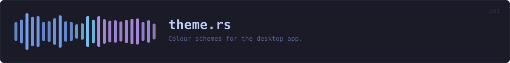
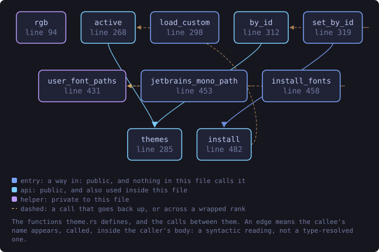
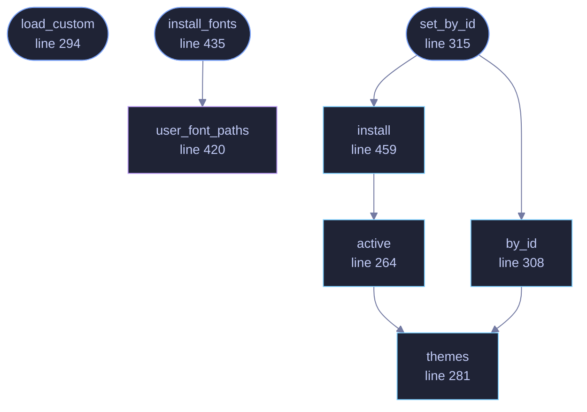

<!-- SPDX-License-Identifier: GPL-3.0-or-later -->
<!-- GENERATED by tools/docs/generate.py from the doc comments in the
     source. Do not edit this file: edit the `//!` and `///` comments in
     the .rs files and run the generator again. CI verifies it with
         python tools/docs/generate.py --check
-->

  

# `crates/veilvoice-gui/src/theme.rs`

[`veilvoice-gui`](../../../crates/veilvoice-gui/README.md) &middot; 784 lines &middot; [read the source](https://github.com/tilas01/veilvoice/blob/main/crates/veilvoice-gui/src/theme.rs)

## Contents

- [One palette, three front-ends](#one-palette-three-front-ends)
- [Why the active theme is an index, not a lock](#why-the-active-theme-is-an-index-not-a-lock)
- [In plain words](#in-plain-words)
  - [What this file contains](#what-this-file-contains)
  - [What calls what](#what-calls-what)
  - [Items](#items)

Colour schemes for the desktop app.

# One palette, three front-ends

Every theme here is the same set of twelve tokens the website defines in
`website/css/themes.css`, with the same names and the same hex values, and
Tokyo Night additionally matches the escape codes the CLI emits. The three
front-ends are meant to read as one program rather than as three tools that
happen to share a name, and the way that is kept true is by copying the
numbers rather than by approximating them. Tests assert **every token of
every theme** against the stylesheet, in **both directions** -- so a colour
changed on either side, a theme removed from either side, or a theme added
to the website and forgotten here all fail the build rather than shipping as
two products that no longer look alike.

# Why the active theme is an index, not a lock

Colours are read on every repaint, from the UI thread, dozens of times a
frame. A `Mutex` around the palette would be a lock taken hundreds of times
a second to read a constant, and a poisoned one would take the window with
it. Instead the themes are a `const` array and the selection is a single
`AtomicUsize`: reading is one relaxed load, it cannot fail, and it cannot
be poisoned.

The index is clamped on read as well as on write. A value that somehow got
out of range would otherwise panic on a slice index, in a paint loop, which
is the worst possible place for it -- so the read saturates to the default
instead.

# In plain words

The colour schemes the application ships with, and the fonts.

They are the same schemes the website offers, defined once so the two cannot
drift apart. Choosing one applies it straight away and it is remembered for
next time.

## What this file contains

784 lines defining **8 functions** (7 public), **1 type** and **5 constants**. Everything below is read out of the source, so it cannot disagree with the code.

**The types it owns.**

- `struct Theme` (line 54) -- One complete colour scheme.

**What happens when it runs.** These are the ways in: public, and nothing else in this file calls them, so they are what an outside caller reaches first.

- `load_custom` (line 294) -- Read the user's palettes and add them to the table.
- `set_by_id` (line 315) -- Switch to id, and apply it to ctx.
  - reaches: `by_id`, `install`, `themes`, `active`
- `install_fonts` (line 435) -- Load JetBrains Mono if the system has it.
  - reaches: `user_font_paths`

## What calls what

The functions this file defines, and the calls between them. Both
are read out of the source: an edge means the callee's name appears,
called, inside the caller's body. It is a syntactic reading, not a
type-resolved one, so a call made through a trait object or a macro
will not appear.

_Colour key: **entry** -- a way in: public, and nothing in this file calls it; **api** -- public, and also used inside this file; **helper** -- private to this file._

  

The same graph as Mermaid source

## Items

| Item | Line | Documentation |
|---|---:|---|
| `TABLE` static | [47](https://github.com/tilas01/veilvoice/blob/main/crates/veilvoice-gui/src/theme.rs#L47) | The theme table, once the user's palettes have been folded in. |
| `Theme` pub struct | [54](https://github.com/tilas01/veilvoice/blob/main/crates/veilvoice-gui/src/theme.rs#L54) | One complete colour scheme. |
| `fn` const | [90](https://github.com/tilas01/veilvoice/blob/main/crates/veilvoice-gui/src/theme.rs#L90) |  |
| `THEMES` pub const | [101](https://github.com/tilas01/veilvoice/blob/main/crates/veilvoice-gui/src/theme.rs#L101) | Every theme, in the order the picker shows them. |
| `ACTIVE` static | [258](https://github.com/tilas01/veilvoice/blob/main/crates/veilvoice-gui/src/theme.rs#L258) | The index of the theme currently in force. |
| `active` pub fn | [264](https://github.com/tilas01/veilvoice/blob/main/crates/veilvoice-gui/src/theme.rs#L264) | The theme currently in force. |
| `themes` pub fn | [281](https://github.com/tilas01/veilvoice/blob/main/crates/veilvoice-gui/src/theme.rs#L281) | Every theme the picker offers: the built-in ones, then any the user added. |
| `load_custom` pub fn | [294](https://github.com/tilas01/veilvoice/blob/main/crates/veilvoice-gui/src/theme.rs#L294) | Read the user's palettes and add them to the table. |
| `by_id` pub fn | [308](https://github.com/tilas01/veilvoice/blob/main/crates/veilvoice-gui/src/theme.rs#L308) | Look a theme up by its stable identifier. |
| `set_by_id` pub fn | [315](https://github.com/tilas01/veilvoice/blob/main/crates/veilvoice-gui/src/theme.rs#L315) | Switch to id, and apply it to ctx. |
| `palette` pub mod | [332](https://github.com/tilas01/veilvoice/blob/main/crates/veilvoice-gui/src/theme.rs#L332) | Shorthand accessors, so call sites read as p::fg() rather than theme::active().fg. |
| `JETBRAINS_MONO_PATHS` const | [408](https://github.com/tilas01/veilvoice/blob/main/crates/veilvoice-gui/src/theme.rs#L408) | Places JetBrains Mono is normally installed. |
| `user_font_paths` fn | [420](https://github.com/tilas01/veilvoice/blob/main/crates/veilvoice-gui/src/theme.rs#L420) |  |
| `install_fonts` pub fn | [435](https://github.com/tilas01/veilvoice/blob/main/crates/veilvoice-gui/src/theme.rs#L435) | Load JetBrains Mono if the system has it. |
| `install` pub fn | [459](https://github.com/tilas01/veilvoice/blob/main/crates/veilvoice-gui/src/theme.rs#L459) | Apply the active theme's visuals and a monospace-everywhere type scale. |

---

Generated from `crates/veilvoice-gui/src/theme.rs`. On the website: [`website/reference/veilvoice-gui/theme.html`](../../../website/reference/veilvoice-gui/theme.html).

Signing key fingerprint `8101FB3BB28D02FB239E0CDF9CC1C7E7A9B5833A`.
