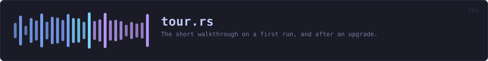
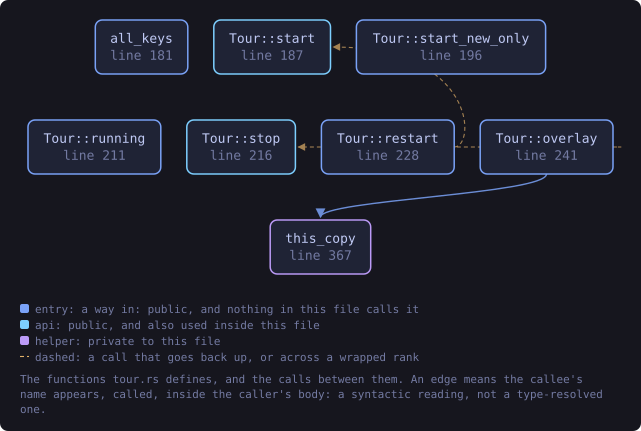
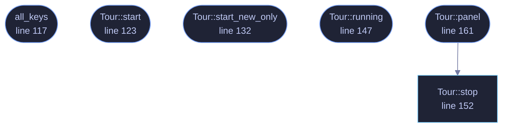

<!-- SPDX-License-Identifier: GPL-3.0-or-later -->
<!-- GENERATED by tools/docs/generate.py from the doc comments in the
     source. Do not edit this file: edit the `//!` and `///` comments in
     the .rs files and run the generator again. CI verifies it with
         python tools/docs/generate.py --check
-->

  

# `crates/veilvoice-gui/src/tour.rs`

[`veilvoice-gui`](../../../crates/veilvoice-gui/README.md) &middot; 289 lines &middot; [read the source](https://github.com/tilas01/veilvoice/blob/main/crates/veilvoice-gui/src/tour.rs)

## Contents

- [What it is for](#what-it-is-for)
- [Why it comes back after an upgrade](#why-it-comes-back-after-an-upgrade)
- [Portable or installed](#portable-or-installed)
  - [What this file contains](#what-this-file-contains)
  - [What calls what](#what-calls-what)
  - [Items](#items)

The short tour on a first run, and after an upgrade.

# What it is for

The window has nine tabs and nothing said what any of them were. Somebody
opening this for the first time met a tab strip and had to guess, and two
of the nine, Monitor and Lock, are not what their names suggest to a person
who has not read the documentation.

So: one card per tab, one sentence each, skippable at any point, and gone
for good once seen. It is not a walkthrough with arrows pointing at
controls. It is the paragraph a person would have read in a manual, offered
at the moment they would have wanted it, and it takes about twenty seconds.

# Why it comes back after an upgrade

Only as far as the tabs that are new. A tour that replays in full on every
upgrade is a tour people learn to skip, and one that never comes back means
a tab added in a later release is never introduced to anybody who was
already a user.

What is stored is the list of tabs that were toured, not a "seen" flag and
not the version number. A flag cannot answer the question an upgrade asks,
and the version can only answer it indirectly: comparing versions tells you
*that* something changed, and the tab list tells you *what*, which is the
thing being shown. It also means a release that adds no tab shows nobody
anything, which is the common case and the right behaviour for it.

# Portable or installed

The last card says which one this copy is, in those words, because it is
the question behind "where did my settings go" and "why is it not in my
menu". It is a statement rather than a prompt: `Install` is a tab, the
decision is made there, and a tour is a bad place to ask somebody to commit
to anything.

## What this file contains

289 lines defining **6 functions** (6 public), **1 type** and **1 constant**. Everything below is read out of the source, so it cannot disagree with the code.

**The types it owns.**

- `struct Tour` (line 109) -- Where the tour is up to.

**What happens when it runs.** These are the ways in: public, and nothing else in this file calls them, so they are what an outside caller reaches first.

- `all_keys` (line 117) -- Every tab key the tour knows, for storing once it has run.
- `Tour::start` (line 123) -- Start the tour from the beginning, showing every card.
- `Tour::start_new_only` (line 132) -- Start it showing only the cards whose tabs are not in known.
- `Tour::running` (line 147) -- Whether the tour is on screen.
- `Tour::panel` (line 161) -- Draw the current card.
  - reaches: `stop`

## What calls what

The functions this file defines, and the calls between them. Both
are read out of the source: an edge means the callee's name appears,
called, inside the caller's body. It is a syntactic reading, not a
type-resolved one, so a call made through a trait object or a macro
will not appear.

_Colour key: **entry** -- a way in: public, and nothing in this file calls it; **api** -- public, and also used inside this file._

  

The same graph as Mermaid source

## Items

| Item | Line | Documentation |
|---|---:|---|
| `CARDS` pub const | [46](https://github.com/tilas01/veilvoice/blob/main/crates/veilvoice-gui/src/tour.rs#L46) | One card: the tab it is about, and what that tab is for. |
| `Tour` pub struct | [109](https://github.com/tilas01/veilvoice/blob/main/crates/veilvoice-gui/src/tour.rs#L109) | Where the tour is up to. |
| `all_keys` pub fn | [117](https://github.com/tilas01/veilvoice/blob/main/crates/veilvoice-gui/src/tour.rs#L117) | Every tab key the tour knows, for storing once it has run. |
| `Tour::start` pub fn | [123](https://github.com/tilas01/veilvoice/blob/main/crates/veilvoice-gui/src/tour.rs#L123) | Start the tour from the beginning, showing every card. |
| `Tour::start_new_only` pub fn | [132](https://github.com/tilas01/veilvoice/blob/main/crates/veilvoice-gui/src/tour.rs#L132) | Start it showing only the cards whose tabs are not in known. |
| `Tour::running` pub fn | [147](https://github.com/tilas01/veilvoice/blob/main/crates/veilvoice-gui/src/tour.rs#L147) | Whether the tour is on screen. |
| `Tour::stop` pub fn | [152](https://github.com/tilas01/veilvoice/blob/main/crates/veilvoice-gui/src/tour.rs#L152) | Stop it. |
| `Tour::panel` pub fn | [161](https://github.com/tilas01/veilvoice/blob/main/crates/veilvoice-gui/src/tour.rs#L161) | Draw the current card. |

---

Generated from `crates/veilvoice-gui/src/tour.rs`. On the website: [`website/reference/veilvoice-gui/tour.html`](../../../website/reference/veilvoice-gui/tour.html).

Signing key fingerprint `8101FB3BB28D02FB239E0CDF9CC1C7E7A9B5833A`.
