<!-- SPDX-License-Identifier: GPL-3.0-or-later -->
<!-- GENERATED by tools/docs/generate.py from the doc comments in the
     source. Do not edit this file: edit the `//!` and `///` comments in
     the .rs files and run the generator again. CI verifies it with
         python tools/docs/generate.py --check
-->

  

# `crates/veilvoice-gui/src/vault_store.rs`

[`veilvoice-gui`](../../../crates/veilvoice-gui/README.md) &middot; 589 lines &middot; [read the source](https://github.com/tilas01/veilvoice/blob/main/crates/veilvoice-gui/src/vault_store.rs)

## Contents

- [The short version, and it is the honest one](#the-short-version-and-it-is-the-honest-one)
- [What it still does not buy](#what-it-still-does-not-buy)
- [Moving in, and the risk that comes with it](#moving-in-and-the-risk-that-comes-with-it)
  - [What this file contains](#what-this-file-contains)
  - [What calls what](#what-calls-what)
  - [Items](#items)

Where the desktop application keeps its own files, and what the app lock
buys for them.

# The short version, and it is the honest one

**With an app lock set**, everything VeilVoice writes about itself lives in
`veilvoice_crypto::hoard`: encrypted, padded to a few fixed sizes, under
filenames derived from the lock passphrase, with decoy files sown among
them. Somebody who opens the folder without the passphrase cannot tell
which file is the settings, which is the integrity record, which holds
anything, and which is junk.

**With no app lock**, none of that is possible and none of it is claimed.
There is no passphrase, so there is no key, so there is nothing to derive a
name from or encrypt with. The files sit in the open under their own names,
exactly as they did before this module existed, and the security tab says
so in those words.

That is the whole bargain, and it is the answer to a fair question about
the app lock: what is it actually *for*, if it is only a password prompt on
a window whose files anybody can read? This is what it is for. Setting a
passphrase is what turns the folder from a set of labelled files into a set
of indistinguishable ones.

# What it still does not buy

Repeated here rather than left in the crypto crate, because this is the
module the application calls and the place somebody looks:

- It does not hide that VeilVoice is installed. The folder is named
`veilvoice` and the lock file is in it under its own name -- it has to
be, since it is what checks the passphrase.
- It does not stop anybody deleting the folder.
- It is no protection at all while the application is open and unlocked.
- Anybody who has the passphrase has everything.

# Moving in, and the risk that comes with it

The first unlock after a lock is set migrates the existing plain files in:
each is read, written as a hoard record, and the original securely erased.

This is the moment to be plain about a consequence that is easy to
under-state. Once the files are in the hoard, **the passphrase is the only
way back to them**. Losing it does not lock you out of a window whose files
you could still read by hand; it loses the settings, the integrity record
and the policies for good. `veilvoice_crypto::lock` keeps a second copy of
the lock for exactly this reason, and the setup screen says the sentence out
loud rather than burying it.

## What this file contains

589 lines defining **11 functions** (10 public), **2 types** and **1 constant**. Everything below is read out of the source, so it cannot disagree with the code.

**The types it owns.**

- `struct VaultStore` (line 124) -- The application's own storage, locked or not.
- `struct Measured` (line 440) -- What the application measured about its own running, kept between sessions.

**What happens when it runs.** These are the ways in: public, and nothing else in this file calls them, so they are what an outside caller reaches first.

- `VaultStore::new` (line 133) -- Point at the program folder.
- `VaultStore::dir` (line 138) -- The program folder, if this platform has one.
- `VaultStore::is_obfuscated` (line 147) -- Whether records are currently obfuscated.
- `VaultStore::unlocked` (line 156) -- Take the key from an unlock and open the hoard with it.
- `VaultStore::locked` (line 194) -- Forget the key.
- `VaultStore::read` (line 200) -- Read a record, from the hoard if it is open and from the plain file if it is not.
  - reaches: `plain_path`
- `VaultStore::write` (line 215) -- Write a record, obfuscated if there is a key and plain if there is not.
  - reaches: `plain_path`
- `Measured::load` (line 457) -- Read it back, or the defaults if nothing has been recorded.
- `Measured::save` (line 480) -- Write it, obfuscated when there is a key and plain when there is not.
- `Measured::record` (line 494) -- Fold this session's numbers in.

## What calls what

The functions this file defines, and the calls between them. Both
are read out of the source: an edge means the callee's name appears,
called, inside the caller's body. It is a syntactic reading, not a
type-resolved one, so a call made through a trait object or a macro
will not appear.

_Colour key: **entry** -- a way in: public, and nothing in this file calls it; **helper** -- private to this file._

  

The same graph as Mermaid source

```mermaid
%%{init: {"theme":"base","themeVariables":{"background":"#1a1b26","primaryColor":"#1f2335","primaryTextColor":"#c0caf5","primaryBorderColor":"#7aa2f7","secondaryColor":"#16161e","tertiaryColor":"#16161e","lineColor":"#737aa2","textColor":"#c0caf5","mainBkg":"#1f2335","nodeBorder":"#7aa2f7","clusterBkg":"#16161e","clusterBorder":"#2f3549","fontFamily":"ui-monospace, SFMono-Regular, Consolas, monospace","fontSize":"14px"}}}%%
flowchart TD
    n_new(["VaultStore::new<br/>line 133"])
    n_dir(["VaultStore::dir<br/>line 138"])
    n_is_obfuscated(["VaultStore::is_obfuscated<br/>line 147"])
    n_unlocked(["VaultStore::unlocked<br/>line 156"])
    n_locked(["VaultStore::locked<br/>line 194"])
    n_read(["VaultStore::read<br/>line 200"])
    n_write(["VaultStore::write<br/>line 215"])
    n_plain_path["VaultStore::plain_path<br/>line 229"]
    n_load(["Measured::load<br/>line 457"])
    n_save(["Measured::save<br/>line 480"])
    n_record(["Measured::record<br/>line 494"])
    n_read --> n_plain_path
    n_write --> n_plain_path
    click n_new href "https://github.com/tilas01/veilvoice/blob/main/crates/veilvoice-gui/src/vault_store.rs#L133" "open the source"
    click n_dir href "https://github.com/tilas01/veilvoice/blob/main/crates/veilvoice-gui/src/vault_store.rs#L138" "open the source"
    click n_is_obfuscated href "https://github.com/tilas01/veilvoice/blob/main/crates/veilvoice-gui/src/vault_store.rs#L147" "open the source"
    click n_unlocked href "https://github.com/tilas01/veilvoice/blob/main/crates/veilvoice-gui/src/vault_store.rs#L156" "open the source"
    click n_locked href "https://github.com/tilas01/veilvoice/blob/main/crates/veilvoice-gui/src/vault_store.rs#L194" "open the source"
    click n_read href "https://github.com/tilas01/veilvoice/blob/main/crates/veilvoice-gui/src/vault_store.rs#L200" "open the source"
    click n_write href "https://github.com/tilas01/veilvoice/blob/main/crates/veilvoice-gui/src/vault_store.rs#L215" "open the source"
    click n_plain_path href "https://github.com/tilas01/veilvoice/blob/main/crates/veilvoice-gui/src/vault_store.rs#L229" "open the source"
    click n_load href "https://github.com/tilas01/veilvoice/blob/main/crates/veilvoice-gui/src/vault_store.rs#L457" "open the source"
    click n_save href "https://github.com/tilas01/veilvoice/blob/main/crates/veilvoice-gui/src/vault_store.rs#L480" "open the source"
    click n_record href "https://github.com/tilas01/veilvoice/blob/main/crates/veilvoice-gui/src/vault_store.rs#L494" "open the source"
    classDef entry fill:#1f2335,stroke:#7aa2f7,color:#c0caf5
    class n_new,n_dir,n_is_obfuscated,n_unlocked,n_locked,n_read,n_write,n_load,n_save,n_record entry
    classDef helper fill:#1f2335,stroke:#bb9af7,color:#c0caf5
    class n_plain_path helper
```

## Items

| Item | Line | Documentation |
|---|---:|---|
| `records` pub mod | [85](https://github.com/tilas01/veilvoice/blob/main/crates/veilvoice-gui/src/vault_store.rs#L85) | The logical names of every record the application keeps. |
| `DECOYS` const | [120](https://github.com/tilas01/veilvoice/blob/main/crates/veilvoice-gui/src/vault_store.rs#L120) | How many decoys a folder is kept stocked with. |
| `VaultStore` pub struct | [124](https://github.com/tilas01/veilvoice/blob/main/crates/veilvoice-gui/src/vault_store.rs#L124) | The application's own storage, locked or not. |
| `VaultStore::new` pub fn | [133](https://github.com/tilas01/veilvoice/blob/main/crates/veilvoice-gui/src/vault_store.rs#L133) | Point at the program folder. |
| `VaultStore::dir` pub fn | [138](https://github.com/tilas01/veilvoice/blob/main/crates/veilvoice-gui/src/vault_store.rs#L138) | The program folder, if this platform has one. |
| `VaultStore::is_obfuscated` pub fn | [147](https://github.com/tilas01/veilvoice/blob/main/crates/veilvoice-gui/src/vault_store.rs#L147) | Whether records are currently obfuscated. |
| `VaultStore::unlocked` pub fn | [156](https://github.com/tilas01/veilvoice/blob/main/crates/veilvoice-gui/src/vault_store.rs#L156) | Take the key from an unlock and open the hoard with it. |
| `VaultStore::locked` pub fn | [194](https://github.com/tilas01/veilvoice/blob/main/crates/veilvoice-gui/src/vault_store.rs#L194) | Forget the key. |
| `VaultStore::read` pub fn | [200](https://github.com/tilas01/veilvoice/blob/main/crates/veilvoice-gui/src/vault_store.rs#L200) | Read a record, from the hoard if it is open and from the plain file if it is not. |
| `VaultStore::write` pub fn | [215](https://github.com/tilas01/veilvoice/blob/main/crates/veilvoice-gui/src/vault_store.rs#L215) | Write a record, obfuscated if there is a key and plain if there is not. |
| `VaultStore::plain_path` fn | [229](https://github.com/tilas01/veilvoice/blob/main/crates/veilvoice-gui/src/vault_store.rs#L229) | Where a record sits when nothing is obfuscating it. |
| `Measured` pub struct | [440](https://github.com/tilas01/veilvoice/blob/main/crates/veilvoice-gui/src/vault_store.rs#L440) | What the application measured about its own running, kept between sessions. |
| `Measured::load` pub fn | [457](https://github.com/tilas01/veilvoice/blob/main/crates/veilvoice-gui/src/vault_store.rs#L457) | Read it back, or the defaults if nothing has been recorded. |
| `Measured::save` pub fn | [480](https://github.com/tilas01/veilvoice/blob/main/crates/veilvoice-gui/src/vault_store.rs#L480) | Write it, obfuscated when there is a key and plain when there is not. |
| `Measured::record` pub fn | [494](https://github.com/tilas01/veilvoice/blob/main/crates/veilvoice-gui/src/vault_store.rs#L494) | Fold this session's numbers in. |
| `measured_tests` mod | [505](https://github.com/tilas01/veilvoice/blob/main/crates/veilvoice-gui/src/vault_store.rs#L505) |  |

---

Generated from `crates/veilvoice-gui/src/vault_store.rs`. On the website: [`website/reference/veilvoice-gui/vault_store.html`](../../../website/reference/veilvoice-gui/vault_store.html).

Signing key fingerprint `8101FB3BB28D02FB239E0CDF9CC1C7E7A9B5833A`.
