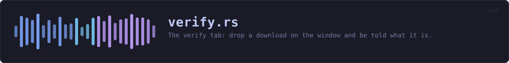
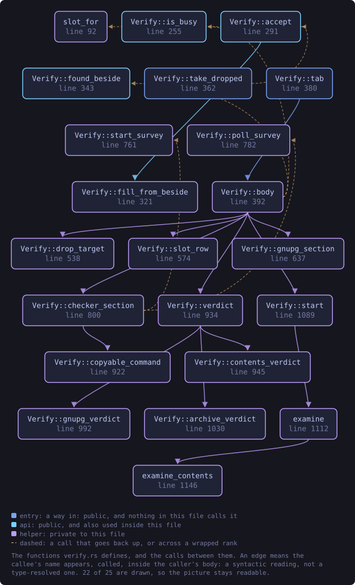

<!-- SPDX-License-Identifier: GPL-3.0-or-later -->
<!-- GENERATED by tools/docs/generate.py from the doc comments in the
     source. Do not edit this file: edit the `//!` and `///` comments in
     the .rs files and run the generator again. CI verifies it with
         python tools/docs/generate.py --check
-->

  

# `crates/veilvoice-gui/src/verify.rs`

[`veilvoice-gui`](../../../crates/veilvoice-gui/README.md) &middot; 505 lines &middot; [read the source](https://github.com/tilas01/veilvoice/blob/main/crates/veilvoice-gui/src/verify.rs)

## Contents

- [Why this exists here rather than in the verifier](#why-this-exists-here-rather-than-in-the-verifier)
- [Three files, and the tab says so before it is given any](#three-files-and-the-tab-says-so-before-it-is-given-any)
- [Nothing here downloads anything](#nothing-here-downloads-anything)
  - [What this file contains](#what-this-file-contains)
  - [What calls what](#what-calls-what)
  - [Items](#items)

The verify tab: drop a download on the window and be told what it is.

# Why this exists here rather than in the verifier

The ask was drag-and-drop verification. There were two ways to have it:
link `eframe` into `veilvoice-verify`, or move the checking out of that
binary so both front ends call the same code.

The portable verifier is the one program in this project whose *smallness*
is a feature — it is what somebody downloads before they trust anything
else here, and a 1.5 MB single file is part of why it is checkable at all.
Putting a GUI toolkit in it would have cost that for a convenience the
desktop application was already the right place for. So the arithmetic
moved to `veilvoice-check` and this is a second caller, not a second
implementation.

# Three files, and the tab says so before it is given any

Verifying needs the download, the `SHA256SUMS` and the `SHA256SUMS.asc`.
Dropping one file on a window and getting a verdict would be a lie, and an
interface that discovers the other two are missing *after* the drop teaches
people that verification is fiddly rather than that it needs three things.
All three slots are visible from the start, and a drop fills whichever one
the file's name says it is.

# Nothing here downloads anything

Not even the key: it is compiled in, and its fingerprint is checked against
a constant a reader can compare with the README. `veilvoice-verify` is
still the tool for fetching a release, because it is the one that can be
checked before it is run.

## What this file contains

505 lines defining **12 functions** (6 public), **2 types** and **0 constants**. Everything below is read out of the source, so it cannot disagree with the code.

**The types it owns.**

- `enum Slot` (line 42) -- Which of the three files a dropped path is.
- `struct Verify` (line 71) -- The tab's state.

**What happens when it runs.** These are the ways in: public, and nothing else in this file calls them, so they are what an outside caller reaches first.

- `Verify::wants_repaint` (line 105) -- Whether the window has to keep drawing for this panel's sake.
- `Verify::drain` (line 110) -- Take the worker's answer if it has one.
- `Verify::take_dropped` (line 144) -- Read what the window was given this frame.
  - reaches: `accept`, `slot_for`
- `Verify::tab` (line 162) -- The whole tab.
  - reaches: `body`, `drop_target`, `is_busy`, `slot_row`, `start`, `verdict`

## What calls what

The functions this file defines, and the calls between them. Both
are read out of the source: an edge means the callee's name appears,
called, inside the caller's body. It is a syntactic reading, not a
type-resolved one, so a call made through a trait object or a macro
will not appear.

_Colour key: **entry** -- a way in: public, and nothing in this file calls it; **api** -- public, and also used inside this file; **helper** -- private to this file._

  

The same graph as Mermaid source

```mermaid
%%{init: {"theme":"base","themeVariables":{"background":"#1a1b26","primaryColor":"#1f2335","primaryTextColor":"#c0caf5","primaryBorderColor":"#7aa2f7","secondaryColor":"#16161e","tertiaryColor":"#16161e","lineColor":"#737aa2","textColor":"#c0caf5","mainBkg":"#1f2335","nodeBorder":"#7aa2f7","clusterBkg":"#16161e","clusterBorder":"#2f3549","fontFamily":"ui-monospace, SFMono-Regular, Consolas, monospace","fontSize":"14px"}}}%%
flowchart TD
    n_slot_for["slot_for<br/>line 55"]
    n_is_busy["Verify::is_busy<br/>line 95"]
    n_wants_repaint(["Verify::wants_repaint<br/>line 105"])
    n_drain(["Verify::drain<br/>line 110"])
    n_accept["Verify::accept<br/>line 128"]
    n_take_dropped(["Verify::take_dropped<br/>line 144"])
    n_tab(["Verify::tab<br/>line 162"])
    n_body["Verify::body<br/>line 168"]
    n_drop_target["Verify::drop_target<br/>line 246"]
    n_slot_row["Verify::slot_row<br/>line 268"]
    n_verdict["Verify::verdict<br/>line 323"]
    n_start["Verify::start<br/>line 382"]
    n_accept --> n_slot_for
    n_body --> n_drop_target
    n_body --> n_is_busy
    n_body --> n_slot_row
    n_body --> n_start
    n_body --> n_verdict
    n_tab --> n_body
    n_take_dropped --> n_accept
    click n_slot_for href "https://github.com/tilas01/veilvoice/blob/main/crates/veilvoice-gui/src/verify.rs#L55" "open the source"
    click n_is_busy href "https://github.com/tilas01/veilvoice/blob/main/crates/veilvoice-gui/src/verify.rs#L95" "open the source"
    click n_wants_repaint href "https://github.com/tilas01/veilvoice/blob/main/crates/veilvoice-gui/src/verify.rs#L105" "open the source"
    click n_drain href "https://github.com/tilas01/veilvoice/blob/main/crates/veilvoice-gui/src/verify.rs#L110" "open the source"
    click n_accept href "https://github.com/tilas01/veilvoice/blob/main/crates/veilvoice-gui/src/verify.rs#L128" "open the source"
    click n_take_dropped href "https://github.com/tilas01/veilvoice/blob/main/crates/veilvoice-gui/src/verify.rs#L144" "open the source"
    click n_tab href "https://github.com/tilas01/veilvoice/blob/main/crates/veilvoice-gui/src/verify.rs#L162" "open the source"
    click n_body href "https://github.com/tilas01/veilvoice/blob/main/crates/veilvoice-gui/src/verify.rs#L168" "open the source"
    click n_drop_target href "https://github.com/tilas01/veilvoice/blob/main/crates/veilvoice-gui/src/verify.rs#L246" "open the source"
    click n_slot_row href "https://github.com/tilas01/veilvoice/blob/main/crates/veilvoice-gui/src/verify.rs#L268" "open the source"
    click n_verdict href "https://github.com/tilas01/veilvoice/blob/main/crates/veilvoice-gui/src/verify.rs#L323" "open the source"
    click n_start href "https://github.com/tilas01/veilvoice/blob/main/crates/veilvoice-gui/src/verify.rs#L382" "open the source"
    classDef entry fill:#1f2335,stroke:#7aa2f7,color:#c0caf5
    class n_wants_repaint,n_drain,n_take_dropped,n_tab entry
    classDef api fill:#1f2335,stroke:#7dcfff,color:#c0caf5
    class n_is_busy,n_accept api
    classDef helper fill:#1f2335,stroke:#bb9af7,color:#c0caf5
    class n_slot_for,n_body,n_drop_target,n_slot_row,n_verdict,n_start helper
```

## Items

| Item | Line | Documentation |
|---|---:|---|
| `Slot` enum | [42](https://github.com/tilas01/veilvoice/blob/main/crates/veilvoice-gui/src/verify.rs#L42) | Which of the three files a dropped path is. |
| `slot_for` fn | [55](https://github.com/tilas01/veilvoice/blob/main/crates/veilvoice-gui/src/verify.rs#L55) | Work out what a dropped file is from its name. |
| `Verify` pub struct | [71](https://github.com/tilas01/veilvoice/blob/main/crates/veilvoice-gui/src/verify.rs#L71) | The tab's state. |
| `Verify::is_busy` pub fn | [95](https://github.com/tilas01/veilvoice/blob/main/crates/veilvoice-gui/src/verify.rs#L95) | Whether a check is running, so the app keeps repainting. |
| `Verify::wants_repaint` pub fn | [105](https://github.com/tilas01/veilvoice/blob/main/crates/veilvoice-gui/src/verify.rs#L105) | Whether the window has to keep drawing for this panel's sake. |
| `Verify::drain` pub fn | [110](https://github.com/tilas01/veilvoice/blob/main/crates/veilvoice-gui/src/verify.rs#L110) | Take the worker's answer if it has one. |
| `Verify::accept` pub fn | [128](https://github.com/tilas01/veilvoice/blob/main/crates/veilvoice-gui/src/verify.rs#L128) | Put a dropped or chosen file into the slot its name says it belongs in. |
| `Verify::take_dropped` pub fn | [144](https://github.com/tilas01/veilvoice/blob/main/crates/veilvoice-gui/src/verify.rs#L144) | Read what the window was given this frame. |
| `Verify::tab` pub fn | [162](https://github.com/tilas01/veilvoice/blob/main/crates/veilvoice-gui/src/verify.rs#L162) | The whole tab. |
| `Verify::body` fn | [168](https://github.com/tilas01/veilvoice/blob/main/crates/veilvoice-gui/src/verify.rs#L168) |  |
| `Verify::drop_target` fn | [246](https://github.com/tilas01/veilvoice/blob/main/crates/veilvoice-gui/src/verify.rs#L246) | The rectangle that lights up while files are over the window. |
| `Verify::slot_row` fn | [268](https://github.com/tilas01/veilvoice/blob/main/crates/veilvoice-gui/src/verify.rs#L268) | One file slot: what it is, what is in it, and a way to change it. |
| `Verify::verdict` fn | [323](https://github.com/tilas01/veilvoice/blob/main/crates/veilvoice-gui/src/verify.rs#L323) | The answer, in the colour it deserves. |
| `Verify::start` fn | [382](https://github.com/tilas01/veilvoice/blob/main/crates/veilvoice-gui/src/verify.rs#L382) | Run the check on a thread of its own. |

---

Generated from `crates/veilvoice-gui/src/verify.rs`. On the website: [`website/reference/veilvoice-gui/verify.html`](../../../website/reference/veilvoice-gui/verify.html).

Signing key fingerprint `8101FB3BB28D02FB239E0CDF9CC1C7E7A9B5833A`.
