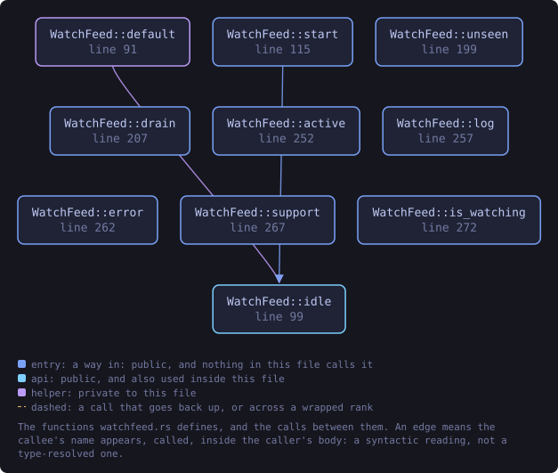

<!-- SPDX-License-Identifier: GPL-3.0-or-later -->
<!-- GENERATED by tools/docs/generate.py from the doc comments in the
     source. Do not edit this file: edit the `//!` and `///` comments in
     the .rs files and run the generator again. CI verifies it with
         python tools/docs/generate.py --check
-->

  

# `crates/veilvoice-gui/src/watchfeed.rs`

[`veilvoice-gui`](../../../crates/veilvoice-gui/README.md) &middot; 381 lines &middot; [read the source](https://github.com/tilas01/veilvoice/blob/main/crates/veilvoice-gui/src/watchfeed.rs)

## Contents

- [Why this file exists](#why-this-file-exists)
- [One thread for the life of the window](#one-thread-for-the-life-of-the-window)
- [It stops when the window does](#it-stops-when-the-window-does)
- [In plain words](#in-plain-words)
  - [What this file contains](#what-this-file-contains)
  - [What calls what](#what-calls-what)
  - [Items](#items)

The device monitor, moved off the thread that paints.

# Why this file exists

The monitor used to be polled straight from `update`, which is the
user-interface thread. Asking the operating system which applications hold
the microphone is not free — on Windows it means running `reg.exe`, and on
Linux it means walking `/proc` — and anything that costs tens of
milliseconds is several frames.

The shipped v0.1.12 did it the expensive way as well as in the wrong place:
two subprocesses per application — 68 of them on the machine this was found
on, costing at least 449 ms measured — every two seconds, on the thread that
draws. The window froze repeatedly. `veilvoice-watch` now costs two
subprocesses whatever is installed, and this file makes sure the remaining
cost never lands on a frame.

**Both halves were needed.** A cheap scan on the painting thread is still a
scan on the painting thread: it would be a stutter rather than a freeze, on
a machine slower than the one it was tested on, and it would come back.

# One thread for the life of the window

Not one per poll. Spawning a thread every two seconds to do 45 ms of work is
most of a thread's lifetime spent being created, and it would put the
monitor's own state — which is what makes "started" and "stopped" different
from "is using" — somewhere it has to be moved back and forth.

So the worker owns the `veilvoice_watch::Monitor` and keeps it. It polls,
sends, sleeps, repeats. The window drains whatever has arrived once a frame
and never waits.

# It stops when the window does

Nothing tells the thread to exit. When the window closes the receiver is
dropped, the next `send` fails, and the loop ends — which is the whole
shutdown protocol and needs no flag, no channel back and no chance of
hanging on exit waiting for a sleep to finish.

# In plain words

Keeps the microphone and camera monitor running somewhere other than the thread
that draws the window.

Asking the operating system which programs are using a device takes long enough
to be visible if it happens while the window is being painted. So it happens on
its own thread and the window reads whatever has arrived.

If that thread ever stops, the panel says so plainly, because a monitor that
has quietly not updated for an hour looks exactly like a machine where nothing
is listening.

## What this file contains

381 lines defining **11 functions** (10 public), **2 types** and **2 constants**. Everything below is read out of the source, so it cannot disagree with the code.

**The types it owns.**

- `struct Update` (line 63) -- One look at the machine.
- `struct WatchFeed` (line 73) -- The window's end of the monitor.

**What happens when it runs.** These are the ways in: public, and nothing else in this file calls them, so they are what an outside caller reaches first.

- `WatchFeed::start` (line 115) -- Start watching, on a thread of its own.
  - reaches: `idle`
- `WatchFeed::unseen` (line 163) -- Alerts that have arrived and not yet been shown as a notification.
- `WatchFeed::has_unseen` (line 168) -- Whether anything is waiting to be shown.
- `WatchFeed::drain` (line 176) -- Take whatever has arrived.
- `WatchFeed::active` (line 221) -- What is holding a device right now.
- `WatchFeed::log` (line 226) -- What has started and stopped, oldest first.
- `WatchFeed::error` (line 231) -- Why the monitor is not answering, if it is not.
- `WatchFeed::support` (line 236) -- What this platform can detect at all.
- `WatchFeed::is_watching` (line 241) -- Whether there is a worker running.

## What calls what

The functions this file defines, and the calls between them. Both
are read out of the source: an edge means the callee's name appears,
called, inside the caller's body. It is a syntactic reading, not a
type-resolved one, so a call made through a trait object or a macro
will not appear.

_Colour key: **entry** -- a way in: public, and nothing in this file calls it; **api** -- public, and also used inside this file; **helper** -- private to this file._

  

The same graph as Mermaid source

```mermaid
%%{init: {"theme":"base","themeVariables":{"background":"#1a1b26","primaryColor":"#1f2335","primaryTextColor":"#c0caf5","primaryBorderColor":"#7aa2f7","secondaryColor":"#16161e","tertiaryColor":"#16161e","lineColor":"#737aa2","textColor":"#c0caf5","mainBkg":"#1f2335","nodeBorder":"#7aa2f7","clusterBkg":"#16161e","clusterBorder":"#2f3549","fontFamily":"ui-monospace, SFMono-Regular, Consolas, monospace","fontSize":"14px"}}}%%
flowchart TD
    n_default["WatchFeed::default<br/>line 91"]
    n_idle["WatchFeed::idle<br/>line 99"]
    n_start(["WatchFeed::start<br/>line 115"])
    n_unseen(["WatchFeed::unseen<br/>line 163"])
    n_has_unseen(["WatchFeed::has_unseen<br/>line 168"])
    n_drain(["WatchFeed::drain<br/>line 176"])
    n_active(["WatchFeed::active<br/>line 221"])
    n_log(["WatchFeed::log<br/>line 226"])
    n_error(["WatchFeed::error<br/>line 231"])
    n_support(["WatchFeed::support<br/>line 236"])
    n_is_watching(["WatchFeed::is_watching<br/>line 241"])
    n_default --> n_idle
    n_start --> n_idle
    click n_default href "https://github.com/tilas01/veilvoice/blob/main/crates/veilvoice-gui/src/watchfeed.rs#L91" "open the source"
    click n_idle href "https://github.com/tilas01/veilvoice/blob/main/crates/veilvoice-gui/src/watchfeed.rs#L99" "open the source"
    click n_start href "https://github.com/tilas01/veilvoice/blob/main/crates/veilvoice-gui/src/watchfeed.rs#L115" "open the source"
    click n_unseen href "https://github.com/tilas01/veilvoice/blob/main/crates/veilvoice-gui/src/watchfeed.rs#L163" "open the source"
    click n_has_unseen href "https://github.com/tilas01/veilvoice/blob/main/crates/veilvoice-gui/src/watchfeed.rs#L168" "open the source"
    click n_drain href "https://github.com/tilas01/veilvoice/blob/main/crates/veilvoice-gui/src/watchfeed.rs#L176" "open the source"
    click n_active href "https://github.com/tilas01/veilvoice/blob/main/crates/veilvoice-gui/src/watchfeed.rs#L221" "open the source"
    click n_log href "https://github.com/tilas01/veilvoice/blob/main/crates/veilvoice-gui/src/watchfeed.rs#L226" "open the source"
    click n_error href "https://github.com/tilas01/veilvoice/blob/main/crates/veilvoice-gui/src/watchfeed.rs#L231" "open the source"
    click n_support href "https://github.com/tilas01/veilvoice/blob/main/crates/veilvoice-gui/src/watchfeed.rs#L236" "open the source"
    click n_is_watching href "https://github.com/tilas01/veilvoice/blob/main/crates/veilvoice-gui/src/watchfeed.rs#L241" "open the source"
    classDef entry fill:#1f2335,stroke:#7aa2f7,color:#c0caf5
    class n_start,n_unseen,n_has_unseen,n_drain,n_active,n_log,n_error,n_support,n_is_watching entry
    classDef api fill:#1f2335,stroke:#7dcfff,color:#c0caf5
    class n_idle api
    classDef helper fill:#1f2335,stroke:#bb9af7,color:#c0caf5
    class n_default helper
```

## Items

| Item | Line | Documentation |
|---|---:|---|
| `EVERY` const | [60](https://github.com/tilas01/veilvoice/blob/main/crates/veilvoice-gui/src/watchfeed.rs#L60) | How often to look. |
| `Update` pub struct | [63](https://github.com/tilas01/veilvoice/blob/main/crates/veilvoice-gui/src/watchfeed.rs#L63) | One look at the machine. |
| `WatchFeed` pub struct | [73](https://github.com/tilas01/veilvoice/blob/main/crates/veilvoice-gui/src/watchfeed.rs#L73) | The window's end of the monitor. |
| `MOST_ALERTS` const | [88](https://github.com/tilas01/veilvoice/blob/main/crates/veilvoice-gui/src/watchfeed.rs#L88) | A log that grows without bound is a memory leak with a user interface. |
| `WatchFeed::default` fn | [91](https://github.com/tilas01/veilvoice/blob/main/crates/veilvoice-gui/src/watchfeed.rs#L91) |  |
| `WatchFeed::idle` pub fn | [99](https://github.com/tilas01/veilvoice/blob/main/crates/veilvoice-gui/src/watchfeed.rs#L99) | A feed that watches nothing. |
| `WatchFeed::start` pub fn | [115](https://github.com/tilas01/veilvoice/blob/main/crates/veilvoice-gui/src/watchfeed.rs#L115) | Start watching, on a thread of its own. |
| `WatchFeed::unseen` pub fn | [163](https://github.com/tilas01/veilvoice/blob/main/crates/veilvoice-gui/src/watchfeed.rs#L163) | Alerts that have arrived and not yet been shown as a notification. |
| `WatchFeed::has_unseen` pub fn | [168](https://github.com/tilas01/veilvoice/blob/main/crates/veilvoice-gui/src/watchfeed.rs#L168) | Whether anything is waiting to be shown. |
| `WatchFeed::drain` pub fn | [176](https://github.com/tilas01/veilvoice/blob/main/crates/veilvoice-gui/src/watchfeed.rs#L176) | Take whatever has arrived. |
| `WatchFeed::active` pub fn | [221](https://github.com/tilas01/veilvoice/blob/main/crates/veilvoice-gui/src/watchfeed.rs#L221) | What is holding a device right now. |
| `WatchFeed::log` pub fn | [226](https://github.com/tilas01/veilvoice/blob/main/crates/veilvoice-gui/src/watchfeed.rs#L226) | What has started and stopped, oldest first. |
| `WatchFeed::error` pub fn | [231](https://github.com/tilas01/veilvoice/blob/main/crates/veilvoice-gui/src/watchfeed.rs#L231) | Why the monitor is not answering, if it is not. |
| `WatchFeed::support` pub fn | [236](https://github.com/tilas01/veilvoice/blob/main/crates/veilvoice-gui/src/watchfeed.rs#L236) | What this platform can detect at all. |
| `WatchFeed::is_watching` pub fn | [241](https://github.com/tilas01/veilvoice/blob/main/crates/veilvoice-gui/src/watchfeed.rs#L241) | Whether there is a worker running. |

---

Generated from `crates/veilvoice-gui/src/watchfeed.rs`. On the website: [`website/reference/veilvoice-gui/watchfeed.html`](../../../website/reference/veilvoice-gui/watchfeed.html).

Signing key fingerprint `8101FB3BB28D02FB239E0CDF9CC1C7E7A9B5833A`.
