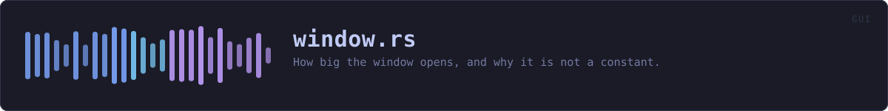
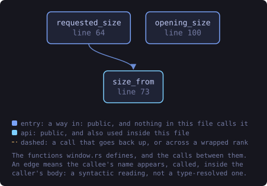
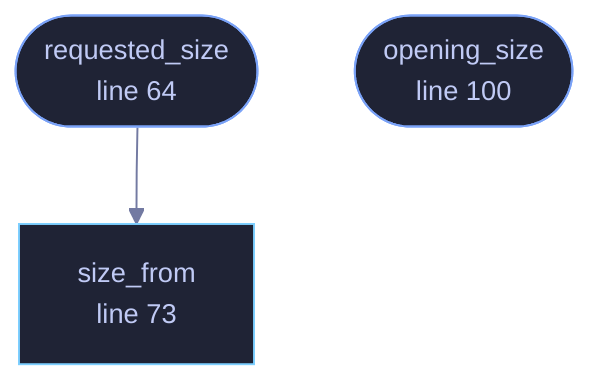

<!-- SPDX-License-Identifier: GPL-3.0-or-later -->
<!-- GENERATED by tools/docs/generate.py from the doc comments in the
     source. Do not edit this file: edit the `//!` and `///` comments in
     the .rs files and run the generator again. CI verifies it with
         python tools/docs/generate.py --check
-->

  

# `crates/veilvoice-gui/src/window.rs`

[`veilvoice-gui`](../../../crates/veilvoice-gui/README.md) &middot; 244 lines &middot; [read the source](https://github.com/tilas01/veilvoice/blob/main/crates/veilvoice-gui/src/window.rs)

## Contents

- [The two failures a single number produces](#the-two-failures-a-single-number-produces)
- [The floor is about width, and it stays where it was](#the-floor-is-about-width-and-it-stays-where-it-was)
  - [What this file contains](#what-this-file-contains)
  - [What calls what](#what-calls-what)
  - [Items](#items)

How big the window opens, and why it is not a constant.

# The two failures a single number produces

The window used to open at 1100 by 720 always. That is too small for this
application: the longest panel is 1288 pixels of content, so it opened on a
panel with its bottom third missing, and a reader had to discover the
scrollbar to find out there was more.

Opening at 1400 by 1000 instead fixes that and breaks something else. A
1366 by 768 laptop is still a common machine, and a window taller than the
screen opens with its lower edge, and often its buttons, off the bottom.
That looks like a broken program rather than a generous one.

So the size is not a constant. It is a preference, clamped to what the
screen can actually show, worked out on the first frame when the monitor
size is known. On a large display the window opens big enough to read; on a
small one it opens as big as fits and scrolls, which is what scrolling is
for.

# The floor is about width, and it stays where it was

Everything is inside one scroll area, so a short window loses nothing.
Width is different: the layout is column-based and below roughly 720 across
the columns start to overlap. That floor is enforced by the window manager
through `with_min_inner_size`, so a person who wants a small window can
still drag it down to the floor. Nothing here stops them; it stops the
program from *opening* somewhere unreadable, which is a different thing.

## What this file contains

244 lines defining **3 functions** (3 public), **0 types** and **3 constants**. Everything below is read out of the source, so it cannot disagree with the code.

**What happens when it runs.** These are the ways in: public, and nothing else in this file calls them, so they are what an outside caller reaches first.

- `requested_size` (line 64) -- The size asked for by --size <W>x<H>, if one was and it parses.
  - reaches: `size_from`
- `opening_size` (line 100) -- The size to open at on this screen, given the monitor and what was asked for on the command line.

## What calls what

The functions this file defines, and the calls between them. Both
are read out of the source: an edge means the callee's name appears,
called, inside the caller's body. It is a syntactic reading, not a
type-resolved one, so a call made through a trait object or a macro
will not appear.

_Colour key: **entry** -- a way in: public, and nothing in this file calls it; **api** -- public, and also used inside this file._

  

The same graph as Mermaid source

## Items

| Item | Line | Documentation |
|---|---:|---|
| `PREFERRED` pub const | [36](https://github.com/tilas01/veilvoice/blob/main/crates/veilvoice-gui/src/window.rs#L36) | The size the window opens at when the screen has room for it. |
| `MINIMUM` pub const | [39](https://github.com/tilas01/veilvoice/blob/main/crates/veilvoice-gui/src/window.rs#L39) | The floor, enforced by the window manager. |
| `CHROME` const | [53](https://github.com/tilas01/veilvoice/blob/main/crates/veilvoice-gui/src/window.rs#L53) | What the window has to leave for the desktop, in pixels. |
| `requested_size` pub fn | [64](https://github.com/tilas01/veilvoice/blob/main/crates/veilvoice-gui/src/window.rs#L64) | The size asked for by --size <W>x<H>, if one was and it parses. |
| `size_from` pub fn | [73](https://github.com/tilas01/veilvoice/blob/main/crates/veilvoice-gui/src/window.rs#L73) | The parsing half, separated from the environment so it can be tested. |
| `opening_size` pub fn | [100](https://github.com/tilas01/veilvoice/blob/main/crates/veilvoice-gui/src/window.rs#L100) | The size to open at on this screen, given the monitor and what was asked for on the command line. |
| `opening` mod | [186](https://github.com/tilas01/veilvoice/blob/main/crates/veilvoice-gui/src/window.rs#L186) |  |

---

Generated from `crates/veilvoice-gui/src/window.rs`. On the website: [`website/reference/veilvoice-gui/window.html`](../../../website/reference/veilvoice-gui/window.html).

Signing key fingerprint `8101FB3BB28D02FB239E0CDF9CC1C7E7A9B5833A`.
