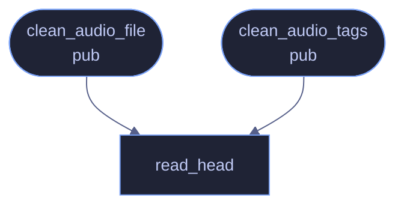

<!-- SPDX-License-Identifier: CC-BY-NC-SA-4.0 -->
<!-- GENERATED by tools/docs/generate.py from the doc comments in the
     source. Do not edit this file: edit the `//!` and `///` comments in
     the .rs files and run the generator again. CI verifies it with
         python tools/docs/generate.py --check
-->

  

# `crates/veilvoice-meta/src/audio.rs`

[`veilvoice-meta`](../../../crates/veilvoice-meta/README.md) &middot; 240 lines &middot; [read the source](https://github.com/tilas01/veilvoice/blob/main/crates/veilvoice-meta/src/audio.rs)

## Contents

- [What calls what](#what-calls-what)
- [Items](#items)

Audio tag removal and replacement.

Tags are handled through `lofty`, which understands ID3v1/ID3v2, Vorbis
comments, MP4 atoms and APE, so one code path covers every format VeilVoice
imports. Only the tag blocks are rewritten — the audio stream is never
re-encoded, so cleaning a file is lossless.

## What calls what

The functions this file defines, and the calls between them. Both
are read out of the source: an edge means the callee's name appears,
called, inside the caller's body. It is a syntactic reading, not a
type-resolved one, so a call made through a trait object or a macro
will not appear.

## Items

| Item | Line | Documentation |
|---|---:|---|
| `read_head` fn | [19](https://github.com/tilas01/veilvoice/blob/main/crates/veilvoice-meta/src/audio.rs#L19) | Read just enough of a file to identify its container. |
| `REALISTIC` const | [33](https://github.com/tilas01/veilvoice/blob/main/crates/veilvoice-meta/src/audio.rs#L33) | Tags written in Policy::Realistic mode. |
| `clean_audio_file` pub fn | [43](https://github.com/tilas01/veilvoice/blob/main/crates/veilvoice-meta/src/audio.rs#L43) | Strip or replace the tags of an audio file, in place. |
| `clean_audio_tags` pub fn | [96](https://github.com/tilas01/veilvoice/blob/main/crates/veilvoice-meta/src/audio.rs#L96) | Report which tag blocks a file carries, without modifying it. |

---

Generated from `crates/veilvoice-meta/src/audio.rs`. On the website: [`website/reference/veilvoice-meta/audio.html`](../../../website/reference/veilvoice-meta/audio.html).

Signing key fingerprint `8101FB3BB28D02FB239E0CDF9CC1C7E7A9B5833A`.
