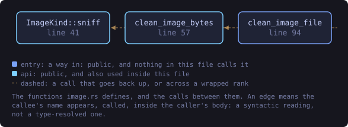
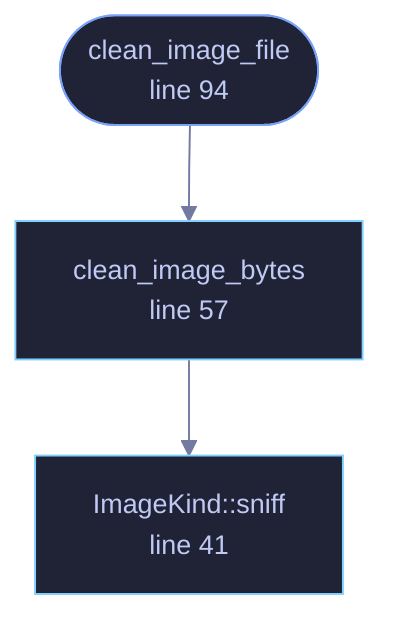

<!-- SPDX-License-Identifier: GPL-3.0-or-later -->
<!-- GENERATED by tools/docs/generate.py from the doc comments in the
     source. Do not edit this file: edit the `//!` and `///` comments in
     the .rs files and run the generator again. CI verifies it with
         python tools/docs/generate.py --check
-->

  

# `crates/veilvoice-meta/src/image.rs`

[`veilvoice-meta`](../../../crates/veilvoice-meta/README.md) &middot; 210 lines &middot; [read the source](https://github.com/tilas01/veilvoice/blob/main/crates/veilvoice-meta/src/image.rs)

## Contents

- [In plain words](#in-plain-words)
  - [What this file contains](#what-this-file-contains)
  - [What calls what](#what-calls-what)
  - [Items](#items)

Image EXIF/GPS removal.

Images are handled at the container level with `img-parts`: the EXIF and XMP
segments are dropped and the compressed pixel data is copied through
untouched. Nothing is re-encoded, so cleaning is lossless and cannot
introduce visible artefacts.

GPS coordinates are the reason this matters most. A single holiday snapshot
attached to an otherwise anonymous message can place someone within a few
metres, and no amount of voice processing helps with that.

# In plain words

Strips the hidden information out of a picture, including where it was taken.

Photographs from a phone routinely carry the exact location, the time, the
device and its serial number. The picture is copied through untouched and only
those sections are dropped, so nothing about how it looks changes.

## What this file contains

210 lines defining **3 functions** (3 public), **1 type** and **0 constants**. Everything below is read out of the source, so it cannot disagree with the code.

**The types it owns.**

- `enum ImageKind` (line 27) -- Image container formats this crate can clean.

**What happens when it runs.** These are the ways in: public, and nothing else in this file calls them, so they are what an outside caller reaches first.

- `clean_image_file` (line 94) -- Strip identifying metadata from an image file, in place.
  - reaches: `clean_image_bytes`, `sniff`

## What calls what

The functions this file defines, and the calls between them. Both
are read out of the source: an edge means the callee's name appears,
called, inside the caller's body. It is a syntactic reading, not a
type-resolved one, so a call made through a trait object or a macro
will not appear.

_Colour key: **entry** -- a way in: public, and nothing in this file calls it; **api** -- public, and also used inside this file._

  

The same graph as Mermaid source

## Items

| Item | Line | Documentation |
|---|---:|---|
| `ImageKind` pub enum | [27](https://github.com/tilas01/veilvoice/blob/main/crates/veilvoice-meta/src/image.rs#L27) | Image container formats this crate can clean. |
| `ImageKind::sniff` pub fn | [41](https://github.com/tilas01/veilvoice/blob/main/crates/veilvoice-meta/src/image.rs#L41) | Identify a format from its magic bytes. |
| `clean_image_bytes` pub fn | [57](https://github.com/tilas01/veilvoice/blob/main/crates/veilvoice-meta/src/image.rs#L57) | Strip identifying metadata from encoded image bytes. |
| `clean_image_file` pub fn | [94](https://github.com/tilas01/veilvoice/blob/main/crates/veilvoice-meta/src/image.rs#L94) | Strip identifying metadata from an image file, in place. |

---

Generated from `crates/veilvoice-meta/src/image.rs`. On the website: [`website/reference/veilvoice-meta/image.html`](../../../website/reference/veilvoice-meta/image.html).

Signing key fingerprint `8101FB3BB28D02FB239E0CDF9CC1C7E7A9B5833A`.
