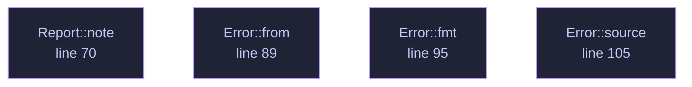

<!-- SPDX-License-Identifier: GPL-3.0-or-later -->
<!-- GENERATED by tools/docs/generate.py from the doc comments in the
     source. Do not edit this file: edit the `//!` and `///` comments in
     the .rs files and run the generator again. CI verifies it with
         python tools/docs/generate.py --check
-->

  

# `crates/veilvoice-meta/src/lib.rs`

[`veilvoice-meta`](../../../crates/veilvoice-meta/README.md) &middot; 111 lines &middot; [read the source](https://github.com/tilas01/veilvoice/blob/main/crates/veilvoice-meta/src/lib.rs)

## Contents

- [Why this exists](#why-this-exists)
- [Strip versus spoof](#strip-versus-spoof)
- [What this crate cannot do](#what-this-crate-cannot-do)
- [What this file contains](#what-this-file-contains)
- [What calls what](#what-calls-what)
- [Items](#items)

Strip or spoof the identifying metadata that rides along with media files.

## Why this exists

De-identifying a voice accomplishes nothing if the file still says who
recorded it. A phone recording routinely carries the device model, the
recording software, a precise timestamp and — for images — GPS coordinates
accurate to a few metres. That is often a far easier way to identify someone
than analysing their voice, and it survives every DSP transform because it
is not in the audio at all.

## Strip versus spoof

Removing every tag is not always the least conspicuous choice. A file with
*no* metadata whatsoever is itself a signal: it says the sender was trying to
hide something, and it stands out in a set of otherwise ordinary files.
`Policy` therefore offers two approaches:

- `Policy::Strip` — remove everything. Best when the file is expected to
be sanitised anyway, or when any false statement would be worse than an
obvious absence.
- `Policy::Realistic` — replace the tags with plausible, non-identifying
values so the file looks unremarkable rather than scrubbed.

## What this crate cannot do

It removes *container* metadata. It cannot remove information encoded in the
media itself: a photograph still shows the room it was taken in, and audio
still carries its room acoustics and background noise. Nor does it touch
filesystem timestamps or the filename, both of which are outside the file —
callers that care must handle those separately.

## What this file contains

111 lines defining **4 functions** (0 public), **3 types** and **1 constant**. Everything below is read out of the source, so it cannot disagree with the code.

**The types it owns.**

- `enum Policy` (line 51) -- How aggressively to rewrite metadata.
- `struct Report` (line 62) -- What changed in a single file.
- `enum Error` (line 79) -- Everything that can go wrong in this crate.

## What calls what

The functions this file defines, and the calls between them. Both
are read out of the source: an edge means the callee's name appears,
called, inside the caller's body. It is a syntactic reading, not a
type-resolved one, so a call made through a trait object or a macro
will not appear.

_Colour key: **helper** -- private to this file._

## Items

| Item | Line | Documentation |
|---|---:|---|
| `VERSION` pub const | [47](https://github.com/tilas01/veilvoice/blob/main/crates/veilvoice-meta/src/lib.rs#L47) | Crate version string, surfaced in the About panel. |
| `Policy` pub enum | [51](https://github.com/tilas01/veilvoice/blob/main/crates/veilvoice-meta/src/lib.rs#L51) | How aggressively to rewrite metadata. |
| `Report` pub struct | [62](https://github.com/tilas01/veilvoice/blob/main/crates/veilvoice-meta/src/lib.rs#L62) | What changed in a single file. |
| `Report::note` fn | [70](https://github.com/tilas01/veilvoice/blob/main/crates/veilvoice-meta/src/lib.rs#L70) |  |
| `Error` pub enum | [79](https://github.com/tilas01/veilvoice/blob/main/crates/veilvoice-meta/src/lib.rs#L79) | Everything that can go wrong in this crate. |
| `Error::from` fn | [89](https://github.com/tilas01/veilvoice/blob/main/crates/veilvoice-meta/src/lib.rs#L89) |  |
| `Error::fmt` fn | [95](https://github.com/tilas01/veilvoice/blob/main/crates/veilvoice-meta/src/lib.rs#L95) |  |
| `Error::source` fn | [105](https://github.com/tilas01/veilvoice/blob/main/crates/veilvoice-meta/src/lib.rs#L105) |  |

---

Generated from `crates/veilvoice-meta/src/lib.rs`. On the website: [`website/reference/veilvoice-meta/lib.html`](../../../website/reference/veilvoice-meta/lib.html).

Signing key fingerprint `8101FB3BB28D02FB239E0CDF9CC1C7E7A9B5833A`.
