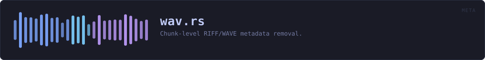
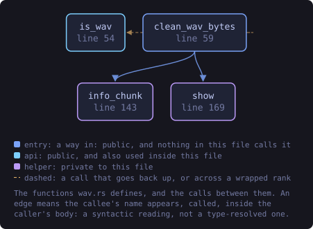
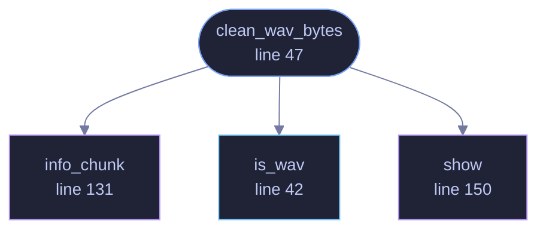

<!-- SPDX-License-Identifier: GPL-3.0-or-later -->
<!-- GENERATED by tools/docs/generate.py from the doc comments in the
     source. Do not edit this file: edit the `//!` and `///` comments in
     the .rs files and run the generator again. CI verifies it with
         python tools/docs/generate.py --check
-->

  

# `crates/veilvoice-meta/src/wav.rs`

[`veilvoice-meta`](../../../crates/veilvoice-meta/README.md) &middot; 332 lines &middot; [read the source](https://github.com/tilas01/veilvoice/blob/main/crates/veilvoice-meta/src/wav.rs)

## Contents

- [Why WAV gets its own path](#why-wav-gets-its-own-path)
- [Whitelist, not blacklist](#whitelist-not-blacklist)
  - [What this file contains](#what-this-file-contains)
  - [What calls what](#what-calls-what)
  - [Items](#items)

Chunk-level RIFF/WAVE metadata removal.

# Why WAV gets its own path

`lofty` handles tags in every other container, but it cannot remove an
ID3v2 block from a WAV file — the attempt fails with an encoding error and
the tag stays put. Silently leaving metadata in place is exactly the failure
this crate exists to prevent, and WAV is the format VeilVoice writes itself,
so it gets a direct implementation rather than a caveat.

# Whitelist, not blacklist

A RIFF file is a flat list of chunks, and metadata hides in a lot of them:
`LIST`/`INFO` (artist, software, comments), `id3 ` and `ID3 `, `bext`
(broadcast extension — originator, date, even a coding history), `iXML`,
`_PMX` (XMP), `axml`, `cart`. Enumerating those would leave every chunk
nobody thought of, and new ones keep being invented.

So this keeps only the chunks needed to decode the audio and drops
everything else. Anything unrecognised is discarded by default, which is the
right bias for a privacy tool: the worst case is a lost non-essential chunk,
not a leaked identity.

## What this file contains

332 lines defining **4 functions** (2 public), **0 types** and **2 constants**. Everything below is read out of the source, so it cannot disagree with the code.

**What happens when it runs.** These are the ways in: public, and nothing else in this file calls them, so they are what an outside caller reaches first.

- `clean_wav_bytes` (line 47) -- Rewrite a WAV, keeping only the chunks needed to decode it.
  - reaches: `info_chunk`, `is_wav`, `show`

## What calls what

The functions this file defines, and the calls between them. Both
are read out of the source: an edge means the callee's name appears,
called, inside the caller's body. It is a syntactic reading, not a
type-resolved one, so a call made through a trait object or a macro
will not appear.

_Colour key: **entry** -- a way in: public, and nothing in this file calls it; **api** -- public, and also used inside this file; **helper** -- private to this file._

  

The same graph as Mermaid source

## Items

| Item | Line | Documentation |
|---|---:|---|
| `KEEP` const | [28](https://github.com/tilas01/veilvoice/blob/main/crates/veilvoice-meta/src/wav.rs#L28) | Chunks required to interpret the audio. |
| `REALISTIC_INFO` const | [35](https://github.com/tilas01/veilvoice/blob/main/crates/veilvoice-meta/src/wav.rs#L35) | Tags written in Policy::Realistic mode, as LIST/INFO sub-chunks. |
| `is_wav` pub fn | [42](https://github.com/tilas01/veilvoice/blob/main/crates/veilvoice-meta/src/wav.rs#L42) | Whether bytes looks like a RIFF/WAVE file. |
| `clean_wav_bytes` pub fn | [47](https://github.com/tilas01/veilvoice/blob/main/crates/veilvoice-meta/src/wav.rs#L47) | Rewrite a WAV, keeping only the chunks needed to decode it. |
| `info_chunk` fn | [131](https://github.com/tilas01/veilvoice/blob/main/crates/veilvoice-meta/src/wav.rs#L131) | Build a bland LIST/INFO chunk. |
| `show` fn | [150](https://github.com/tilas01/veilvoice/blob/main/crates/veilvoice-meta/src/wav.rs#L150) |  |

---

Generated from `crates/veilvoice-meta/src/wav.rs`. On the website: [`website/reference/veilvoice-meta/wav.html`](../../../website/reference/veilvoice-meta/wav.html).

Signing key fingerprint `8101FB3BB28D02FB239E0CDF9CC1C7E7A9B5833A`.
