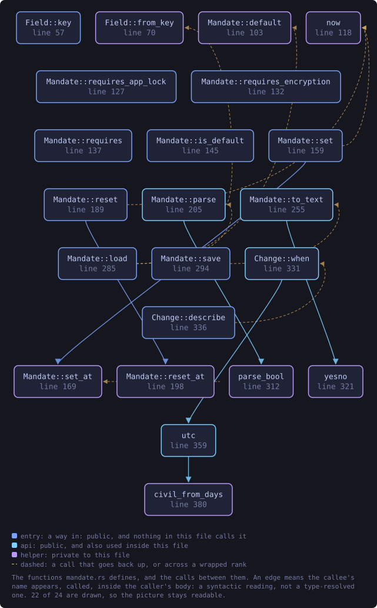

<!-- SPDX-License-Identifier: GPL-3.0-or-later -->
<!-- GENERATED by tools/docs/generate.py from the doc comments in the
     source. Do not edit this file: edit the `//!` and `///` comments in
     the .rs files and run the generator again. CI verifies it with
         python tools/docs/generate.py --check
-->

  

# `crates/veilvoice-policy/src/mandate.rs`

[`veilvoice-policy`](../../../crates/veilvoice-policy/README.md) &middot; 511 lines &middot; [read the source](https://github.com/tilas01/veilvoice/blob/main/crates/veilvoice-policy/src/mandate.rs)

## Contents

- [What this is](#what-this-is)
- [It is not the sealed policy, and the difference is the point](#it-is-not-the-sealed-policy-and-the-difference-is-the-point)
- [Why it keeps a history](#why-it-keeps-a-history)
- [In plain words](#in-plain-words)
  - [What this file contains](#what-this-file-contains)
  - [What calls what](#what-calls-what)
  - [Items](#items)

The two things VeilVoice insists on unless you say otherwise.

# What this is

By default VeilVoice requires **an app lock** and **encryption of every
recording at rest**. Both matter for the same reason: de-identification
removes the voiceprint but keeps the words, so a veiled recording is still a
recording of everything that was said, and an unlocked application sitting
open is still a window into what you have processed.

So both are on, by default, without anybody choosing them. This module is
how you *stop* insisting on one or both -- a deliberate, recorded choice
rather than a setting that quietly drifts.

# It is not the sealed policy, and the difference is the point

`crate::Policy` is the sealed, administrator-set policy that can only ever
make VeilVoice **stricter** and cannot be weakened without the passphrase.
This is the opposite tool for the opposite person: it is *your own* baseline,
plainly stored, that you may relax. The two compose safely -- the effective
requirement is this baseline OR whatever the sealed policy adds -- so an
administrator can still force on something you turned off, and never the
other way round.

# Why it keeps a history

Turning off encryption or the app lock is exactly the kind of change someone
should be able to see was made, when, and away from what. So every change is
appended to a log with its timestamp and whether the value it left was the
default. Nothing here is secret -- it is your own record of your own
decisions -- so it is a plain file you can read.

# In plain words

VeilVoice asks for a password for itself and encrypts your recordings,
unless you deliberately turn one or both off. It remembers when you did, and
what it was before, so the choice is never a mystery later.

## What this file contains

511 lines defining **24 functions** (16 public), **3 types** and **1 constant**. Everything below is read out of the source, so it cannot disagree with the code.

**The types it owns.**

- `enum Field` (line 48) -- Which requirement a change concerns.
- `struct Change` (line 75) -- One recorded change.
- `struct Mandate` (line 88) -- The current requirements, and the log of how they got there.

**What happens when it runs.** These are the ways in: public, and nothing else in this file calls them, so they are what an outside caller reaches first.

- `Field::key` (line 57) -- The word used in the file and on the command line.
- `Mandate::requires_app_lock` (line 115) -- Whether an app lock is required.
- `Mandate::requires_encryption` (line 120) -- Whether encryption of recordings at rest is required.
- `Mandate::requires` (line 125) -- The value of one field.
- `Mandate::is_default` (line 133) -- Whether this is still the default: both required, nothing turned off.
- `Mandate::history` (line 138) -- The change log, oldest first.
- `Mandate::set` (line 147) -- Set one requirement, recording the change if it is actually a change.
  - reaches: `now`, `set_at`
- `Mandate::reset` (line 171) -- Return to the default (both required), recording the changes.
  - reaches: `now`, `reset_at`, `set_at`
- `Mandate::load` (line 262) -- Load from path, or the default if it is not there.
  - reaches: `default`, `parse`, `from_key`, `parse_bool`
- `Mandate::save` (line 271) -- Write to path, owner-only.
  - reaches: `to_text`, `yesno`
- `default_path` (line 281) -- Where the mandate file lives: beside the app lock, under its own name.
- `Change::describe` (line 308) -- A whole sentence describing the change, for a log a person reads.
  - reaches: `when`, `utc`, `civil_from_days`

## What calls what

The functions this file defines, and the calls between them. Both
are read out of the source: an edge means the callee's name appears,
called, inside the caller's body. It is a syntactic reading, not a
type-resolved one, so a call made through a trait object or a macro
will not appear.

_22 of 24 functions are drawn; the diagram is bounded at 22 so it
stays readable. The full list is in the table below._

_Colour key: **entry** -- a way in: public, and nothing in this file calls it; **api** -- public, and also used inside this file; **helper** -- private to this file._

  

The same graph as Mermaid source

```mermaid
%%{init: {"theme":"base","themeVariables":{"background":"#1a1b26","primaryColor":"#1f2335","primaryTextColor":"#c0caf5","primaryBorderColor":"#7aa2f7","secondaryColor":"#16161e","tertiaryColor":"#16161e","lineColor":"#737aa2","textColor":"#c0caf5","mainBkg":"#1f2335","nodeBorder":"#7aa2f7","clusterBkg":"#16161e","clusterBorder":"#2f3549","fontFamily":"ui-monospace, SFMono-Regular, Consolas, monospace","fontSize":"14px"}}}%%
flowchart TD
    n_key(["Field::key<br/>line 57"])
    n_from_key["Field::from_key<br/>line 64"]
    n_default["Mandate::default<br/>line 97"]
    n_now["now<br/>line 106"]
    n_requires_app_lock(["Mandate::requires_app_lock<br/>line 115"])
    n_requires_encryption(["Mandate::requires_encryption<br/>line 120"])
    n_requires(["Mandate::requires<br/>line 125"])
    n_is_default(["Mandate::is_default<br/>line 133"])
    n_set(["Mandate::set<br/>line 147"])
    n_set_at["Mandate::set_at<br/>line 151"]
    n_reset(["Mandate::reset<br/>line 171"])
    n_reset_at["Mandate::reset_at<br/>line 175"]
    n_parse["Mandate::parse<br/>line 182"]
    n_to_text["Mandate::to_text<br/>line 232"]
    n_load(["Mandate::load<br/>line 262"])
    n_save(["Mandate::save<br/>line 271"])
    n_parse_bool["parse_bool<br/>line 285"]
    n_yesno["yesno<br/>line 293"]
    n_when["Change::when<br/>line 303"]
    n_describe(["Change::describe<br/>line 308"])
    n_utc["utc<br/>line 331"]
    n_civil_from_days["civil_from_days<br/>line 352"]
    n_describe --> n_when
    n_load --> n_default
    n_load --> n_parse
    n_parse --> n_from_key
    n_parse --> n_parse_bool
    n_reset --> n_now
    n_reset --> n_reset_at
    n_reset_at --> n_set_at
    n_save --> n_to_text
    n_set --> n_now
    n_set --> n_set_at
    n_to_text --> n_yesno
    n_utc --> n_civil_from_days
    n_when --> n_utc
    click n_key href "https://github.com/tilas01/veilvoice/blob/main/crates/veilvoice-policy/src/mandate.rs#L57" "open the source"
    click n_from_key href "https://github.com/tilas01/veilvoice/blob/main/crates/veilvoice-policy/src/mandate.rs#L64" "open the source"
    click n_default href "https://github.com/tilas01/veilvoice/blob/main/crates/veilvoice-policy/src/mandate.rs#L97" "open the source"
    click n_now href "https://github.com/tilas01/veilvoice/blob/main/crates/veilvoice-policy/src/mandate.rs#L106" "open the source"
    click n_requires_app_lock href "https://github.com/tilas01/veilvoice/blob/main/crates/veilvoice-policy/src/mandate.rs#L115" "open the source"
    click n_requires_encryption href "https://github.com/tilas01/veilvoice/blob/main/crates/veilvoice-policy/src/mandate.rs#L120" "open the source"
    click n_requires href "https://github.com/tilas01/veilvoice/blob/main/crates/veilvoice-policy/src/mandate.rs#L125" "open the source"
    click n_is_default href "https://github.com/tilas01/veilvoice/blob/main/crates/veilvoice-policy/src/mandate.rs#L133" "open the source"
    click n_set href "https://github.com/tilas01/veilvoice/blob/main/crates/veilvoice-policy/src/mandate.rs#L147" "open the source"
    click n_set_at href "https://github.com/tilas01/veilvoice/blob/main/crates/veilvoice-policy/src/mandate.rs#L151" "open the source"
    click n_reset href "https://github.com/tilas01/veilvoice/blob/main/crates/veilvoice-policy/src/mandate.rs#L171" "open the source"
    click n_reset_at href "https://github.com/tilas01/veilvoice/blob/main/crates/veilvoice-policy/src/mandate.rs#L175" "open the source"
    click n_parse href "https://github.com/tilas01/veilvoice/blob/main/crates/veilvoice-policy/src/mandate.rs#L182" "open the source"
    click n_to_text href "https://github.com/tilas01/veilvoice/blob/main/crates/veilvoice-policy/src/mandate.rs#L232" "open the source"
    click n_load href "https://github.com/tilas01/veilvoice/blob/main/crates/veilvoice-policy/src/mandate.rs#L262" "open the source"
    click n_save href "https://github.com/tilas01/veilvoice/blob/main/crates/veilvoice-policy/src/mandate.rs#L271" "open the source"
    click n_parse_bool href "https://github.com/tilas01/veilvoice/blob/main/crates/veilvoice-policy/src/mandate.rs#L285" "open the source"
    click n_yesno href "https://github.com/tilas01/veilvoice/blob/main/crates/veilvoice-policy/src/mandate.rs#L293" "open the source"
    click n_when href "https://github.com/tilas01/veilvoice/blob/main/crates/veilvoice-policy/src/mandate.rs#L303" "open the source"
    click n_describe href "https://github.com/tilas01/veilvoice/blob/main/crates/veilvoice-policy/src/mandate.rs#L308" "open the source"
    click n_utc href "https://github.com/tilas01/veilvoice/blob/main/crates/veilvoice-policy/src/mandate.rs#L331" "open the source"
    click n_civil_from_days href "https://github.com/tilas01/veilvoice/blob/main/crates/veilvoice-policy/src/mandate.rs#L352" "open the source"
    classDef entry fill:#1f2335,stroke:#7aa2f7,color:#c0caf5
    class n_key,n_requires_app_lock,n_requires_encryption,n_requires,n_is_default,n_set,n_reset,n_load,n_save,n_describe entry
    classDef api fill:#1f2335,stroke:#7dcfff,color:#c0caf5
    class n_parse,n_to_text,n_when,n_utc api
    classDef helper fill:#1f2335,stroke:#bb9af7,color:#c0caf5
    class n_from_key,n_default,n_now,n_set_at,n_reset_at,n_parse_bool,n_yesno,n_civil_from_days helper
```

## Items

| Item | Line | Documentation |
|---|---:|---|
| `MAGIC` const | [44](https://github.com/tilas01/veilvoice/blob/main/crates/veilvoice-policy/src/mandate.rs#L44) | The magic on the first line, so a stray file is not mistaken for this one. |
| `Field` pub enum | [48](https://github.com/tilas01/veilvoice/blob/main/crates/veilvoice-policy/src/mandate.rs#L48) | Which requirement a change concerns. |
| `Field::key` pub fn | [57](https://github.com/tilas01/veilvoice/blob/main/crates/veilvoice-policy/src/mandate.rs#L57) | The word used in the file and on the command line. |
| `Field::from_key` fn | [64](https://github.com/tilas01/veilvoice/blob/main/crates/veilvoice-policy/src/mandate.rs#L64) |  |
| `Change` pub struct | [75](https://github.com/tilas01/veilvoice/blob/main/crates/veilvoice-policy/src/mandate.rs#L75) | One recorded change. |
| `Mandate` pub struct | [88](https://github.com/tilas01/veilvoice/blob/main/crates/veilvoice-policy/src/mandate.rs#L88) | The current requirements, and the log of how they got there. |
| `Mandate::default` fn | [97](https://github.com/tilas01/veilvoice/blob/main/crates/veilvoice-policy/src/mandate.rs#L97) | Both required. |
| `now` fn | [106](https://github.com/tilas01/veilvoice/blob/main/crates/veilvoice-policy/src/mandate.rs#L106) |  |
| `Mandate::requires_app_lock` pub fn | [115](https://github.com/tilas01/veilvoice/blob/main/crates/veilvoice-policy/src/mandate.rs#L115) | Whether an app lock is required. |
| `Mandate::requires_encryption` pub fn | [120](https://github.com/tilas01/veilvoice/blob/main/crates/veilvoice-policy/src/mandate.rs#L120) | Whether encryption of recordings at rest is required. |
| `Mandate::requires` pub fn | [125](https://github.com/tilas01/veilvoice/blob/main/crates/veilvoice-policy/src/mandate.rs#L125) | The value of one field. |
| `Mandate::is_default` pub fn | [133](https://github.com/tilas01/veilvoice/blob/main/crates/veilvoice-policy/src/mandate.rs#L133) | Whether this is still the default: both required, nothing turned off. |
| `Mandate::history` pub fn | [138](https://github.com/tilas01/veilvoice/blob/main/crates/veilvoice-policy/src/mandate.rs#L138) | The change log, oldest first. |
| `Mandate::set` pub fn | [147](https://github.com/tilas01/veilvoice/blob/main/crates/veilvoice-policy/src/mandate.rs#L147) | Set one requirement, recording the change if it is actually a change. |
| `Mandate::set_at` fn | [151](https://github.com/tilas01/veilvoice/blob/main/crates/veilvoice-policy/src/mandate.rs#L151) |  |
| `Mandate::reset` pub fn | [171](https://github.com/tilas01/veilvoice/blob/main/crates/veilvoice-policy/src/mandate.rs#L171) | Return to the default (both required), recording the changes. |
| `Mandate::reset_at` fn | [175](https://github.com/tilas01/veilvoice/blob/main/crates/veilvoice-policy/src/mandate.rs#L175) |  |
| `Mandate::parse` pub fn | [182](https://github.com/tilas01/veilvoice/blob/main/crates/veilvoice-policy/src/mandate.rs#L182) | Parse the file format. |
| `Mandate::to_text` pub fn | [232](https://github.com/tilas01/veilvoice/blob/main/crates/veilvoice-policy/src/mandate.rs#L232) | Render the file format. |
| `Mandate::load` pub fn | [262](https://github.com/tilas01/veilvoice/blob/main/crates/veilvoice-policy/src/mandate.rs#L262) | Load from path, or the default if it is not there. |
| `Mandate::save` pub fn | [271](https://github.com/tilas01/veilvoice/blob/main/crates/veilvoice-policy/src/mandate.rs#L271) | Write to path, owner-only. |
| `default_path` pub fn | [281](https://github.com/tilas01/veilvoice/blob/main/crates/veilvoice-policy/src/mandate.rs#L281) | Where the mandate file lives: beside the app lock, under its own name. |
| `parse_bool` fn | [285](https://github.com/tilas01/veilvoice/blob/main/crates/veilvoice-policy/src/mandate.rs#L285) |  |
| `yesno` fn | [293](https://github.com/tilas01/veilvoice/blob/main/crates/veilvoice-policy/src/mandate.rs#L293) |  |
| `Change::when` pub fn | [303](https://github.com/tilas01/veilvoice/blob/main/crates/veilvoice-policy/src/mandate.rs#L303) | When the change was made, as a UTC civil timestamp. |
| `Change::describe` pub fn | [308](https://github.com/tilas01/veilvoice/blob/main/crates/veilvoice-policy/src/mandate.rs#L308) | A whole sentence describing the change, for a log a person reads. |
| `utc` pub fn | [331](https://github.com/tilas01/veilvoice/blob/main/crates/veilvoice-policy/src/mandate.rs#L331) | Unix seconds as YYYY-MM-DD HH:MM:SS UTC. |
| `civil_from_days` fn | [352](https://github.com/tilas01/veilvoice/blob/main/crates/veilvoice-policy/src/mandate.rs#L352) | Days since 1970-01-01 to a civil year, month and day. |

---

Generated from `crates/veilvoice-policy/src/mandate.rs`. On the website: [`website/reference/veilvoice-policy/mandate.html`](../../../website/reference/veilvoice-policy/mandate.html).

Signing key fingerprint `8101FB3BB28D02FB239E0CDF9CC1C7E7A9B5833A`.
