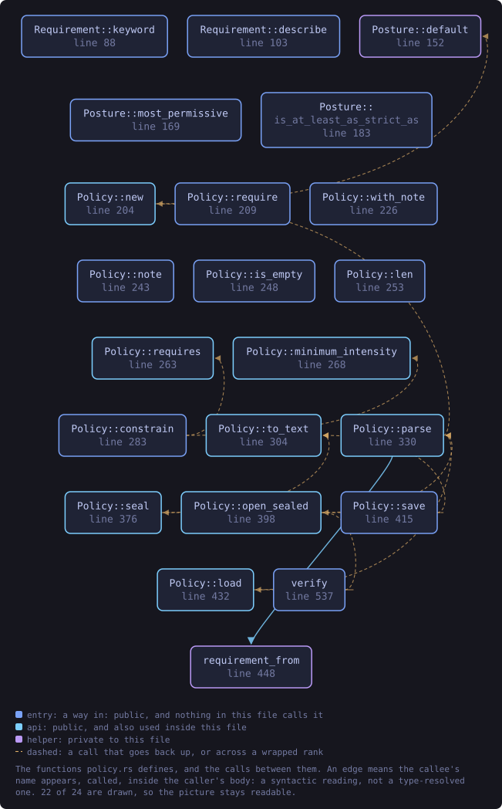

<!-- SPDX-License-Identifier: GPL-3.0-or-later -->
<!-- GENERATED by tools/docs/generate.py from the doc comments in the
     source. Do not edit this file: edit the `//!` and `///` comments in
     the .rs files and run the generator again. CI verifies it with
         python tools/docs/generate.py --check
-->

<p align="center">
  
</p>

# `crates/veilvoice-policy/src/policy.rs`

[`veilvoice-policy`](../../../crates/veilvoice-policy/README.md) &middot; 892 lines &middot; [read the source](https://github.com/tilas01/veilvoice/blob/main/crates/veilvoice-policy/src/policy.rs)

## Contents

- [Every requirement tightens, and there is nowhere to write one that does not](#every-requirement-tightens-and-there-is-nowhere-to-write-one-that-does-not)
- [Format](#format)
  - [What this file contains](#what-this-file-contains)
  - [What calls what](#what-calls-what)
  - [Items](#items)

The policy itself: what can be required, and what requiring it does.

# Every requirement tightens, and there is nowhere to write one that does not

`Requirement` has five variants and all five move VeilVoice in the same
direction. There is no `AllowPlaintext`, no `MaximumIntensity`, no
`SkipMetadataCleaning`. That is not an oversight to be filled in later; it
is the property the whole crate rests on, and
`Posture::is_at_least_as_strict_as` exists so a test can hold it.

Anybody adding a variant should read `crate`'s documentation first. A
loosening variant does not merely add a feature — it removes the reason the
plain file can be read without a passphrase.

# Format

Text, one requirement per line, for the same reason the tamper manifest is
text: the point of the file is to be readable by the person it constrains.

```text
VEILPOLICY1
note  Set by the IT department. Ask before changing.
require  encrypt-recordings
require  clean-metadata
require  minimum-intensity  80
```

The floor is a whole number of hundredths, not a decimal. A policy has to
compare equal to its own sealed copy, and a value that reads back as
0.7999999 would make `crate::verify` report `Differs` for ever.

An unknown `require` keyword is an **error**, not a line to skip. A policy
written by a newer build says something this one cannot honour, and quietly
honouring the rest would leave the machine less restricted than the person
who wrote it believes. Refusing says so.

## What this file contains

892 lines defining **25 functions** (23 public), **4 types** and **3 constants**. Everything below is read out of the source, so it cannot disagree with the code.

**The types it owns.**

- `enum Requirement` (line 56) -- One thing a policy can insist on.
- `struct Posture` (line 124) -- The settings a policy can reach, as a front end holds them.
- `struct Policy` (line 181) -- A set of requirements, and an optional note from whoever wrote them.
- `enum Verification` (line 443) -- What is known about the seal on a policy.

**What happens when it runs.** These are the ways in: public, and nothing else in this file calls them, so they are what an outside caller reaches first.

- `Requirement::keyword` (line 75) -- The keyword this is written as.
- `Requirement::describe` (line 90) -- What this means, in the words a front end should show beside the control it has taken away.
- `Posture::most_permissive` (line 156) -- The most permissive arrangement the controls can reach.
- `Posture::is_at_least_as_strict_as` (line 170) -- Whether self is at least as strict as other in every dimension.
- `Policy::require` (line 196) -- Add a requirement.
- `Policy::with_note` (line 213) -- Set the note shown beside every control the policy has fixed.
- `Policy::note` (line 230) -- The note, if there is one.
- `Policy::is_empty` (line 235) -- Whether anything at all is required.
- `Policy::len` (line 240) -- How many requirements there are.
- `Policy::requirements` (line 245) -- The requirements, in a stable order.
- `Policy::constrain` (line 270) -- Apply the policy to a posture.
  - reaches: `minimum_intensity`, `requires`
- `Policy::save` (line 385) -- Write the plain policy into dir, and the sealed copy beside it.
  - reaches: `seal`, `to_text`
- `Verification::describe` (line 463) -- One line for a front end.
- `Verification::wants_attention` (line 488) -- Whether this is a state somebody should look at.
- `verify` (line 500) -- Check the plain policy in dir against its sealed copy.
  - reaches: `load`, `open_sealed`, `parse`, `new`, `requirement_from`, `default`

## What calls what

The functions this file defines, and the calls between them. Both
are read out of the source: an edge means the callee's name appears,
called, inside the caller's body. It is a syntactic reading, not a
type-resolved one, so a call made through a trait object or a macro
will not appear.

_22 of 24 functions are drawn; the diagram is bounded at 22 so it
stays readable. The full list is in the table below._

_Colour key: **entry** -- a way in: public, and nothing in this file calls it; **api** -- public, and also used inside this file; **helper** -- private to this file._

<p align="center">
  
</p>

<details>
<summary>The same graph as Mermaid source</summary>



</details>

```mermaid
%%{init: {"theme":"base","themeVariables":{"background":"#1a1b26","primaryColor":"#1f2335","primaryTextColor":"#c0caf5","primaryBorderColor":"#7aa2f7","secondaryColor":"#16161e","tertiaryColor":"#16161e","lineColor":"#737aa2","textColor":"#c0caf5","mainBkg":"#1f2335","nodeBorder":"#7aa2f7","clusterBkg":"#16161e","clusterBorder":"#2f3549","fontFamily":"ui-monospace, SFMono-Regular, Consolas, monospace","fontSize":"14px"}}}%%
flowchart TD
    n_keyword(["Requirement::keyword<br/>line 75"])
    n_describe(["Requirement::describe<br/>line 90"])
    n_default["Posture::default<br/>line 139"]
    n_most_permissive(["Posture::most_permissive<br/>line 156"])
    n_is_at_least_as_strict_as(["Posture::is_at_least_as_stric…<br/>line 170"])
    n_new["Policy::new<br/>line 191"]
    n_require(["Policy::require<br/>line 196"])
    n_with_note(["Policy::with_note<br/>line 213"])
    n_note(["Policy::note<br/>line 230"])
    n_is_empty(["Policy::is_empty<br/>line 235"])
    n_len(["Policy::len<br/>line 240"])
    n_requires["Policy::requires<br/>line 250"]
    n_minimum_intensity["Policy::minimum_intensity<br/>line 255"]
    n_constrain(["Policy::constrain<br/>line 270"])
    n_to_text["Policy::to_text<br/>line 291"]
    n_parse["Policy::parse<br/>line 317"]
    n_seal["Policy::seal<br/>line 363"]
    n_open_sealed["Policy::open_sealed<br/>line 372"]
    n_save(["Policy::save<br/>line 385"])
    n_load["Policy::load<br/>line 402"]
    n_requirement_from["requirement_from<br/>line 411"]
    n_verify(["verify<br/>line 500"])
    n_constrain --> n_minimum_intensity
    n_constrain --> n_requires
    n_load --> n_parse
    n_new --> n_default
    n_open_sealed --> n_parse
    n_parse --> n_new
    n_parse --> n_requirement_from
    n_save --> n_seal
    n_save --> n_to_text
    n_seal --> n_to_text
    n_verify --> n_load
    n_verify --> n_open_sealed
    click n_keyword href "https://github.com/tilas01/veilvoice/blob/main/crates/veilvoice-policy/src/policy.rs#L75" "open the source"
    click n_describe href "https://github.com/tilas01/veilvoice/blob/main/crates/veilvoice-policy/src/policy.rs#L90" "open the source"
    click n_default href "https://github.com/tilas01/veilvoice/blob/main/crates/veilvoice-policy/src/policy.rs#L139" "open the source"
    click n_most_permissive href "https://github.com/tilas01/veilvoice/blob/main/crates/veilvoice-policy/src/policy.rs#L156" "open the source"
    click n_is_at_least_as_strict_as href "https://github.com/tilas01/veilvoice/blob/main/crates/veilvoice-policy/src/policy.rs#L170" "open the source"
    click n_new href "https://github.com/tilas01/veilvoice/blob/main/crates/veilvoice-policy/src/policy.rs#L191" "open the source"
    click n_require href "https://github.com/tilas01/veilvoice/blob/main/crates/veilvoice-policy/src/policy.rs#L196" "open the source"
    click n_with_note href "https://github.com/tilas01/veilvoice/blob/main/crates/veilvoice-policy/src/policy.rs#L213" "open the source"
    click n_note href "https://github.com/tilas01/veilvoice/blob/main/crates/veilvoice-policy/src/policy.rs#L230" "open the source"
    click n_is_empty href "https://github.com/tilas01/veilvoice/blob/main/crates/veilvoice-policy/src/policy.rs#L235" "open the source"
    click n_len href "https://github.com/tilas01/veilvoice/blob/main/crates/veilvoice-policy/src/policy.rs#L240" "open the source"
    click n_requires href "https://github.com/tilas01/veilvoice/blob/main/crates/veilvoice-policy/src/policy.rs#L250" "open the source"
    click n_minimum_intensity href "https://github.com/tilas01/veilvoice/blob/main/crates/veilvoice-policy/src/policy.rs#L255" "open the source"
    click n_constrain href "https://github.com/tilas01/veilvoice/blob/main/crates/veilvoice-policy/src/policy.rs#L270" "open the source"
    click n_to_text href "https://github.com/tilas01/veilvoice/blob/main/crates/veilvoice-policy/src/policy.rs#L291" "open the source"
    click n_parse href "https://github.com/tilas01/veilvoice/blob/main/crates/veilvoice-policy/src/policy.rs#L317" "open the source"
    click n_seal href "https://github.com/tilas01/veilvoice/blob/main/crates/veilvoice-policy/src/policy.rs#L363" "open the source"
    click n_open_sealed href "https://github.com/tilas01/veilvoice/blob/main/crates/veilvoice-policy/src/policy.rs#L372" "open the source"
    click n_save href "https://github.com/tilas01/veilvoice/blob/main/crates/veilvoice-policy/src/policy.rs#L385" "open the source"
    click n_load href "https://github.com/tilas01/veilvoice/blob/main/crates/veilvoice-policy/src/policy.rs#L402" "open the source"
    click n_requirement_from href "https://github.com/tilas01/veilvoice/blob/main/crates/veilvoice-policy/src/policy.rs#L411" "open the source"
    click n_verify href "https://github.com/tilas01/veilvoice/blob/main/crates/veilvoice-policy/src/policy.rs#L500" "open the source"
    classDef entry fill:#1f2335,stroke:#7aa2f7,color:#c0caf5
    class n_keyword,n_describe,n_most_permissive,n_is_at_least_as_strict_as,n_require,n_with_note,n_note,n_is_empty,n_len,n_constrain,n_save,n_verify entry
    classDef api fill:#1f2335,stroke:#7dcfff,color:#c0caf5
    class n_new,n_requires,n_minimum_intensity,n_to_text,n_parse,n_seal,n_open_sealed,n_load api
    classDef helper fill:#1f2335,stroke:#bb9af7,color:#c0caf5
    class n_default,n_requirement_from helper
```

## Items

| Item | Line | Documentation |
|---|---:|---|
| `MAGIC` <sub>const</sub> | [43](https://github.com/tilas01/veilvoice/blob/main/crates/veilvoice-policy/src/policy.rs#L43) | Magic first line. |
| `PLAIN_FILE` <sub>pub const</sub> | [46](https://github.com/tilas01/veilvoice/blob/main/crates/veilvoice-policy/src/policy.rs#L46) | The plain policy, read at every launch and needing no passphrase. |
| `SEALED_FILE` <sub>pub const</sub> | [50](https://github.com/tilas01/veilvoice/blob/main/crates/veilvoice-policy/src/policy.rs#L50) | The same policy sealed under a passphrase, for proving the plain one is what was written. |
| `Requirement` <sub>pub enum</sub> | [56](https://github.com/tilas01/veilvoice/blob/main/crates/veilvoice-policy/src/policy.rs#L56) | One thing a policy can insist on. |
| `Requirement::keyword` <sub>pub fn</sub> | [75](https://github.com/tilas01/veilvoice/blob/main/crates/veilvoice-policy/src/policy.rs#L75) | The keyword this is written as. |
| `Requirement::describe` <sub>pub fn</sub> | [90](https://github.com/tilas01/veilvoice/blob/main/crates/veilvoice-policy/src/policy.rs#L90) | What this means, in the words a front end should show beside the control it has taken away. |
| `Posture` <sub>pub struct</sub> | [124](https://github.com/tilas01/veilvoice/blob/main/crates/veilvoice-policy/src/policy.rs#L124) | The settings a policy can reach, as a front end holds them. |
| `Posture::default` <sub>fn</sub> | [139](https://github.com/tilas01/veilvoice/blob/main/crates/veilvoice-policy/src/policy.rs#L139) | VeilVoice's own defaults, which are the strict ones. |
| `Posture::most_permissive` <sub>pub fn</sub> | [156](https://github.com/tilas01/veilvoice/blob/main/crates/veilvoice-policy/src/policy.rs#L156) | The most permissive arrangement the controls can reach. |
| `Posture::is_at_least_as_strict_as` <sub>pub fn</sub> | [170](https://github.com/tilas01/veilvoice/blob/main/crates/veilvoice-policy/src/policy.rs#L170) | Whether self is at least as strict as other in every dimension. |
| `Policy` <sub>pub struct</sub> | [181](https://github.com/tilas01/veilvoice/blob/main/crates/veilvoice-policy/src/policy.rs#L181) | A set of requirements, and an optional note from whoever wrote them. |
| `Policy::new` <sub>pub fn</sub> | [191](https://github.com/tilas01/veilvoice/blob/main/crates/veilvoice-policy/src/policy.rs#L191) | A policy that requires nothing. |
| `Policy::require` <sub>pub fn</sub> | [196](https://github.com/tilas01/veilvoice/blob/main/crates/veilvoice-policy/src/policy.rs#L196) | Add a requirement. |
| `Policy::with_note` <sub>pub fn</sub> | [213](https://github.com/tilas01/veilvoice/blob/main/crates/veilvoice-policy/src/policy.rs#L213) | Set the note shown beside every control the policy has fixed. |
| `Policy::note` <sub>pub fn</sub> | [230](https://github.com/tilas01/veilvoice/blob/main/crates/veilvoice-policy/src/policy.rs#L230) | The note, if there is one. |
| `Policy::is_empty` <sub>pub fn</sub> | [235](https://github.com/tilas01/veilvoice/blob/main/crates/veilvoice-policy/src/policy.rs#L235) | Whether anything at all is required. |
| `Policy::len` <sub>pub fn</sub> | [240](https://github.com/tilas01/veilvoice/blob/main/crates/veilvoice-policy/src/policy.rs#L240) | How many requirements there are. |
| `Policy::requirements` <sub>pub fn</sub> | [245](https://github.com/tilas01/veilvoice/blob/main/crates/veilvoice-policy/src/policy.rs#L245) | The requirements, in a stable order. |
| `Policy::requires` <sub>pub fn</sub> | [250](https://github.com/tilas01/veilvoice/blob/main/crates/veilvoice-policy/src/policy.rs#L250) | Whether a particular requirement is in force. |
| `Policy::minimum_intensity` <sub>pub fn</sub> | [255](https://github.com/tilas01/veilvoice/blob/main/crates/veilvoice-policy/src/policy.rs#L255) | The intensity floor, or 0.0 when none is set. |
| `Policy::constrain` <sub>pub fn</sub> | [270](https://github.com/tilas01/veilvoice/blob/main/crates/veilvoice-policy/src/policy.rs#L270) | Apply the policy to a posture. |
| `Policy::to_text` <sub>pub fn</sub> | [291](https://github.com/tilas01/veilvoice/blob/main/crates/veilvoice-policy/src/policy.rs#L291) | Serialise to the text format described at the top of this module. |
| `Policy::parse` <sub>pub fn</sub> | [317](https://github.com/tilas01/veilvoice/blob/main/crates/veilvoice-policy/src/policy.rs#L317) | Parse the text format. |
| `Policy::seal` <sub>pub fn</sub> | [363](https://github.com/tilas01/veilvoice/blob/main/crates/veilvoice-policy/src/policy.rs#L363) | Seal the policy under a passphrase. |
| `Policy::open_sealed` <sub>pub fn</sub> | [372](https://github.com/tilas01/veilvoice/blob/main/crates/veilvoice-policy/src/policy.rs#L372) | Open a policy sealed by Policy::seal. |
| `Policy::save` <sub>pub fn</sub> | [385](https://github.com/tilas01/veilvoice/blob/main/crates/veilvoice-policy/src/policy.rs#L385) | Write the plain policy into dir, and the sealed copy beside it. |
| `Policy::load` <sub>pub fn</sub> | [402](https://github.com/tilas01/veilvoice/blob/main/crates/veilvoice-policy/src/policy.rs#L402) | Read the plain policy from dir. |
| `requirement_from` <sub>fn</sub> | [411](https://github.com/tilas01/veilvoice/blob/main/crates/veilvoice-policy/src/policy.rs#L411) |  |
| `Verification` <sub>pub enum</sub> | [443](https://github.com/tilas01/veilvoice/blob/main/crates/veilvoice-policy/src/policy.rs#L443) | What is known about the seal on a policy. |
| `Verification::describe` <sub>pub fn</sub> | [463](https://github.com/tilas01/veilvoice/blob/main/crates/veilvoice-policy/src/policy.rs#L463) | One line for a front end. |
| `Verification::wants_attention` <sub>pub fn</sub> | [488](https://github.com/tilas01/veilvoice/blob/main/crates/veilvoice-policy/src/policy.rs#L488) | Whether this is a state somebody should look at. |
| `verify` <sub>pub fn</sub> | [500](https://github.com/tilas01/veilvoice/blob/main/crates/veilvoice-policy/src/policy.rs#L500) | Check the plain policy in dir against its sealed copy. |

---

Generated from `crates/veilvoice-policy/src/policy.rs`. On the website: [`website/reference/veilvoice-policy/policy.html`](../../../website/reference/veilvoice-policy/policy.html).

Signing key fingerprint `8101FB3BB28D02FB239E0CDF9CC1C7E7A9B5833A`.
