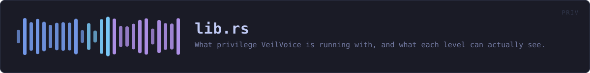
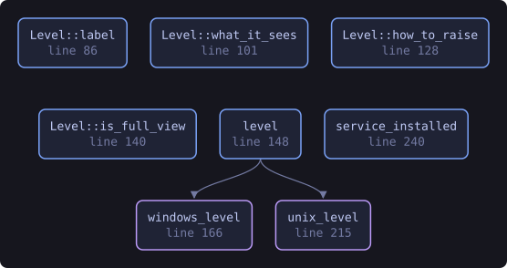

<!-- SPDX-License-Identifier: GPL-3.0-or-later -->
<!-- GENERATED by tools/docs/generate.py from the doc comments in the
     source. Do not edit this file: edit the `//!` and `///` comments in
     the .rs files and run the generator again. CI verifies it with
         python tools/docs/generate.py --check
-->

  

# `crates/veilvoice-priv/src/lib.rs`

[`veilvoice-priv`](../../../crates/veilvoice-priv/README.md) &middot; 406 lines &middot; [read the source](https://github.com/tilas01/veilvoice/blob/main/crates/veilvoice-priv/src/lib.rs)

## Contents

- [Three levels, and the third one this project does not ship](#three-levels-and-the-third-one-this-project-does-not-ship)
- [This crate does not elevate anything](#this-crate-does-not-elevate-anything)
- [Detection is a measurement, and it can fail](#detection-is-a-measurement-and-it-can-fail)
- [In plain words](#in-plain-words)
  - [What this file contains](#what-this-file-contains)
  - [What calls what](#what-calls-what)
  - [Items](#items)

What privilege VeilVoice is running with, and what each level can actually
see.

# Three levels, and the third one this project does not ship

* `Level::User` is VeilVoice as you. Everything the de-identifier does
happens here, and nothing about the engine, the container format or the
app lock needs any more than this.
* `Level::Elevated` is running as administrator or root. The monitoring
features see further: processes belonging to other users, service
accounts, and a few registry and system paths that are unreadable
otherwise.
* **Kernel level** is not shipped, and not for want of trying. Loading a
kernel driver on 64-bit Windows needs an EV code-signing certificate
issued to a verified legal entity plus Microsoft's attestation signing;
macOS needs an Apple Developer ID and an entitlement granted case by
case. Both are identity checks, and this project is published under a
pseudonym on purpose. `NO_KERNEL` says so in the words a front end
should show.

# This crate does not elevate anything

It reports. It does not re-launch VeilVoice as administrator, install a
service, or ask for a password. Those are changes to somebody's machine and
they belong to the person whose machine it is: `Level::how_to_raise`
prints the command, and they type it.

That is not caution for its own sake. A privacy tool that silently acquires
administrator rights is a privacy tool nobody can reason about, and one that
installs a background service without being asked is worse, because a service
outlives the window it was started from, and somebody who tried VeilVoice
once should not find it still running next month.

# Detection is a measurement, and it can fail

There is no `am_i_admin()` in the standard library and reaching the real
answer is FFI on every platform here. So this asks a tool the system already
ships, exactly as `veilvoice-watch` asks the registry, and when the tool
cannot be run, the answer is `Level::Unknown` rather than a guess.

**`Unknown` is not `User`.** Reporting "not elevated" when the truth is "I
could not tell" would understate what VeilVoice can see, which sounds like
the safe direction and is not: somebody would conclude a feature is
unavailable and stop looking at its output.

# In plain words

Most of VeilVoice needs no special permissions at all, because changing a voice is
something any program can do with your own account.

The parts that *watch* your machine can see more when VeilVoice is run as an
administrator: programs belonging to other accounts, and a few places on the
system that are otherwise off limits. This tells you which of those you are
currently getting, and how to run it the other way if you want to.

It will not do that for you. Running as administrator, or installing a
background service, is a change to your computer and it should be one you
made on purpose. And there is a third level, inside the operating system
itself, that VeilVoice does not reach and says so rather than implying it
does.

## What this file contains

406 lines defining **8 functions** (6 public), **1 type** and **3 constants**. Everything below is read out of the source, so it cannot disagree with the code.

**The types it owns.**

- `enum Level` (line 69) -- What VeilVoice is running with.

**What happens when it runs.** These are the ways in: public, and nothing else in this file calls them, so they are what an outside caller reaches first.

- `Level::label` (line 86) -- A short name.
- `Level::what_it_sees` (line 101) -- What this level can see, and what it cannot.
- `Level::how_to_raise` (line 128) -- The command that would run VeilVoice at the higher level.
- `Level::is_full_view` (line 140) -- Whether the monitoring features are seeing everything they could.
- `level` (line 148) -- What VeilVoice is running with right now.
  - reaches: `unix_level`, `windows_level`
- `service_installed` (line 240) -- Whether a background service is installed.

## What calls what

The functions this file defines, and the calls between them. Both
are read out of the source: an edge means the callee's name appears,
called, inside the caller's body. It is a syntactic reading, not a
type-resolved one, so a call made through a trait object or a macro
will not appear.

_Colour key: **entry** -- a way in: public, and nothing in this file calls it; **helper** -- private to this file._

  

The same graph as Mermaid source

```mermaid
%%{init: {"theme":"base","themeVariables":{"background":"#1a1b26","primaryColor":"#1f2335","primaryTextColor":"#c0caf5","primaryBorderColor":"#7aa2f7","secondaryColor":"#16161e","tertiaryColor":"#16161e","lineColor":"#737aa2","textColor":"#c0caf5","mainBkg":"#1f2335","nodeBorder":"#7aa2f7","clusterBkg":"#16161e","clusterBorder":"#2f3549","fontFamily":"ui-monospace, SFMono-Regular, Consolas, monospace","fontSize":"14px"}}}%%
flowchart TD
    n_label(["Level::label<br/>line 86"])
    n_what_it_sees(["Level::what_it_sees<br/>line 101"])
    n_how_to_raise(["Level::how_to_raise<br/>line 128"])
    n_is_full_view(["Level::is_full_view<br/>line 140"])
    n_level(["level<br/>line 148"])
    n_windows_level["windows_level<br/>line 166"]
    n_unix_level["unix_level<br/>line 215"]
    n_service_installed(["service_installed<br/>line 240"])
    n_level --> n_unix_level
    n_level --> n_windows_level
    click n_label href "https://github.com/tilas01/veilvoice/blob/main/crates/veilvoice-priv/src/lib.rs#L86" "open the source"
    click n_what_it_sees href "https://github.com/tilas01/veilvoice/blob/main/crates/veilvoice-priv/src/lib.rs#L101" "open the source"
    click n_how_to_raise href "https://github.com/tilas01/veilvoice/blob/main/crates/veilvoice-priv/src/lib.rs#L128" "open the source"
    click n_is_full_view href "https://github.com/tilas01/veilvoice/blob/main/crates/veilvoice-priv/src/lib.rs#L140" "open the source"
    click n_level href "https://github.com/tilas01/veilvoice/blob/main/crates/veilvoice-priv/src/lib.rs#L148" "open the source"
    click n_windows_level href "https://github.com/tilas01/veilvoice/blob/main/crates/veilvoice-priv/src/lib.rs#L166" "open the source"
    click n_unix_level href "https://github.com/tilas01/veilvoice/blob/main/crates/veilvoice-priv/src/lib.rs#L215" "open the source"
    click n_service_installed href "https://github.com/tilas01/veilvoice/blob/main/crates/veilvoice-priv/src/lib.rs#L240" "open the source"
    classDef entry fill:#1f2335,stroke:#7aa2f7,color:#c0caf5
    class n_label,n_what_it_sees,n_how_to_raise,n_is_full_view,n_level,n_service_installed entry
    classDef helper fill:#1f2335,stroke:#bb9af7,color:#c0caf5
    class n_windows_level,n_unix_level helper
```

## Items

| Item | Line | Documentation |
|---|---:|---|
| `Level` pub enum | [69](https://github.com/tilas01/veilvoice/blob/main/crates/veilvoice-priv/src/lib.rs#L69) | What VeilVoice is running with. |
| `Level::label` pub fn | [86](https://github.com/tilas01/veilvoice/blob/main/crates/veilvoice-priv/src/lib.rs#L86) | A short name. |
| `Level::what_it_sees` pub fn | [101](https://github.com/tilas01/veilvoice/blob/main/crates/veilvoice-priv/src/lib.rs#L101) | What this level can see, and what it cannot. |
| `Level::how_to_raise` pub fn | [128](https://github.com/tilas01/veilvoice/blob/main/crates/veilvoice-priv/src/lib.rs#L128) | The command that would run VeilVoice at the higher level. |
| `Level::is_full_view` pub fn | [140](https://github.com/tilas01/veilvoice/blob/main/crates/veilvoice-priv/src/lib.rs#L140) | Whether the monitoring features are seeing everything they could. |
| `level` pub fn | [148](https://github.com/tilas01/veilvoice/blob/main/crates/veilvoice-priv/src/lib.rs#L148) | What VeilVoice is running with right now. |
| `windows_level` fn | [166](https://github.com/tilas01/veilvoice/blob/main/crates/veilvoice-priv/src/lib.rs#L166) | On Windows, ask whoami /groups for the administrators SID. |
| `unix_level` fn | [215](https://github.com/tilas01/veilvoice/blob/main/crates/veilvoice-priv/src/lib.rs#L215) | Everywhere else, ask id -u. |
| `service_installed` pub fn | [240](https://github.com/tilas01/veilvoice/blob/main/crates/veilvoice-priv/src/lib.rs#L240) | Whether a background service is installed. |
| `NO_SERVICE` pub const | [245](https://github.com/tilas01/veilvoice/blob/main/crates/veilvoice-priv/src/lib.rs#L245) | Why the opt-in service is not shipped, in the words to show. |
| `NO_KERNEL` pub const | [254](https://github.com/tilas01/veilvoice/blob/main/crates/veilvoice-priv/src/lib.rs#L254) | What kernel level would need, and why it is not here. |
| `NEVER_ELEVATES` pub const | [265](https://github.com/tilas01/veilvoice/blob/main/crates/veilvoice-priv/src/lib.rs#L265) | What this crate will not do, and why that is deliberate. |

---

Generated from `crates/veilvoice-priv/src/lib.rs`. On the website: [`website/reference/veilvoice-priv/lib.html`](../../../website/reference/veilvoice-priv/lib.html).

Signing key fingerprint `8101FB3BB28D02FB239E0CDF9CC1C7E7A9B5833A`.
