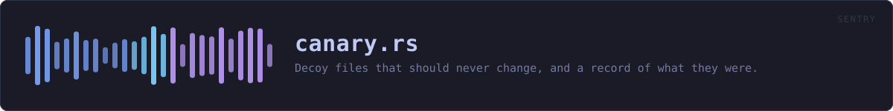
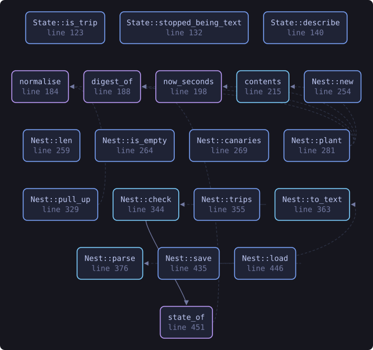

<!-- SPDX-License-Identifier: GPL-3.0-or-later -->
<!-- GENERATED by tools/docs/generate.py from the doc comments in the
     source. Do not edit this file: edit the `//!` and `///` comments in
     the .rs files and run the generator again. CI verifies it with
         python tools/docs/generate.py --check
-->

<p align="center">
  
</p>

# `crates/veilvoice-sentry/src/canary.rs`

[`veilvoice-sentry`](../../../crates/veilvoice-sentry/README.md) &middot; 750 lines &middot; [read the source](https://github.com/tilas01/veilvoice/blob/main/crates/veilvoice-sentry/src/canary.rs)

## Contents

- [The idea, in one paragraph](#the-idea-in-one-paragraph)
- [And the hole in it, which is large](#and-the-hole-in-it-which-is-large)
- [The name is a deliberate trade, and the default takes the honest side](#the-name-is-a-deliberate-trade-and-the-default-takes-the-honest-side)
- [A deletion and an encryption look the same](#a-deletion-and-an-encryption-look-the-same)
- [Format](#format)
  - [What this file contains](#what-this-file-contains)
  - [What calls what](#what-calls-what)
  - [Items](#items)

Decoy files that should never change, and a record of what they were.

# The idea, in one paragraph

Put a file somewhere nothing legitimately writes, remember exactly what it
contained, and look at it later. If it differs, something walked that
directory and wrote to everything it found. That is a much cleaner signal
than counting file changes, because there is no innocent explanation for a
file nobody uses having been rewritten.

# And the hole in it, which is large

A canary fires only if whatever is running **reaches it**. Something that
encrypts `.docx` under one folder will never look at a canary planted
anywhere else, and this crate has no way to tell "nothing happened" from
"it happened somewhere I was not". A quiet canary is not an all-clear, and
no wording in a front end may present it as one.

Plant several, in the directories that actually matter, and accept that the
answer is still one-sided: a trip is evidence, silence is not.

# The name is a deliberate trade, and the default takes the honest side

`DEFAULT_NAME` says what the file is. Anything that reads filenames before
deciding what to encrypt can therefore skip it, and the signal is lost. A
decoy called `quarterly-report.docx` would survive that.

The default is the recognisable name anyway, for two reasons. Indiscriminate
encryption of everything under a directory is the overwhelmingly common
case, and it is not fooled either way. And a file the user does not
recognise is a file the user eventually deletes — which reads here as a
trip, produces an alarm that was nobody's fault, and teaches them to ignore
the next one. A warning system whose alarms are usually wrong is worse than
no warning system.

`Nest::plant` takes a name, so anybody who wants the quieter trade can
have it. It is a choice, made in the open, not a default that decides for
them.

# A deletion and an encryption look the same

Much ransomware writes a new encrypted file beside the original and deletes
the original, so the canary comes back as `State::Removed` — which is
also what a user tidying a folder produces. `State` reports which of the
two happened to the file, never which of the two happened in the world.

# Format

One record per line, text, for the same reason the tamper manifest is text:
the point of the file is to be checkable without this crate.

```text
VEILSENTRY-NEST1
<sha256 hex>  <size>  <planted unix seconds>  <path>
```

## What this file contains

750 lines defining **20 functions** (16 public), **4 types** and **4 constants**. Everything below is read out of the source, so it cannot disagree with the code.

**The types it owns.**

- `struct Canary` (line 83) -- One planted decoy, and what it was when it was planted.
- `enum State` (line 96) -- What a canary looks like now.
- `struct Sighting` (line 166) -- One canary and what became of it.
- `struct Nest` (line 175) -- The set of planted canaries.

**What happens when it runs.** These are the ways in: public, and nothing else in this file calls them, so they are what an outside caller reaches first.

- `State::is_trip` (line 123) -- Whether this is anything other than State::Intact.
- `State::stopped_being_text` (line 132) -- Whether the contents stopped looking like the text that was planted.
- `State::describe` (line 140) -- A single line for a terminal or a log.
- `Nest::new` (line 254) -- An empty nest.
- `Nest::len` (line 259) -- How many canaries are planted.
- `Nest::is_empty` (line 264) -- Whether nothing is planted.
- `Nest::canaries` (line 269) -- The planted canaries, in a stable order.
- `Nest::plant` (line 281) -- Write a canary into dir and record it.
  - reaches: `contents`, `digest_of`, `normalise`, `now_seconds`
- `Nest::pull_up` (line 329) -- Stop watching a canary, and delete it.
  - reaches: `normalise`
- `Nest::trips` (line 355) -- Only the canaries that are not intact.
  - reaches: `check`, `state_of`, `digest_of`
- `Nest::save` (line 435) -- Write the nest to path.
  - reaches: `to_text`
- `Nest::load` (line 446) -- Read a nest written by Nest::save.
  - reaches: `parse`

## What calls what

The functions this file defines, and the calls between them. Both
are read out of the source: an edge means the callee's name appears,
called, inside the caller's body. It is a syntactic reading, not a
type-resolved one, so a call made through a trait object or a macro
will not appear.

_Colour key: **entry** -- a way in: public, and nothing in this file calls it; **api** -- public, and also used inside this file; **helper** -- private to this file._

<p align="center">
  
</p>

<details>
<summary>The same graph as Mermaid source</summary>



</details>

```mermaid
%%{init: {"theme":"base","themeVariables":{"background":"#1a1b26","primaryColor":"#1f2335","primaryTextColor":"#c0caf5","primaryBorderColor":"#7aa2f7","secondaryColor":"#16161e","tertiaryColor":"#16161e","lineColor":"#737aa2","textColor":"#c0caf5","mainBkg":"#1f2335","nodeBorder":"#7aa2f7","clusterBkg":"#16161e","clusterBorder":"#2f3549","fontFamily":"ui-monospace, SFMono-Regular, Consolas, monospace","fontSize":"14px"}}}%%
flowchart TD
    n_is_trip(["State::is_trip<br/>line 123"])
    n_stopped_being_text(["State::stopped_being_text<br/>line 132"])
    n_describe(["State::describe<br/>line 140"])
    n_normalise["normalise<br/>line 184"]
    n_digest_of["digest_of<br/>line 188"]
    n_now_seconds["now_seconds<br/>line 198"]
    n_contents["contents<br/>line 215"]
    n_new(["Nest::new<br/>line 254"])
    n_len(["Nest::len<br/>line 259"])
    n_is_empty(["Nest::is_empty<br/>line 264"])
    n_canaries(["Nest::canaries<br/>line 269"])
    n_plant(["Nest::plant<br/>line 281"])
    n_pull_up(["Nest::pull_up<br/>line 329"])
    n_check["Nest::check<br/>line 344"]
    n_trips(["Nest::trips<br/>line 355"])
    n_to_text["Nest::to_text<br/>line 363"]
    n_parse["Nest::parse<br/>line 376"]
    n_save(["Nest::save<br/>line 435"])
    n_load(["Nest::load<br/>line 446"])
    n_state_of["state_of<br/>line 451"]
    n_check --> n_state_of
    n_load --> n_parse
    n_plant --> n_contents
    n_plant --> n_digest_of
    n_plant --> n_normalise
    n_plant --> n_now_seconds
    n_pull_up --> n_normalise
    n_save --> n_to_text
    n_state_of --> n_digest_of
    n_trips --> n_check
    click n_is_trip href "https://github.com/tilas01/veilvoice/blob/main/crates/veilvoice-sentry/src/canary.rs#L123" "open the source"
    click n_stopped_being_text href "https://github.com/tilas01/veilvoice/blob/main/crates/veilvoice-sentry/src/canary.rs#L132" "open the source"
    click n_describe href "https://github.com/tilas01/veilvoice/blob/main/crates/veilvoice-sentry/src/canary.rs#L140" "open the source"
    click n_normalise href "https://github.com/tilas01/veilvoice/blob/main/crates/veilvoice-sentry/src/canary.rs#L184" "open the source"
    click n_digest_of href "https://github.com/tilas01/veilvoice/blob/main/crates/veilvoice-sentry/src/canary.rs#L188" "open the source"
    click n_now_seconds href "https://github.com/tilas01/veilvoice/blob/main/crates/veilvoice-sentry/src/canary.rs#L198" "open the source"
    click n_contents href "https://github.com/tilas01/veilvoice/blob/main/crates/veilvoice-sentry/src/canary.rs#L215" "open the source"
    click n_new href "https://github.com/tilas01/veilvoice/blob/main/crates/veilvoice-sentry/src/canary.rs#L254" "open the source"
    click n_len href "https://github.com/tilas01/veilvoice/blob/main/crates/veilvoice-sentry/src/canary.rs#L259" "open the source"
    click n_is_empty href "https://github.com/tilas01/veilvoice/blob/main/crates/veilvoice-sentry/src/canary.rs#L264" "open the source"
    click n_canaries href "https://github.com/tilas01/veilvoice/blob/main/crates/veilvoice-sentry/src/canary.rs#L269" "open the source"
    click n_plant href "https://github.com/tilas01/veilvoice/blob/main/crates/veilvoice-sentry/src/canary.rs#L281" "open the source"
    click n_pull_up href "https://github.com/tilas01/veilvoice/blob/main/crates/veilvoice-sentry/src/canary.rs#L329" "open the source"
    click n_check href "https://github.com/tilas01/veilvoice/blob/main/crates/veilvoice-sentry/src/canary.rs#L344" "open the source"
    click n_trips href "https://github.com/tilas01/veilvoice/blob/main/crates/veilvoice-sentry/src/canary.rs#L355" "open the source"
    click n_to_text href "https://github.com/tilas01/veilvoice/blob/main/crates/veilvoice-sentry/src/canary.rs#L363" "open the source"
    click n_parse href "https://github.com/tilas01/veilvoice/blob/main/crates/veilvoice-sentry/src/canary.rs#L376" "open the source"
    click n_save href "https://github.com/tilas01/veilvoice/blob/main/crates/veilvoice-sentry/src/canary.rs#L435" "open the source"
    click n_load href "https://github.com/tilas01/veilvoice/blob/main/crates/veilvoice-sentry/src/canary.rs#L446" "open the source"
    click n_state_of href "https://github.com/tilas01/veilvoice/blob/main/crates/veilvoice-sentry/src/canary.rs#L451" "open the source"
    classDef entry fill:#1f2335,stroke:#7aa2f7,color:#c0caf5
    class n_is_trip,n_stopped_being_text,n_describe,n_new,n_len,n_is_empty,n_canaries,n_plant,n_pull_up,n_trips,n_save,n_load entry
    classDef api fill:#1f2335,stroke:#7dcfff,color:#c0caf5
    class n_contents,n_check,n_to_text,n_parse api
    classDef helper fill:#1f2335,stroke:#bb9af7,color:#c0caf5
    class n_normalise,n_digest_of,n_now_seconds,n_state_of helper
```

## Items

| Item | Line | Documentation |
|---|---:|---|
| `MAGIC` <sub>const</sub> | [65](https://github.com/tilas01/veilvoice/blob/main/crates/veilvoice-sentry/src/canary.rs#L65) | Magic first line. |
| `DEFAULT_NAME` <sub>pub const</sub> | [71](https://github.com/tilas01/veilvoice/blob/main/crates/veilvoice-sentry/src/canary.rs#L71) | The default filename for a canary. |
| `PROSE_CEILING` <sub>pub const</sub> | [79](https://github.com/tilas01/veilvoice/blob/main/crates/veilvoice-sentry/src/canary.rs#L79) | Below this, a canary that was prose has stopped being prose. |
| `Canary` <sub>pub struct</sub> | [83](https://github.com/tilas01/veilvoice/blob/main/crates/veilvoice-sentry/src/canary.rs#L83) | One planted decoy, and what it was when it was planted. |
| `State` <sub>pub enum</sub> | [96](https://github.com/tilas01/veilvoice/blob/main/crates/veilvoice-sentry/src/canary.rs#L96) | What a canary looks like now. |
| `State::is_trip` <sub>pub fn</sub> | [123](https://github.com/tilas01/veilvoice/blob/main/crates/veilvoice-sentry/src/canary.rs#L123) | Whether this is anything other than State::Intact. |
| `State::stopped_being_text` <sub>pub fn</sub> | [132](https://github.com/tilas01/veilvoice/blob/main/crates/veilvoice-sentry/src/canary.rs#L132) | Whether the contents stopped looking like the text that was planted. |
| `State::describe` <sub>pub fn</sub> | [140](https://github.com/tilas01/veilvoice/blob/main/crates/veilvoice-sentry/src/canary.rs#L140) | A single line for a terminal or a log. |
| `Sighting` <sub>pub struct</sub> | [166](https://github.com/tilas01/veilvoice/blob/main/crates/veilvoice-sentry/src/canary.rs#L166) | One canary and what became of it. |
| `Nest` <sub>pub struct</sub> | [175](https://github.com/tilas01/veilvoice/blob/main/crates/veilvoice-sentry/src/canary.rs#L175) | The set of planted canaries. |
| `normalise` <sub>fn</sub> | [184](https://github.com/tilas01/veilvoice/blob/main/crates/veilvoice-sentry/src/canary.rs#L184) | Normalise a path for storage: forward slashes, as the tamper manifest does, so a nest written on Windows still reads on Linux. |
| `digest_of` <sub>fn</sub> | [188](https://github.com/tilas01/veilvoice/blob/main/crates/veilvoice-sentry/src/canary.rs#L188) |  |
| `now_seconds` <sub>fn</sub> | [198](https://github.com/tilas01/veilvoice/blob/main/crates/veilvoice-sentry/src/canary.rs#L198) |  |
| `contents` <sub>pub fn</sub> | [215](https://github.com/tilas01/veilvoice/blob/main/crates/veilvoice-sentry/src/canary.rs#L215) | The text a canary is filled with. |
| `FILLER` <sub>const</sub> | [244](https://github.com/tilas01/veilvoice/blob/main/crates/veilvoice-sentry/src/canary.rs#L244) | Plain sentences, in the project's own register, repeated to make a body. |
| `Nest::new` <sub>pub fn</sub> | [254](https://github.com/tilas01/veilvoice/blob/main/crates/veilvoice-sentry/src/canary.rs#L254) | An empty nest. |
| `Nest::len` <sub>pub fn</sub> | [259](https://github.com/tilas01/veilvoice/blob/main/crates/veilvoice-sentry/src/canary.rs#L259) | How many canaries are planted. |
| `Nest::is_empty` <sub>pub fn</sub> | [264](https://github.com/tilas01/veilvoice/blob/main/crates/veilvoice-sentry/src/canary.rs#L264) | Whether nothing is planted. |
| `Nest::canaries` <sub>pub fn</sub> | [269](https://github.com/tilas01/veilvoice/blob/main/crates/veilvoice-sentry/src/canary.rs#L269) | The planted canaries, in a stable order. |
| `Nest::plant` <sub>pub fn</sub> | [281](https://github.com/tilas01/veilvoice/blob/main/crates/veilvoice-sentry/src/canary.rs#L281) | Write a canary into dir and record it. |
| `Nest::pull_up` <sub>pub fn</sub> | [329](https://github.com/tilas01/veilvoice/blob/main/crates/veilvoice-sentry/src/canary.rs#L329) | Stop watching a canary, and delete it. |
| `Nest::check` <sub>pub fn</sub> | [344](https://github.com/tilas01/veilvoice/blob/main/crates/veilvoice-sentry/src/canary.rs#L344) | Look at every canary. |
| `Nest::trips` <sub>pub fn</sub> | [355](https://github.com/tilas01/veilvoice/blob/main/crates/veilvoice-sentry/src/canary.rs#L355) | Only the canaries that are not intact. |
| `Nest::to_text` <sub>pub fn</sub> | [363](https://github.com/tilas01/veilvoice/blob/main/crates/veilvoice-sentry/src/canary.rs#L363) | Serialise to the text format described at the top of this module. |
| `Nest::parse` <sub>pub fn</sub> | [376](https://github.com/tilas01/veilvoice/blob/main/crates/veilvoice-sentry/src/canary.rs#L376) | Parse the text format. |
| `Nest::save` <sub>pub fn</sub> | [435](https://github.com/tilas01/veilvoice/blob/main/crates/veilvoice-sentry/src/canary.rs#L435) | Write the nest to path. |
| `Nest::load` <sub>pub fn</sub> | [446](https://github.com/tilas01/veilvoice/blob/main/crates/veilvoice-sentry/src/canary.rs#L446) | Read a nest written by Nest::save. |
| `state_of` <sub>fn</sub> | [451](https://github.com/tilas01/veilvoice/blob/main/crates/veilvoice-sentry/src/canary.rs#L451) |  |

---

Generated from `crates/veilvoice-sentry/src/canary.rs`. On the website: [`website/reference/veilvoice-sentry/canary.html`](../../../website/reference/veilvoice-sentry/canary.html).

Signing key fingerprint `8101FB3BB28D02FB239E0CDF9CC1C7E7A9B5833A`.
