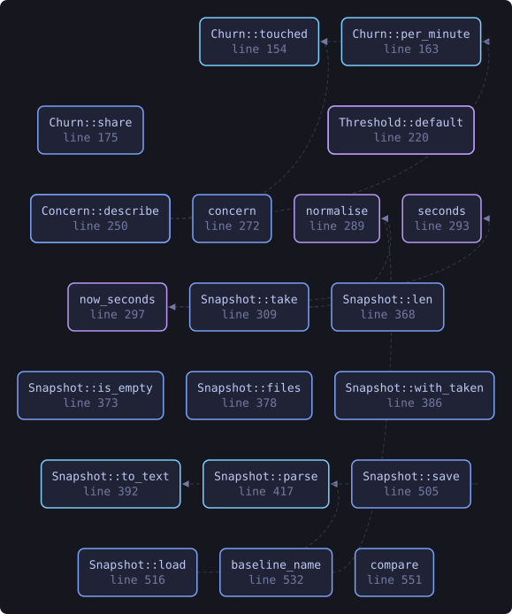

<!-- SPDX-License-Identifier: GPL-3.0-or-later -->
<!-- GENERATED by tools/docs/generate.py from the doc comments in the
     source. Do not edit this file: edit the `//!` and `///` comments in
     the .rs files and run the generator again. CI verifies it with
         python tools/docs/generate.py --check
-->

<p align="center">
  
</p>

# `crates/veilvoice-sentry/src/rate.rs`

[`veilvoice-sentry`](../../../crates/veilvoice-sentry/README.md) &middot; 942 lines &middot; [read the source](https://github.com/tilas01/veilvoice/blob/main/crates/veilvoice-sentry/src/rate.rs)

## Contents

- [What this measures, and what it does not](#what-this-measures-and-what-it-does-not)
- [Modification times can be set by whatever did the modifying](#modification-times-can-be-set-by-whatever-did-the-modifying)
- [Walking a tree costs real time, so the walk is bounded](#walking-a-tree-costs-real-time-so-the-walk-is-bounded)
- [Format](#format)
  - [What this file contains](#what-this-file-contains)
  - [What calls what](#what-calls-what)
  - [Items](#items)

How much of a directory tree changed, and how fast.

# What this measures, and what it does not

It counts files. Take a `Snapshot` of a tree, take another later, and
`compare` reports how many were added, removed or altered in between, and
over what interval. That is the whole of the measurement.

It is **not** a ransomware detector, and `Churn` deliberately has no
`is_ransomware` on it. Restoring a backup, importing a camera card, a
synchronisation client catching up after a week offline, extracting an
archive, and a compiler writing a target directory all produce exactly the
shape this measures, because they are all mass rewrites. Anything claiming
to tell those apart by counting files is claiming something it cannot do.

So the output is numbers plus a `Concern` level against a `Threshold`
**the user sets**, and the front end's job is to say "this many files
changed in this long, was that you?" — a question, which the person at the
keyboard can answer instantly and this crate never can.

# Modification times can be set by whatever did the modifying

A file counts as changed when its length or its modification time differs.
Both are attacker-controllable: anything that can rewrite a file can restore
its old timestamp, and on most filesystems its length is whatever it chose
to write. This measure therefore has a floor, not a guarantee, and something
careful will pass under it.

`crate::canary` does not have that weakness, because it compares contents
against a recorded digest. It has a different weakness instead. That is why
there are two signals here rather than one.

# Walking a tree costs real time, so the walk is bounded

`Limits` caps how many files and how deep, and a snapshot that hit a cap
is marked `Snapshot::truncated`. A truncated snapshot compared against
another truncated snapshot is still useful — both walked in the same order —
but the count is of what was looked at, not of what is there, and every
report carries that flag so a front end cannot present it as complete.

Symbolic links are recorded and never followed. Following them turns a tree
walk into a graph walk with cycles in it, and lets a link inside the watched
directory make this crate report on files outside it.

# Format

A snapshot has to survive between two runs of the program, or the only
comparison possible is one taken inside a single session — which measures
the minute you were looking and nothing else. So it is written to disk, in
text, one record per line, for the same reason the tamper manifest is text:
the point of the file is to be checkable without this crate.

```text
VEILSENTRY-SNAP1
root  /home/somebody/Documents
taken  1700000000
truncated  false
unreadable  /home/somebody/Documents/private: permission denied
file  4096  1699999000  /home/somebody/Documents/notes.txt
```

A modification time the platform did not report is written as `-`, which is
not the same as zero: zero is a real instant in 1970 and files claiming it
do exist.

## What this file contains

942 lines defining **22 functions** (17 public), **6 types** and **1 constant**. Everything below is read out of the source, so it cannot disagree with the code.

**The types it owns.**

- `struct Facts` (line 77) -- What is recorded about one file.
- `struct Limits` (line 91) -- How far a walk is allowed to go.
- `struct Snapshot` (line 109) -- What a tree looked like at one moment.
- `struct Churn` (line 126) -- The difference between two snapshots.
- `struct Threshold` (line 201) -- When to raise the level, set by the user rather than guessed at here.
- `enum Concern` (line 228) -- How much of the threshold a Churn met.

**What happens when it runs.** These are the ways in: public, and nothing else in this file calls them, so they are what an outside caller reaches first.

- `Churn::share` (line 164) -- The proportion of the earlier snapshot that was touched, from 0.0 to 1.0.
- `Churn::describe` (line 173) -- One line for a terminal or a log.
  - reaches: `per_minute`, `touched`
- `Concern::describe` (line 239) -- A line for a front end, phrased as the question it actually is.
  - reaches: `per_minute`, `touched`
- `concern` (line 261) -- Judge a Churn against a Threshold.
- `Snapshot::take` (line 298) -- Walk root and record what is there.
  - reaches: `normalise`, `now_seconds`, `seconds`
- `Snapshot::len` (line 357) -- How many files were recorded.
- `Snapshot::is_empty` (line 362) -- Whether nothing was recorded.
- `Snapshot::files` (line 367) -- The recorded paths and facts, in a stable order.
- `Snapshot::with_taken` (line 375) -- Replace the recorded time.
- `Snapshot::save` (line 494) -- Write the snapshot to path.
  - reaches: `to_text`
- `Snapshot::load` (line 505) -- Read a snapshot written by Snapshot::save.
  - reaches: `parse`
- `baseline_name` (line 521) -- A stable filename for the saved snapshot of root.
  - reaches: `normalise`
- `compare` (line 540) -- Compare two snapshots of the same tree.

## What calls what

The functions this file defines, and the calls between them. Both
are read out of the source: an edge means the callee's name appears,
called, inside the caller's body. It is a syntactic reading, not a
type-resolved one, so a call made through a trait object or a macro
will not appear.

_Colour key: **entry** -- a way in: public, and nothing in this file calls it; **api** -- public, and also used inside this file; **helper** -- private to this file._

<p align="center">
  
</p>

<details>
<summary>The same graph as Mermaid source</summary>



</details>

```mermaid
%%{init: {"theme":"base","themeVariables":{"background":"#1a1b26","primaryColor":"#1f2335","primaryTextColor":"#c0caf5","primaryBorderColor":"#7aa2f7","secondaryColor":"#16161e","tertiaryColor":"#16161e","lineColor":"#737aa2","textColor":"#c0caf5","mainBkg":"#1f2335","nodeBorder":"#7aa2f7","clusterBkg":"#16161e","clusterBorder":"#2f3549","fontFamily":"ui-monospace, SFMono-Regular, Consolas, monospace","fontSize":"14px"}}}%%
flowchart TD
    n_default["Limits::default<br/>line 99"]
    n_touched["Churn::touched<br/>line 143"]
    n_per_minute["Churn::per_minute<br/>line 152"]
    n_share(["Churn::share<br/>line 164"])
    n_describe(["Churn::describe<br/>line 173"])
    n_default["Threshold::default<br/>line 209"]
    n_describe(["Concern::describe<br/>line 239"])
    n_concern(["concern<br/>line 261"])
    n_normalise["normalise<br/>line 278"]
    n_seconds["seconds<br/>line 282"]
    n_now_seconds["now_seconds<br/>line 286"]
    n_take(["Snapshot::take<br/>line 298"])
    n_len(["Snapshot::len<br/>line 357"])
    n_is_empty(["Snapshot::is_empty<br/>line 362"])
    n_files(["Snapshot::files<br/>line 367"])
    n_with_taken(["Snapshot::with_taken<br/>line 375"])
    n_to_text["Snapshot::to_text<br/>line 381"]
    n_parse["Snapshot::parse<br/>line 406"]
    n_save(["Snapshot::save<br/>line 494"])
    n_load(["Snapshot::load<br/>line 505"])
    n_baseline_name(["baseline_name<br/>line 521"])
    n_compare(["compare<br/>line 540"])
    n_baseline_name --> n_normalise
    n_describe --> n_per_minute
    n_describe --> n_touched
    n_load --> n_parse
    n_now_seconds --> n_seconds
    n_per_minute --> n_touched
    n_save --> n_to_text
    n_take --> n_normalise
    n_take --> n_now_seconds
    click n_default href "https://github.com/tilas01/veilvoice/blob/main/crates/veilvoice-sentry/src/rate.rs#L99" "open the source"
    click n_touched href "https://github.com/tilas01/veilvoice/blob/main/crates/veilvoice-sentry/src/rate.rs#L143" "open the source"
    click n_per_minute href "https://github.com/tilas01/veilvoice/blob/main/crates/veilvoice-sentry/src/rate.rs#L152" "open the source"
    click n_share href "https://github.com/tilas01/veilvoice/blob/main/crates/veilvoice-sentry/src/rate.rs#L164" "open the source"
    click n_describe href "https://github.com/tilas01/veilvoice/blob/main/crates/veilvoice-sentry/src/rate.rs#L173" "open the source"
    click n_default href "https://github.com/tilas01/veilvoice/blob/main/crates/veilvoice-sentry/src/rate.rs#L209" "open the source"
    click n_describe href "https://github.com/tilas01/veilvoice/blob/main/crates/veilvoice-sentry/src/rate.rs#L239" "open the source"
    click n_concern href "https://github.com/tilas01/veilvoice/blob/main/crates/veilvoice-sentry/src/rate.rs#L261" "open the source"
    click n_normalise href "https://github.com/tilas01/veilvoice/blob/main/crates/veilvoice-sentry/src/rate.rs#L278" "open the source"
    click n_seconds href "https://github.com/tilas01/veilvoice/blob/main/crates/veilvoice-sentry/src/rate.rs#L282" "open the source"
    click n_now_seconds href "https://github.com/tilas01/veilvoice/blob/main/crates/veilvoice-sentry/src/rate.rs#L286" "open the source"
    click n_take href "https://github.com/tilas01/veilvoice/blob/main/crates/veilvoice-sentry/src/rate.rs#L298" "open the source"
    click n_len href "https://github.com/tilas01/veilvoice/blob/main/crates/veilvoice-sentry/src/rate.rs#L357" "open the source"
    click n_is_empty href "https://github.com/tilas01/veilvoice/blob/main/crates/veilvoice-sentry/src/rate.rs#L362" "open the source"
    click n_files href "https://github.com/tilas01/veilvoice/blob/main/crates/veilvoice-sentry/src/rate.rs#L367" "open the source"
    click n_with_taken href "https://github.com/tilas01/veilvoice/blob/main/crates/veilvoice-sentry/src/rate.rs#L375" "open the source"
    click n_to_text href "https://github.com/tilas01/veilvoice/blob/main/crates/veilvoice-sentry/src/rate.rs#L381" "open the source"
    click n_parse href "https://github.com/tilas01/veilvoice/blob/main/crates/veilvoice-sentry/src/rate.rs#L406" "open the source"
    click n_save href "https://github.com/tilas01/veilvoice/blob/main/crates/veilvoice-sentry/src/rate.rs#L494" "open the source"
    click n_load href "https://github.com/tilas01/veilvoice/blob/main/crates/veilvoice-sentry/src/rate.rs#L505" "open the source"
    click n_baseline_name href "https://github.com/tilas01/veilvoice/blob/main/crates/veilvoice-sentry/src/rate.rs#L521" "open the source"
    click n_compare href "https://github.com/tilas01/veilvoice/blob/main/crates/veilvoice-sentry/src/rate.rs#L540" "open the source"
    classDef entry fill:#1f2335,stroke:#7aa2f7,color:#c0caf5
    class n_share,n_describe,n_describe,n_concern,n_take,n_len,n_is_empty,n_files,n_with_taken,n_save,n_load,n_baseline_name,n_compare entry
    classDef api fill:#1f2335,stroke:#7dcfff,color:#c0caf5
    class n_touched,n_per_minute,n_to_text,n_parse api
    classDef helper fill:#1f2335,stroke:#bb9af7,color:#c0caf5
    class n_default,n_default,n_normalise,n_seconds,n_now_seconds helper
```

## Items

| Item | Line | Documentation |
|---|---:|---|
| `MAGIC` <sub>const</sub> | [73](https://github.com/tilas01/veilvoice/blob/main/crates/veilvoice-sentry/src/rate.rs#L73) | Magic first line of a saved snapshot. |
| `Facts` <sub>pub struct</sub> | [77](https://github.com/tilas01/veilvoice/blob/main/crates/veilvoice-sentry/src/rate.rs#L77) | What is recorded about one file. |
| `Limits` <sub>pub struct</sub> | [91](https://github.com/tilas01/veilvoice/blob/main/crates/veilvoice-sentry/src/rate.rs#L91) | How far a walk is allowed to go. |
| `Limits::default` <sub>fn</sub> | [99](https://github.com/tilas01/veilvoice/blob/main/crates/veilvoice-sentry/src/rate.rs#L99) |  |
| `Snapshot` <sub>pub struct</sub> | [109](https://github.com/tilas01/veilvoice/blob/main/crates/veilvoice-sentry/src/rate.rs#L109) | What a tree looked like at one moment. |
| `Churn` <sub>pub struct</sub> | [126](https://github.com/tilas01/veilvoice/blob/main/crates/veilvoice-sentry/src/rate.rs#L126) | The difference between two snapshots. |
| `Churn::touched` <sub>pub fn</sub> | [143](https://github.com/tilas01/veilvoice/blob/main/crates/veilvoice-sentry/src/rate.rs#L143) | Added plus removed plus modified: everything that is not unchanged. |
| `Churn::per_minute` <sub>pub fn</sub> | [152](https://github.com/tilas01/veilvoice/blob/main/crates/veilvoice-sentry/src/rate.rs#L152) | Files touched per minute. |
| `Churn::share` <sub>pub fn</sub> | [164](https://github.com/tilas01/veilvoice/blob/main/crates/veilvoice-sentry/src/rate.rs#L164) | The proportion of the earlier snapshot that was touched, from 0.0 to 1.0. |
| `Churn::describe` <sub>pub fn</sub> | [173](https://github.com/tilas01/veilvoice/blob/main/crates/veilvoice-sentry/src/rate.rs#L173) | One line for a terminal or a log. |
| `Threshold` <sub>pub struct</sub> | [201](https://github.com/tilas01/veilvoice/blob/main/crates/veilvoice-sentry/src/rate.rs#L201) | When to raise the level, set by the user rather than guessed at here. |
| `Threshold::default` <sub>fn</sub> | [209](https://github.com/tilas01/veilvoice/blob/main/crates/veilvoice-sentry/src/rate.rs#L209) |  |
| `Concern` <sub>pub enum</sub> | [228](https://github.com/tilas01/veilvoice/blob/main/crates/veilvoice-sentry/src/rate.rs#L228) | How much of the threshold a Churn met. |
| `Concern::describe` <sub>pub fn</sub> | [239](https://github.com/tilas01/veilvoice/blob/main/crates/veilvoice-sentry/src/rate.rs#L239) | A line for a front end, phrased as the question it actually is. |
| `concern` <sub>pub fn</sub> | [261](https://github.com/tilas01/veilvoice/blob/main/crates/veilvoice-sentry/src/rate.rs#L261) | Judge a Churn against a Threshold. |
| `normalise` <sub>fn</sub> | [278](https://github.com/tilas01/veilvoice/blob/main/crates/veilvoice-sentry/src/rate.rs#L278) | Normalise a path for storage: forward slashes, as everywhere else here. |
| `seconds` <sub>fn</sub> | [282](https://github.com/tilas01/veilvoice/blob/main/crates/veilvoice-sentry/src/rate.rs#L282) |  |
| `now_seconds` <sub>fn</sub> | [286](https://github.com/tilas01/veilvoice/blob/main/crates/veilvoice-sentry/src/rate.rs#L286) |  |
| `Snapshot::take` <sub>pub fn</sub> | [298](https://github.com/tilas01/veilvoice/blob/main/crates/veilvoice-sentry/src/rate.rs#L298) | Walk root and record what is there. |
| `Snapshot::len` <sub>pub fn</sub> | [357](https://github.com/tilas01/veilvoice/blob/main/crates/veilvoice-sentry/src/rate.rs#L357) | How many files were recorded. |
| `Snapshot::is_empty` <sub>pub fn</sub> | [362](https://github.com/tilas01/veilvoice/blob/main/crates/veilvoice-sentry/src/rate.rs#L362) | Whether nothing was recorded. |
| `Snapshot::files` <sub>pub fn</sub> | [367](https://github.com/tilas01/veilvoice/blob/main/crates/veilvoice-sentry/src/rate.rs#L367) | The recorded paths and facts, in a stable order. |
| `Snapshot::with_taken` <sub>pub fn</sub> | [375](https://github.com/tilas01/veilvoice/blob/main/crates/veilvoice-sentry/src/rate.rs#L375) | Replace the recorded time. |
| `Snapshot::to_text` <sub>pub fn</sub> | [381](https://github.com/tilas01/veilvoice/blob/main/crates/veilvoice-sentry/src/rate.rs#L381) | Serialise to the text format described at the top of this module. |
| `Snapshot::parse` <sub>pub fn</sub> | [406](https://github.com/tilas01/veilvoice/blob/main/crates/veilvoice-sentry/src/rate.rs#L406) | Parse the text format. |
| `Snapshot::save` <sub>pub fn</sub> | [494](https://github.com/tilas01/veilvoice/blob/main/crates/veilvoice-sentry/src/rate.rs#L494) | Write the snapshot to path. |
| `Snapshot::load` <sub>pub fn</sub> | [505](https://github.com/tilas01/veilvoice/blob/main/crates/veilvoice-sentry/src/rate.rs#L505) | Read a snapshot written by Snapshot::save. |
| `baseline_name` <sub>pub fn</sub> | [521](https://github.com/tilas01/veilvoice/blob/main/crates/veilvoice-sentry/src/rate.rs#L521) | A stable filename for the saved snapshot of root. |
| `compare` <sub>pub fn</sub> | [540](https://github.com/tilas01/veilvoice/blob/main/crates/veilvoice-sentry/src/rate.rs#L540) | Compare two snapshots of the same tree. |

---

Generated from `crates/veilvoice-sentry/src/rate.rs`. On the website: [`website/reference/veilvoice-sentry/rate.html`](../../../website/reference/veilvoice-sentry/rate.html).

Signing key fingerprint `8101FB3BB28D02FB239E0CDF9CC1C7E7A9B5833A`.
