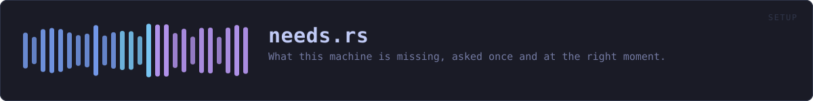
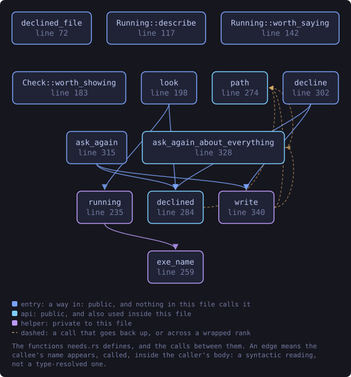

<!-- SPDX-License-Identifier: GPL-3.0-or-later -->
<!-- GENERATED by tools/docs/generate.py from the doc comments in the
     source. Do not edit this file: edit the `//!` and `///` comments in
     the .rs files and run the generator again. CI verifies it with
         python tools/docs/generate.py --check
-->

  

# `crates/veilvoice-setup/src/needs.rs`

[`veilvoice-setup`](../../../crates/veilvoice-setup/README.md) &middot; 565 lines &middot; [read the source](https://github.com/tilas01/veilvoice/blob/main/crates/veilvoice-setup/src/needs.rs)

## Contents

- [What it asks, and what it does not](#what-it-asks-and-what-it-does-not)
- [A no is remembered](#a-no-is-remembered)
- [In plain words](#in-plain-words)
  - [What this file contains](#what-this-file-contains)
  - [What calls what](#what-calls-what)
  - [Items](#items)

What this machine is missing, asked once and at the right moment.

**Roadmap item 163.** Three things need `ffmpeg`: `import`, `video` and the
Studio's render. Each of them found out at the moment it was used and
printed the install line. That is the right refusal at the wrong time.
Somebody learns their recording cannot be turned into a video **after they
have finished making it**, which is the one point in the process where the
answer is least useful and most annoying.

So the question is asked in one place, before anything depends on it, and
the answer is one list rather than three separate discoveries.

# What it asks, and what it does not

Three things:

* Is `ffmpeg` here? Three commands need it and none of them can do their
last step without it.
* Is GnuPG here? Nothing in VeilVoice needs it, and that is the point: it is
what lets somebody check a VeilVoice release with a program this project
did not write, which is the only check that escapes the circularity of a
download verifying itself.
* Is this copy installed, or running out of a folder?

The third is here rather than in `crate::install` because it belongs to
the same question. Somebody running a portable copy who has not been told
that portable is a supported choice will assume something went wrong, and
somebody who meant to install and did not is a person whose next terminal
will not find `veilvoice`. Both are facts about this machine, wanted at the
same moment, and reporting them in one place is the whole of this module.

**Nothing here changes anything, spawns anything, or reaches the network.**
Every probe is a `PATH` lookup or a file test. `look` is cheap enough to
call at a launch, which is the only reason it can be called at one.

# A no is remembered

Being asked the same question at every launch is how a prompt becomes
something people dismiss without reading, and this project has already
written that argument down about tamper alarms. So a decline is recorded,
per companion, in a file the reader can open and delete: see `declined`.

It is per companion rather than one switch. Somebody who does not want
`ffmpeg` has said nothing about GnuPG, and treating the two as one answer is
putting words in their mouth.

A decline is **not** a claim that the software is absent or unwanted for
ever. `look` still reports what is there; what a decline suppresses is the
offer. `veilvoice companions` shows everything regardless, because somebody
who types the name of the thing is asking.

# In plain words

Checks once, when VeilVoice starts, whether the few optional things are here,
instead of finding out when you are halfway through something.

If you say no to one of them, it remembers, and does not ask again. The
answer is kept in a small text file you can read and delete.

## What this file contains

565 lines defining **13 functions** (10 public), **3 types** and **2 constants**. Everything below is read out of the source, so it cannot disagree with the code.

**The types it owns.**

- `enum Running` (line 98) -- Whether this copy is installed, and whether it is the one running.
- `struct Absent` (line 152) -- One thing this machine has not got, and what could be done about it.
- `struct Check` (line 165) -- What one look at this machine found.

**What happens when it runs.** These are the ways in: public, and nothing else in this file calls them, so they are what an outside caller reaches first.

- `declined_file` (line 72) -- The file a decline is remembered in.
- `Running::describe` (line 117) -- A line for a reader, which never calls portable a problem.
- `Running::worth_saying` (line 142) -- Whether anything here is worth putting in front of somebody.
- `Check::worth_showing` (line 183) -- Whether there is anything a reader should be shown at a launch.
- `look` (line 198) -- Look at this machine.
  - reaches: `declined`, `running`, `path`, `exe_name`
- `decline` (line 302) -- Remember that this one is not wanted.
  - reaches: `declined`, `write`, `path`, `ask_again_about_everything`
- `ask_again` (line 315) -- Ask about this one again.
  - reaches: `declined`, `write`, `path`, `ask_again_about_everything`

## What calls what

The functions this file defines, and the calls between them. Both
are read out of the source: an edge means the callee's name appears,
called, inside the caller's body. It is a syntactic reading, not a
type-resolved one, so a call made through a trait object or a macro
will not appear.

_Colour key: **entry** -- a way in: public, and nothing in this file calls it; **api** -- public, and also used inside this file; **helper** -- private to this file._

  

The same graph as Mermaid source

```mermaid
%%{init: {"theme":"base","themeVariables":{"background":"#1a1b26","primaryColor":"#1f2335","primaryTextColor":"#c0caf5","primaryBorderColor":"#7aa2f7","secondaryColor":"#16161e","tertiaryColor":"#16161e","lineColor":"#737aa2","textColor":"#c0caf5","mainBkg":"#1f2335","nodeBorder":"#7aa2f7","clusterBkg":"#16161e","clusterBorder":"#2f3549","fontFamily":"ui-monospace, SFMono-Regular, Consolas, monospace","fontSize":"14px"}}}%%
flowchart TD
    n_declined_file(["declined_file<br/>line 72"])
    n_describe(["Running::describe<br/>line 117"])
    n_worth_saying(["Running::worth_saying<br/>line 142"])
    n_worth_showing(["Check::worth_showing<br/>line 183"])
    n_look(["look<br/>line 198"])
    n_running["running<br/>line 235"]
    n_exe_name["exe_name<br/>line 259"]
    n_path["path<br/>line 274"]
    n_declined["declined<br/>line 284"]
    n_decline(["decline<br/>line 302"])
    n_ask_again(["ask_again<br/>line 315"])
    n_ask_again_about_everything["ask_again_about_everything<br/>line 328"]
    n_write["write<br/>line 340"]
    n_ask_again --> n_declined
    n_ask_again --> n_write
    n_ask_again_about_everything --> n_path
    n_decline --> n_declined
    n_decline --> n_write
    n_declined --> n_path
    n_look --> n_declined
    n_look --> n_running
    n_running --> n_exe_name
    n_write --> n_ask_again_about_everything
    n_write --> n_path
    click n_declined_file href "https://github.com/tilas01/veilvoice/blob/main/crates/veilvoice-setup/src/needs.rs#L72" "open the source"
    click n_describe href "https://github.com/tilas01/veilvoice/blob/main/crates/veilvoice-setup/src/needs.rs#L117" "open the source"
    click n_worth_saying href "https://github.com/tilas01/veilvoice/blob/main/crates/veilvoice-setup/src/needs.rs#L142" "open the source"
    click n_worth_showing href "https://github.com/tilas01/veilvoice/blob/main/crates/veilvoice-setup/src/needs.rs#L183" "open the source"
    click n_look href "https://github.com/tilas01/veilvoice/blob/main/crates/veilvoice-setup/src/needs.rs#L198" "open the source"
    click n_running href "https://github.com/tilas01/veilvoice/blob/main/crates/veilvoice-setup/src/needs.rs#L235" "open the source"
    click n_exe_name href "https://github.com/tilas01/veilvoice/blob/main/crates/veilvoice-setup/src/needs.rs#L259" "open the source"
    click n_path href "https://github.com/tilas01/veilvoice/blob/main/crates/veilvoice-setup/src/needs.rs#L274" "open the source"
    click n_declined href "https://github.com/tilas01/veilvoice/blob/main/crates/veilvoice-setup/src/needs.rs#L284" "open the source"
    click n_decline href "https://github.com/tilas01/veilvoice/blob/main/crates/veilvoice-setup/src/needs.rs#L302" "open the source"
    click n_ask_again href "https://github.com/tilas01/veilvoice/blob/main/crates/veilvoice-setup/src/needs.rs#L315" "open the source"
    click n_ask_again_about_everything href "https://github.com/tilas01/veilvoice/blob/main/crates/veilvoice-setup/src/needs.rs#L328" "open the source"
    click n_write href "https://github.com/tilas01/veilvoice/blob/main/crates/veilvoice-setup/src/needs.rs#L340" "open the source"
    classDef entry fill:#1f2335,stroke:#7aa2f7,color:#c0caf5
    class n_declined_file,n_describe,n_worth_saying,n_worth_showing,n_look,n_decline,n_ask_again entry
    classDef api fill:#1f2335,stroke:#7dcfff,color:#c0caf5
    class n_path,n_declined,n_ask_again_about_everything api
    classDef helper fill:#1f2335,stroke:#bb9af7,color:#c0caf5
    class n_running,n_exe_name,n_write helper
```

## Items

| Item | Line | Documentation |
|---|---:|---|
| `declined_file` pub fn | [72](https://github.com/tilas01/veilvoice/blob/main/crates/veilvoice-setup/src/needs.rs#L72) | The file a decline is remembered in. |
| `PREAMBLE` pub const | [81](https://github.com/tilas01/veilvoice/blob/main/crates/veilvoice-setup/src/needs.rs#L81) | What is written at the top of that file, so it explains itself. |
| `Running` pub enum | [98](https://github.com/tilas01/veilvoice/blob/main/crates/veilvoice-setup/src/needs.rs#L98) | Whether this copy is installed, and whether it is the one running. |
| `Running::describe` pub fn | [117](https://github.com/tilas01/veilvoice/blob/main/crates/veilvoice-setup/src/needs.rs#L117) | A line for a reader, which never calls portable a problem. |
| `Running::worth_saying` pub fn | [142](https://github.com/tilas01/veilvoice/blob/main/crates/veilvoice-setup/src/needs.rs#L142) | Whether anything here is worth putting in front of somebody. |
| `Absent` pub struct | [152](https://github.com/tilas01/veilvoice/blob/main/crates/veilvoice-setup/src/needs.rs#L152) | One thing this machine has not got, and what could be done about it. |
| `Check` pub struct | [165](https://github.com/tilas01/veilvoice/blob/main/crates/veilvoice-setup/src/needs.rs#L165) | What one look at this machine found. |
| `Check::worth_showing` pub fn | [183](https://github.com/tilas01/veilvoice/blob/main/crates/veilvoice-setup/src/needs.rs#L183) | Whether there is anything a reader should be shown at a launch. |
| `WANTED` pub const | [195](https://github.com/tilas01/veilvoice/blob/main/crates/veilvoice-setup/src/needs.rs#L195) | The companions a launch asks about, by key. |
| `look` pub fn | [198](https://github.com/tilas01/veilvoice/blob/main/crates/veilvoice-setup/src/needs.rs#L198) | Look at this machine. |
| `running` fn | [235](https://github.com/tilas01/veilvoice/blob/main/crates/veilvoice-setup/src/needs.rs#L235) | Which copy of VeilVoice is running. |
| `exe_name` fn | [259](https://github.com/tilas01/veilvoice/blob/main/crates/veilvoice-setup/src/needs.rs#L259) | The command line's file name on this platform. |
| `path` pub fn | [274](https://github.com/tilas01/veilvoice/blob/main/crates/veilvoice-setup/src/needs.rs#L274) | Where the declines are remembered, or None on a platform that names nowhere. |
| `declined` pub fn | [284](https://github.com/tilas01/veilvoice/blob/main/crates/veilvoice-setup/src/needs.rs#L284) | The companions a decline has been recorded for. |
| `decline` pub fn | [302](https://github.com/tilas01/veilvoice/blob/main/crates/veilvoice-setup/src/needs.rs#L302) | Remember that this one is not wanted. |
| `ask_again` pub fn | [315](https://github.com/tilas01/veilvoice/blob/main/crates/veilvoice-setup/src/needs.rs#L315) | Ask about this one again. |
| `ask_again_about_everything` pub fn | [328](https://github.com/tilas01/veilvoice/blob/main/crates/veilvoice-setup/src/needs.rs#L328) | Ask about everything again, by removing the file rather than emptying it. |
| `write` fn | [340](https://github.com/tilas01/veilvoice/blob/main/crates/veilvoice-setup/src/needs.rs#L340) | Write the set, preamble and all. |

---

Generated from `crates/veilvoice-setup/src/needs.rs`. On the website: [`website/reference/veilvoice-setup/needs.html`](../../../website/reference/veilvoice-setup/needs.html).

Signing key fingerprint `8101FB3BB28D02FB239E0CDF9CC1C7E7A9B5833A`.
