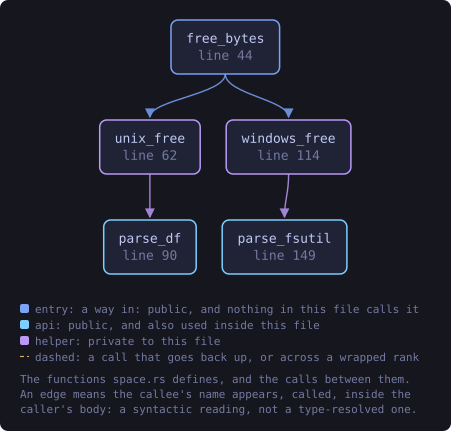
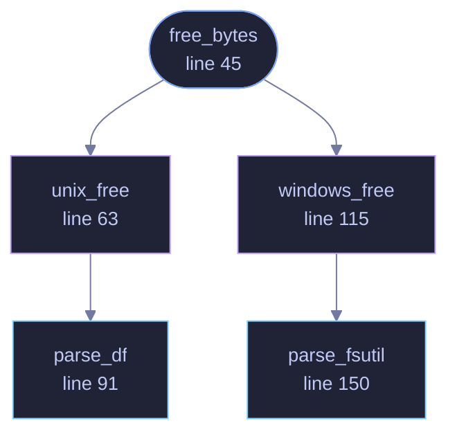

<!-- SPDX-License-Identifier: GPL-3.0-or-later -->
<!-- GENERATED by tools/docs/generate.py from the doc comments in the
     source. Do not edit this file: edit the `//!` and `///` comments in
     the .rs files and run the generator again. CI verifies it with
         python tools/docs/generate.py --check
-->

  

# `crates/veilvoice-setup/src/space.rs`

[`veilvoice-setup`](../../../crates/veilvoice-setup/README.md) &middot; 171 lines &middot; [read the source](https://github.com/tilas01/veilvoice/blob/main/crates/veilvoice-setup/src/space.rs)

## Contents

- [Why this is measured rather than assumed](#why-this-is-measured-rather-than-assumed)
- [No unsafe, and no new dependency](#no-unsafe-and-no-new-dependency)
- [In plain words](#in-plain-words)
  - [What this file contains](#what-this-file-contains)
  - [What calls what](#what-calls-what)
  - [Items](#items)

How much room is actually free where VeilVoice keeps things.

# Why this is measured rather than assumed

Decoy vaults are only worth making if there is somewhere to put them, and
how many to make is a question with a real answer on each machine. A number
picked here would be a guess dressed as advice: nine decoys is careless on a
nearly full laptop and timid on a four-terabyte disk.

So this asks the operating system, and where the operating system will not
say, it returns `None` and the interface says the count is a suggestion
rather than a measurement. **Not measuring and not saying so** is the answer
this module exists to avoid.

# No `unsafe`, and no new dependency

The free-space call is `statvfs` on Unix and `GetDiskFreeSpaceEx` on
Windows, and reaching either from Rust means an `unsafe` block or a crate.
This workspace forbids the first everywhere and weighs the second against a
dependency graph people are invited to read, and neither is worth paying for
one integer.

So it runs the tool the platform already ships. On Unix that is `df` with
`-Pk`, whose output format is specified by POSIX rather than left to the
implementation, which is the whole reason that flag is there: the columns
are fixed, the block size is 1024, and one line describes the filesystem
asked about.

# In plain words

Asks the system how much space is free where VeilVoice is putting files, so
it can suggest a sensible number of decoy vaults instead of inventing one.
If the system will not say, it says so rather than guessing.

## What this file contains

171 lines defining **5 functions** (3 public), **0 types** and **0 constants**. Everything below is read out of the source, so it cannot disagree with the code.

**What happens when it runs.** These are the ways in: public, and nothing else in this file calls them, so they are what an outside caller reaches first.

- `free_bytes` (line 45) -- Free space at path, in bytes, or None if the platform would not say.
  - reaches: `unix_free`, `windows_free`, `parse_df`, `parse_fsutil`

## What calls what

The functions this file defines, and the calls between them. Both
are read out of the source: an edge means the callee's name appears,
called, inside the caller's body. It is a syntactic reading, not a
type-resolved one, so a call made through a trait object or a macro
will not appear.

_Colour key: **entry** -- a way in: public, and nothing in this file calls it; **api** -- public, and also used inside this file; **helper** -- private to this file._

  

The same graph as Mermaid source

## Items

| Item | Line | Documentation |
|---|---:|---|
| `free_bytes` pub fn | [45](https://github.com/tilas01/veilvoice/blob/main/crates/veilvoice-setup/src/space.rs#L45) | Free space at path, in bytes, or None if the platform would not say. |
| `unix_free` fn | [63](https://github.com/tilas01/veilvoice/blob/main/crates/veilvoice-setup/src/space.rs#L63) | df -Pk, parsed from the format POSIX specifies. |
| `parse_df` pub fn | [91](https://github.com/tilas01/veilvoice/blob/main/crates/veilvoice-setup/src/space.rs#L91) | The available column of a df -Pk report. |
| `windows_free` fn | [115](https://github.com/tilas01/veilvoice/blob/main/crates/veilvoice-setup/src/space.rs#L115) | fsutil volume diskfree, which is on every Windows since Vista. |
| `parse_fsutil` pub fn | [150](https://github.com/tilas01/veilvoice/blob/main/crates/veilvoice-setup/src/space.rs#L150) | The free-bytes figure from fsutil volume diskfree. |

---

Generated from `crates/veilvoice-setup/src/space.rs`. On the website: [`website/reference/veilvoice-setup/space.html`](../../../website/reference/veilvoice-setup/space.html).

Signing key fingerprint `8101FB3BB28D02FB239E0CDF9CC1C7E7A9B5833A`.
