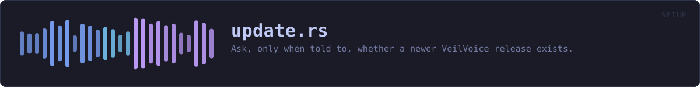
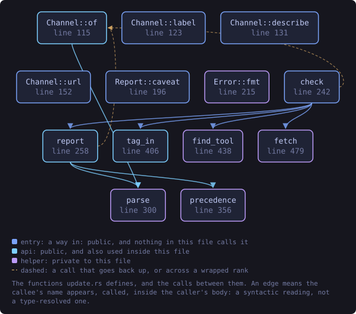
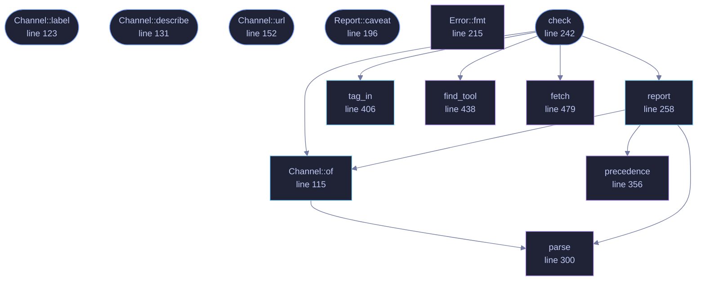

<!-- SPDX-License-Identifier: GPL-3.0-or-later -->
<!-- GENERATED by tools/docs/generate.py from the doc comments in the
     source. Do not edit this file: edit the `//!` and `///` comments in
     the .rs files and run the generator again. CI verifies it with
         python tools/docs/generate.py --check
-->

  

# `crates/veilvoice-setup/src/update.rs`

[`veilvoice-setup`](../../../crates/veilvoice-setup/README.md) &middot; 892 lines &middot; [read the source](https://github.com/tilas01/veilvoice/blob/main/crates/veilvoice-setup/src/update.rs)

## Contents

- [What this is, and the claim it changes](#what-this-is-and-the-claim-it-changes)
- [There is still no HTTP client in the dependency graph](#there-is-still-no-http-client-in-the-dependency-graph)
- [What it will not do](#what-it-will-not-do)
- [What a "newer version" is worth here](#what-a-newer-version-is-worth-here)
- [In plain words](#in-plain-words)
  - [What this file contains](#what-this-file-contains)
  - [What calls what](#what-calls-what)
  - [Items](#items)

Ask, **only when told to**, whether a newer VeilVoice release exists.

# What this is, and the claim it changes

Until this crate existed, VeilVoice's front page said *"no telemetry, no
update check"*. Half of that is unchanged and half of it is not, and the
wording moved in the same commit as the code rather than afterwards:

* **No telemetry.** Unchanged, and nothing here sends anything about you.
The request is a plain `GET` of a public URL that anybody can open in a
browser; it carries no identifier, no configuration and no counter.
* **No *automatic* update check.** Nothing runs on a timer, at startup, or
in the background. `check` runs because a person pressed a button in
this run of the program, and it does nothing else ever.

An update checker that runs by itself is a beacon: it tells a server that
this machine has VeilVoice on it, roughly how often it is used, and from
which address. That is the thing being refused. A button somebody presses,
once, when they want to know, is a different act with different consequences,
and it is the only one on offer.

# There is still no HTTP client in the dependency graph

This crate has **no dependencies**. It runs the transfer tool the operating
system already ships, exactly as `veilvoice-verify` has fetched releases
since it existed, and reads its output. `cargo tree` shows no `reqwest`, no
`hyper`, no `ureq`; the CI job that fails the build if one appears is
unchanged and still passes.

The tool is found at an **absolute path**, never by bare name. Resolving a
program by name on Windows searches the current directory before most of
`PATH`, so a file called `curl.exe` sitting beside the program would be run
instead of the system one. That is finding F-13, and it does not get to
happen twice.

# What it will not do

It does not download a release, it does not install anything, and it does
not restart the program. It reports a version string and leaves every
decision to the reader. Downloading a release and checking its signature is
`veilvoice-verify`'s job, and that is a separate, deliberate act too.

An update checker that could install its own answer is an update checker
that can be made to install somebody else's.

# What a "newer version" is worth here

The answer comes from a public web page over TLS. That is enough to say
*"there is probably something newer, go and look"* and it is **not** enough
to act on: a name in a document is not a signature. Nothing in this crate
verifies anything, and `Report::caveat` says so in the words the user
sees rather than only in this comment.

# In plain words

This is the "check for updates" button, and nothing else.

It runs when you press it and at no other time. There is no timer and nothing
in the background, because a program that checks by itself is telling somebody
else's computer that yours exists and how often you use it.

It reads a public page anybody can open, tells you the newest version number,
and stops there. It does not download anything and it does not install
anything.

## What this file contains

892 lines defining **13 functions** (8 public), **6 types** and **8 constants**. Everything below is read out of the source, so it cannot disagree with the code.

**The types it owns.**

- `enum Channel` (line 105) -- Which stream of releases a build came from.
- `enum Verdict` (line 162) -- How this build's version compares with the newest published one.
- `struct Report` (line 179) -- What a check found.
- `enum Error` (line 205) -- Why a check could not be completed.
- `struct Version` (line 282) -- A version, in the only shape this project publishes.
- `struct Tool` (line 432) -- Where a transfer tool was found, and how to drive it.

**What happens when it runs.** These are the ways in: public, and nothing else in this file calls them, so they are what an outside caller reaches first.

- `Channel::label` (line 123) -- The word for it, for a line somebody reads.
- `Channel::describe` (line 131) -- One sentence saying what this stream is, shown beside the label.
- `Channel::url` (line 152) -- The page an update check reads for this stream.
- `Report::caveat` (line 196) -- What this answer is worth, in the words the user should see.
- `check` (line 242) -- Ask whether anything newer than current has been published.
  - reaches: `fetch`, `find_tool`, `of`, `report`, `tag_in`, `parse`, `precedence`

## What calls what

The functions this file defines, and the calls between them. Both
are read out of the source: an edge means the callee's name appears,
called, inside the caller's body. It is a syntactic reading, not a
type-resolved one, so a call made through a trait object or a macro
will not appear.

_Colour key: **entry** -- a way in: public, and nothing in this file calls it; **api** -- public, and also used inside this file; **helper** -- private to this file._

  

The same graph as Mermaid source

## Items

| Item | Line | Documentation |
|---|---:|---|
| `REPO` pub const | [71](https://github.com/tilas01/veilvoice/blob/main/crates/veilvoice-setup/src/update.rs#L71) | The repository asked about. |
| `LATEST_URL` pub const | [78](https://github.com/tilas01/veilvoice/blob/main/crates/veilvoice-setup/src/update.rs#L78) | The page fetched. |
| `RELEASES_URL` pub const | [81](https://github.com/tilas01/veilvoice/blob/main/crates/veilvoice-setup/src/update.rs#L81) | Where releases are listed, for somebody doing this by hand. |
| `TIMEOUT` pub const | [88](https://github.com/tilas01/veilvoice/blob/main/crates/veilvoice-setup/src/update.rs#L88) | How long the transfer tool is given before it is given up on. |
| `Channel` pub enum | [105](https://github.com/tilas01/veilvoice/blob/main/crates/veilvoice-setup/src/update.rs#L105) | Which stream of releases a build came from. |
| `Channel::of` pub fn | [115](https://github.com/tilas01/veilvoice/blob/main/crates/veilvoice-setup/src/update.rs#L115) | Which stream this version belongs to. |
| `Channel::label` pub fn | [123](https://github.com/tilas01/veilvoice/blob/main/crates/veilvoice-setup/src/update.rs#L123) | The word for it, for a line somebody reads. |
| `Channel::describe` pub fn | [131](https://github.com/tilas01/veilvoice/blob/main/crates/veilvoice-setup/src/update.rs#L131) | One sentence saying what this stream is, shown beside the label. |
| `Channel::url` pub fn | [152](https://github.com/tilas01/veilvoice/blob/main/crates/veilvoice-setup/src/update.rs#L152) | The page an update check reads for this stream. |
| `Verdict` pub enum | [162](https://github.com/tilas01/veilvoice/blob/main/crates/veilvoice-setup/src/update.rs#L162) | How this build's version compares with the newest published one. |
| `Report` pub struct | [179](https://github.com/tilas01/veilvoice/blob/main/crates/veilvoice-setup/src/update.rs#L179) | What a check found. |
| `Report::caveat` pub fn | [196](https://github.com/tilas01/veilvoice/blob/main/crates/veilvoice-setup/src/update.rs#L196) | What this answer is worth, in the words the user should see. |
| `Error` pub enum | [205](https://github.com/tilas01/veilvoice/blob/main/crates/veilvoice-setup/src/update.rs#L205) | Why a check could not be completed. |
| `Error::fmt` fn | [215](https://github.com/tilas01/veilvoice/blob/main/crates/veilvoice-setup/src/update.rs#L215) |  |
| `VERSION` pub const | [236](https://github.com/tilas01/veilvoice/blob/main/crates/veilvoice-setup/src/update.rs#L236) | The version this build was compiled as. |
| `check` pub fn | [242](https://github.com/tilas01/veilvoice/blob/main/crates/veilvoice-setup/src/update.rs#L242) | Ask whether anything newer than current has been published. |
| `report` pub fn | [258](https://github.com/tilas01/veilvoice/blob/main/crates/veilvoice-setup/src/update.rs#L258) | Compare two version strings and build the report. |
| `Version` struct | [282](https://github.com/tilas01/veilvoice/blob/main/crates/veilvoice-setup/src/update.rs#L282) | A version, in the only shape this project publishes. |
| `parse` fn | [300](https://github.com/tilas01/veilvoice/blob/main/crates/veilvoice-setup/src/update.rs#L300) | 1.2.3, v1.2.3 or v1.2.3-beta.1. |
| `precedence` fn | [356](https://github.com/tilas01/veilvoice/blob/main/crates/veilvoice-setup/src/update.rs#L356) | Semantic versioning's precedence, section 11, implemented rather than approximated. |
| `tag_in` pub fn | [406](https://github.com/tilas01/veilvoice/blob/main/crates/veilvoice-setup/src/update.rs#L406) | The tag in whatever the transfer tool printed. |
| `NULL_DEVICE` const | [426](https://github.com/tilas01/veilvoice/blob/main/crates/veilvoice-setup/src/update.rs#L426) | This platform's bit bucket, for a reply whose body is not wanted. |
| `NULL_DEVICE` const | [429](https://github.com/tilas01/veilvoice/blob/main/crates/veilvoice-setup/src/update.rs#L429) | This platform's bit bucket, for a reply whose body is not wanted. |
| `Tool` struct | [432](https://github.com/tilas01/veilvoice/blob/main/crates/veilvoice-setup/src/update.rs#L432) | Where a transfer tool was found, and how to drive it. |
| `find_tool` fn | [438](https://github.com/tilas01/veilvoice/blob/main/crates/veilvoice-setup/src/update.rs#L438) | Absolute paths only. |
| `fetch` fn | [479](https://github.com/tilas01/veilvoice/blob/main/crates/veilvoice-setup/src/update.rs#L479) | Run the tool and hand back what it printed. |
| `SCOPE` pub const | [557](https://github.com/tilas01/veilvoice/blob/main/crates/veilvoice-setup/src/update.rs#L557) | What this crate does and does not do, in one paragraph, for a front end to show beside the button. |

---

Generated from `crates/veilvoice-setup/src/update.rs`. On the website: [`website/reference/veilvoice-setup/update.html`](../../../website/reference/veilvoice-setup/update.html).

Signing key fingerprint `8101FB3BB28D02FB239E0CDF9CC1C7E7A9B5833A`.
