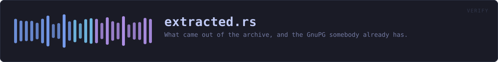
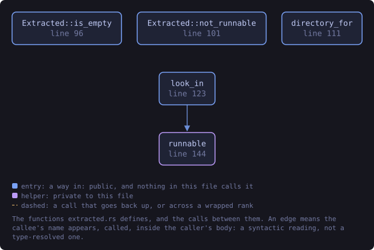
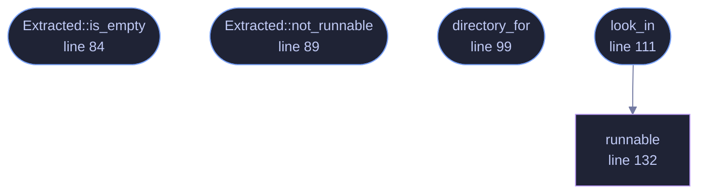

<!-- SPDX-License-Identifier: GPL-3.0-or-later -->
<!-- GENERATED by tools/docs/generate.py from the doc comments in the
     source. Do not edit this file: edit the `//!` and `///` comments in
     the .rs files and run the generator again. CI verifies it with
         python tools/docs/generate.py --check
-->

  

# `crates/veilvoice-verify/src/extracted.rs`

[`veilvoice-verify`](../../../crates/veilvoice-verify/README.md) &middot; 303 lines &middot; [read the source](https://github.com/tilas01/veilvoice/blob/main/crates/veilvoice-verify/src/extracted.rs)

## Contents

- [The honest limit on checking an extracted copy](#the-honest-limit-on-checking-an-extracted-copy)
- [GnuPG](#gnupg)
- [In plain words](#in-plain-words)
  - [What this file contains](#what-this-file-contains)
  - [What calls what](#what-calls-what)
  - [Items](#items)

What came out of the archive, and the GnuPG somebody already has.

**Marker 91.** Two halves of the same request: check the extracted copy as
well as the archive, and offer the check through GnuPG for anybody who would
rather trust their own tools than this binary.

# The honest limit on checking an extracted copy

This is the part worth reading before the code. A release signs
`SHA256SUMS`, and `SHA256SUMS` covers the **archives**. It says nothing
about a directory somebody unzipped last week.

So verifying `veilvoice-0.1.14-linux-x86_64.zip` proves that archive is the
one that was signed. It does **not** prove that the folder sitting beside it
came out of that archive. The folder may predate the download, may have been
extracted from a different copy, may have been edited since. Nothing on disk
records which archive an extracted directory came from, and no amount of
hashing the loose files can invent that link, because there is no signed
list of what those files should be.

A verifier that reported "archive good, extracted files present" as one
green result would be telling somebody their installed copy is verified when
it is not. So this reports the two separately, in those words, and says the
one thing that does resolve it: extract the archive that was just checked,
now, and use that.

What it can honestly say about the extracted copy is whether the programs
are there and whether the operating system will run them, which is the other
half of what was asked and is a real thing to get wrong: an archive
extracted by a tool that drops the executable bit leaves somebody with files
that look right and will not start.

# GnuPG

VeilVoice checks the signature itself, with the key compiled into this
binary, so that somebody with no GnuPG installed is not stuck. That is a
convenience and it has an obvious circularity: the program telling you the
download is genuine is a program from the same download.

`gnupg_commands` is the answer to that. It prints the exact commands to
run with a GnuPG this project did not write, against a key fingerprint
published somewhere this project does not control. Anybody who wants the
independent check has it, spelled out, with nothing to work out.

# In plain words

Checks the folder you unzipped, as well as the zip.

It will tell you the programs are there and that your system will run them.
It will not tell you the folder came out of the zip it just checked, because
nothing on your disk records that. If you want to be certain, unzip the
checked file again and use what comes out.

## What this file contains

303 lines defining **5 functions** (4 public), **2 types** and **1 constant**. Everything below is read out of the source, so it cannot disagree with the code.

**The types it owns.**

- `struct Program` (line 62) -- One program found in an extracted directory.
- `struct Extracted` (line 75) -- What an extracted directory turned out to hold.

**What happens when it runs.** These are the ways in: public, and nothing else in this file calls them, so they are what an outside caller reaches first.

- `Extracted::is_empty` (line 84) -- Whether anything was found at all.
- `Extracted::not_runnable` (line 89) -- The programs the operating system will not run.
- `directory_for` (line 99) -- The directory an archive would extract into, by this project's naming.
- `look_in` (line 111) -- Look in directory for the programs a release carries.
  - reaches: `runnable`

## What calls what

The functions this file defines, and the calls between them. Both
are read out of the source: an edge means the callee's name appears,
called, inside the caller's body. It is a syntactic reading, not a
type-resolved one, so a call made through a trait object or a macro
will not appear.

_Colour key: **entry** -- a way in: public, and nothing in this file calls it; **helper** -- private to this file._

  

The same graph as Mermaid source

## Items

| Item | Line | Documentation |
|---|---:|---|
| `PROGRAMS` pub const | [58](https://github.com/tilas01/veilvoice/blob/main/crates/veilvoice-verify/src/extracted.rs#L58) | The programs a release archive carries. |
| `Program` pub struct | [62](https://github.com/tilas01/veilvoice/blob/main/crates/veilvoice-verify/src/extracted.rs#L62) | One program found in an extracted directory. |
| `Extracted` pub struct | [75](https://github.com/tilas01/veilvoice/blob/main/crates/veilvoice-verify/src/extracted.rs#L75) | What an extracted directory turned out to hold. |
| `Extracted::is_empty` pub fn | [84](https://github.com/tilas01/veilvoice/blob/main/crates/veilvoice-verify/src/extracted.rs#L84) | Whether anything was found at all. |
| `Extracted::not_runnable` pub fn | [89](https://github.com/tilas01/veilvoice/blob/main/crates/veilvoice-verify/src/extracted.rs#L89) | The programs the operating system will not run. |
| `directory_for` pub fn | [99](https://github.com/tilas01/veilvoice/blob/main/crates/veilvoice-verify/src/extracted.rs#L99) | The directory an archive would extract into, by this project's naming. |
| `look_in` pub fn | [111](https://github.com/tilas01/veilvoice/blob/main/crates/veilvoice-verify/src/extracted.rs#L111) | Look in directory for the programs a release carries. |
| `runnable` fn | [132](https://github.com/tilas01/veilvoice/blob/main/crates/veilvoice-verify/src/extracted.rs#L132) | Whether the operating system will run this file. |

---

Generated from `crates/veilvoice-verify/src/extracted.rs`. On the website: [`website/reference/veilvoice-verify/extracted.html`](../../../website/reference/veilvoice-verify/extracted.html).

Signing key fingerprint `8101FB3BB28D02FB239E0CDF9CC1C7E7A9B5833A`.
