<!-- SPDX-License-Identifier: GPL-3.0-or-later -->
<!-- GENERATED by tools/docs/generate.py from the doc comments in the
     source. Do not edit this file: edit the `//!` and `///` comments in
     the .rs files and run the generator again. CI verifies it with
         python tools/docs/generate.py --check
-->

  

# `crates/veilvoice-verify/src/main.rs`

[`veilvoice-verify`](../../../crates/veilvoice-verify/README.md) &middot; 746 lines &middot; [read the source](https://github.com/tilas01/veilvoice/blob/main/crates/veilvoice-verify/src/main.rs)

## Contents

- [What this is for](#what-this-is-for)
- [The one thing it cannot embed](#the-one-thing-it-cannot-embed)
- [What it does not do](#what-it-does-not-do)
  - [What this file contains](#what-this-file-contains)
  - [What calls what](#what-calls-what)
  - [Items](#items)

The portable verifier: check a VeilVoice release without GnuPG installed.

# What this is for

Verifying a download by hand needs GnuPG and a SHA-256 tool. That is four
commands and two dependencies, and on Windows it is usually neither. This
is one binary that does the same checks with nothing else installed: the
signing key and its fingerprint are compiled into it.

# The one thing it cannot embed

It cannot carry the expected hash of the file it is checking. A file cannot
contain its own digest -- writing the digest in changes the file, which
changes the digest. So the hash has to come from outside, and there are
exactly two places it can come from. They prove **different things**, and
this tool is careful never to blur them:

**From the published `SHA256SUMS`** -- whose signature this tool checks
against the embedded key. A match proves the download is *intact*: it is
byte-for-byte the file that was published, not a corrupted or substituted
one. It says nothing about whether that file corresponds to the source,
because whoever published it produced both the file and the list.

**Typed in by hand, from a hash somebody else produced** by building the
same tagged source themselves. A match proves something strictly stronger:
that the published binary is what that source compiles to, on a machine
that is not the publisher's. That is *reproducibility*, and it is the only
check that does not ultimately rest on trusting whoever signed the release.

Most people want the first. The second is what makes the first worth
anything, and it needs somebody other than the author to have done a build.
`docs/REPRODUCIBLE_BUILDS.md` says how.

# What it does not do

It does not download anything -- this project has no network code and this
binary is not the exception. Fetch the files however you like; this reads
them from disk. It does not install anything, and it writes nothing.

## What this file contains

746 lines defining **18 functions** (0 public), **0 types** and **4 constants**. Everything below is read out of the source, so it cannot disagree with the code.

## What calls what

The functions this file defines, and the calls between them. Both
are read out of the source: an edge means the callee's name appears,
called, inside the caller's body. It is a syntactic reading, not a
type-resolved one, so a call made through a trait object or a macro
will not appear.

_Colour key: **helper** -- private to this file._

```mermaid
%%{init: {"theme":"base","themeVariables":{"background":"#1a1b26","primaryColor":"#1f2335","primaryTextColor":"#c0caf5","primaryBorderColor":"#7aa2f7","secondaryColor":"#16161e","tertiaryColor":"#16161e","lineColor":"#737aa2","textColor":"#c0caf5","mainBkg":"#1f2335","nodeBorder":"#7aa2f7","clusterBkg":"#16161e","clusterBorder":"#2f3549","fontFamily":"ui-monospace, SFMono-Regular, Consolas, monospace","fontSize":"14px"}}}%%
flowchart TD
    n_good["good<br/>line 167"]
    n_fail["fail<br/>line 178"]
    n_deny["deny<br/>line 192"]
    n_embedded_key["embedded_key<br/>line 212"]
    n_fingerprint_of["fingerprint_of<br/>line 225"]
    n_sha256_file["sha256_file<br/>line 242"]
    n_digests_match["digests_match<br/>line 271"]
    n_digest_from_sums["digest_from_sums<br/>line 281"]
    n_verify_detached["verify_detached<br/>line 304"]
    n_read_text["read_text<br/>line 326"]
    n_command_key["command_key<br/>line 330"]
    n_command_sums["command_sums<br/>line 349"]
    n_command_file_against_sums["command_file_against_sums<br/>line 387"]
    n_command_file_against_hash["command_file_against_hash<br/>line 471"]
    n_command_hash["command_hash<br/>line 523"]
    n_take_value["take_value<br/>line 540"]
    n_command_release["command_release<br/>line 556"]
    n_main["main<br/>line 627"]
    n_command_file_against_hash --> n_deny
    n_command_file_against_hash --> n_digests_match
    n_command_file_against_hash --> n_good
    n_command_file_against_hash --> n_sha256_file
    n_command_file_against_sums --> n_deny
    n_command_file_against_sums --> n_digest_from_sums
    n_command_file_against_sums --> n_digests_match
    n_command_file_against_sums --> n_embedded_key
    n_command_file_against_sums --> n_good
    n_command_file_against_sums --> n_read_text
    n_command_file_against_sums --> n_sha256_file
    n_command_file_against_sums --> n_verify_detached
    n_command_hash --> n_deny
    n_command_hash --> n_sha256_file
    n_command_key --> n_deny
    n_command_key --> n_embedded_key
    n_command_key --> n_fingerprint_of
    n_command_release --> n_command_file_against_sums
    n_command_release --> n_command_sums
    n_command_release --> n_deny
    n_command_release --> n_fail
    n_command_sums --> n_deny
    n_command_sums --> n_embedded_key
    n_command_sums --> n_good
    n_command_sums --> n_read_text
    n_command_sums --> n_verify_detached
    n_embedded_key --> n_fingerprint_of
    n_main --> n_command_file_against_hash
    n_main --> n_command_file_against_sums
    n_main --> n_command_hash
    n_main --> n_command_key
    n_main --> n_command_release
    n_main --> n_command_sums
    n_main --> n_deny
    n_main --> n_take_value
    click n_good href "https://github.com/tilas01/veilvoice/blob/main/crates/veilvoice-verify/src/main.rs#L167" "open the source"
    click n_fail href "https://github.com/tilas01/veilvoice/blob/main/crates/veilvoice-verify/src/main.rs#L178" "open the source"
    click n_deny href "https://github.com/tilas01/veilvoice/blob/main/crates/veilvoice-verify/src/main.rs#L192" "open the source"
    click n_embedded_key href "https://github.com/tilas01/veilvoice/blob/main/crates/veilvoice-verify/src/main.rs#L212" "open the source"
    click n_fingerprint_of href "https://github.com/tilas01/veilvoice/blob/main/crates/veilvoice-verify/src/main.rs#L225" "open the source"
    click n_sha256_file href "https://github.com/tilas01/veilvoice/blob/main/crates/veilvoice-verify/src/main.rs#L242" "open the source"
    click n_digests_match href "https://github.com/tilas01/veilvoice/blob/main/crates/veilvoice-verify/src/main.rs#L271" "open the source"
    click n_digest_from_sums href "https://github.com/tilas01/veilvoice/blob/main/crates/veilvoice-verify/src/main.rs#L281" "open the source"
    click n_verify_detached href "https://github.com/tilas01/veilvoice/blob/main/crates/veilvoice-verify/src/main.rs#L304" "open the source"
    click n_read_text href "https://github.com/tilas01/veilvoice/blob/main/crates/veilvoice-verify/src/main.rs#L326" "open the source"
    click n_command_key href "https://github.com/tilas01/veilvoice/blob/main/crates/veilvoice-verify/src/main.rs#L330" "open the source"
    click n_command_sums href "https://github.com/tilas01/veilvoice/blob/main/crates/veilvoice-verify/src/main.rs#L349" "open the source"
    click n_command_file_against_sums href "https://github.com/tilas01/veilvoice/blob/main/crates/veilvoice-verify/src/main.rs#L387" "open the source"
    click n_command_file_against_hash href "https://github.com/tilas01/veilvoice/blob/main/crates/veilvoice-verify/src/main.rs#L471" "open the source"
    click n_command_hash href "https://github.com/tilas01/veilvoice/blob/main/crates/veilvoice-verify/src/main.rs#L523" "open the source"
    click n_take_value href "https://github.com/tilas01/veilvoice/blob/main/crates/veilvoice-verify/src/main.rs#L540" "open the source"
    click n_command_release href "https://github.com/tilas01/veilvoice/blob/main/crates/veilvoice-verify/src/main.rs#L556" "open the source"
    click n_main href "https://github.com/tilas01/veilvoice/blob/main/crates/veilvoice-verify/src/main.rs#L627" "open the source"
    classDef helper fill:#1f2335,stroke:#bb9af7,color:#c0caf5
    class n_good,n_fail,n_deny,n_embedded_key,n_fingerprint_of,n_sha256_file,n_digests_match,n_digest_from_sums,n_verify_detached,n_read_text,n_command_key,n_command_sums,n_command_file_against_sums,n_command_file_against_hash,n_command_hash,n_take_value,n_command_release,n_main helper
```

## Items

| Item | Line | Documentation |
|---|---:|---|
| `PUBLIC_KEY` const | [59](https://github.com/tilas01/veilvoice/blob/main/crates/veilvoice-verify/src/main.rs#L59) | The signing key, compiled in. |
| `FINGERPRINT` const | [71](https://github.com/tilas01/veilvoice/blob/main/crates/veilvoice-verify/src/main.rs#L71) | The fingerprint, written out rather than derived. |
| `USAGE` const | [73](https://github.com/tilas01/veilvoice/blob/main/crates/veilvoice-verify/src/main.rs#L73) |  |
| `EXPLAIN` const | [120](https://github.com/tilas01/veilvoice/blob/main/crates/veilvoice-verify/src/main.rs#L120) |  |
| `good` fn | [167](https://github.com/tilas01/veilvoice/blob/main/crates/veilvoice-verify/src/main.rs#L167) |  |
| `fail` fn | [178](https://github.com/tilas01/veilvoice/blob/main/crates/veilvoice-verify/src/main.rs#L178) | A failure that is not a refusal: something did not happen, rather than something was checked and found wrong. |
| `deny` fn | [192](https://github.com/tilas01/veilvoice/blob/main/crates/veilvoice-verify/src/main.rs#L192) | Every refusal goes through here, so every refusal names the check. |
| `embedded_key` fn | [212](https://github.com/tilas01/veilvoice/blob/main/crates/veilvoice-verify/src/main.rs#L212) | Parse the embedded key and confirm its fingerprint is the expected one. |
| `fingerprint_of` fn | [225](https://github.com/tilas01/veilvoice/blob/main/crates/veilvoice-verify/src/main.rs#L225) |  |
| `sha256_file` fn | [242](https://github.com/tilas01/veilvoice/blob/main/crates/veilvoice-verify/src/main.rs#L242) | SHA-256 of a file, read in chunks. |
| `digests_match` fn | [271](https://github.com/tilas01/veilvoice/blob/main/crates/veilvoice-verify/src/main.rs#L271) | Compare two hex digests without caring about case or stray whitespace. |
| `digest_from_sums` fn | [281](https://github.com/tilas01/veilvoice/blob/main/crates/veilvoice-verify/src/main.rs#L281) | Find a file's line in a sha256sum-format list. |
| `verify_detached` fn | [304](https://github.com/tilas01/veilvoice/blob/main/crates/veilvoice-verify/src/main.rs#L304) | Verify a detached signature over data using the embedded key. |
| `read_text` fn | [326](https://github.com/tilas01/veilvoice/blob/main/crates/veilvoice-verify/src/main.rs#L326) |  |
| `command_key` fn | [330](https://github.com/tilas01/veilvoice/blob/main/crates/veilvoice-verify/src/main.rs#L330) |  |
| `command_sums` fn | [349](https://github.com/tilas01/veilvoice/blob/main/crates/veilvoice-verify/src/main.rs#L349) |  |
| `command_file_against_sums` fn | [387](https://github.com/tilas01/veilvoice/blob/main/crates/veilvoice-verify/src/main.rs#L387) |  |
| `command_file_against_hash` fn | [471](https://github.com/tilas01/veilvoice/blob/main/crates/veilvoice-verify/src/main.rs#L471) |  |
| `command_hash` fn | [523](https://github.com/tilas01/veilvoice/blob/main/crates/veilvoice-verify/src/main.rs#L523) |  |
| `take_value` fn | [540](https://github.com/tilas01/veilvoice/blob/main/crates/veilvoice-verify/src/main.rs#L540) |  |
| `command_release` fn | [556](https://github.com/tilas01/veilvoice/blob/main/crates/veilvoice-verify/src/main.rs#L556) | Fetch a release and check it, in one step. |
| `main` fn | [627](https://github.com/tilas01/veilvoice/blob/main/crates/veilvoice-verify/src/main.rs#L627) |  |

---

Generated from `crates/veilvoice-verify/src/main.rs`. On the website: [`website/reference/veilvoice-verify/main.html`](../../../website/reference/veilvoice-verify/main.html).

Signing key fingerprint `8101FB3BB28D02FB239E0CDF9CC1C7E7A9B5833A`.
