<!-- SPDX-License-Identifier: GPL-3.0-or-later -->
<!-- GENERATED by tools/docs/generate.py from the doc comments in the
     source. Do not edit this file: edit the `//!` and `///` comments in
     the .rs files and run the generator again. CI verifies it with
         python tools/docs/generate.py --check
-->

  

# `crates/veilvoice-verify/src/main.rs`

[`veilvoice-verify`](../../../crates/veilvoice-verify/README.md) &middot; 906 lines &middot; [read the source](https://github.com/tilas01/veilvoice/blob/main/crates/veilvoice-verify/src/main.rs)

## Contents

- [What this is for](#what-this-is-for)
- [The one thing it cannot embed](#the-one-thing-it-cannot-embed)
- [What it does not do](#what-it-does-not-do)
- [In plain words](#in-plain-words)
  - [What this file contains](#what-this-file-contains)
  - [What calls what](#what-calls-what)
  - [Items](#items)

The portable verifier: check a VeilVoice release without GnuPG installed.

# What this is for

Verifying a download by hand needs GnuPG and a SHA-256 tool. That is four
commands and two dependencies, and on Windows it is usually neither. This
is one binary that does the same checks with nothing else installed: the
signing key and its fingerprint are compiled into it.

# The one thing it cannot embed

It cannot carry the expected hash of the file it is checking. A file cannot
contain its own digest -- writing the digest in changes the file, which
changes the digest. So the hash has to come from outside, and there are
exactly two places it can come from. They prove **different things**, and
this tool is careful never to blur them:

**From the published `SHA256SUMS`** -- whose signature this tool checks
against the embedded key. A match proves the download is *intact*: it is
byte-for-byte the file that was published, not a corrupted or substituted
one. It says nothing about whether that file corresponds to the source,
because whoever published it produced both the file and the list.

**Typed in by hand, from a hash somebody else produced** by building the
same tagged source themselves. A match proves something strictly stronger:
that the published binary is what that source compiles to, on a machine
that is not the publisher's. That is *reproducibility*, and it is the only
check that does not ultimately rest on trusting whoever signed the release.

Most people want the first. The second is what makes the first worth
anything, and it needs somebody other than the author to have done a build.
`docs/REPRODUCIBLE_BUILDS.md` says how.

# What it does not do

It does not download anything -- this project has no network code and this
binary is not the exception. Fetch the files however you like; this reads
them from disk. It does not install anything, and it writes nothing.

# In plain words

This is the small program you can check a download with before trusting
anything else here.

It is deliberately tiny and it is on its own: no window, no other pieces, and
it does not need any other software installed -- not even the usual signature
program. That matters because it is the first thing you run, and the point of
it is to be small enough to be worth reading.

Double-click it and it looks for a downloaded release nearby and checks it.
Give it arguments and it does exactly what you asked.

## What this file contains

906 lines defining **20 functions** (0 public), **0 types** and **2 constants**. Everything below is read out of the source, so it cannot disagree with the code.

## What calls what

The functions this file defines, and the calls between them. Both
are read out of the source: an edge means the callee's name appears,
called, inside the caller's body. It is a syntactic reading, not a
type-resolved one, so a call made through a trait object or a macro
will not appear.

_Colour key: **helper** -- private to this file._

  

The same graph as Mermaid source

```mermaid
%%{init: {"theme":"base","themeVariables":{"background":"#1a1b26","primaryColor":"#1f2335","primaryTextColor":"#c0caf5","primaryBorderColor":"#7aa2f7","secondaryColor":"#16161e","tertiaryColor":"#16161e","lineColor":"#737aa2","textColor":"#c0caf5","mainBkg":"#1f2335","nodeBorder":"#7aa2f7","clusterBkg":"#16161e","clusterBorder":"#2f3549","fontFamily":"ui-monospace, SFMono-Regular, Consolas, monospace","fontSize":"14px"}}}%%
flowchart TD
    n_embedded_key["embedded_key<br/>line 134"]
    n_sha256_file["sha256_file<br/>line 145"]
    n_verify_detached["verify_detached<br/>line 150"]
    n_good["good<br/>line 256"]
    n_fail["fail<br/>line 267"]
    n_deny["deny<br/>line 283"]
    n_incomplete_deny["incomplete_deny<br/>line 300"]
    n_cannot["cannot<br/>line 318"]
    n_usage["usage<br/>line 338"]
    n_read_text["read_text<br/>line 359"]
    n_command_key["command_key<br/>line 363"]
    n_command_sums["command_sums<br/>line 382"]
    n_command_file_against_sums["command_file_against_sums<br/>line 420"]
    n_command_file_against_hash["command_file_against_hash<br/>line 504"]
    n_command_hash["command_hash<br/>line 556"]
    n_take_value["take_value<br/>line 573"]
    n_command_release["command_release<br/>line 589"]
    n_command_auto["command_auto<br/>line 670"]
    n_wait_before_the_window_closes["wait_before_the_window_closes<br/>line 752"]
    n_main["main<br/>line 759"]
    n_command_auto --> n_command_file_against_sums
    n_command_auto --> n_incomplete_deny
    n_command_file_against_hash --> n_cannot
    n_command_file_against_hash --> n_deny
    n_command_file_against_hash --> n_good
    n_command_file_against_hash --> n_sha256_file
    n_command_file_against_hash --> n_usage
    n_command_file_against_sums --> n_cannot
    n_command_file_against_sums --> n_deny
    n_command_file_against_sums --> n_embedded_key
    n_command_file_against_sums --> n_good
    n_command_file_against_sums --> n_read_text
    n_command_file_against_sums --> n_sha256_file
    n_command_file_against_sums --> n_verify_detached
    n_command_hash --> n_cannot
    n_command_hash --> n_sha256_file
    n_command_key --> n_deny
    n_command_key --> n_embedded_key
    n_command_release --> n_command_file_against_sums
    n_command_release --> n_command_sums
    n_command_release --> n_fail
    n_command_release --> n_usage
    n_command_sums --> n_cannot
    n_command_sums --> n_deny
    n_command_sums --> n_embedded_key
    n_command_sums --> n_good
    n_command_sums --> n_read_text
    n_command_sums --> n_verify_detached
    n_main --> n_command_auto
    n_main --> n_command_file_against_hash
    n_main --> n_command_file_against_sums
    n_main --> n_command_hash
    n_main --> n_command_key
    n_main --> n_command_release
    n_main --> n_command_sums
    n_main --> n_take_value
    n_main --> n_usage
    n_main --> n_wait_before_the_window_closes
    click n_embedded_key href "https://github.com/tilas01/veilvoice/blob/main/crates/veilvoice-verify/src/main.rs#L134" "open the source"
    click n_sha256_file href "https://github.com/tilas01/veilvoice/blob/main/crates/veilvoice-verify/src/main.rs#L145" "open the source"
    click n_verify_detached href "https://github.com/tilas01/veilvoice/blob/main/crates/veilvoice-verify/src/main.rs#L150" "open the source"
    click n_good href "https://github.com/tilas01/veilvoice/blob/main/crates/veilvoice-verify/src/main.rs#L256" "open the source"
    click n_fail href "https://github.com/tilas01/veilvoice/blob/main/crates/veilvoice-verify/src/main.rs#L267" "open the source"
    click n_deny href "https://github.com/tilas01/veilvoice/blob/main/crates/veilvoice-verify/src/main.rs#L283" "open the source"
    click n_incomplete_deny href "https://github.com/tilas01/veilvoice/blob/main/crates/veilvoice-verify/src/main.rs#L300" "open the source"
    click n_cannot href "https://github.com/tilas01/veilvoice/blob/main/crates/veilvoice-verify/src/main.rs#L318" "open the source"
    click n_usage href "https://github.com/tilas01/veilvoice/blob/main/crates/veilvoice-verify/src/main.rs#L338" "open the source"
    click n_read_text href "https://github.com/tilas01/veilvoice/blob/main/crates/veilvoice-verify/src/main.rs#L359" "open the source"
    click n_command_key href "https://github.com/tilas01/veilvoice/blob/main/crates/veilvoice-verify/src/main.rs#L363" "open the source"
    click n_command_sums href "https://github.com/tilas01/veilvoice/blob/main/crates/veilvoice-verify/src/main.rs#L382" "open the source"
    click n_command_file_against_sums href "https://github.com/tilas01/veilvoice/blob/main/crates/veilvoice-verify/src/main.rs#L420" "open the source"
    click n_command_file_against_hash href "https://github.com/tilas01/veilvoice/blob/main/crates/veilvoice-verify/src/main.rs#L504" "open the source"
    click n_command_hash href "https://github.com/tilas01/veilvoice/blob/main/crates/veilvoice-verify/src/main.rs#L556" "open the source"
    click n_take_value href "https://github.com/tilas01/veilvoice/blob/main/crates/veilvoice-verify/src/main.rs#L573" "open the source"
    click n_command_release href "https://github.com/tilas01/veilvoice/blob/main/crates/veilvoice-verify/src/main.rs#L589" "open the source"
    click n_command_auto href "https://github.com/tilas01/veilvoice/blob/main/crates/veilvoice-verify/src/main.rs#L670" "open the source"
    click n_wait_before_the_window_closes href "https://github.com/tilas01/veilvoice/blob/main/crates/veilvoice-verify/src/main.rs#L752" "open the source"
    click n_main href "https://github.com/tilas01/veilvoice/blob/main/crates/veilvoice-verify/src/main.rs#L759" "open the source"
    classDef helper fill:#1f2335,stroke:#bb9af7,color:#c0caf5
    class n_embedded_key,n_sha256_file,n_verify_detached,n_good,n_fail,n_deny,n_incomplete_deny,n_cannot,n_usage,n_read_text,n_command_key,n_command_sums,n_command_file_against_sums,n_command_file_against_hash,n_command_hash,n_take_value,n_command_release,n_command_auto,n_wait_before_the_window_closes,n_main helper
```

## Items

| Item | Line | Documentation |
|---|---:|---|
| `embedded_key` fn | [134](https://github.com/tilas01/veilvoice/blob/main/crates/veilvoice-verify/src/main.rs#L134) | The embedded key, with its fingerprint checked against FINGERPRINT. |
| `sha256_file` fn | [145](https://github.com/tilas01/veilvoice/blob/main/crates/veilvoice-verify/src/main.rs#L145) | SHA-256 of a file, as this program's Result<_, String>. |
| `verify_detached` fn | [150](https://github.com/tilas01/veilvoice/blob/main/crates/veilvoice-verify/src/main.rs#L150) | Verify a detached signature, as this program's Result<_, String>. |
| `USAGE` const | [154](https://github.com/tilas01/veilvoice/blob/main/crates/veilvoice-verify/src/main.rs#L154) |  |
| `EXPLAIN` const | [209](https://github.com/tilas01/veilvoice/blob/main/crates/veilvoice-verify/src/main.rs#L209) |  |
| `good` fn | [256](https://github.com/tilas01/veilvoice/blob/main/crates/veilvoice-verify/src/main.rs#L256) |  |
| `fail` fn | [267](https://github.com/tilas01/veilvoice/blob/main/crates/veilvoice-verify/src/main.rs#L267) | A failure that is not a refusal: something did not happen, rather than something was checked and found wrong. |
| `deny` fn | [283](https://github.com/tilas01/veilvoice/blob/main/crates/veilvoice-verify/src/main.rs#L283) | Every refusal goes through here, so every refusal names the check. |
| `incomplete_deny` fn | [300](https://github.com/tilas01/veilvoice/blob/main/crates/veilvoice-verify/src/main.rs#L300) | Nothing could be checked, with the same shape of detail as a refusal. |
| `cannot` fn | [318](https://github.com/tilas01/veilvoice/blob/main/crates/veilvoice-verify/src/main.rs#L318) | A file this program was told to read could not be read. |
| `usage` fn | [338](https://github.com/tilas01/veilvoice/blob/main/crates/veilvoice-verify/src/main.rs#L338) | The command line could not be understood, so nothing was attempted. |
| `read_text` fn | [359](https://github.com/tilas01/veilvoice/blob/main/crates/veilvoice-verify/src/main.rs#L359) |  |
| `command_key` fn | [363](https://github.com/tilas01/veilvoice/blob/main/crates/veilvoice-verify/src/main.rs#L363) |  |
| `command_sums` fn | [382](https://github.com/tilas01/veilvoice/blob/main/crates/veilvoice-verify/src/main.rs#L382) |  |
| `command_file_against_sums` fn | [420](https://github.com/tilas01/veilvoice/blob/main/crates/veilvoice-verify/src/main.rs#L420) |  |
| `command_file_against_hash` fn | [504](https://github.com/tilas01/veilvoice/blob/main/crates/veilvoice-verify/src/main.rs#L504) |  |
| `command_hash` fn | [556](https://github.com/tilas01/veilvoice/blob/main/crates/veilvoice-verify/src/main.rs#L556) |  |
| `take_value` fn | [573](https://github.com/tilas01/veilvoice/blob/main/crates/veilvoice-verify/src/main.rs#L573) |  |
| `command_release` fn | [589](https://github.com/tilas01/veilvoice/blob/main/crates/veilvoice-verify/src/main.rs#L589) | Fetch a release and check it, in one step. |
| `command_auto` fn | [670](https://github.com/tilas01/veilvoice/blob/main/crates/veilvoice-verify/src/main.rs#L670) | Find a release near the user and check it, with nothing else to type. |
| `wait_before_the_window_closes` fn | [752](https://github.com/tilas01/veilvoice/blob/main/crates/veilvoice-verify/src/main.rs#L752) | Keep the window open when there was nobody watching a terminal. |
| `main` fn | [759](https://github.com/tilas01/veilvoice/blob/main/crates/veilvoice-verify/src/main.rs#L759) |  |

---

Generated from `crates/veilvoice-verify/src/main.rs`. On the website: [`website/reference/veilvoice-verify/main.html`](../../../website/reference/veilvoice-verify/main.html).

Signing key fingerprint `8101FB3BB28D02FB239E0CDF9CC1C7E7A9B5833A`.
