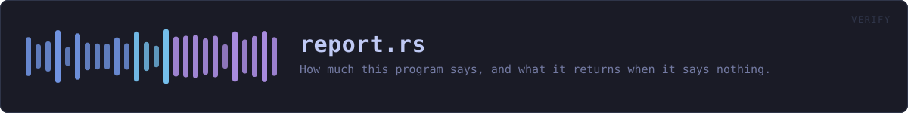
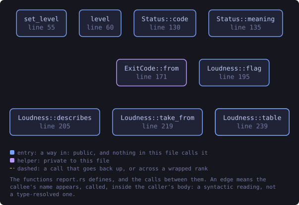

<!-- SPDX-License-Identifier: GPL-3.0-or-later -->
<!-- GENERATED by tools/docs/generate.py from the doc comments in the
     source. Do not edit this file: edit the `//!` and `///` comments in
     the .rs files and run the generator again. CI verifies it with
         python tools/docs/generate.py --check
-->

  

# `crates/veilvoice-verify/src/report.rs`

[`veilvoice-verify`](../../../crates/veilvoice-verify/README.md) &middot; 385 lines &middot; [read the source](https://github.com/tilas01/veilvoice/blob/main/crates/veilvoice-verify/src/report.rs)

## Contents

- [The exit status comes first, and that is not an accident](#the-exit-status-comes-first-and-that-is-not-an-accident)
- [Failing, refusing, and the difference](#failing-refusing-and-the-difference)
- [In plain words](#in-plain-words)
  - [What this file contains](#what-this-file-contains)
  - [What calls what](#what-calls-what)
  - [Items](#items)

How much this program says, and what it returns when it says nothing.

# The exit status comes first, and that is not an accident

This module exists because of one requirement: **there is a verbosity level
called "nothing"**. A tool that prints nothing and returns zero when a
signature did not verify is worse than a noisy one -- it is a tool that
reports success by staying quiet, which is the shape every failure takes
when nobody is watching.

So the statuses are defined and documented first, and `--quiet` is only
usable *because* they are. `Status` gives every outcome its own number,
they are stable, and `--help` prints the table.

# Failing, refusing, and the difference

Two outcomes are both "not success" and must never be confused:

* `Status::Refused` -- a check ran and the answer was wrong. The signature
did not verify, or a hash did not match. Somebody may have tampered with
a release.
* `Status::Incomplete` -- a check did not run. A download failed, a file
was missing, a tool was not installed. **Nothing has been proven either
way**, which is not the same as nothing being wrong.

The existing reporting already keeps these apart in the words it prints.
This gives them separate numbers so a script can tell them apart too, since
a script is exactly the reader who gets no words.

# In plain words

This decides how much the program prints -- from every detail down to
absolutely nothing -- and makes sure that when it prints nothing it still
*tells* you the answer, through the number every program hands back when it
finishes. Something has to carry the answer. If it is not the text on the
screen, it has to be the number.

And it keeps two different bad outcomes apart: "I checked and it was wrong"
is not the same as "I could not check". The first means somebody may have
tampered with your download. The second usually means your internet hiccuped.

## What this file contains

385 lines defining **10 functions** (9 public), **2 types** and **2 constants**. Everything below is read out of the source, so it cannot disagree with the code.

**The types it owns.**

- `enum Status` (line 78) -- What happened, as a number a script can read.
- `enum Loudness` (line 180) -- How much to print.

**What happens when it runs.** These are the ways in: public, and nothing else in this file calls them, so they are what an outside caller reaches first.

- `set_level` (line 55) -- Set the level.
- `level` (line 60) -- The level in force.
- `Status::code` (line 130) -- The number this outcome exits with.
- `Status::meaning` (line 135) -- One line, for the table in --help.
- `Status::table` (line 161) -- The table, as --help prints it.
- `Loudness::flag` (line 195) -- The flag that selects this level.
- `Loudness::describes` (line 205) -- What this level shows.
- `Loudness::take_from` (line 219) -- Read the level out of the arguments, removing the flags that set it.
- `Loudness::table` (line 239) -- The table, as --help prints it.

## What calls what

The functions this file defines, and the calls between them. Both
are read out of the source: an edge means the callee's name appears,
called, inside the caller's body. It is a syntactic reading, not a
type-resolved one, so a call made through a trait object or a macro
will not appear.

_Colour key: **entry** -- a way in: public, and nothing in this file calls it; **helper** -- private to this file._

  

The same graph as Mermaid source

```mermaid
%%{init: {"theme":"base","themeVariables":{"background":"#1a1b26","primaryColor":"#1f2335","primaryTextColor":"#c0caf5","primaryBorderColor":"#7aa2f7","secondaryColor":"#16161e","tertiaryColor":"#16161e","lineColor":"#737aa2","textColor":"#c0caf5","mainBkg":"#1f2335","nodeBorder":"#7aa2f7","clusterBkg":"#16161e","clusterBorder":"#2f3549","fontFamily":"ui-monospace, SFMono-Regular, Consolas, monospace","fontSize":"14px"}}}%%
flowchart TD
    n_set_level(["set_level<br/>line 55"])
    n_level(["level<br/>line 60"])
    n_code(["Status::code<br/>line 130"])
    n_meaning(["Status::meaning<br/>line 135"])
    n_table(["Status::table<br/>line 161"])
    n_from["ExitCode::from<br/>line 171"]
    n_flag(["Loudness::flag<br/>line 195"])
    n_describes(["Loudness::describes<br/>line 205"])
    n_take_from(["Loudness::take_from<br/>line 219"])
    n_table(["Loudness::table<br/>line 239"])
    click n_set_level href "https://github.com/tilas01/veilvoice/blob/main/crates/veilvoice-verify/src/report.rs#L55" "open the source"
    click n_level href "https://github.com/tilas01/veilvoice/blob/main/crates/veilvoice-verify/src/report.rs#L60" "open the source"
    click n_code href "https://github.com/tilas01/veilvoice/blob/main/crates/veilvoice-verify/src/report.rs#L130" "open the source"
    click n_meaning href "https://github.com/tilas01/veilvoice/blob/main/crates/veilvoice-verify/src/report.rs#L135" "open the source"
    click n_table href "https://github.com/tilas01/veilvoice/blob/main/crates/veilvoice-verify/src/report.rs#L161" "open the source"
    click n_from href "https://github.com/tilas01/veilvoice/blob/main/crates/veilvoice-verify/src/report.rs#L171" "open the source"
    click n_flag href "https://github.com/tilas01/veilvoice/blob/main/crates/veilvoice-verify/src/report.rs#L195" "open the source"
    click n_describes href "https://github.com/tilas01/veilvoice/blob/main/crates/veilvoice-verify/src/report.rs#L205" "open the source"
    click n_take_from href "https://github.com/tilas01/veilvoice/blob/main/crates/veilvoice-verify/src/report.rs#L219" "open the source"
    click n_table href "https://github.com/tilas01/veilvoice/blob/main/crates/veilvoice-verify/src/report.rs#L239" "open the source"
    classDef entry fill:#1f2335,stroke:#7aa2f7,color:#c0caf5
    class n_set_level,n_level,n_code,n_meaning,n_table,n_flag,n_describes,n_take_from,n_table entry
    classDef helper fill:#1f2335,stroke:#bb9af7,color:#c0caf5
    class n_from helper
```

## Items

| Item | Line | Documentation |
|---|---:|---|
| `LEVEL` static | [52](https://github.com/tilas01/veilvoice/blob/main/crates/veilvoice-verify/src/report.rs#L52) | The level in force, set once at startup and read everywhere. |
| `set_level` pub fn | [55](https://github.com/tilas01/veilvoice/blob/main/crates/veilvoice-verify/src/report.rs#L55) | Set the level. |
| `level` pub fn | [60](https://github.com/tilas01/veilvoice/blob/main/crates/veilvoice-verify/src/report.rs#L60) | The level in force. |
| `Status` pub enum | [78](https://github.com/tilas01/veilvoice/blob/main/crates/veilvoice-verify/src/report.rs#L78) | What happened, as a number a script can read. |
| `Status::code` pub fn | [130](https://github.com/tilas01/veilvoice/blob/main/crates/veilvoice-verify/src/report.rs#L130) | The number this outcome exits with. |
| `Status::meaning` pub fn | [135](https://github.com/tilas01/veilvoice/blob/main/crates/veilvoice-verify/src/report.rs#L135) | One line, for the table in --help. |
| `Status::ALL` pub const | [149](https://github.com/tilas01/veilvoice/blob/main/crates/veilvoice-verify/src/report.rs#L149) | Every status, for printing the table and for testing it is complete. |
| `Status::table` pub fn | [161](https://github.com/tilas01/veilvoice/blob/main/crates/veilvoice-verify/src/report.rs#L161) | The table, as --help prints it. |
| `ExitCode::from` fn | [171](https://github.com/tilas01/veilvoice/blob/main/crates/veilvoice-verify/src/report.rs#L171) |  |
| `Loudness` pub enum | [180](https://github.com/tilas01/veilvoice/blob/main/crates/veilvoice-verify/src/report.rs#L180) | How much to print. |
| `Loudness::flag` pub fn | [195](https://github.com/tilas01/veilvoice/blob/main/crates/veilvoice-verify/src/report.rs#L195) | The flag that selects this level. |
| `Loudness::describes` pub fn | [205](https://github.com/tilas01/veilvoice/blob/main/crates/veilvoice-verify/src/report.rs#L205) | What this level shows. |
| `Loudness::take_from` pub fn | [219](https://github.com/tilas01/veilvoice/blob/main/crates/veilvoice-verify/src/report.rs#L219) | Read the level out of the arguments, removing the flags that set it. |
| `Loudness::table` pub fn | [239](https://github.com/tilas01/veilvoice/blob/main/crates/veilvoice-verify/src/report.rs#L239) | The table, as --help prints it. |

---

Generated from `crates/veilvoice-verify/src/report.rs`. On the website: [`website/reference/veilvoice-verify/report.html`](../../../website/reference/veilvoice-verify/report.html).

Signing key fingerprint `8101FB3BB28D02FB239E0CDF9CC1C7E7A9B5833A`.
