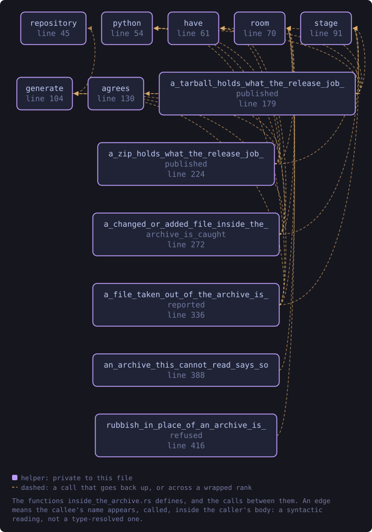

<!-- SPDX-License-Identifier: GPL-3.0-or-later -->
<!-- GENERATED by tools/docs/generate.py from the doc comments in the
     source. Do not edit this file: edit the `//!` and `///` comments in
     the .rs files and run the generator again. CI verifies it with
         python tools/docs/generate.py --check
-->

  

# `crates/veilvoice-verify/tests/inside_the_archive.rs`

[`veilvoice-verify`](../../../crates/veilvoice-verify/README.md) &middot; 430 lines &middot; [read the source](https://github.com/tilas01/veilvoice/blob/main/crates/veilvoice-verify/tests/inside_the_archive.rs)

## Contents

- [Why this test exists](#why-this-test-exists)
- [The names are the interesting part](#the-names-are-the-interesting-part)
- [Why it is allowed to skip](#why-it-is-allowed-to-skip)
  - [What this file contains](#what-this-file-contains)
  - [What calls what](#what-calls-what)
  - [Items](#items)

**Roadmap item 164.** Reading a release archive from the inside, checked
against the list the release job actually writes.

# Why this test exists

`check::archive` hashes every member of a `.tar.gz` or a `.zip` and compares
the result against `CONTENTS.sha256`. Both ends of that comparison are
produced by different code on different machines: the list by
`tools/release/contents.py`, running on the publishing runner under Python's
`tarfile` and `zipfile`; the hashes by two readers written here, running on
whatever the reader downloaded to.

The failure that matters is not a crash. It is the two ends disagreeing
quietly about a member's *name* -- a leading `./`, a backslash, a path
rebuilt from `ustar`'s `prefix` field -- so that every file reads as
`MISSING` and a perfectly sound release is refused. Or the same disagreement
in the other direction, where a name lines up by accident and a file nobody
published is passed over.

So nothing here is a stand-in. The archives are built by `tar` and by
Python's `zipfile`, which is what built every archive this project has ever
published; the list is written by the real generator; and the readers are
the ones a download is checked with.

# The names are the interesting part

Each release staged here carries a path long enough to force `tar` out of
the plain header and into a `L` record or a `pax` header, a file in a
subdirectory, and a dotfile. Those are the three shapes that have actually
been got wrong, here and in the generator (see F-102).

# Why it is allowed to skip

It needs Python and `tar`, for the reason `release_manifest.rs` gives at
length: their absence is a fact about the machine rather than a defect in
the release job, and the release workflow itself cannot be without them.

## What this file contains

430 lines defining **13 functions** (0 public), **0 types** and **1 constant**. Everything below is read out of the source, so it cannot disagree with the code.

## What calls what

The functions this file defines, and the calls between them. Both
are read out of the source: an edge means the callee's name appears,
called, inside the caller's body. It is a syntactic reading, not a
type-resolved one, so a call made through a trait object or a macro
will not appear.

_Colour key: **helper** -- private to this file._

  

The same graph as Mermaid source

```mermaid
%%{init: {"theme":"base","themeVariables":{"background":"#1a1b26","primaryColor":"#1f2335","primaryTextColor":"#c0caf5","primaryBorderColor":"#7aa2f7","secondaryColor":"#16161e","tertiaryColor":"#16161e","lineColor":"#737aa2","textColor":"#c0caf5","mainBkg":"#1f2335","nodeBorder":"#7aa2f7","clusterBkg":"#16161e","clusterBorder":"#2f3549","fontFamily":"ui-monospace, SFMono-Regular, Consolas, monospace","fontSize":"14px"}}}%%
flowchart TD
    n_repository["repository<br/>line 45"]
    n_python["python<br/>line 54"]
    n_have["have<br/>line 61"]
    n_room["room<br/>line 70"]
    n_stage["stage<br/>line 91"]
    n_generate["generate<br/>line 104"]
    n_agrees["agrees<br/>line 130"]
    n_a_tarball_holds_what_the_release_job_published["a_tarball_holds_what_the_release_job_<br/>published<br/>line 179"]
    n_a_zip_holds_what_the_release_job_published["a_zip_holds_what_the_release_job_<br/>published<br/>line 224"]
    n_a_changed_or_added_file_inside_the_archive_is_caught["a_changed_or_added_file_inside_the_<br/>archive_is_caught<br/>line 272"]
    n_a_file_taken_out_of_the_archive_is_reported["a_file_taken_out_of_the_archive_is_<br/>reported<br/>line 336"]
    n_an_archive_this_cannot_read_says_so["an_archive_this_cannot_read_says_so<br/>line 388"]
    n_rubbish_in_place_of_an_archive_is_refused["rubbish_in_place_of_an_archive_is_<br/>refused<br/>line 416"]
    n_a_changed_or_added_file_inside_the_archive_is_caught --> n_generate
    n_a_changed_or_added_file_inside_the_archive_is_caught --> n_have
    n_a_changed_or_added_file_inside_the_archive_is_caught --> n_python
    n_a_changed_or_added_file_inside_the_archive_is_caught --> n_room
    n_a_changed_or_added_file_inside_the_archive_is_caught --> n_stage
    n_a_file_taken_out_of_the_archive_is_reported --> n_generate
    n_a_file_taken_out_of_the_archive_is_reported --> n_have
    n_a_file_taken_out_of_the_archive_is_reported --> n_python
    n_a_file_taken_out_of_the_archive_is_reported --> n_room
    n_a_file_taken_out_of_the_archive_is_reported --> n_stage
    n_a_tarball_holds_what_the_release_job_published --> n_agrees
    n_a_tarball_holds_what_the_release_job_published --> n_generate
    n_a_tarball_holds_what_the_release_job_published --> n_have
    n_a_tarball_holds_what_the_release_job_published --> n_python
    n_a_tarball_holds_what_the_release_job_published --> n_room
    n_a_tarball_holds_what_the_release_job_published --> n_stage
    n_a_zip_holds_what_the_release_job_published --> n_agrees
    n_a_zip_holds_what_the_release_job_published --> n_generate
    n_a_zip_holds_what_the_release_job_published --> n_python
    n_a_zip_holds_what_the_release_job_published --> n_room
    n_a_zip_holds_what_the_release_job_published --> n_stage
    n_an_archive_this_cannot_read_says_so --> n_room
    n_generate --> n_repository
    n_rubbish_in_place_of_an_archive_is_refused --> n_room
    click n_repository href "https://github.com/tilas01/veilvoice/blob/main/crates/veilvoice-verify/tests/inside_the_archive.rs#L45" "open the source"
    click n_python href "https://github.com/tilas01/veilvoice/blob/main/crates/veilvoice-verify/tests/inside_the_archive.rs#L54" "open the source"
    click n_have href "https://github.com/tilas01/veilvoice/blob/main/crates/veilvoice-verify/tests/inside_the_archive.rs#L61" "open the source"
    click n_room href "https://github.com/tilas01/veilvoice/blob/main/crates/veilvoice-verify/tests/inside_the_archive.rs#L70" "open the source"
    click n_stage href "https://github.com/tilas01/veilvoice/blob/main/crates/veilvoice-verify/tests/inside_the_archive.rs#L91" "open the source"
    click n_generate href "https://github.com/tilas01/veilvoice/blob/main/crates/veilvoice-verify/tests/inside_the_archive.rs#L104" "open the source"
    click n_agrees href "https://github.com/tilas01/veilvoice/blob/main/crates/veilvoice-verify/tests/inside_the_archive.rs#L130" "open the source"
    click n_a_tarball_holds_what_the_release_job_published href "https://github.com/tilas01/veilvoice/blob/main/crates/veilvoice-verify/tests/inside_the_archive.rs#L179" "open the source"
    click n_a_zip_holds_what_the_release_job_published href "https://github.com/tilas01/veilvoice/blob/main/crates/veilvoice-verify/tests/inside_the_archive.rs#L224" "open the source"
    click n_a_changed_or_added_file_inside_the_archive_is_caught href "https://github.com/tilas01/veilvoice/blob/main/crates/veilvoice-verify/tests/inside_the_archive.rs#L272" "open the source"
    click n_a_file_taken_out_of_the_archive_is_reported href "https://github.com/tilas01/veilvoice/blob/main/crates/veilvoice-verify/tests/inside_the_archive.rs#L336" "open the source"
    click n_an_archive_this_cannot_read_says_so href "https://github.com/tilas01/veilvoice/blob/main/crates/veilvoice-verify/tests/inside_the_archive.rs#L388" "open the source"
    click n_rubbish_in_place_of_an_archive_is_refused href "https://github.com/tilas01/veilvoice/blob/main/crates/veilvoice-verify/tests/inside_the_archive.rs#L416" "open the source"
    classDef helper fill:#1f2335,stroke:#bb9af7,color:#c0caf5
    class n_repository,n_python,n_have,n_room,n_stage,n_generate,n_agrees,n_a_tarball_holds_what_the_release_job_published,n_a_zip_holds_what_the_release_job_published,n_a_changed_or_added_file_inside_the_archive_is_caught,n_a_file_taken_out_of_the_archive_is_reported,n_an_archive_this_cannot_read_says_so,n_rubbish_in_place_of_an_archive_is_refused helper
```

## Items

| Item | Line | Documentation |
|---|---:|---|
| `repository` fn | [45](https://github.com/tilas01/veilvoice/blob/main/crates/veilvoice-verify/tests/inside_the_archive.rs#L45) | The repository root, from this test's own location. |
| `python` fn | [54](https://github.com/tilas01/veilvoice/blob/main/crates/veilvoice-verify/tests/inside_the_archive.rs#L54) | A Python to run, if this machine has one. |
| `have` fn | [61](https://github.com/tilas01/veilvoice/blob/main/crates/veilvoice-verify/tests/inside_the_archive.rs#L61) | Whether a program is on this machine at all. |
| `room` fn | [70](https://github.com/tilas01/veilvoice/blob/main/crates/veilvoice-verify/tests/inside_the_archive.rs#L70) | Somewhere to build a release, removed by the caller. |
| `LONG` const | [87](https://github.com/tilas01/veilvoice/blob/main/crates/veilvoice-verify/tests/inside_the_archive.rs#L87) | A path long enough that tar cannot fit it in a header's 100-byte name. |
| `stage` fn | [91](https://github.com/tilas01/veilvoice/blob/main/crates/veilvoice-verify/tests/inside_the_archive.rs#L91) | Build one release directory, the shape the release job stages. |
| `generate` fn | [104](https://github.com/tilas01/veilvoice/blob/main/crates/veilvoice-verify/tests/inside_the_archive.rs#L104) | Run the real generator over a staging directory. |
| `agrees` fn | [130](https://github.com/tilas01/veilvoice/blob/main/crates/veilvoice-verify/tests/inside_the_archive.rs#L130) | Assert that an archive holds exactly what the generated list says it does. |
| `a_tarball_holds_what_the_release_job_published` fn | [179](https://github.com/tilas01/veilvoice/blob/main/crates/veilvoice-verify/tests/inside_the_archive.rs#L179) | A gzipped tar, in each of the three ways tar spells a long name. |
| `a_zip_holds_what_the_release_job_published` fn | [224](https://github.com/tilas01/veilvoice/blob/main/crates/veilvoice-verify/tests/inside_the_archive.rs#L224) | A zip, deflated and stored, read from its central directory. |
| `a_changed_or_added_file_inside_the_archive_is_caught` fn | [272](https://github.com/tilas01/veilvoice/blob/main/crates/veilvoice-verify/tests/inside_the_archive.rs#L272) | A file changed inside the archive is named, and an added one is too. |
| `a_file_taken_out_of_the_archive_is_reported` fn | [336](https://github.com/tilas01/veilvoice/blob/main/crates/veilvoice-verify/tests/inside_the_archive.rs#L336) | A published file missing from the archive is reported as missing. |
| `an_archive_this_cannot_read_says_so` fn | [388](https://github.com/tilas01/veilvoice/blob/main/crates/veilvoice-verify/tests/inside_the_archive.rs#L388) | An archive this reader cannot open says so, rather than reporting nothing. |
| `rubbish_in_place_of_an_archive_is_refused` fn | [416](https://github.com/tilas01/veilvoice/blob/main/crates/veilvoice-verify/tests/inside_the_archive.rs#L416) | A file that is not an archive at all is refused, not passed over. |

---

Generated from `crates/veilvoice-verify/tests/inside_the_archive.rs`. On the website: [`website/reference/veilvoice-verify/tests-inside_the_archive.html`](../../../website/reference/veilvoice-verify/tests-inside_the_archive.html).

Signing key fingerprint `8101FB3BB28D02FB239E0CDF9CC1C7E7A9B5833A`.
