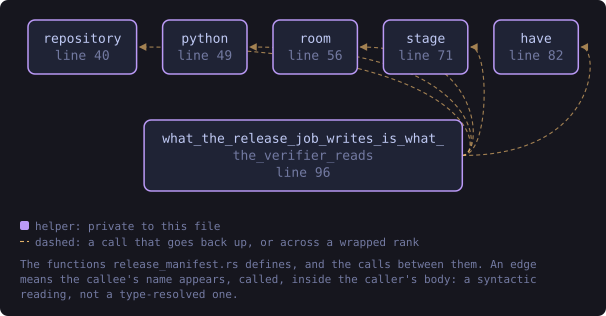
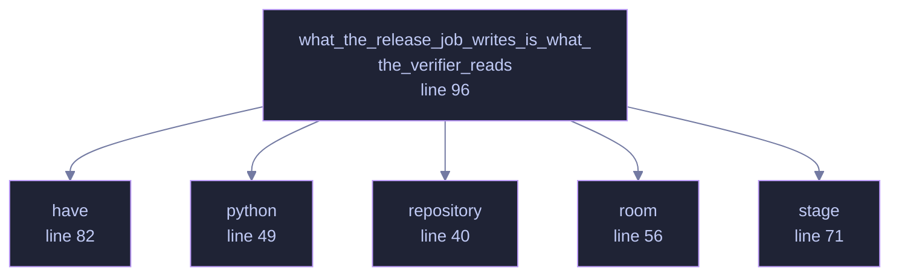

<!-- SPDX-License-Identifier: GPL-3.0-or-later -->
<!-- GENERATED by tools/docs/generate.py from the doc comments in the
     source. Do not edit this file: edit the `//!` and `///` comments in
     the .rs files and run the generator again. CI verifies it with
         python tools/docs/generate.py --check
-->

<p align="center">
  
</p>

# `crates/veilvoice-verify/tests/release_manifest.rs`

[`veilvoice-verify`](../../../crates/veilvoice-verify/README.md) &middot; 198 lines &middot; [read the source](https://github.com/tilas01/veilvoice/blob/main/crates/veilvoice-verify/tests/release_manifest.rs)

## Contents

- [Why this test exists](#why-this-test-exists)
- [Why it is allowed to skip](#why-it-is-allowed-to-skip)
  - [What this file contains](#what-this-file-contains)
  - [What calls what](#what-calls-what)
  - [Items](#items)

**Marker 97.** The release job's contents list, read back by the parser
that will read it for real.

# Why this test exists

`CONTENTS.sha256` is the newest link in the chain a verifier follows:

```text
SHA256SUMS.asc -> SHA256SUMS -> CONTENTS.sha256 -> each file on disk
```

Every other link has tests on both sides of it. This one had a writer that
ran once a release, in a job nobody can run on a laptop, and a reader with
unit tests over hand-written samples. Two halves that were never introduced
to each other, and the failure mode is the worst shape a verifier has: a
manifest the reader parses happily and whose paths do not line up with what
is actually on disk, so every file reads as `MISSING` and a genuine release
is refused. Or worse, paths that line up by accident on one platform.

So this builds a release the way the release job does, runs the real
generator over it, and checks the real reader against the real extracted
files. Nothing here is a stand-in.

# Why it is allowed to skip

It needs Python, and the `test` job does not install one. Every runner this
project uses has one anyway, so the test runs on all three in practice; on a
machine without one it returns rather than failing, because "Python is not
installed here" is a fact about the machine and not a defect in the release
job. The generator is also run by the release workflow itself, which is
where its absence would actually matter and where it cannot be absent.

## What this file contains

198 lines defining **6 functions** (0 public), **0 types** and **0 constants**. Everything below is read out of the source, so it cannot disagree with the code.

## What calls what

The functions this file defines, and the calls between them. Both
are read out of the source: an edge means the callee's name appears,
called, inside the caller's body. It is a syntactic reading, not a
type-resolved one, so a call made through a trait object or a macro
will not appear.

_Colour key: **helper** -- private to this file._

<p align="center">
  
</p>

<details>
<summary>The same graph as Mermaid source</summary>



</details>

## Items

| Item | Line | Documentation |
|---|---:|---|
| `repository` <sub>fn</sub> | [40](https://github.com/tilas01/veilvoice/blob/main/crates/veilvoice-verify/tests/release_manifest.rs#L40) | The repository root, from this test's own location. |
| `python` <sub>fn</sub> | [49](https://github.com/tilas01/veilvoice/blob/main/crates/veilvoice-verify/tests/release_manifest.rs#L49) | A Python to run, if this machine has one. |
| `room` <sub>fn</sub> | [56](https://github.com/tilas01/veilvoice/blob/main/crates/veilvoice-verify/tests/release_manifest.rs#L56) | Somewhere to build a release, removed by the caller. |
| `stage` <sub>fn</sub> | [71](https://github.com/tilas01/veilvoice/blob/main/crates/veilvoice-verify/tests/release_manifest.rs#L71) | Build one release directory, the shape the release job stages. |
| `have` <sub>fn</sub> | [82](https://github.com/tilas01/veilvoice/blob/main/crates/veilvoice-verify/tests/release_manifest.rs#L82) | Whether a program is on this machine at all. |
| `what_the_release_job_writes_is_what_the_verifier_reads` <sub>fn</sub> | [96](https://github.com/tilas01/veilvoice/blob/main/crates/veilvoice-verify/tests/release_manifest.rs#L96) | The whole seam: stage, archive, generate, parse, extract, check. |

---

Generated from `crates/veilvoice-verify/tests/release_manifest.rs`. On the website: [`website/reference/veilvoice-verify/tests-release_manifest.html`](../../../website/reference/veilvoice-verify/tests-release_manifest.html).

Signing key fingerprint `8101FB3BB28D02FB239E0CDF9CC1C7E7A9B5833A`.
