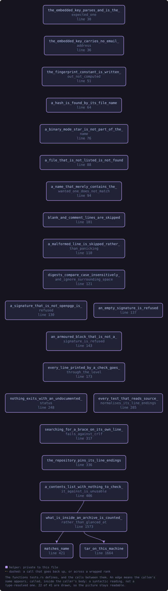

<!-- SPDX-License-Identifier: GPL-3.0-or-later -->
<!-- GENERATED by tools/docs/generate.py from the doc comments in the
     source. Do not edit this file: edit the `//!` and `///` comments in
     the .rs files and run the generator again. CI verifies it with
         python tools/docs/generate.py --check
-->

  

# `crates/veilvoice-verify/src/tests.rs`

[`veilvoice-verify`](../../../crates/veilvoice-verify/README.md) &middot; 357 lines &middot; [read the source](https://github.com/tilas01/veilvoice/blob/main/crates/veilvoice-verify/src/tests.rs)

## Contents

- [In plain words](#in-plain-words)
  - [What this file contains](#what-this-file-contains)
  - [What calls what](#what-calls-what)
  - [Items](#items)

The verifier's own tests.

The property that matters most here is not "a good signature is accepted"
but **"a bad one is refused"**. A verifier that accepts everything passes
every happy-path test ever written, and would ship looking perfect while
doing the opposite of its job -- so most of what follows is negative:
corrupted signatures, wrong keys, truncated input, mismatched hashes.

This file is `//!`-documented rather than `//`-commented so that the
reasoning above appears in the generated documentation. A reader deciding
whether to trust `veilvoice-verify` should be able to see what it was tested
*against* without cloning the repository, because the whole purpose of that
binary is to be the thing you check a download with.

# In plain words

The verifier's own tests, and most of them are about failure rather than
success.

That is deliberate. A verifier that accepted everything would pass every
happy-path test ever written and would ship looking perfect while doing the
opposite of its job. So most of what is here is corrupted signatures, wrong
keys, truncated files and mismatched hashes, and the question each time is
whether it says no.

## What this file contains

357 lines defining **18 functions** (0 public), **0 types** and **0 constants**. Everything below is read out of the source, so it cannot disagree with the code.

## What calls what

The functions this file defines, and the calls between them. Both
are read out of the source: an edge means the callee's name appears,
called, inside the caller's body. It is a syntactic reading, not a
type-resolved one, so a call made through a trait object or a macro
will not appear.

_Colour key: **helper** -- private to this file._

  

The same graph as Mermaid source

## Items

| Item | Line | Documentation |
|---|---:|---|
| `the_embedded_key_parses_and_is_the_expected_one` fn | [30](https://github.com/tilas01/veilvoice/blob/main/crates/veilvoice-verify/src/tests.rs#L30) |  |
| `the_embedded_key_carries_no_email_address` fn | [36](https://github.com/tilas01/veilvoice/blob/main/crates/veilvoice-verify/src/tests.rs#L36) |  |
| `the_fingerprint_constant_is_written_out_not_computed` fn | [51](https://github.com/tilas01/veilvoice/blob/main/crates/veilvoice-verify/src/tests.rs#L51) |  |
| `a_hash_is_found_by_its_file_name` fn | [64](https://github.com/tilas01/veilvoice/blob/main/crates/veilvoice-verify/src/tests.rs#L64) |  |
| `a_binary_mode_star_is_not_part_of_the_name` fn | [76](https://github.com/tilas01/veilvoice/blob/main/crates/veilvoice-verify/src/tests.rs#L76) |  |
| `a_file_that_is_not_listed_is_not_found` fn | [88](https://github.com/tilas01/veilvoice/blob/main/crates/veilvoice-verify/src/tests.rs#L88) |  |
| `a_name_that_merely_contains_the_wanted_one_does_not_match` fn | [94](https://github.com/tilas01/veilvoice/blob/main/crates/veilvoice-verify/src/tests.rs#L94) |  |
| `blank_and_comment_lines_are_skipped` fn | [101](https://github.com/tilas01/veilvoice/blob/main/crates/veilvoice-verify/src/tests.rs#L101) |  |
| `a_malformed_line_is_skipped_rather_than_panicking` fn | [110](https://github.com/tilas01/veilvoice/blob/main/crates/veilvoice-verify/src/tests.rs#L110) |  |
| `digests_compare_case_insensitively_and_ignore_surrounding_space` fn | [121](https://github.com/tilas01/veilvoice/blob/main/crates/veilvoice-verify/src/tests.rs#L121) |  |
| `a_signature_that_is_not_openpgp_is_refused` fn | [130](https://github.com/tilas01/veilvoice/blob/main/crates/veilvoice-verify/src/tests.rs#L130) |  |
| `an_empty_signature_is_refused` fn | [137](https://github.com/tilas01/veilvoice/blob/main/crates/veilvoice-verify/src/tests.rs#L137) |  |
| `an_armoured_block_that_is_not_a_signature_is_refused` fn | [143](https://github.com/tilas01/veilvoice/blob/main/crates/veilvoice-verify/src/tests.rs#L143) |  |
| `every_line_printed_by_a_check_goes_through_the_level` fn | [173](https://github.com/tilas01/veilvoice/blob/main/crates/veilvoice-verify/src/tests.rs#L173) | Nothing may print without asking the level first. |
| `nothing_exits_with_an_undocumented_status` fn | [248](https://github.com/tilas01/veilvoice/blob/main/crates/veilvoice-verify/src/tests.rs#L248) | Every exit this program can take is one of the documented statuses. |
| `every_test_that_reads_source_normalises_its_line_endings` fn | [285](https://github.com/tilas01/veilvoice/blob/main/crates/veilvoice-verify/src/tests.rs#L285) | F-72. |
| `searching_for_a_brace_on_its_own_line_fails_against_crlf` fn | [317](https://github.com/tilas01/veilvoice/blob/main/crates/veilvoice-verify/src/tests.rs#L317) | The failure mode itself, so it is on record as reachable rather than theoretical. |
| `the_repository_pins_its_line_endings` fn | [336](https://github.com/tilas01/veilvoice/blob/main/crates/veilvoice-verify/src/tests.rs#L336) | .gitattributes exists and pins text to LF. |

---

Generated from `crates/veilvoice-verify/src/tests.rs`. On the website: [`website/reference/veilvoice-verify/tests.html`](../../../website/reference/veilvoice-verify/tests.html).

Signing key fingerprint `8101FB3BB28D02FB239E0CDF9CC1C7E7A9B5833A`.
