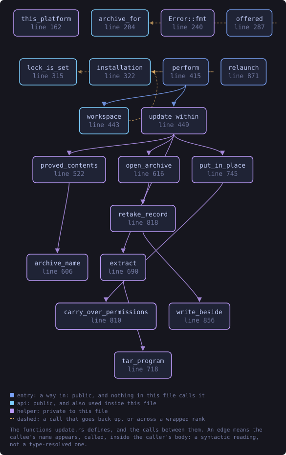

<!-- SPDX-License-Identifier: GPL-3.0-or-later -->
<!-- GENERATED by tools/docs/generate.py from the doc comments in the
     source. Do not edit this file: edit the `//!` and `///` comments in
     the .rs files and run the generator again. CI verifies it with
         python tools/docs/generate.py --check
-->

  

# `crates/veilvoice-verify/src/update.rs`

[`veilvoice-verify`](../../../crates/veilvoice-verify/README.md) &middot; 1333 lines &middot; [read the source](https://github.com/tilas01/veilvoice/blob/main/crates/veilvoice-verify/src/update.rs)

## Contents

- [The stance this changes, and the sentence that survives it](#the-stance-this-changes-and-the-sentence-that-survives-it)
- [The order, which is the whole design](#the-order-which-is-the-whole-design)
- [The archive is never trusted to name its own files](#the-archive-is-never-trusted-to-name-its-own-files)
- [The integrity record, and why it is re-taken here](#the-integrity-record-and-why-it-is-re-taken-here)
- [What this updates is the copy you are running](#what-this-updates-is-the-copy-you-are-running)
- [In plain words](#in-plain-words)
  - [What this file contains](#what-this-file-contains)
  - [What calls what](#what-calls-what)
  - [Items](#items)

The update that does the update.

**Roadmap item 179.** `veilvoice_setup::update` reports that a newer release
exists and stops there, which leaves the reader to download it, verify it,
unpack it and replace their copy by hand. Most people will do some of that
and not the rest, and the part they skip is the checking. This does all four
in one act, and the checking is the part it will not skip.

# The stance this changes, and the sentence that survives it

`veilvoice_setup::update` used to say, as a design note rather than a
limitation:

> An update checker that could install its own answer is an update checker
> that can be made to install somebody else's.

That sentence is still true and it is still the constraint this module is
written around. What made it an argument for doing nothing was the missing
half: **whose** answer. Every byte that reaches your disk here is checked
against a signature made by a key that is **compiled into the binary you are
already running**, before anything is unpacked and long before anything is
copied over a program. Somebody who can answer the network cannot produce
that signature, so they cannot make this install their answer. They can make
it refuse, loudly, which is the correct failure.

The other half of that sentence, that nothing happens on its own, is
unchanged and is not a detail. There is no timer, no check at startup and
no background thread. An update happens because a person asked for one, in
the same session, and every step of it is reported as it happens.

# The order, which is the whole design

1. **Ask.** `offered` calls `veilvoice_setup::update::check`, which reads
one public page with the transfer tool the operating system already
ships. Nothing is downloaded.
2. **Fetch.** The archive for this platform, `SHA256SUMS`, `SHA256SUMS.asc`
and `CONTENTS.sha256`, into a directory the caller names. Nothing is run
and nothing is opened.
3. **Prove.** The signature over `SHA256SUMS` against the compiled-in key;
the archive against `SHA256SUMS`; `CONTENTS.sha256` against
`SHA256SUMS`; and then every file **inside** the archive against
`CONTENTS.sha256`, read where it lies without unpacking it.
4. **Open.** Only now, and with the system's own `tar`, into an empty
directory. What lands is hashed again against the same signed list,
because an extractor is a program too.
5. **Replace.** The binaries beside the running one are moved aside and the
new ones put in their place.
6. **Record.** The integrity record is re-taken, for the reason below.
7. **Restart**, which the caller does, because a window and a command line
part company here.

Steps 3 and 4 are `crate::check`, unchanged and uncopied. That was the
condition roadmap item 164 was landed first for: an updater that verified a
download with its own second implementation would be a second implementation
to get subtly wrong, in the one place where being subtly wrong means
accepting something.

# The archive is never trusted to name its own files

Nothing here reads a name out of the archive and acts on it. The list of
members comes from `CONTENTS.sha256`, which the signature covers, and the
archive is compared **against** that list in both directions: a member the
list does not have is a failure, and a listed file the archive does not
carry is a failure. So the archive-traversal defects, a member called
`../../.bashrc` or a symbolic link pointing at one, are refused at the
comparison rather than caught at the extractor.

# The integrity record, and why it is re-taken here

`veilvoice-guard` records what VeilVoice's own files hash to, and the window
checks that record at every launch. An update replaces those files with
different ones, so the next launch after an update would report the update
as a change, every time, for ever. A tamper alarm that fires on the ordinary
maintenance of the thing it watches is an alarm people learn to dismiss, and
an alarm people dismiss is worth nothing on the day it is right.

So the record is re-taken as part of the update. Two constraints on when and
how, both of which are the point rather than housekeeping:

* **After the signature has been checked, never before.** A record re-taken
first would be a record of whatever arrived, blessed by this program, and
an update that failed its signature check would have already written down
the attacker's files as the correct ones.
* **Unsealed unless the reader is there to seal it.** The sealed record is
sealed under the app lock's passphrase, which exists only while somebody
is present and has typed it. With it in hand the new record is sealed;
without it the record is written in the clear and `Done::record` says
so, in those words, rather than sealing it under something kept beside it
and calling that protection.

With an app lock set, the passphrase is **required** rather than optional:
see `Error::Locked`. Updating past a lock without it would leave the
machine with new files and a sealed record of the old ones, which reads as
tampering at the next unlock and cannot be told apart from the real thing.

# What this updates is the copy you are running

Not "the installation", which this program is in no position to be certain
about: VeilVoice runs portably by design, and a folder somebody unzipped is
as real an installation as anything under `~/.local`. The files replaced are
the ones beside `std::env::current_exe`, which is what a person pressing
update means, and it is the one answer that is right for a portable folder,
a per-user install and a copy somebody put somewhere of their own.

# In plain words

Downloads the new version, checks it properly, and puts it in place.

It checks the download against a signature made with a key that is already
inside the program you are running, before it opens the file, and it opens
the file before it touches anything of yours. If any of that fails, nothing
is replaced and it tells you what failed.

If you have an app lock, it will ask for it, because the record of what
VeilVoice's own files should look like has to be rewritten by the update and
that record is locked with the same passphrase.

## What this file contains

1333 lines defining **19 functions** (7 public), **5 types** and **3 constants**. Everything below is read out of the source, so it cannot disagree with the code.

**The types it owns.**

- `enum Error` (line 216) -- Everything that can stop an update, in the words the reader is given.
- `struct Offer` (line 273) -- A newer release, and the file to fetch for it.
- `enum Step` (line 337) -- What the update is doing, reported as it happens.
- `enum Record` (line 352) -- What became of the integrity record.
- `struct Done` (line 363) -- A finished update.

**What happens when it runs.** These are the ways in: public, and nothing else in this file calls them, so they are what an outside caller reaches first.

- `offered` (line 287) -- Ask what is published, and offer it if it is newer.
  - reaches: `archive_for`
- `perform` (line 415) -- The whole update, in the one order that is safe.
  - reaches: `installation`, `lock_is_set`, `update_within`, `workspace`, `open_archive`, `proved_contents`, `put_in_place`, `retake_record`, `extract`, `archive_name`, `carry_over_permissions`, `write_beside`
- `relaunch` (line 871) -- Start the updated program and return.

## What calls what

The functions this file defines, and the calls between them. Both
are read out of the source: an edge means the callee's name appears,
called, inside the caller's body. It is a syntactic reading, not a
type-resolved one, so a call made through a trait object or a macro
will not appear.

_Colour key: **entry** -- a way in: public, and nothing in this file calls it; **api** -- public, and also used inside this file; **helper** -- private to this file._

  

The same graph as Mermaid source

```mermaid
%%{init: {"theme":"base","themeVariables":{"background":"#1a1b26","primaryColor":"#1f2335","primaryTextColor":"#c0caf5","primaryBorderColor":"#7aa2f7","secondaryColor":"#16161e","tertiaryColor":"#16161e","lineColor":"#737aa2","textColor":"#c0caf5","mainBkg":"#1f2335","nodeBorder":"#7aa2f7","clusterBkg":"#16161e","clusterBorder":"#2f3549","fontFamily":"ui-monospace, SFMono-Regular, Consolas, monospace","fontSize":"14px"}}}%%
flowchart TD
    n_archive_for["archive_for<br/>line 204"]
    n_fmt["Error::fmt<br/>line 240"]
    n_offered(["offered<br/>line 287"])
    n_lock_is_set["lock_is_set<br/>line 315"]
    n_installation["installation<br/>line 322"]
    n_perform(["perform<br/>line 415"])
    n_workspace["workspace<br/>line 443"]
    n_update_within["update_within<br/>line 449"]
    n_proved_contents["proved_contents<br/>line 522"]
    n_archive_name["archive_name<br/>line 606"]
    n_open_archive["open_archive<br/>line 616"]
    n_extract["extract<br/>line 690"]
    n_tar_program["tar_program<br/>line 718"]
    n_put_in_place["put_in_place<br/>line 745"]
    n_carry_over_permissions["carry_over_permissions<br/>line 800"]
    n_carry_over_permissions["carry_over_permissions<br/>line 810"]
    n_retake_record["retake_record<br/>line 818"]
    n_write_beside["write_beside<br/>line 856"]
    n_relaunch(["relaunch<br/>line 871"])
    n_extract --> n_tar_program
    n_offered --> n_archive_for
    n_open_archive --> n_extract
    n_perform --> n_installation
    n_perform --> n_lock_is_set
    n_perform --> n_update_within
    n_perform --> n_workspace
    n_proved_contents --> n_archive_name
    n_put_in_place --> n_carry_over_permissions
    n_retake_record --> n_write_beside
    n_update_within --> n_open_archive
    n_update_within --> n_proved_contents
    n_update_within --> n_put_in_place
    n_update_within --> n_retake_record
    n_workspace --> n_installation
    click n_archive_for href "https://github.com/tilas01/veilvoice/blob/main/crates/veilvoice-verify/src/update.rs#L204" "open the source"
    click n_fmt href "https://github.com/tilas01/veilvoice/blob/main/crates/veilvoice-verify/src/update.rs#L240" "open the source"
    click n_offered href "https://github.com/tilas01/veilvoice/blob/main/crates/veilvoice-verify/src/update.rs#L287" "open the source"
    click n_lock_is_set href "https://github.com/tilas01/veilvoice/blob/main/crates/veilvoice-verify/src/update.rs#L315" "open the source"
    click n_installation href "https://github.com/tilas01/veilvoice/blob/main/crates/veilvoice-verify/src/update.rs#L322" "open the source"
    click n_perform href "https://github.com/tilas01/veilvoice/blob/main/crates/veilvoice-verify/src/update.rs#L415" "open the source"
    click n_workspace href "https://github.com/tilas01/veilvoice/blob/main/crates/veilvoice-verify/src/update.rs#L443" "open the source"
    click n_update_within href "https://github.com/tilas01/veilvoice/blob/main/crates/veilvoice-verify/src/update.rs#L449" "open the source"
    click n_proved_contents href "https://github.com/tilas01/veilvoice/blob/main/crates/veilvoice-verify/src/update.rs#L522" "open the source"
    click n_archive_name href "https://github.com/tilas01/veilvoice/blob/main/crates/veilvoice-verify/src/update.rs#L606" "open the source"
    click n_open_archive href "https://github.com/tilas01/veilvoice/blob/main/crates/veilvoice-verify/src/update.rs#L616" "open the source"
    click n_extract href "https://github.com/tilas01/veilvoice/blob/main/crates/veilvoice-verify/src/update.rs#L690" "open the source"
    click n_tar_program href "https://github.com/tilas01/veilvoice/blob/main/crates/veilvoice-verify/src/update.rs#L718" "open the source"
    click n_put_in_place href "https://github.com/tilas01/veilvoice/blob/main/crates/veilvoice-verify/src/update.rs#L745" "open the source"
    click n_carry_over_permissions href "https://github.com/tilas01/veilvoice/blob/main/crates/veilvoice-verify/src/update.rs#L800" "open the source"
    click n_carry_over_permissions href "https://github.com/tilas01/veilvoice/blob/main/crates/veilvoice-verify/src/update.rs#L810" "open the source"
    click n_retake_record href "https://github.com/tilas01/veilvoice/blob/main/crates/veilvoice-verify/src/update.rs#L818" "open the source"
    click n_write_beside href "https://github.com/tilas01/veilvoice/blob/main/crates/veilvoice-verify/src/update.rs#L856" "open the source"
    click n_relaunch href "https://github.com/tilas01/veilvoice/blob/main/crates/veilvoice-verify/src/update.rs#L871" "open the source"
    classDef entry fill:#1f2335,stroke:#7aa2f7,color:#c0caf5
    class n_offered,n_perform,n_relaunch entry
    classDef api fill:#1f2335,stroke:#7dcfff,color:#c0caf5
    class n_archive_for,n_lock_is_set,n_installation,n_workspace api
    classDef helper fill:#1f2335,stroke:#bb9af7,color:#c0caf5
    class n_fmt,n_update_within,n_proved_contents,n_archive_name,n_open_archive,n_extract,n_tar_program,n_put_in_place,n_carry_over_permissions,n_carry_over_permissions,n_retake_record,n_write_beside helper
```

## Items

| Item | Line | Documentation |
|---|---:|---|
| `PUBLISHED` pub const | [131](https://github.com/tilas01/veilvoice/blob/main/crates/veilvoice-verify/src/update.rs#L131) | Every platform label the release workflow publishes an archive for. |
| `PLATFORM` pub const | [152](https://github.com/tilas01/veilvoice/blob/main/crates/veilvoice-verify/src/update.rs#L152) | This build's label, or None for a build of a kind nothing is published for. |
| `fn` const | [162](https://github.com/tilas01/veilvoice/blob/main/crates/veilvoice-verify/src/update.rs#L162) | The label picked apart by target, as the workflow's matrix picks it. |
| `archive_for` pub fn | [204](https://github.com/tilas01/veilvoice/blob/main/crates/veilvoice-verify/src/update.rs#L204) | The archive this platform's release is published under. |
| `Error` pub enum | [216](https://github.com/tilas01/veilvoice/blob/main/crates/veilvoice-verify/src/update.rs#L216) | Everything that can stop an update, in the words the reader is given. |
| `Error::fmt` fn | [240](https://github.com/tilas01/veilvoice/blob/main/crates/veilvoice-verify/src/update.rs#L240) |  |
| `Offer` pub struct | [273](https://github.com/tilas01/veilvoice/blob/main/crates/veilvoice-verify/src/update.rs#L273) | A newer release, and the file to fetch for it. |
| `offered` pub fn | [287](https://github.com/tilas01/veilvoice/blob/main/crates/veilvoice-verify/src/update.rs#L287) | Ask what is published, and offer it if it is newer. |
| `lock_is_set` pub fn | [315](https://github.com/tilas01/veilvoice/blob/main/crates/veilvoice-verify/src/update.rs#L315) | Whether this machine has an app lock set. |
| `installation` pub fn | [322](https://github.com/tilas01/veilvoice/blob/main/crates/veilvoice-verify/src/update.rs#L322) | Where the running copy of VeilVoice lives. |
| `Step` pub enum | [337](https://github.com/tilas01/veilvoice/blob/main/crates/veilvoice-verify/src/update.rs#L337) | What the update is doing, reported as it happens. |
| `Record` pub enum | [352](https://github.com/tilas01/veilvoice/blob/main/crates/veilvoice-verify/src/update.rs#L352) | What became of the integrity record. |
| `Done` pub struct | [363](https://github.com/tilas01/veilvoice/blob/main/crates/veilvoice-verify/src/update.rs#L363) | A finished update. |
| `perform` pub fn | [415](https://github.com/tilas01/veilvoice/blob/main/crates/veilvoice-verify/src/update.rs#L415) | The whole update, in the one order that is safe. |
| `workspace` pub fn | [443](https://github.com/tilas01/veilvoice/blob/main/crates/veilvoice-verify/src/update.rs#L443) | Where an update does its work: beside the copy being replaced. |
| `update_within` fn | [449](https://github.com/tilas01/veilvoice/blob/main/crates/veilvoice-verify/src/update.rs#L449) | The update itself, with the workspace's lifetime handled by the caller above. |
| `proved_contents` fn | [522](https://github.com/tilas01/veilvoice/blob/main/crates/veilvoice-verify/src/update.rs#L522) | The signature, the hash list, the contents list and every member, in that order, all of it crate::check. |
| `archive_name` fn | [606](https://github.com/tilas01/veilvoice/blob/main/crates/veilvoice-verify/src/update.rs#L606) | The archive's own file name, which is the key into the contents list. |
| `open_archive` fn | [616](https://github.com/tilas01/veilvoice/blob/main/crates/veilvoice-verify/src/update.rs#L616) | Unpack into an empty directory, then hash what landed. |
| `extract` fn | [690](https://github.com/tilas01/veilvoice/blob/main/crates/veilvoice-verify/src/update.rs#L690) | Unpack with the tool the operating system already ships. |
| `tar_program` fn | [718](https://github.com/tilas01/veilvoice/blob/main/crates/veilvoice-verify/src/update.rs#L718) | tar, by absolute path. |
| `put_in_place` fn | [745](https://github.com/tilas01/veilvoice/blob/main/crates/veilvoice-verify/src/update.rs#L745) | Move the old binaries aside and put the new ones in their place. |
| `carry_over_permissions` fn | [800](https://github.com/tilas01/veilvoice/blob/main/crates/veilvoice-verify/src/update.rs#L800) | Give the new file the mode the archive published for it. |
| `carry_over_permissions` fn | [810](https://github.com/tilas01/veilvoice/blob/main/crates/veilvoice-verify/src/update.rs#L810) | The everywhere-else half: there is no execute bit to carry over. |
| `retake_record` fn | [818](https://github.com/tilas01/veilvoice/blob/main/crates/veilvoice-verify/src/update.rs#L818) | Re-take the integrity record over the files that were just replaced. |
| `write_beside` fn | [856](https://github.com/tilas01/veilvoice/blob/main/crates/veilvoice-verify/src/update.rs#L856) | Write the sealed record, owner-readable, making its directory if needed. |
| `relaunch` pub fn | [871](https://github.com/tilas01/veilvoice/blob/main/crates/veilvoice-verify/src/update.rs#L871) | Start the updated program and return. |

---

Generated from `crates/veilvoice-verify/src/update.rs`. On the website: [`website/reference/veilvoice-verify/update.html`](../../../website/reference/veilvoice-verify/update.html).

Signing key fingerprint `8101FB3BB28D02FB239E0CDF9CC1C7E7A9B5833A`.
