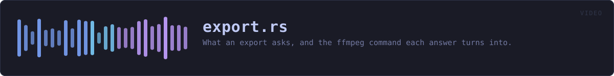
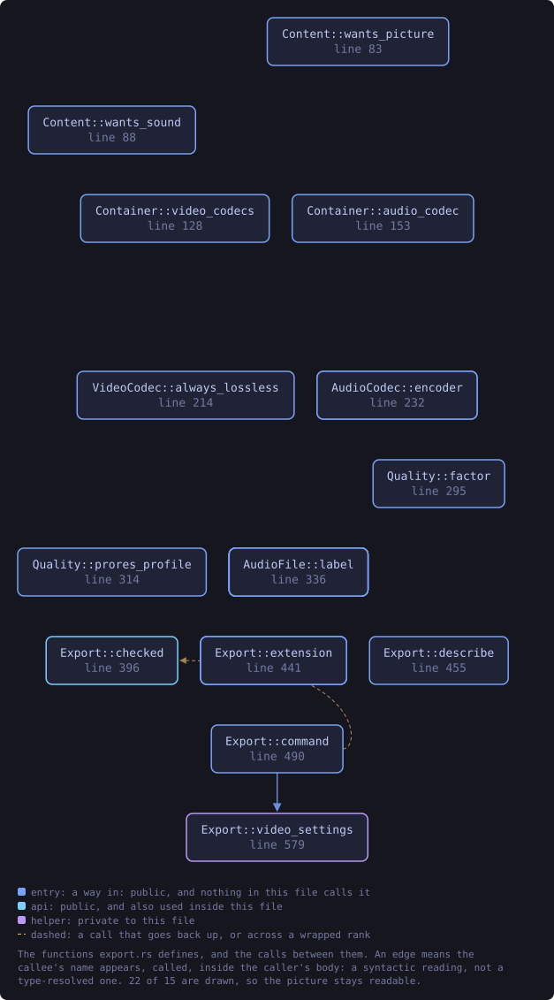

<!-- SPDX-License-Identifier: GPL-3.0-or-later -->
<!-- GENERATED by tools/docs/generate.py from the doc comments in the
     source. Do not edit this file: edit the `//!` and `///` comments in
     the .rs files and run the generator again. CI verifies it with
         python tools/docs/generate.py --check
-->

  

# `crates/veilvoice-video/src/export.rs`

[`veilvoice-video`](../../../crates/veilvoice-video/README.md) &middot; 891 lines &middot; [read the source](https://github.com/tilas01/veilvoice/blob/main/crates/veilvoice-video/src/export.rs)

## Contents

- [The audio is lossless whatever the video is](#the-audio-is-lossless-whatever-the-video-is)
- [A choice that cannot work is refused before anything runs](#a-choice-that-cannot-work-is-refused-before-anything-runs)
- [And VeilVoice still does not run it for you](#and-veilvoice-still-does-not-run-it-for-you)
- [In plain words](#in-plain-words)
  - [What this file contains](#what-this-file-contains)
  - [What calls what](#what-calls-what)
  - [Items](#items)

What an export asks, and the `ffmpeg` command each answer turns into.

**Roadmap item 175.** The Browser's export used to offer three things: a
page, a video with a black picture, or both. A recording tool asks more
than that, and this module is the questions it asks, in the order it asks
them:

1. **What to write**: the sound on its own, the picture on its own, or the
two together (`Content`).
2. **A container and a codec** (`Container`, `VideoCodec`).
3. **A quality**, from a lossless master down to something small enough to
send in a message (`Quality`).

The fourth question, how the picture looks, is `crate::motion`.

# The audio is lossless whatever the video is

There is no lossy audio codec anywhere in this module, and that is the
rule rather than a default. The recording is the point of the file and the
picture is a carrier for it: somebody who picks the smallest video there is
has chosen a smaller picture, not a worse voice. So the sound goes in as
FLAC, ALAC or plain PCM, whichever the container can carry, and a veiled
recording that leaves VeilVoice is bit for bit the one that was stored.

That rule is also why **WebM is not offered**. WebM carries Vorbis and Opus
and nothing lossless, and `ffmpeg` refuses to put FLAC in it. Offering it
would mean either breaking the rule for one container or offering a choice
that always fails, and neither is honest.

# A choice that cannot work is refused before anything runs

Not every codec goes in every container, and not every quality means
anything for every codec. `Export::checked` refuses the combinations that
would make `ffmpeg` stop after the frames were drawn, and every refusal
names something that would have worked, because "that does not go in a
MOV" is only half an answer.

# And VeilVoice still does not run it for you

Exactly as `crate::ffmpeg` says: this builds the argument list. Running
it is the caller's, and a front end names the program it found rather than
fetching one.

# In plain words

These are the questions the export asks: sound, picture or both; which kind
of file; how good. Whatever you pick for the picture, the sound is saved
without losing anything, because the voice is what the file is for.

## What this file contains

891 lines defining **23 functions** (21 public), **7 types** and **3 constants**. Everything below is read out of the source, so it cannot disagree with the code.

**The types it owns.**

- `enum Content` (line 58) -- What an export writes.
- `enum Container` (line 95) -- The file a video goes into.
- `enum VideoCodec` (line 163) -- How the picture is compressed.
- `enum AudioCodec` (line 221) -- The lossless audio an export carries.
- `enum Quality` (line 259) -- How good the picture is, and so how large the file is.
- `enum AudioFile` (line 326) -- The lossless audio-only file.
- `struct Export` (line 354) -- Every answer an export needs.

**What happens when it runs.** These are the ways in: public, and nothing else in this file calls them, so they are what an outside caller reaches first.

- `Content::label` (line 74) -- What this is called where it is chosen.
- `Content::wants_picture` (line 83) -- Whether the picture is drawn at all.
- `Content::wants_sound` (line 88) -- Whether the sound goes in.
- `Container::label` (line 110) -- What this is called where it is chosen.
- `Container::extension` (line 119) -- The file extension, without its dot.
- `Container::video_codecs` (line 128) -- The video codecs this container carries, in the order they are offered.
- `Container::audio_codec` (line 153) -- The lossless audio this container carries.
- `VideoCodec::label` (line 181) -- What this is called where it is chosen.
- `VideoCodec::encoder` (line 199) -- The ffmpeg encoder that writes it.
- `VideoCodec::always_lossless` (line 214) -- Whether every quality is the same quality for this codec.
- `AudioCodec::encoder` (line 232) -- The ffmpeg encoder that writes it.
- `AudioCodec::label` (line 243) -- What this is called where it is shown.
- `Quality::label` (line 281) -- What this is called where it is chosen.
- `Quality::factor` (line 295) -- The constant rate factor this quality means for codec, if it uses one.
- `Quality::prores_profile` (line 314) -- The ProRes profile this quality means: 3 is HQ, 2 standard, 0 proxy.
- `AudioFile::label` (line 336) -- What this is called where it is chosen.
- `AudioFile::extension` (line 344) -- The file extension, without its dot.
- `Export::extension` (line 441) -- The extension of the file this writes.
- `Export::describe` (line 455) -- What will be written, in one line a person reads before pressing the button.
- `Export::command` (line 490) -- The command that writes the export.
  - reaches: `checked`, `video_settings`

## What calls what

The functions this file defines, and the calls between them. Both
are read out of the source: an edge means the callee's name appears,
called, inside the caller's body. It is a syntactic reading, not a
type-resolved one, so a call made through a trait object or a macro
will not appear.

_22 of 15 functions are drawn; the diagram is bounded at 22 so it
stays readable. The full list is in the table below._

_Colour key: **entry** -- a way in: public, and nothing in this file calls it; **api** -- public, and also used inside this file; **helper** -- private to this file._

  

The same graph as Mermaid source

```mermaid
%%{init: {"theme":"base","themeVariables":{"background":"#1a1b26","primaryColor":"#1f2335","primaryTextColor":"#c0caf5","primaryBorderColor":"#7aa2f7","secondaryColor":"#16161e","tertiaryColor":"#16161e","lineColor":"#737aa2","textColor":"#c0caf5","mainBkg":"#1f2335","nodeBorder":"#7aa2f7","clusterBkg":"#16161e","clusterBorder":"#2f3549","fontFamily":"ui-monospace, SFMono-Regular, Consolas, monospace","fontSize":"14px"}}}%%
flowchart TD
    n_label(["Content::label<br/>line 74"])
    n_wants_picture(["Content::wants_picture<br/>line 83"])
    n_wants_sound(["Content::wants_sound<br/>line 88"])
    n_label(["Container::label<br/>line 110"])
    n_extension(["Container::extension<br/>line 119"])
    n_video_codecs(["Container::video_codecs<br/>line 128"])
    n_audio_codec(["Container::audio_codec<br/>line 153"])
    n_label(["VideoCodec::label<br/>line 181"])
    n_encoder(["VideoCodec::encoder<br/>line 199"])
    n_always_lossless(["VideoCodec::always_lossless<br/>line 214"])
    n_encoder(["AudioCodec::encoder<br/>line 232"])
    n_label(["AudioCodec::label<br/>line 243"])
    n_label(["Quality::label<br/>line 281"])
    n_factor(["Quality::factor<br/>line 295"])
    n_prores_profile(["Quality::prores_profile<br/>line 314"])
    n_label(["AudioFile::label<br/>line 336"])
    n_extension(["AudioFile::extension<br/>line 344"])
    n_checked["Export::checked<br/>line 396"]
    n_extension(["Export::extension<br/>line 441"])
    n_describe(["Export::describe<br/>line 455"])
    n_command(["Export::command<br/>line 490"])
    n_video_settings["Export::video_settings<br/>line 579"]
    n_command --> n_checked
    n_command --> n_video_settings
    click n_label href "https://github.com/tilas01/veilvoice/blob/main/crates/veilvoice-video/src/export.rs#L74" "open the source"
    click n_wants_picture href "https://github.com/tilas01/veilvoice/blob/main/crates/veilvoice-video/src/export.rs#L83" "open the source"
    click n_wants_sound href "https://github.com/tilas01/veilvoice/blob/main/crates/veilvoice-video/src/export.rs#L88" "open the source"
    click n_label href "https://github.com/tilas01/veilvoice/blob/main/crates/veilvoice-video/src/export.rs#L110" "open the source"
    click n_extension href "https://github.com/tilas01/veilvoice/blob/main/crates/veilvoice-video/src/export.rs#L119" "open the source"
    click n_video_codecs href "https://github.com/tilas01/veilvoice/blob/main/crates/veilvoice-video/src/export.rs#L128" "open the source"
    click n_audio_codec href "https://github.com/tilas01/veilvoice/blob/main/crates/veilvoice-video/src/export.rs#L153" "open the source"
    click n_label href "https://github.com/tilas01/veilvoice/blob/main/crates/veilvoice-video/src/export.rs#L181" "open the source"
    click n_encoder href "https://github.com/tilas01/veilvoice/blob/main/crates/veilvoice-video/src/export.rs#L199" "open the source"
    click n_always_lossless href "https://github.com/tilas01/veilvoice/blob/main/crates/veilvoice-video/src/export.rs#L214" "open the source"
    click n_encoder href "https://github.com/tilas01/veilvoice/blob/main/crates/veilvoice-video/src/export.rs#L232" "open the source"
    click n_label href "https://github.com/tilas01/veilvoice/blob/main/crates/veilvoice-video/src/export.rs#L243" "open the source"
    click n_label href "https://github.com/tilas01/veilvoice/blob/main/crates/veilvoice-video/src/export.rs#L281" "open the source"
    click n_factor href "https://github.com/tilas01/veilvoice/blob/main/crates/veilvoice-video/src/export.rs#L295" "open the source"
    click n_prores_profile href "https://github.com/tilas01/veilvoice/blob/main/crates/veilvoice-video/src/export.rs#L314" "open the source"
    click n_label href "https://github.com/tilas01/veilvoice/blob/main/crates/veilvoice-video/src/export.rs#L336" "open the source"
    click n_extension href "https://github.com/tilas01/veilvoice/blob/main/crates/veilvoice-video/src/export.rs#L344" "open the source"
    click n_checked href "https://github.com/tilas01/veilvoice/blob/main/crates/veilvoice-video/src/export.rs#L396" "open the source"
    click n_extension href "https://github.com/tilas01/veilvoice/blob/main/crates/veilvoice-video/src/export.rs#L441" "open the source"
    click n_describe href "https://github.com/tilas01/veilvoice/blob/main/crates/veilvoice-video/src/export.rs#L455" "open the source"
    click n_command href "https://github.com/tilas01/veilvoice/blob/main/crates/veilvoice-video/src/export.rs#L490" "open the source"
    click n_video_settings href "https://github.com/tilas01/veilvoice/blob/main/crates/veilvoice-video/src/export.rs#L579" "open the source"
    classDef entry fill:#1f2335,stroke:#7aa2f7,color:#c0caf5
    class n_label,n_wants_picture,n_wants_sound,n_label,n_extension,n_video_codecs,n_audio_codec,n_label,n_encoder,n_always_lossless,n_encoder,n_label,n_label,n_factor,n_prores_profile,n_label,n_extension,n_extension,n_describe,n_command entry
    classDef api fill:#1f2335,stroke:#7dcfff,color:#c0caf5
    class n_checked api
    classDef helper fill:#1f2335,stroke:#bb9af7,color:#c0caf5
    class n_video_settings helper
```

## Items

| Item | Line | Documentation |
|---|---:|---|
| `Content` pub enum | [58](https://github.com/tilas01/veilvoice/blob/main/crates/veilvoice-video/src/export.rs#L58) | What an export writes. |
| `Content::ALL` pub const | [71](https://github.com/tilas01/veilvoice/blob/main/crates/veilvoice-video/src/export.rs#L71) | Every choice, in the order they are offered. |
| `Content::label` pub fn | [74](https://github.com/tilas01/veilvoice/blob/main/crates/veilvoice-video/src/export.rs#L74) | What this is called where it is chosen. |
| `Content::wants_picture` pub fn | [83](https://github.com/tilas01/veilvoice/blob/main/crates/veilvoice-video/src/export.rs#L83) | Whether the picture is drawn at all. |
| `Content::wants_sound` pub fn | [88](https://github.com/tilas01/veilvoice/blob/main/crates/veilvoice-video/src/export.rs#L88) | Whether the sound goes in. |
| `Container` pub enum | [95](https://github.com/tilas01/veilvoice/blob/main/crates/veilvoice-video/src/export.rs#L95) | The file a video goes into. |
| `Container::ALL` pub const | [107](https://github.com/tilas01/veilvoice/blob/main/crates/veilvoice-video/src/export.rs#L107) | Every container, in the order they are offered. |
| `Container::label` pub fn | [110](https://github.com/tilas01/veilvoice/blob/main/crates/veilvoice-video/src/export.rs#L110) | What this is called where it is chosen. |
| `Container::extension` pub fn | [119](https://github.com/tilas01/veilvoice/blob/main/crates/veilvoice-video/src/export.rs#L119) | The file extension, without its dot. |
| `Container::video_codecs` pub fn | [128](https://github.com/tilas01/veilvoice/blob/main/crates/veilvoice-video/src/export.rs#L128) | The video codecs this container carries, in the order they are offered. |
| `Container::audio_codec` pub fn | [153](https://github.com/tilas01/veilvoice/blob/main/crates/veilvoice-video/src/export.rs#L153) | The lossless audio this container carries. |
| `VideoCodec` pub enum | [163](https://github.com/tilas01/veilvoice/blob/main/crates/veilvoice-video/src/export.rs#L163) | How the picture is compressed. |
| `VideoCodec::label` pub fn | [181](https://github.com/tilas01/veilvoice/blob/main/crates/veilvoice-video/src/export.rs#L181) | What this is called where it is chosen. |
| `VideoCodec::encoder` pub fn | [199](https://github.com/tilas01/veilvoice/blob/main/crates/veilvoice-video/src/export.rs#L199) | The ffmpeg encoder that writes it. |
| `VideoCodec::always_lossless` pub fn | [214](https://github.com/tilas01/veilvoice/blob/main/crates/veilvoice-video/src/export.rs#L214) | Whether every quality is the same quality for this codec. |
| `AudioCodec` pub enum | [221](https://github.com/tilas01/veilvoice/blob/main/crates/veilvoice-video/src/export.rs#L221) | The lossless audio an export carries. |
| `AudioCodec::encoder` pub fn | [232](https://github.com/tilas01/veilvoice/blob/main/crates/veilvoice-video/src/export.rs#L232) | The ffmpeg encoder that writes it. |
| `AudioCodec::label` pub fn | [243](https://github.com/tilas01/veilvoice/blob/main/crates/veilvoice-video/src/export.rs#L243) | What this is called where it is shown. |
| `Quality` pub enum | [259](https://github.com/tilas01/veilvoice/blob/main/crates/veilvoice-video/src/export.rs#L259) | How good the picture is, and so how large the file is. |
| `Quality::ALL` pub const | [273](https://github.com/tilas01/veilvoice/blob/main/crates/veilvoice-video/src/export.rs#L273) | Every quality, best first. |
| `Quality::label` pub fn | [281](https://github.com/tilas01/veilvoice/blob/main/crates/veilvoice-video/src/export.rs#L281) | What this is called where it is chosen. |
| `Quality::factor` pub fn | [295](https://github.com/tilas01/veilvoice/blob/main/crates/veilvoice-video/src/export.rs#L295) | The constant rate factor this quality means for codec, if it uses one. |
| `Quality::prores_profile` pub fn | [314](https://github.com/tilas01/veilvoice/blob/main/crates/veilvoice-video/src/export.rs#L314) | The ProRes profile this quality means: 3 is HQ, 2 standard, 0 proxy. |
| `AudioFile` pub enum | [326](https://github.com/tilas01/veilvoice/blob/main/crates/veilvoice-video/src/export.rs#L326) | The lossless audio-only file. |
| `AudioFile::label` pub fn | [336](https://github.com/tilas01/veilvoice/blob/main/crates/veilvoice-video/src/export.rs#L336) | What this is called where it is chosen. |
| `AudioFile::extension` pub fn | [344](https://github.com/tilas01/veilvoice/blob/main/crates/veilvoice-video/src/export.rs#L344) | The file extension, without its dot. |
| `Export` pub struct | [354](https://github.com/tilas01/veilvoice/blob/main/crates/veilvoice-video/src/export.rs#L354) | Every answer an export needs. |
| `Export::default` fn | [377](https://github.com/tilas01/veilvoice/blob/main/crates/veilvoice-video/src/export.rs#L377) | High quality H.264 in an MP4 with FLAC in it, at 1080p and sixty frames a second. |
| `Export::checked` pub fn | [396](https://github.com/tilas01/veilvoice/blob/main/crates/veilvoice-video/src/export.rs#L396) | Refuse a combination ffmpeg would refuse, and say what would work. |
| `Export::extension` pub fn | [441](https://github.com/tilas01/veilvoice/blob/main/crates/veilvoice-video/src/export.rs#L441) | The extension of the file this writes. |
| `Export::describe` pub fn | [455](https://github.com/tilas01/veilvoice/blob/main/crates/veilvoice-video/src/export.rs#L455) | What will be written, in one line a person reads before pressing the button. |
| `Export::command` pub fn | [490](https://github.com/tilas01/veilvoice/blob/main/crates/veilvoice-video/src/export.rs#L490) | The command that writes the export. |
| `Export::video_settings` fn | [579](https://github.com/tilas01/veilvoice/blob/main/crates/veilvoice-video/src/export.rs#L579) | The encoder settings for the chosen codec and quality. |

---

Generated from `crates/veilvoice-video/src/export.rs`. On the website: [`website/reference/veilvoice-video/export.html`](../../../website/reference/veilvoice-video/export.html).

Signing key fingerprint `8101FB3BB28D02FB239E0CDF9CC1C7E7A9B5833A`.
