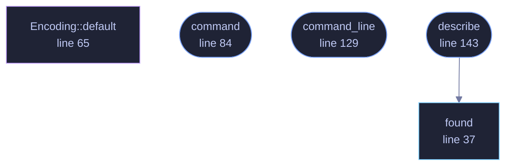

<!-- SPDX-License-Identifier: GPL-3.0-or-later -->
<!-- GENERATED by tools/docs/generate.py from the doc comments in the
     source. Do not edit this file: edit the `//!` and `///` comments in
     the .rs files and run the generator again. CI verifies it with
         python tools/docs/generate.py --check
-->

  

# `crates/veilvoice-video/src/ffmpeg.rs`

[`veilvoice-video`](../../../crates/veilvoice-video/README.md) &middot; 278 lines &middot; [read the source](https://github.com/tilas01/veilvoice/blob/main/crates/veilvoice-video/src/ffmpeg.rs)

## Contents

- [Why there is no encoder here](#why-there-is-no-encoder-here)
- [And VeilVoice will not run it for you](#and-veilvoice-will-not-run-it-for-you)
- [If the machine has no ffmpeg, nothing has failed](#if-the-machine-has-no-ffmpeg-nothing-has-failed)
  - [What this file contains](#what-this-file-contains)
  - [What calls what](#what-calls-what)
  - [Items](#items)

The video file, which needs a codec this project does not ship.

# Why there is no encoder here

A conversation an hour long is about 108,000 frames at 30 per second. Turning
those into something a phone will play means H.264 or AV1, and writing
either is not a sensible thing for a voice de-identifier to do. Pulling one
in is worse: every usable encoder is a large C library, and this project's
dependency graph containing no such thing is a claim on its front page that
a reader can check with `cargo tree` in ten seconds.

So the honest arrangement is the one the rest of the project already uses
for exactly this kind of problem — the download in `veilvoice-verify`, the
registry in `veilvoice-watch`, the driver list in `veilvoice-drivers`. Find
the tool the machine already has, prepare the exact command, and let the
person decide.

# And VeilVoice will not run it for you

`command` builds the argument list. Running it is the caller's, and a
front end should print it rather than execute it silently — the same rule
the companion installer follows, for the same reason.

# If the machine has no ffmpeg, nothing has failed

`crate::page::player` has already written a file that plays everywhere
and needs nothing installed. The video file is the extra, not the product.

## What this file contains

278 lines defining **5 functions** (4 public), **1 type** and **0 constants**. Everything below is read out of the source, so it cannot disagree with the code.

**The types it owns.**

- `struct Encoding` (line 57) -- How to render the file.

**What happens when it runs.** These are the ways in: public, and nothing else in this file calls them, so they are what an outside caller reaches first.

- `command` (line 84) -- The command that turns a directory of numbered frames and a WAV into a video file.
- `command_line` (line 129) -- The command as one line, for printing.
- `describe` (line 143) -- What to tell the user about their machine's ffmpeg.
  - reaches: `found`

## What calls what

The functions this file defines, and the calls between them. Both
are read out of the source: an edge means the callee's name appears,
called, inside the caller's body. It is a syntactic reading, not a
type-resolved one, so a call made through a trait object or a macro
will not appear.

_Colour key: **entry** -- a way in: public, and nothing in this file calls it; **api** -- public, and also used inside this file; **helper** -- private to this file._

## Items

| Item | Line | Documentation |
|---|---:|---|
| `found` pub fn | [37](https://github.com/tilas01/veilvoice/blob/main/crates/veilvoice-video/src/ffmpeg.rs#L37) | Where ffmpeg is, if this machine has one. |
| `Encoding` pub struct | [57](https://github.com/tilas01/veilvoice/blob/main/crates/veilvoice-video/src/ffmpeg.rs#L57) | How to render the file. |
| `Encoding::default` fn | [65](https://github.com/tilas01/veilvoice/blob/main/crates/veilvoice-video/src/ffmpeg.rs#L65) |  |
| `command` pub fn | [84](https://github.com/tilas01/veilvoice/blob/main/crates/veilvoice-video/src/ffmpeg.rs#L84) | The command that turns a directory of numbered frames and a WAV into a video file. |
| `command_line` pub fn | [129](https://github.com/tilas01/veilvoice/blob/main/crates/veilvoice-video/src/ffmpeg.rs#L129) | The command as one line, for printing. |
| `describe` pub fn | [143](https://github.com/tilas01/veilvoice/blob/main/crates/veilvoice-video/src/ffmpeg.rs#L143) | What to tell the user about their machine's ffmpeg. |

---

Generated from `crates/veilvoice-video/src/ffmpeg.rs`. On the website: [`website/reference/veilvoice-video/ffmpeg.html`](../../../website/reference/veilvoice-video/ffmpeg.html).

Signing key fingerprint `8101FB3BB28D02FB239E0CDF9CC1C7E7A9B5833A`.
