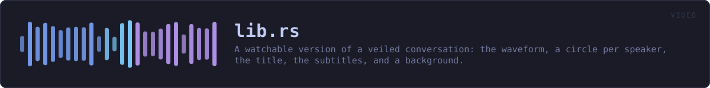
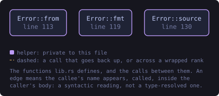
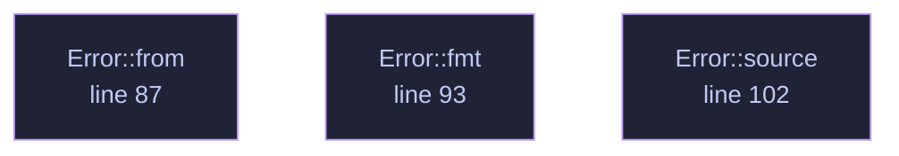

<!-- SPDX-License-Identifier: GPL-3.0-or-later -->
<!-- GENERATED by tools/docs/generate.py from the doc comments in the
     source. Do not edit this file: edit the `//!` and `///` comments in
     the .rs files and run the generator again. CI verifies it with
         python tools/docs/generate.py --check
-->

  

# `crates/veilvoice-video/src/lib.rs`

[`veilvoice-video`](../../../crates/veilvoice-video/README.md) &middot; 140 lines &middot; [read the source](https://github.com/tilas01/veilvoice/blob/main/crates/veilvoice-video/src/lib.rs)

## Contents

  - [What this produces, and what needs something else](#what-this-produces-and-what-needs-something-else)
  - [The page needs a little JavaScript, and says so](#the-page-needs-a-little-javascript-and-says-so)
  - [A picture is not veiled](#a-picture-is-not-veiled)
- [In plain words](#in-plain-words)
  - [What this file contains](#what-this-file-contains)
  - [What calls what](#what-calls-what)
  - [Items](#items)

A watchable version of a veiled conversation: the waveform, a circle per
speaker, the title, the subtitles, and a background.

## What this produces, and what needs something else

**A self-contained page, always.** `page::player` writes one HTML file
that plays the veiled audio, draws its waveform, lights each speaker's
circle as they talk and shows the subtitles. It needs nothing installed, it
contacts nothing, it opens in any browser on any device, and it is what this
crate is for.

**A video file, only if `ffmpeg` is there.** Turning a few thousand frames
into an `.mp4` needs a codec, and this project ships none: writing an H.264
encoder is not a sensible thing for a voice de-identifier to do, and pulling
one in would put a large C dependency into a graph whose emptiness is a
front-page claim. So `ffmpeg` finds the tool if the machine has it and
prepares the exact command; if the machine does not, the page is still
there and nothing has failed.

VeilVoice never downloads or runs `ffmpeg` on your behalf, exactly as it
never installs any other companion.

## The page needs a little JavaScript, and says so

Lighting the right circle means knowing where the audio has got to, and only
the audio element knows that. There is a small inline script, with no file,
no network and no library, and a `<noscript>` that says what it does. Without it
the audio still plays, the subtitles still appear and the waveform is still
drawn; the circles simply do not light up.

## A picture is not veiled

A speaker may have a portrait, and it is drawn exactly as supplied. Nothing
here anonymises an image: a photograph of somebody's face beside their
veiled voice identifies them completely. The default is a plain filled
circle for that reason, and `SCOPE` says it where a user will read it.

# In plain words

This draws the picture.

A waveform, a circle for each person in their own colour with their name under
it, a title, and a page that plays all of it together in a browser and needs
nothing installed.

It does not make a video file. That needs an encoder, and this project ships
none -- so it prints the command that would do it with `ffmpeg`, if you have
`ffmpeg`, and leaves running it to you.

## What this file contains

140 lines defining **3 functions** (0 public), **1 type** and **2 constants**. Everything below is read out of the source, so it cannot disagree with the code.

**The types it owns.**

- `enum Error` (line 79) -- Everything that can go wrong in this crate.

## What calls what

The functions this file defines, and the calls between them. Both
are read out of the source: an edge means the callee's name appears,
called, inside the caller's body. It is a syntactic reading, not a
type-resolved one, so a call made through a trait object or a macro
will not appear.

_Colour key: **helper** -- private to this file._

  

The same graph as Mermaid source

## Items

| Item | Line | Documentation |
|---|---:|---|
| `VERSION` pub const | [61](https://github.com/tilas01/veilvoice/blob/main/crates/veilvoice-video/src/lib.rs#L61) | Crate version string, surfaced in the About panel. |
| `SCOPE` pub const | [67](https://github.com/tilas01/veilvoice/blob/main/crates/veilvoice-video/src/lib.rs#L67) | What a rendered video is worth, in the words a front end should show. |
| `Error` pub enum | [79](https://github.com/tilas01/veilvoice/blob/main/crates/veilvoice-video/src/lib.rs#L79) | Everything that can go wrong in this crate. |
| `Error::from` fn | [87](https://github.com/tilas01/veilvoice/blob/main/crates/veilvoice-video/src/lib.rs#L87) |  |
| `Error::fmt` fn | [93](https://github.com/tilas01/veilvoice/blob/main/crates/veilvoice-video/src/lib.rs#L93) |  |
| `Error::source` fn | [102](https://github.com/tilas01/veilvoice/blob/main/crates/veilvoice-video/src/lib.rs#L102) |  |

---

Generated from `crates/veilvoice-video/src/lib.rs`. On the website: [`website/reference/veilvoice-video/lib.html`](../../../website/reference/veilvoice-video/lib.html).

Signing key fingerprint `8101FB3BB28D02FB239E0CDF9CC1C7E7A9B5833A`.
