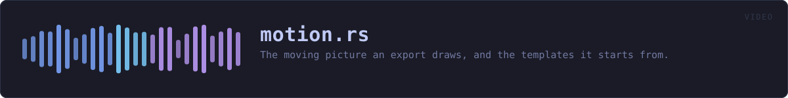
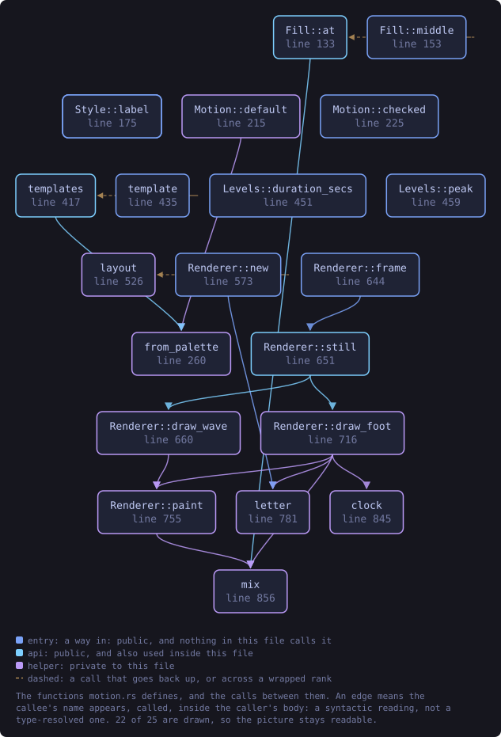

<!-- SPDX-License-Identifier: GPL-3.0-or-later -->
<!-- GENERATED by tools/docs/generate.py from the doc comments in the
     source. Do not edit this file: edit the `//!` and `///` comments in
     the .rs files and run the generator again. CI verifies it with
         python tools/docs/generate.py --check
-->

  

# `crates/veilvoice-video/src/motion.rs`

[`veilvoice-video`](../../../crates/veilvoice-video/README.md) &middot; 1116 lines &middot; [read the source](https://github.com/tilas01/veilvoice/blob/main/crates/veilvoice-video/src/motion.rs)

## Contents

- [The whole look is a setting](#the-whole-look-is-a-setting)
- [Templates, so nobody has to open the advanced half](#templates-so-nobody-has-to-open-the-advanced-half)
- [Why a timeline of levels rather than the samples](#why-a-timeline-of-levels-rather-than-the-samples)
- [The same picture on every machine](#the-same-picture-on-every-machine)
- [In plain words](#in-plain-words)
  - [What this file contains](#what-this-file-contains)
  - [What calls what](#what-calls-what)
  - [Items](#items)

The moving picture an export draws, and the templates it starts from.

**Roadmap item 175.** The Browser's video used to be a black frame with the
sound under it, which is enough for somewhere that only takes video and is
nothing anybody would choose to watch. This is the picture a recording tool
draws: a wave that answers the sound as it plays, moving across the frame,
in colours chosen to look right in motion.

# The whole look is a setting

`Motion` is every part of it:

* **the lettering**: the built-in face, heavier, or none at all
(`Face`);
* **the colours**: the background and the wave, each a flat colour or a
gradient (`Fill`);
* **the shape**: bars from a baseline, bars mirrored about the middle, or a
line (`Style`);
* **how strongly the wave answers the sound** (`Motion::response`);
* **how many seconds of it are on screen at once**
(`Motion::window_secs`);
* **how quickly it settles** after a loud moment (`Motion::settle_secs`).

# Templates, so nobody has to open the advanced half

`templates` is one for every theme the application already has, built
from that theme's own colours, and several more chosen because they look
right moving rather than because they match a panel. The default is the
application's default theme, and its settings are the ones that looked best
at sixty frames a second: high enough quality and smooth enough that the
defaults are the answer for most people.

# Why a timeline of levels rather than the samples

Drawing a frame from the samples means reading every sample on screen, for
every frame: six seconds of 48 kHz audio is nearly three hundred thousand
samples, sixty times a second. So the recording is reduced once, to a level
every five milliseconds with the settling already applied (`levels`), and
a frame reads a few hundred of those. The smoothing is computed in time
order along the whole recording, which is what makes it a property of the
sound rather than of the frame rate: the same recording settles the same
way at twenty-four frames a second and at sixty.

# The same picture on every machine

As for everything `crate::raster` draws: no system fonts and no
dependency, so two people exporting one recording with one template get the
same frames.

# In plain words

This draws the video: a wave that moves with the voice, in a colour scheme
you pick from a list or make yourself. The defaults are chosen so that most
people never need to change anything.

## What this file contains

1116 lines defining **27 functions** (18 public), **9 types** and **8 constants**. Everything below is read out of the source, so it cannot disagree with the code.

**The types it owns.**

- `enum Face` (line 65) -- How the title and the times are lettered.
- `enum Direction` (line 91) -- Which way a gradient runs.
- `enum Fill` (line 117) -- A colour, or two with a gradient between them.
- `enum Style` (line 160) -- The shape the wave is drawn as.
- `struct Motion` (line 193) -- The whole look of a video.
- `struct Template` (line 249) -- A named starting point.
- `struct Levels` (line 444) -- How loud the recording is, every five milliseconds, already settled.
- `struct Layout` (line 512) -- Where everything on a frame goes.
- `struct Renderer` (line 558) -- Draws the frames of one export.

**What happens when it runs.** These are the ways in: public, and nothing else in this file calls them, so they are what an outside caller reaches first.

- `Face::label` (line 80) -- What this is called where it is chosen.
- `Direction::label` (line 106) -- What this is called where it is chosen.
- `Fill::middle` (line 153) -- The colour a thumbnail or a picker shows for this fill: its middle.
  - reaches: `at`, `mix`
- `Style::label` (line 175) -- What this is called where it is chosen.
- `Motion::checked` (line 225) -- Refuse settings outside the ranges the controls offer.
- `template` (line 435) -- The template with this identifier.
  - reaches: `templates`, `from_palette`
- `Levels::duration_secs` (line 451) -- How long the recording is.
- `Levels::peak` (line 459) -- The loudest settled level between two moments, from 0.0 to 1.0.
- `levels` (line 478) -- Reduce a recording to the timeline a picture is drawn from.
- `Renderer::new` (line 573) -- A renderer for levels at size, fps frames a second, with title lettered at the top unless the face is Face::None.
  - reaches: `layout`, `letter`
- `Renderer::frames` (line 628) -- How many frames the video has: the length times the rate, rounded up so the last partial frame is still shown.
- `Renderer::undrawable` (line 634) -- Text that came out as boxes, so a front end can say so before the render rather than after.
- `Renderer::frame_bytes` (line 639) -- The size of one frame in bytes, as rgb24.
- `Renderer::frame` (line 644) -- Draw frame index into out, which is resized to fit.
  - reaches: `still`, `draw_foot`, `draw_wave`, `clock`, `letter`, `mix`, `paint`
- `thumbnail` (line 810) -- A picture of a whole recording, for a list of them.

## What calls what

The functions this file defines, and the calls between them. Both
are read out of the source: an edge means the callee's name appears,
called, inside the caller's body. It is a syntactic reading, not a
type-resolved one, so a call made through a trait object or a macro
will not appear.

_22 of 25 functions are drawn; the diagram is bounded at 22 so it
stays readable. The full list is in the table below._

_Colour key: **entry** -- a way in: public, and nothing in this file calls it; **api** -- public, and also used inside this file; **helper** -- private to this file._

  

The same graph as Mermaid source

```mermaid
%%{init: {"theme":"base","themeVariables":{"background":"#1a1b26","primaryColor":"#1f2335","primaryTextColor":"#c0caf5","primaryBorderColor":"#7aa2f7","secondaryColor":"#16161e","tertiaryColor":"#16161e","lineColor":"#737aa2","textColor":"#c0caf5","mainBkg":"#1f2335","nodeBorder":"#7aa2f7","clusterBkg":"#16161e","clusterBorder":"#2f3549","fontFamily":"ui-monospace, SFMono-Regular, Consolas, monospace","fontSize":"14px"}}}%%
flowchart TD
    n_label(["Face::label<br/>line 80"])
    n_label(["Direction::label<br/>line 106"])
    n_at["Fill::at<br/>line 133"]
    n_middle(["Fill::middle<br/>line 153"])
    n_label(["Style::label<br/>line 175"])
    n_default["Motion::default<br/>line 215"]
    n_checked(["Motion::checked<br/>line 225"])
    n_from_palette["from_palette<br/>line 260"]
    n_templates["templates<br/>line 417"]
    n_template(["template<br/>line 435"])
    n_duration_secs(["Levels::duration_secs<br/>line 451"])
    n_peak(["Levels::peak<br/>line 459"])
    n_layout["layout<br/>line 526"]
    n_new(["Renderer::new<br/>line 573"])
    n_frame(["Renderer::frame<br/>line 644"])
    n_still["Renderer::still<br/>line 651"]
    n_draw_wave["Renderer::draw_wave<br/>line 660"]
    n_draw_foot["Renderer::draw_foot<br/>line 716"]
    n_paint["Renderer::paint<br/>line 755"]
    n_letter["letter<br/>line 781"]
    n_clock["clock<br/>line 845"]
    n_mix["mix<br/>line 856"]
    n_at --> n_mix
    n_default --> n_from_palette
    n_draw_foot --> n_clock
    n_draw_foot --> n_letter
    n_draw_foot --> n_mix
    n_draw_foot --> n_paint
    n_draw_wave --> n_paint
    n_frame --> n_still
    n_middle --> n_at
    n_new --> n_layout
    n_new --> n_letter
    n_paint --> n_mix
    n_still --> n_draw_foot
    n_still --> n_draw_wave
    n_template --> n_templates
    n_templates --> n_from_palette
    click n_label href "https://github.com/tilas01/veilvoice/blob/main/crates/veilvoice-video/src/motion.rs#L80" "open the source"
    click n_label href "https://github.com/tilas01/veilvoice/blob/main/crates/veilvoice-video/src/motion.rs#L106" "open the source"
    click n_at href "https://github.com/tilas01/veilvoice/blob/main/crates/veilvoice-video/src/motion.rs#L133" "open the source"
    click n_middle href "https://github.com/tilas01/veilvoice/blob/main/crates/veilvoice-video/src/motion.rs#L153" "open the source"
    click n_label href "https://github.com/tilas01/veilvoice/blob/main/crates/veilvoice-video/src/motion.rs#L175" "open the source"
    click n_default href "https://github.com/tilas01/veilvoice/blob/main/crates/veilvoice-video/src/motion.rs#L215" "open the source"
    click n_checked href "https://github.com/tilas01/veilvoice/blob/main/crates/veilvoice-video/src/motion.rs#L225" "open the source"
    click n_from_palette href "https://github.com/tilas01/veilvoice/blob/main/crates/veilvoice-video/src/motion.rs#L260" "open the source"
    click n_templates href "https://github.com/tilas01/veilvoice/blob/main/crates/veilvoice-video/src/motion.rs#L417" "open the source"
    click n_template href "https://github.com/tilas01/veilvoice/blob/main/crates/veilvoice-video/src/motion.rs#L435" "open the source"
    click n_duration_secs href "https://github.com/tilas01/veilvoice/blob/main/crates/veilvoice-video/src/motion.rs#L451" "open the source"
    click n_peak href "https://github.com/tilas01/veilvoice/blob/main/crates/veilvoice-video/src/motion.rs#L459" "open the source"
    click n_layout href "https://github.com/tilas01/veilvoice/blob/main/crates/veilvoice-video/src/motion.rs#L526" "open the source"
    click n_new href "https://github.com/tilas01/veilvoice/blob/main/crates/veilvoice-video/src/motion.rs#L573" "open the source"
    click n_frame href "https://github.com/tilas01/veilvoice/blob/main/crates/veilvoice-video/src/motion.rs#L644" "open the source"
    click n_still href "https://github.com/tilas01/veilvoice/blob/main/crates/veilvoice-video/src/motion.rs#L651" "open the source"
    click n_draw_wave href "https://github.com/tilas01/veilvoice/blob/main/crates/veilvoice-video/src/motion.rs#L660" "open the source"
    click n_draw_foot href "https://github.com/tilas01/veilvoice/blob/main/crates/veilvoice-video/src/motion.rs#L716" "open the source"
    click n_paint href "https://github.com/tilas01/veilvoice/blob/main/crates/veilvoice-video/src/motion.rs#L755" "open the source"
    click n_letter href "https://github.com/tilas01/veilvoice/blob/main/crates/veilvoice-video/src/motion.rs#L781" "open the source"
    click n_clock href "https://github.com/tilas01/veilvoice/blob/main/crates/veilvoice-video/src/motion.rs#L845" "open the source"
    click n_mix href "https://github.com/tilas01/veilvoice/blob/main/crates/veilvoice-video/src/motion.rs#L856" "open the source"
    classDef entry fill:#1f2335,stroke:#7aa2f7,color:#c0caf5
    class n_label,n_label,n_middle,n_label,n_checked,n_template,n_duration_secs,n_peak,n_new,n_frame entry
    classDef api fill:#1f2335,stroke:#7dcfff,color:#c0caf5
    class n_at,n_templates,n_still api
    classDef helper fill:#1f2335,stroke:#bb9af7,color:#c0caf5
    class n_default,n_from_palette,n_layout,n_draw_wave,n_draw_foot,n_paint,n_letter,n_clock,n_mix helper
```

## Items

| Item | Line | Documentation |
|---|---:|---|
| `Face` pub enum | [65](https://github.com/tilas01/veilvoice/blob/main/crates/veilvoice-video/src/motion.rs#L65) | How the title and the times are lettered. |
| `Face::ALL` pub const | [77](https://github.com/tilas01/veilvoice/blob/main/crates/veilvoice-video/src/motion.rs#L77) | Every face, in the order they are offered. |
| `Face::label` pub fn | [80](https://github.com/tilas01/veilvoice/blob/main/crates/veilvoice-video/src/motion.rs#L80) | What this is called where it is chosen. |
| `Direction` pub enum | [91](https://github.com/tilas01/veilvoice/blob/main/crates/veilvoice-video/src/motion.rs#L91) | Which way a gradient runs. |
| `Direction::ALL` pub const | [103](https://github.com/tilas01/veilvoice/blob/main/crates/veilvoice-video/src/motion.rs#L103) | Every direction, in the order they are offered. |
| `Direction::label` pub fn | [106](https://github.com/tilas01/veilvoice/blob/main/crates/veilvoice-video/src/motion.rs#L106) | What this is called where it is chosen. |
| `Fill` pub enum | [117](https://github.com/tilas01/veilvoice/blob/main/crates/veilvoice-video/src/motion.rs#L117) | A colour, or two with a gradient between them. |
| `Fill::at` pub fn | [133](https://github.com/tilas01/veilvoice/blob/main/crates/veilvoice-video/src/motion.rs#L133) | The colour at a point, given as a fraction of the width and height. |
| `Fill::middle` pub fn | [153](https://github.com/tilas01/veilvoice/blob/main/crates/veilvoice-video/src/motion.rs#L153) | The colour a thumbnail or a picker shows for this fill: its middle. |
| `Style` pub enum | [160](https://github.com/tilas01/veilvoice/blob/main/crates/veilvoice-video/src/motion.rs#L160) | The shape the wave is drawn as. |
| `Style::ALL` pub const | [172](https://github.com/tilas01/veilvoice/blob/main/crates/veilvoice-video/src/motion.rs#L172) | Every style, in the order they are offered. |
| `Style::label` pub fn | [175](https://github.com/tilas01/veilvoice/blob/main/crates/veilvoice-video/src/motion.rs#L175) | What this is called where it is chosen. |
| `RESPONSE_RANGE` pub const | [185](https://github.com/tilas01/veilvoice/blob/main/crates/veilvoice-video/src/motion.rs#L185) | The smallest and largest Motion::response. |
| `WINDOW_RANGE` pub const | [187](https://github.com/tilas01/veilvoice/blob/main/crates/veilvoice-video/src/motion.rs#L187) | The shortest and longest Motion::window_secs. |
| `SETTLE_RANGE` pub const | [189](https://github.com/tilas01/veilvoice/blob/main/crates/veilvoice-video/src/motion.rs#L189) | The shortest and longest Motion::settle_secs. |
| `Motion` pub struct | [193](https://github.com/tilas01/veilvoice/blob/main/crates/veilvoice-video/src/motion.rs#L193) | The whole look of a video. |
| `Motion::default` fn | [215](https://github.com/tilas01/veilvoice/blob/main/crates/veilvoice-video/src/motion.rs#L215) |  |
| `Motion::checked` pub fn | [225](https://github.com/tilas01/veilvoice/blob/main/crates/veilvoice-video/src/motion.rs#L225) | Refuse settings outside the ranges the controls offer. |
| `Template` pub struct | [249](https://github.com/tilas01/veilvoice/blob/main/crates/veilvoice-video/src/motion.rs#L249) | A named starting point. |
| `from_palette` fn | [260](https://github.com/tilas01/veilvoice/blob/main/crates/veilvoice-video/src/motion.rs#L260) | The template a theme makes: its own background, its two accents as the wave, its own text colour. |
| `EXTRAS` const | [283](https://github.com/tilas01/veilvoice/blob/main/crates/veilvoice-video/src/motion.rs#L283) | The templates that are not a theme, chosen for how they look moving. |
| `templates` pub fn | [417](https://github.com/tilas01/veilvoice/blob/main/crates/veilvoice-video/src/motion.rs#L417) | Every template: one per theme, in the themes' own order, then the extras. |
| `template` pub fn | [435](https://github.com/tilas01/veilvoice/blob/main/crates/veilvoice-video/src/motion.rs#L435) | The template with this identifier. |
| `HOP_SECS` pub const | [440](https://github.com/tilas01/veilvoice/blob/main/crates/veilvoice-video/src/motion.rs#L440) | Seconds between two entries of a Levels timeline. |
| `Levels` pub struct | [444](https://github.com/tilas01/veilvoice/blob/main/crates/veilvoice-video/src/motion.rs#L444) | How loud the recording is, every five milliseconds, already settled. |
| `Levels::duration_secs` pub fn | [451](https://github.com/tilas01/veilvoice/blob/main/crates/veilvoice-video/src/motion.rs#L451) | How long the recording is. |
| `Levels::peak` pub fn | [459](https://github.com/tilas01/veilvoice/blob/main/crates/veilvoice-video/src/motion.rs#L459) | The loudest settled level between two moments, from 0.0 to 1.0. |
| `levels` pub fn | [478](https://github.com/tilas01/veilvoice/blob/main/crates/veilvoice-video/src/motion.rs#L478) | Reduce a recording to the timeline a picture is drawn from. |
| `Layout` struct | [512](https://github.com/tilas01/veilvoice/blob/main/crates/veilvoice-video/src/motion.rs#L512) | Where everything on a frame goes. |
| `layout` fn | [526](https://github.com/tilas01/veilvoice/blob/main/crates/veilvoice-video/src/motion.rs#L526) | Where the wave, the title and the progress line go on a frame of this size. |
| `Renderer` pub struct | [558](https://github.com/tilas01/veilvoice/blob/main/crates/veilvoice-video/src/motion.rs#L558) | Draws the frames of one export. |
| `Renderer::new` pub fn | [573](https://github.com/tilas01/veilvoice/blob/main/crates/veilvoice-video/src/motion.rs#L573) | A renderer for levels at size, fps frames a second, with title lettered at the top unless the face is Face::None. |
| `Renderer::frames` pub fn | [628](https://github.com/tilas01/veilvoice/blob/main/crates/veilvoice-video/src/motion.rs#L628) | How many frames the video has: the length times the rate, rounded up so the last partial frame is still shown. |
| `Renderer::undrawable` pub fn | [634](https://github.com/tilas01/veilvoice/blob/main/crates/veilvoice-video/src/motion.rs#L634) | Text that came out as boxes, so a front end can say so before the render rather than after. |
| `Renderer::frame_bytes` pub fn | [639](https://github.com/tilas01/veilvoice/blob/main/crates/veilvoice-video/src/motion.rs#L639) | The size of one frame in bytes, as rgb24. |
| `Renderer::frame` pub fn | [644](https://github.com/tilas01/veilvoice/blob/main/crates/veilvoice-video/src/motion.rs#L644) | Draw frame index into out, which is resized to fit. |
| `Renderer::still` pub fn | [651](https://github.com/tilas01/veilvoice/blob/main/crates/veilvoice-video/src/motion.rs#L651) | Draw frame index as a canvas, for a still or a test. |
| `Renderer::draw_wave` fn | [660](https://github.com/tilas01/veilvoice/blob/main/crates/veilvoice-video/src/motion.rs#L660) | The wave as it stands at at_secs, newest sound at the right. |
| `Renderer::draw_foot` fn | [716](https://github.com/tilas01/veilvoice/blob/main/crates/veilvoice-video/src/motion.rs#L716) | The elapsed time, the length, and a progress line under them. |
| `Renderer::paint` fn | [755](https://github.com/tilas01/veilvoice/blob/main/crates/veilvoice-video/src/motion.rs#L755) | Fill a rectangle with the wave's colours, with soft edges where it falls between pixels. |
| `letter` fn | [781](https://github.com/tilas01/veilvoice/blob/main/crates/veilvoice-video/src/motion.rs#L781) | Letter text centred on centre_x, heavier for Face::Bold. |
| `thumbnail` pub fn | [810](https://github.com/tilas01/veilvoice/blob/main/crates/veilvoice-video/src/motion.rs#L810) | A picture of a whole recording, for a list of them. |
| `clock` fn | [845](https://github.com/tilas01/veilvoice/blob/main/crates/veilvoice-video/src/motion.rs#L845) | m:ss, or h:mm:ss past an hour. |
| `mix` fn | [856](https://github.com/tilas01/veilvoice/blob/main/crates/veilvoice-video/src/motion.rs#L856) | Mix from a towards b by t. |

---

Generated from `crates/veilvoice-video/src/motion.rs`. On the website: [`website/reference/veilvoice-video/motion.html`](../../../website/reference/veilvoice-video/motion.html).

Signing key fingerprint `8101FB3BB28D02FB239E0CDF9CC1C7E7A9B5833A`.
