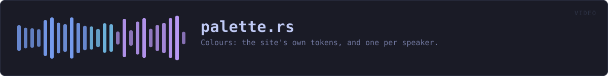
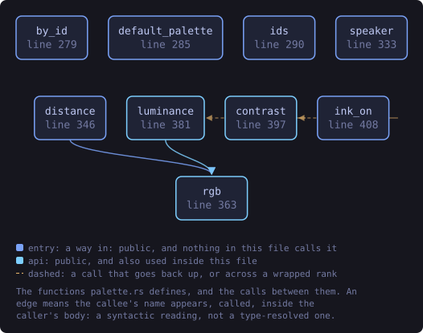
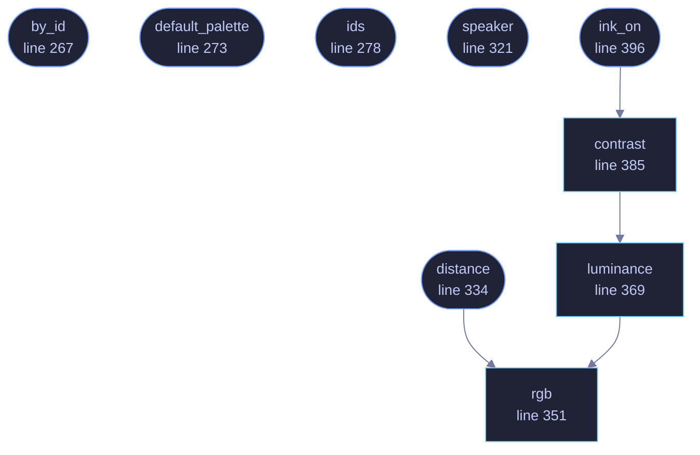

<!-- SPDX-License-Identifier: GPL-3.0-or-later -->
<!-- GENERATED by tools/docs/generate.py from the doc comments in the
     source. Do not edit this file: edit the `//!` and `///` comments in
     the .rs files and run the generator again. CI verifies it with
         python tools/docs/generate.py --check
-->

  

# `crates/veilvoice-video/src/palette.rs`

[`veilvoice-video`](../../../crates/veilvoice-video/README.md) &middot; 735 lines &middot; [read the source](https://github.com/tilas01/veilvoice/blob/main/crates/veilvoice-video/src/palette.rs)

## Contents

- [One source of colour, cross-checked by a test](#one-source-of-colour-cross-checked-by-a-test)
- [Ten speaker colours, ordered by measurement rather than by eye](#ten-speaker-colours-ordered-by-measurement-rather-than-by-eye)
- [Colour is never the only signal](#colour-is-never-the-only-signal)
  - [What this file contains](#what-this-file-contains)
  - [What calls what](#what-calls-what)
  - [Items](#items)

Colours: the site's own tokens, and one per speaker.

# One source of colour, cross-checked by a test

The hexes below are Tokyo Night, and they are the same ones
`website/css/themes.css` declares. They are written out here rather than
parsed at run time because a crate should not need the website to be on disk
to draw a circle — and a test reads that stylesheet and fails if the two ever
disagree, which is the same arrangement `veilvoice-gui` has had since the
themes existed.

# Ten speaker colours, ordered by measurement rather than by eye

Six of them are palette tokens. The other four are from the wider Tokyo
Night set, chosen to sit between the tokens.

The **order** was first written down by looking at a hue wheel, and it was
wrong: a test comparing every pair found a further-apart pair than the one
put first. So the order is now computed rather than judged, by
`distance` — the "redmean" approximation, which is the cheap standard
stand-in for perceptual difference and weights green most because the eye
does.

Slot 0 and slot 1 are **the** furthest-apart pair in the set, because two
speakers is the common case. Every slot after that is the colour whose
nearest neighbour among the ones already used is furthest away — a maximin
order, so the table degrades gracefully: a recording with four people uses
four colours chosen to be as separable as four can be, rather than the first
four somebody listed.

Ten colours cannot all be far apart. Under this metric the furthest pair
scores 507 and the closest pair anywhere in the set scores 63, and the
closest pair is only ever reached by a recording with nine or ten people in
it.

One colour is deliberately not a hue at all: the near-white foreground
token, separated from every saturated colour by **lightness** — the axis
that is still free once the wheel is full.

# Colour is never the only signal

Somebody who cannot separate two of these needs the name, and the name is
always drawn beside the circle and always in the subtitles. A player that
showed only colours would be one about eight per cent of men could not use.

## What this file contains

735 lines defining **9 functions** (9 public), **1 type** and **8 constants**. Everything below is read out of the source, so it cannot disagree with the code.

**The types it owns.**

- `struct Palette` (line 66) -- One complete colour scheme, matching one data-theme block in website/css/themes.css and one entry in veilvoice-gui's theme table.

**What happens when it runs.** These are the ways in: public, and nothing else in this file calls them, so they are what an outside caller reaches first.

- `by_id` (line 267) -- The palette with this identifier.
- `default_palette` (line 273) -- The default palette.
- `ids` (line 278) -- Every identifier, for an error message or a picker.
- `speaker` (line 321) -- The colour for a speaker slot.
- `distance` (line 334) -- How far apart two colours look, by the "redmean" approximation.
  - reaches: `rgb`
- `ink_on` (line 396) -- Black or white, whichever is readable on background.
  - reaches: `contrast`, `luminance`, `rgb`

## What calls what

The functions this file defines, and the calls between them. Both
are read out of the source: an edge means the callee's name appears,
called, inside the caller's body. It is a syntactic reading, not a
type-resolved one, so a call made through a trait object or a macro
will not appear.

_Colour key: **entry** -- a way in: public, and nothing in this file calls it; **api** -- public, and also used inside this file._

  

The same graph as Mermaid source

## Items

| Item | Line | Documentation |
|---|---:|---|
| `BG` pub const | [48](https://github.com/tilas01/veilvoice/blob/main/crates/veilvoice-video/src/palette.rs#L48) | The page background. |
| `BG_INSET` pub const | [50](https://github.com/tilas01/veilvoice/blob/main/crates/veilvoice-video/src/palette.rs#L50) | A panel or inset behind the waveform. |
| `BORDER` pub const | [52](https://github.com/tilas01/veilvoice/blob/main/crates/veilvoice-video/src/palette.rs#L52) | Hairlines and dividers. |
| `FG` pub const | [54](https://github.com/tilas01/veilvoice/blob/main/crates/veilvoice-video/src/palette.rs#L54) | Body text. |
| `MUTED` pub const | [56](https://github.com/tilas01/veilvoice/blob/main/crates/veilvoice-video/src/palette.rs#L56) | Secondary text. |
| `Palette` pub struct | [66](https://github.com/tilas01/veilvoice/blob/main/crates/veilvoice-video/src/palette.rs#L66) | One complete colour scheme, matching one data-theme block in website/css/themes.css and one entry in veilvoice-gui's theme table. |
| `PALETTES` pub const | [103](https://github.com/tilas01/veilvoice/blob/main/crates/veilvoice-video/src/palette.rs#L103) | Every palette, in the order the pickers show them. |
| `DEFAULT_ID` pub const | [260](https://github.com/tilas01/veilvoice/blob/main/crates/veilvoice-video/src/palette.rs#L260) | The palette a render uses unless one is named. |
| `by_id` pub fn | [267](https://github.com/tilas01/veilvoice/blob/main/crates/veilvoice-video/src/palette.rs#L267) | The palette with this identifier. |
| `default_palette` pub fn | [273](https://github.com/tilas01/veilvoice/blob/main/crates/veilvoice-video/src/palette.rs#L273) | The default palette. |
| `ids` pub fn | [278](https://github.com/tilas01/veilvoice/blob/main/crates/veilvoice-video/src/palette.rs#L278) | Every identifier, for an error message or a picker. |
| `SPEAKERS` pub const | [302](https://github.com/tilas01/veilvoice/blob/main/crates/veilvoice-video/src/palette.rs#L302) | The ten speaker colours, in the order slots are handed out. |
| `speaker` pub fn | [321](https://github.com/tilas01/veilvoice/blob/main/crates/veilvoice-video/src/palette.rs#L321) | The colour for a speaker slot. |
| `distance` pub fn | [334](https://github.com/tilas01/veilvoice/blob/main/crates/veilvoice-video/src/palette.rs#L334) | How far apart two colours look, by the "redmean" approximation. |
| `rgb` pub fn | [351](https://github.com/tilas01/veilvoice/blob/main/crates/veilvoice-video/src/palette.rs#L351) | Parse #rrggbb into its three channels. |
| `luminance` pub fn | [369](https://github.com/tilas01/veilvoice/blob/main/crates/veilvoice-video/src/palette.rs#L369) | Relative luminance, as WCAG defines it, from 0.0 to 1.0. |
| `contrast` pub fn | [385](https://github.com/tilas01/veilvoice/blob/main/crates/veilvoice-video/src/palette.rs#L385) | The contrast ratio between two colours, from 1.0 to 21.0. |
| `ink_on` pub fn | [396](https://github.com/tilas01/veilvoice/blob/main/crates/veilvoice-video/src/palette.rs#L396) | Black or white, whichever is readable on background. |

---

Generated from `crates/veilvoice-video/src/palette.rs`. On the website: [`website/reference/veilvoice-video/palette.html`](../../../website/reference/veilvoice-video/palette.html).

Signing key fingerprint `8101FB3BB28D02FB239E0CDF9CC1C7E7A9B5833A`.
