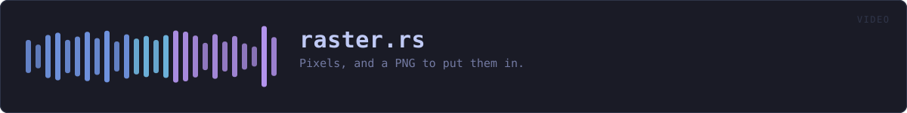
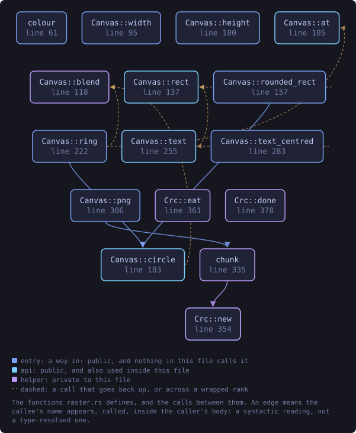

<!-- SPDX-License-Identifier: GPL-3.0-or-later -->
<!-- GENERATED by tools/docs/generate.py from the doc comments in the
     source. Do not edit this file: edit the `//!` and `///` comments in
     the .rs files and run the generator again. CI verifies it with
         python tools/docs/generate.py --check
-->

  

# `crates/veilvoice-video/src/raster.rs`

[`veilvoice-video`](../../../crates/veilvoice-video/README.md) &middot; 594 lines &middot; [read the source](https://github.com/tilas01/veilvoice/blob/main/crates/veilvoice-video/src/raster.rs)

## Contents

- [Why the video's pictures are drawn here rather than converted](#why-the-videos-pictures-are-drawn-here-rather-than-converted)
- [The same picture on every machine](#the-same-picture-on-every-machine)
- [One dependency, and what it is for](#one-dependency-and-what-it-is-for)
- [In plain words](#in-plain-words)
  - [What this file contains](#what-this-file-contains)
  - [What calls what](#what-calls-what)
  - [Items](#items)

Pixels, and a PNG to put them in.

# Why the video's pictures are drawn here rather than converted

Everything else this crate draws is SVG, which is right for a page: the
reader's browser has a renderer and a font library and neither is this
project's problem. A video file is not a page. `ffmpeg` reads a directory of
raster images, and **no build of ffmpeg can be assumed to read SVG**: that
needs librsvg, which most builds do not have, and a picture that fails to
encode on somebody's machine is worse than one that was never offered.

The other way is to convert the SVG here, which means an SVG rasteriser.
Every usable one is large, and `crate::ffmpeg` already spends a page
explaining why this project will not pull in a large library to make a video
file. Doing it anyway, one module over, would make that argument a thing
this project says rather than a thing it does.

So the picture is a few hundred lines: rectangles, circles, a face
(`crate::font`) and a PNG writer. That is the whole of what the drawing
needs, and it is small enough to read.

# The same picture on every machine

No system fonts, no floating-point that varies by platform in a way that
reaches a pixel, and no dependency that could quietly change its output. Two
people rendering the same recording get identical files, which is the same
property the reproducible builds have and is checked the same way: by
comparing bytes.

# One dependency, and what it is for

`miniz_oxide` deflates the pixel data, because PNG is deflate and a PNG
written with stored blocks is roughly six megabytes a frame. It is pure Rust
and it is **already in this tree**, underneath `flate2`, which `lofty` and
`pgp` both pull in, so naming it here adds nothing to the dependency graph
that was not being compiled already.

# In plain words

The part that draws the video's pictures, dot by dot, and writes them as PNG
files.

It is written here rather than borrowed because the video tool this hands its
pictures to cannot be relied on to read drawings, and converting them would
mean carrying a large piece of somebody else's code, which is the thing this
program is careful not to do.

## What this file contains

594 lines defining **17 functions** (12 public), **2 types** and **0 constants**. Everything below is read out of the source, so it cannot disagree with the code.

**The types it owns.**

- `struct Canvas` (line 74) -- A picture being drawn, one byte per channel, three channels per pixel.
- `struct Crc` (line 349) -- The CRC-32 PNG puts on every chunk.

**What happens when it runs.** These are the ways in: public, and nothing else in this file calls them, so they are what an outside caller reaches first.

- `colour` (line 61) -- Read #rrggbb into three bytes.
- `Canvas::width` (line 95) -- How wide it is.
- `Canvas::height` (line 100) -- How tall it is.
- `Canvas::rounded_rect` (line 157) -- A rectangle with rounded ends, which is how the level bars are drawn.
  - reaches: `circle`, `rect`, `blend`
- `Canvas::ring` (line 222) -- A ring, drawn as a filled disc with the middle taken back out.
  - reaches: `at`, `blend`, `circle`
- `Canvas::text_centred` (line 283) -- Draw text centred on centre_x, with its top at y.
  - reaches: `text`, `rect`
- `Canvas::png` (line 306) -- The picture as a PNG file.
  - reaches: `chunk`, `new`

## What calls what

The functions this file defines, and the calls between them. Both
are read out of the source: an edge means the callee's name appears,
called, inside the caller's body. It is a syntactic reading, not a
type-resolved one, so a call made through a trait object or a macro
will not appear.

_Colour key: **entry** -- a way in: public, and nothing in this file calls it; **api** -- public, and also used inside this file; **helper** -- private to this file._

  

The same graph as Mermaid source

```mermaid
%%{init: {"theme":"base","themeVariables":{"background":"#1a1b26","primaryColor":"#1f2335","primaryTextColor":"#c0caf5","primaryBorderColor":"#7aa2f7","secondaryColor":"#16161e","tertiaryColor":"#16161e","lineColor":"#737aa2","textColor":"#c0caf5","mainBkg":"#1f2335","nodeBorder":"#7aa2f7","clusterBkg":"#16161e","clusterBorder":"#2f3549","fontFamily":"ui-monospace, SFMono-Regular, Consolas, monospace","fontSize":"14px"}}}%%
flowchart TD
    n_colour(["colour<br/>line 61"])
    n_new["Canvas::new<br/>line 82"]
    n_width(["Canvas::width<br/>line 95"])
    n_height(["Canvas::height<br/>line 100"])
    n_at["Canvas::at<br/>line 105"]
    n_blend["Canvas::blend<br/>line 118"]
    n_rect["Canvas::rect<br/>line 137"]
    n_rounded_rect(["Canvas::rounded_rect<br/>line 157"])
    n_circle["Canvas::circle<br/>line 183"]
    n_ring(["Canvas::ring<br/>line 222"])
    n_text["Canvas::text<br/>line 255"]
    n_text_centred(["Canvas::text_centred<br/>line 283"])
    n_png(["Canvas::png<br/>line 306"])
    n_chunk["chunk<br/>line 335"]
    n_new["Crc::new<br/>line 352"]
    n_eat["Crc::eat<br/>line 356"]
    n_done["Crc::done<br/>line 370"]
    n_chunk --> n_new
    n_circle --> n_blend
    n_png --> n_chunk
    n_ring --> n_at
    n_ring --> n_blend
    n_ring --> n_circle
    n_rounded_rect --> n_circle
    n_rounded_rect --> n_rect
    n_text --> n_rect
    n_text_centred --> n_text
    click n_colour href "https://github.com/tilas01/veilvoice/blob/main/crates/veilvoice-video/src/raster.rs#L61" "open the source"
    click n_new href "https://github.com/tilas01/veilvoice/blob/main/crates/veilvoice-video/src/raster.rs#L82" "open the source"
    click n_width href "https://github.com/tilas01/veilvoice/blob/main/crates/veilvoice-video/src/raster.rs#L95" "open the source"
    click n_height href "https://github.com/tilas01/veilvoice/blob/main/crates/veilvoice-video/src/raster.rs#L100" "open the source"
    click n_at href "https://github.com/tilas01/veilvoice/blob/main/crates/veilvoice-video/src/raster.rs#L105" "open the source"
    click n_blend href "https://github.com/tilas01/veilvoice/blob/main/crates/veilvoice-video/src/raster.rs#L118" "open the source"
    click n_rect href "https://github.com/tilas01/veilvoice/blob/main/crates/veilvoice-video/src/raster.rs#L137" "open the source"
    click n_rounded_rect href "https://github.com/tilas01/veilvoice/blob/main/crates/veilvoice-video/src/raster.rs#L157" "open the source"
    click n_circle href "https://github.com/tilas01/veilvoice/blob/main/crates/veilvoice-video/src/raster.rs#L183" "open the source"
    click n_ring href "https://github.com/tilas01/veilvoice/blob/main/crates/veilvoice-video/src/raster.rs#L222" "open the source"
    click n_text href "https://github.com/tilas01/veilvoice/blob/main/crates/veilvoice-video/src/raster.rs#L255" "open the source"
    click n_text_centred href "https://github.com/tilas01/veilvoice/blob/main/crates/veilvoice-video/src/raster.rs#L283" "open the source"
    click n_png href "https://github.com/tilas01/veilvoice/blob/main/crates/veilvoice-video/src/raster.rs#L306" "open the source"
    click n_chunk href "https://github.com/tilas01/veilvoice/blob/main/crates/veilvoice-video/src/raster.rs#L335" "open the source"
    click n_new href "https://github.com/tilas01/veilvoice/blob/main/crates/veilvoice-video/src/raster.rs#L352" "open the source"
    click n_eat href "https://github.com/tilas01/veilvoice/blob/main/crates/veilvoice-video/src/raster.rs#L356" "open the source"
    click n_done href "https://github.com/tilas01/veilvoice/blob/main/crates/veilvoice-video/src/raster.rs#L370" "open the source"
    classDef entry fill:#1f2335,stroke:#7aa2f7,color:#c0caf5
    class n_colour,n_width,n_height,n_rounded_rect,n_ring,n_text_centred,n_png entry
    classDef api fill:#1f2335,stroke:#7dcfff,color:#c0caf5
    class n_new,n_at,n_rect,n_circle,n_text api
    classDef helper fill:#1f2335,stroke:#bb9af7,color:#c0caf5
    class n_blend,n_chunk,n_new,n_eat,n_done helper
```

## Items

| Item | Line | Documentation |
|---|---:|---|
| `Rgb` pub type | [52](https://github.com/tilas01/veilvoice/blob/main/crates/veilvoice-video/src/raster.rs#L52) | A colour, as the three bytes a PNG stores. |
| `colour` pub fn | [61](https://github.com/tilas01/veilvoice/blob/main/crates/veilvoice-video/src/raster.rs#L61) | Read #rrggbb into three bytes. |
| `Canvas` pub struct | [74](https://github.com/tilas01/veilvoice/blob/main/crates/veilvoice-video/src/raster.rs#L74) | A picture being drawn, one byte per channel, three channels per pixel. |
| `Canvas::new` pub fn | [82](https://github.com/tilas01/veilvoice/blob/main/crates/veilvoice-video/src/raster.rs#L82) | A canvas of width by height, filled with background. |
| `Canvas::width` pub fn | [95](https://github.com/tilas01/veilvoice/blob/main/crates/veilvoice-video/src/raster.rs#L95) | How wide it is. |
| `Canvas::height` pub fn | [100](https://github.com/tilas01/veilvoice/blob/main/crates/veilvoice-video/src/raster.rs#L100) | How tall it is. |
| `Canvas::at` pub fn | [105](https://github.com/tilas01/veilvoice/blob/main/crates/veilvoice-video/src/raster.rs#L105) | The colour at a point, or None outside the canvas. |
| `Canvas::blend` fn | [118](https://github.com/tilas01/veilvoice/blob/main/crates/veilvoice-video/src/raster.rs#L118) | Mix colour into the pixel at x, y by alpha, from 0.0 to 1.0. |
| `Canvas::rect` pub fn | [137](https://github.com/tilas01/veilvoice/blob/main/crates/veilvoice-video/src/raster.rs#L137) | A filled rectangle, clipped to the canvas. |
| `Canvas::rounded_rect` pub fn | [157](https://github.com/tilas01/veilvoice/blob/main/crates/veilvoice-video/src/raster.rs#L157) | A rectangle with rounded ends, which is how the level bars are drawn. |
| `Canvas::circle` pub fn | [183](https://github.com/tilas01/veilvoice/blob/main/crates/veilvoice-video/src/raster.rs#L183) | A filled circle with a smooth edge. |
| `Canvas::ring` pub fn | [222](https://github.com/tilas01/veilvoice/blob/main/crates/veilvoice-video/src/raster.rs#L222) | A ring, drawn as a filled disc with the middle taken back out. |
| `Canvas::text` pub fn | [255](https://github.com/tilas01/veilvoice/blob/main/crates/veilvoice-video/src/raster.rs#L255) | Draw text with its left edge at x and its top at y. |
| `Canvas::text_centred` pub fn | [283](https://github.com/tilas01/veilvoice/blob/main/crates/veilvoice-video/src/raster.rs#L283) | Draw text centred on centre_x, with its top at y. |
| `Canvas::png` pub fn | [306](https://github.com/tilas01/veilvoice/blob/main/crates/veilvoice-video/src/raster.rs#L306) | The picture as a PNG file. |
| `chunk` fn | [335](https://github.com/tilas01/veilvoice/blob/main/crates/veilvoice-video/src/raster.rs#L335) | Append one PNG chunk: length, type, data, and the checksum over both. |
| `Crc` struct | [349](https://github.com/tilas01/veilvoice/blob/main/crates/veilvoice-video/src/raster.rs#L349) | The CRC-32 PNG puts on every chunk. |
| `Crc::new` fn | [352](https://github.com/tilas01/veilvoice/blob/main/crates/veilvoice-video/src/raster.rs#L352) |  |
| `Crc::eat` fn | [356](https://github.com/tilas01/veilvoice/blob/main/crates/veilvoice-video/src/raster.rs#L356) |  |
| `Crc::done` fn | [370](https://github.com/tilas01/veilvoice/blob/main/crates/veilvoice-video/src/raster.rs#L370) |  |

---

Generated from `crates/veilvoice-video/src/raster.rs`. On the website: [`website/reference/veilvoice-video/raster.html`](../../../website/reference/veilvoice-video/raster.html).

Signing key fingerprint `8101FB3BB28D02FB239E0CDF9CC1C7E7A9B5833A`.
