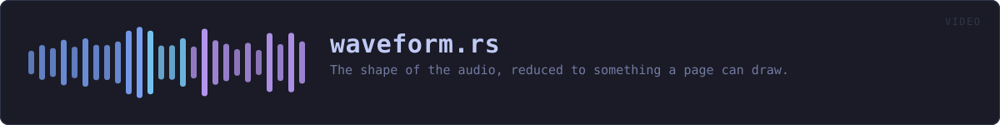
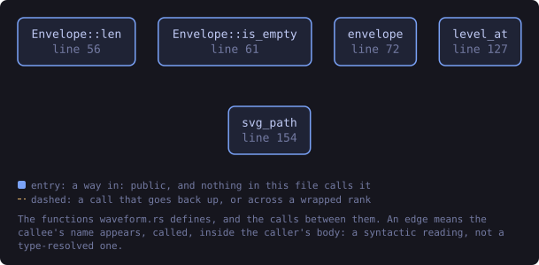

<!-- SPDX-License-Identifier: GPL-3.0-or-later -->
<!-- GENERATED by tools/docs/generate.py from the doc comments in the
     source. Do not edit this file: edit the `//!` and `///` comments in
     the .rs files and run the generator again. CI verifies it with
         python tools/docs/generate.py --check
-->

  

# `crates/veilvoice-video/src/waveform.rs`

[`veilvoice-video`](../../../crates/veilvoice-video/README.md) &middot; 259 lines &middot; [read the source](https://github.com/tilas01/veilvoice/blob/main/crates/veilvoice-video/src/waveform.rs)

## Contents

- [Peaks, not samples](#peaks-not-samples)
- [It is drawn from the veiled audio](#it-is-drawn-from-the-veiled-audio)
- [What a waveform still shows](#what-a-waveform-still-shows)
- [In plain words](#in-plain-words)
  - [What this file contains](#what-this-file-contains)
  - [What calls what](#what-calls-what)
  - [Items](#items)

The shape of the audio, reduced to something a page can draw.

# Peaks, not samples

A minute of audio at 48 kHz is 2.88 million samples and a waveform is about
a thousand pixels wide. Drawing every sample would produce a path megabytes
long that renders as a solid block.

So the audio is divided into as many buckets as there are columns, and each
bucket keeps its **minimum and maximum** — not its average, and not its
root-mean-square. The extremes are what a waveform is: they are what makes a
plosive look like a plosive, and an average over a bucket of a symmetric
waveform is approximately zero however loud it was.

# It is drawn from the veiled audio

Worth stating, because the alternative is an easy mistake. The picture is of
the **output**, not the input. A waveform is not a voiceprint — it carries
no formants and no phase — but it does carry timing and loudness, and a
picture of the original would show the original's timing and loudness beside
a recording that had gone to some trouble to replace them.

# What a waveform still shows

Silences, the rhythm of speech, how loud somebody was, and roughly where a
sentence ends. That is the same turn-taking structure a conversation render
keeps on purpose, drawn rather than heard, and it is not additional exposure
beyond what the audio already carries.

# In plain words

Turns a recording into the wavy shape you see drawn along the bottom of an
audio player.

A minute of sound is nearly three million numbers, which is far more than a
picture a few hundred pixels wide can show or a web page should carry. So the
sound is divided into as many pieces as there are columns to draw, and each
piece is reduced to its loudest point.

The loudest point rather than the average, because averaging smooths a
recording into a flat sausage and loses exactly the peaks that make a waveform
worth looking at.

## What this file contains

259 lines defining **4 functions** (4 public), **1 type** and **0 constants**. Everything below is read out of the source, so it cannot disagree with the code.

**The types it owns.**

- `struct Envelope` (line 47) -- The peak envelope of a signal: one minimum and one maximum per column.

**What happens when it runs.** These are the ways in: public, and nothing else in this file calls them, so they are what an outside caller reaches first.

- `Envelope::len` (line 56) -- How many columns this envelope has.
- `Envelope::is_empty` (line 61) -- Whether there are no columns at all.
- `envelope` (line 72) -- Reduce samples to columns peak pairs.
- `svg_path` (line 115) -- The envelope as an SVG path, filled, inside a box.

## What calls what

The functions this file defines, and the calls between them. Both
are read out of the source: an edge means the callee's name appears,
called, inside the caller's body. It is a syntactic reading, not a
type-resolved one, so a call made through a trait object or a macro
will not appear.

_Colour key: **entry** -- a way in: public, and nothing in this file calls it._

  

The same graph as Mermaid source

```mermaid
%%{init: {"theme":"base","themeVariables":{"background":"#1a1b26","primaryColor":"#1f2335","primaryTextColor":"#c0caf5","primaryBorderColor":"#7aa2f7","secondaryColor":"#16161e","tertiaryColor":"#16161e","lineColor":"#737aa2","textColor":"#c0caf5","mainBkg":"#1f2335","nodeBorder":"#7aa2f7","clusterBkg":"#16161e","clusterBorder":"#2f3549","fontFamily":"ui-monospace, SFMono-Regular, Consolas, monospace","fontSize":"14px"}}}%%
flowchart TD
    n_len(["Envelope::len<br/>line 56"])
    n_is_empty(["Envelope::is_empty<br/>line 61"])
    n_envelope(["envelope<br/>line 72"])
    n_svg_path(["svg_path<br/>line 115"])
    click n_len href "https://github.com/tilas01/veilvoice/blob/main/crates/veilvoice-video/src/waveform.rs#L56" "open the source"
    click n_is_empty href "https://github.com/tilas01/veilvoice/blob/main/crates/veilvoice-video/src/waveform.rs#L61" "open the source"
    click n_envelope href "https://github.com/tilas01/veilvoice/blob/main/crates/veilvoice-video/src/waveform.rs#L72" "open the source"
    click n_svg_path href "https://github.com/tilas01/veilvoice/blob/main/crates/veilvoice-video/src/waveform.rs#L115" "open the source"
    classDef entry fill:#1f2335,stroke:#7aa2f7,color:#c0caf5
    class n_len,n_is_empty,n_envelope,n_svg_path entry
```

## Items

| Item | Line | Documentation |
|---|---:|---|
| `Envelope` pub struct | [47](https://github.com/tilas01/veilvoice/blob/main/crates/veilvoice-video/src/waveform.rs#L47) | The peak envelope of a signal: one minimum and one maximum per column. |
| `Envelope::len` pub fn | [56](https://github.com/tilas01/veilvoice/blob/main/crates/veilvoice-video/src/waveform.rs#L56) | How many columns this envelope has. |
| `Envelope::is_empty` pub fn | [61](https://github.com/tilas01/veilvoice/blob/main/crates/veilvoice-video/src/waveform.rs#L61) | Whether there are no columns at all. |
| `envelope` pub fn | [72](https://github.com/tilas01/veilvoice/blob/main/crates/veilvoice-video/src/waveform.rs#L72) | Reduce samples to columns peak pairs. |
| `svg_path` pub fn | [115](https://github.com/tilas01/veilvoice/blob/main/crates/veilvoice-video/src/waveform.rs#L115) | The envelope as an SVG path, filled, inside a box. |

---

Generated from `crates/veilvoice-video/src/waveform.rs`. On the website: [`website/reference/veilvoice-video/waveform.html`](../../../website/reference/veilvoice-video/waveform.html).

Signing key fingerprint `8101FB3BB28D02FB239E0CDF9CC1C7E7A9B5833A`.
