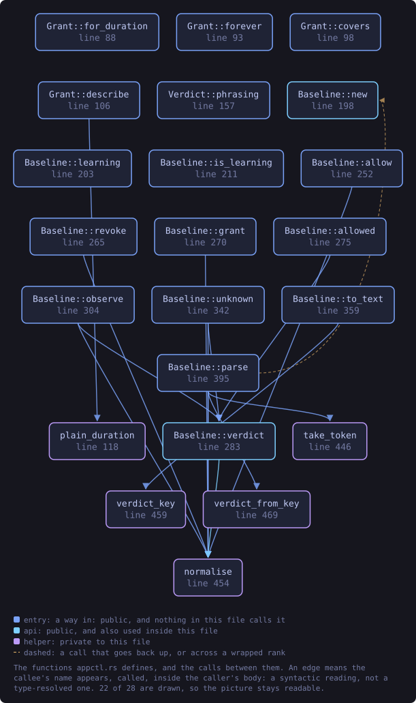

<!-- SPDX-License-Identifier: GPL-3.0-or-later -->
<!-- GENERATED by tools/docs/generate.py from the doc comments in the
     source. Do not edit this file: edit the `//!` and `///` comments in
     the .rs files and run the generator again. CI verifies it with
         python tools/docs/generate.py --check
-->

  

# `crates/veilvoice-watch/src/appctl.rs`

[`veilvoice-watch`](../../../crates/veilvoice-watch/README.md) &middot; 798 lines &middot; [read the source](https://github.com/tilas01/veilvoice/blob/main/crates/veilvoice-watch/src/appctl.rs)

## Contents

- [What this is, said before anything else](#what-this-is-said-before-anything-else)
- [Learning, and why it has an end](#learning-and-why-it-has-an-end)
- [Grants expire, and that is the whole design](#grants-expire-and-that-is-the-whole-design)
- [The log is append-only, and it is the point](#the-log-is-append-only-and-it-is-the-point)
- [In plain words](#in-plain-words)
  - [What this file contains](#what-this-file-contains)
  - [What calls what](#what-calls-what)
  - [Items](#items)

Learn what normally runs on this machine, then notice what does not.

# What this is, said before anything else

**This is not application control.** It does not stop a program starting,
it cannot stop one starting, and nothing in this crate tries. It is a
*baseline*: you tell it to watch for a while, it records what it sees, and
afterwards it can tell you when something runs that was not in that
picture.

The name is the roadmap's and it is kept because renaming it would leave two
names for one thing, but `SCOPE` is the wording every front end must show,
and it says outright that nothing here prevents anything. Real enforcement
means a kernel driver or a signed policy blob and an application identity to
sign it with, and this project is published under a pseudonym on purpose.
Shipping something called "app control" that quietly only *watches* would be
the exact failure this project's second rule exists to prevent.

# Learning, and why it has an end

`Baseline::learning` records what runs. It is not left on: a baseline that
is always learning has learned nothing, because whatever an attacker starts
becomes part of the picture the moment it starts. So learning is a phase
with an end, and `Baseline::freeze` closes it.

# Grants expire, and that is the whole design

Allowing something for ever is how an allowlist becomes a list of everything
anybody ever ran. `Grant`s carry an expiry, `Baseline::allowed` checks
it against the clock it is given, and an expired grant is simply not a
grant. Nothing sweeps them: an expired entry is kept, because *"this was
allowed until Tuesday"* is worth more to somebody reading the log than a row
that vanished.

Permanent grants exist and are spelled `Grant::forever`, so that choosing
one is a thing somebody typed rather than a default they never saw.

# The log is append-only, and it is the point

Every decision is recorded: what was seen, whether it was known, which grant
covered it and when that grant ends. A control whose decisions cannot be
reviewed afterwards is a control nobody can check, and this one is *only*
ever going to be reviewable, since it does not enforce.

# In plain words

For a while, this watches which programs you normally run and writes them
down. After that, it can tell you when something starts that was not on that
list.

It does **not** block anything. It cannot. It is a way of noticing, not a
lock on the door, and anything that told you otherwise would be lying to
you about how safe you are.

You can allow a program you recognise, and when you do you say for how long
-- an hour, a day, or permanently if you really mean it. Temporary is the
normal case, because a list that only ever grows stops meaning anything.
Everything it decides is written to a log you can read.

## What this file contains

798 lines defining **28 functions** (22 public), **5 types** and **2 constants**. Everything below is read out of the source, so it cannot disagree with the code.

**The types it owns.**

- `enum Grant` (line 69) -- How long a grant lasts.
- `enum Verdict` (line 136) -- What a baseline says about one program.
- `struct Entry` (line 172) -- One line of the decision log.
- `struct Baseline` (line 185) -- What normally runs here, what has been allowed, and what has been decided.
- `enum Error` (line 481) -- Why something was refused.

**What happens when it runs.** These are the ways in: public, and nothing else in this file calls them, so they are what an outside caller reaches first.

- `Grant::for_duration` (line 88) -- A grant lasting how_long from now.
- `Grant::forever` (line 93) -- A permanent grant.
- `Grant::covers` (line 98) -- Whether this grant still covers now.
- `Grant::describe` (line 106) -- How this reads in a report.
  - reaches: `plain_duration`
- `Verdict::phrasing` (line 157) -- The wording a front end should use.
- `Baseline::learning` (line 203) -- A baseline in its learning phase.
- `Baseline::is_learning` (line 211) -- Whether the learning phase is open.
- `Baseline::freeze` (line 221) -- Close the learning phase.
- `Baseline::len` (line 233) -- How many programs the baseline holds.
- `Baseline::is_empty` (line 238) -- Whether the baseline holds nothing.
- `Baseline::programs` (line 243) -- Every program in the baseline, in order.
- `Baseline::allow` (line 252) -- Allow a program until a moment, or for good.
  - reaches: `normalise`
- `Baseline::revoke` (line 265) -- Withdraw a grant.
  - reaches: `normalise`
- `Baseline::grant` (line 270) -- The grant covering a program, expired or not.
  - reaches: `normalise`
- `Baseline::allowed` (line 275) -- Whether this program is allowed to be running, as of now.
  - reaches: `verdict`, `normalise`
- `Baseline::observe` (line 304) -- Record what is running now, and return what was decided.
  - reaches: `normalise`, `verdict`
- `Baseline::log` (line 337) -- The decision log, oldest first.
- `Baseline::unknown` (line 342) -- Everything running that is neither known nor granted.
  - reaches: `normalise`, `verdict`
- `Baseline::to_text` (line 359) -- Write the baseline as text.
  - reaches: `verdict_key`
- `Baseline::parse` (line 395) -- Read a baseline back.
  - reaches: `new`, `normalise`, `take_token`, `verdict_from_key`

## What calls what

The functions this file defines, and the calls between them. Both
are read out of the source: an edge means the callee's name appears,
called, inside the caller's body. It is a syntactic reading, not a
type-resolved one, so a call made through a trait object or a macro
will not appear.

_22 of 28 functions are drawn; the diagram is bounded at 22 so it
stays readable. The full list is in the table below._

_Colour key: **entry** -- a way in: public, and nothing in this file calls it; **api** -- public, and also used inside this file; **helper** -- private to this file._

  

The same graph as Mermaid source

```mermaid
%%{init: {"theme":"base","themeVariables":{"background":"#1a1b26","primaryColor":"#1f2335","primaryTextColor":"#c0caf5","primaryBorderColor":"#7aa2f7","secondaryColor":"#16161e","tertiaryColor":"#16161e","lineColor":"#737aa2","textColor":"#c0caf5","mainBkg":"#1f2335","nodeBorder":"#7aa2f7","clusterBkg":"#16161e","clusterBorder":"#2f3549","fontFamily":"ui-monospace, SFMono-Regular, Consolas, monospace","fontSize":"14px"}}}%%
flowchart TD
    n_for_duration(["Grant::for_duration<br/>line 88"])
    n_forever(["Grant::forever<br/>line 93"])
    n_covers(["Grant::covers<br/>line 98"])
    n_describe(["Grant::describe<br/>line 106"])
    n_plain_duration["plain_duration<br/>line 118"]
    n_phrasing(["Verdict::phrasing<br/>line 157"])
    n_new["Baseline::new<br/>line 198"]
    n_learning(["Baseline::learning<br/>line 203"])
    n_is_learning(["Baseline::is_learning<br/>line 211"])
    n_allow(["Baseline::allow<br/>line 252"])
    n_revoke(["Baseline::revoke<br/>line 265"])
    n_grant(["Baseline::grant<br/>line 270"])
    n_allowed(["Baseline::allowed<br/>line 275"])
    n_verdict["Baseline::verdict<br/>line 283"]
    n_observe(["Baseline::observe<br/>line 304"])
    n_unknown(["Baseline::unknown<br/>line 342"])
    n_to_text(["Baseline::to_text<br/>line 359"])
    n_parse(["Baseline::parse<br/>line 395"])
    n_take_token["take_token<br/>line 446"]
    n_normalise["normalise<br/>line 454"]
    n_verdict_key["verdict_key<br/>line 459"]
    n_verdict_from_key["verdict_from_key<br/>line 469"]
    n_allow --> n_normalise
    n_allowed --> n_verdict
    n_describe --> n_plain_duration
    n_grant --> n_normalise
    n_observe --> n_normalise
    n_observe --> n_verdict
    n_parse --> n_new
    n_parse --> n_normalise
    n_parse --> n_take_token
    n_parse --> n_verdict_from_key
    n_revoke --> n_normalise
    n_to_text --> n_verdict_key
    n_unknown --> n_normalise
    n_unknown --> n_verdict
    n_verdict --> n_normalise
    click n_for_duration href "https://github.com/tilas01/veilvoice/blob/main/crates/veilvoice-watch/src/appctl.rs#L88" "open the source"
    click n_forever href "https://github.com/tilas01/veilvoice/blob/main/crates/veilvoice-watch/src/appctl.rs#L93" "open the source"
    click n_covers href "https://github.com/tilas01/veilvoice/blob/main/crates/veilvoice-watch/src/appctl.rs#L98" "open the source"
    click n_describe href "https://github.com/tilas01/veilvoice/blob/main/crates/veilvoice-watch/src/appctl.rs#L106" "open the source"
    click n_plain_duration href "https://github.com/tilas01/veilvoice/blob/main/crates/veilvoice-watch/src/appctl.rs#L118" "open the source"
    click n_phrasing href "https://github.com/tilas01/veilvoice/blob/main/crates/veilvoice-watch/src/appctl.rs#L157" "open the source"
    click n_new href "https://github.com/tilas01/veilvoice/blob/main/crates/veilvoice-watch/src/appctl.rs#L198" "open the source"
    click n_learning href "https://github.com/tilas01/veilvoice/blob/main/crates/veilvoice-watch/src/appctl.rs#L203" "open the source"
    click n_is_learning href "https://github.com/tilas01/veilvoice/blob/main/crates/veilvoice-watch/src/appctl.rs#L211" "open the source"
    click n_allow href "https://github.com/tilas01/veilvoice/blob/main/crates/veilvoice-watch/src/appctl.rs#L252" "open the source"
    click n_revoke href "https://github.com/tilas01/veilvoice/blob/main/crates/veilvoice-watch/src/appctl.rs#L265" "open the source"
    click n_grant href "https://github.com/tilas01/veilvoice/blob/main/crates/veilvoice-watch/src/appctl.rs#L270" "open the source"
    click n_allowed href "https://github.com/tilas01/veilvoice/blob/main/crates/veilvoice-watch/src/appctl.rs#L275" "open the source"
    click n_verdict href "https://github.com/tilas01/veilvoice/blob/main/crates/veilvoice-watch/src/appctl.rs#L283" "open the source"
    click n_observe href "https://github.com/tilas01/veilvoice/blob/main/crates/veilvoice-watch/src/appctl.rs#L304" "open the source"
    click n_unknown href "https://github.com/tilas01/veilvoice/blob/main/crates/veilvoice-watch/src/appctl.rs#L342" "open the source"
    click n_to_text href "https://github.com/tilas01/veilvoice/blob/main/crates/veilvoice-watch/src/appctl.rs#L359" "open the source"
    click n_parse href "https://github.com/tilas01/veilvoice/blob/main/crates/veilvoice-watch/src/appctl.rs#L395" "open the source"
    click n_take_token href "https://github.com/tilas01/veilvoice/blob/main/crates/veilvoice-watch/src/appctl.rs#L446" "open the source"
    click n_normalise href "https://github.com/tilas01/veilvoice/blob/main/crates/veilvoice-watch/src/appctl.rs#L454" "open the source"
    click n_verdict_key href "https://github.com/tilas01/veilvoice/blob/main/crates/veilvoice-watch/src/appctl.rs#L459" "open the source"
    click n_verdict_from_key href "https://github.com/tilas01/veilvoice/blob/main/crates/veilvoice-watch/src/appctl.rs#L469" "open the source"
    classDef entry fill:#1f2335,stroke:#7aa2f7,color:#c0caf5
    class n_for_duration,n_forever,n_covers,n_describe,n_phrasing,n_learning,n_is_learning,n_allow,n_revoke,n_grant,n_allowed,n_observe,n_unknown,n_to_text,n_parse entry
    classDef api fill:#1f2335,stroke:#7dcfff,color:#c0caf5
    class n_new,n_verdict api
    classDef helper fill:#1f2335,stroke:#bb9af7,color:#c0caf5
    class n_plain_duration,n_take_token,n_normalise,n_verdict_key,n_verdict_from_key helper
```

## Items

| Item | Line | Documentation |
|---|---:|---|
| `MAGIC` const | [65](https://github.com/tilas01/veilvoice/blob/main/crates/veilvoice-watch/src/appctl.rs#L65) | The file format's first line. |
| `Grant` pub enum | [69](https://github.com/tilas01/veilvoice/blob/main/crates/veilvoice-watch/src/appctl.rs#L69) | How long a grant lasts. |
| `Grant::for_duration` pub fn | [88](https://github.com/tilas01/veilvoice/blob/main/crates/veilvoice-watch/src/appctl.rs#L88) | A grant lasting how_long from now. |
| `Grant::forever` pub fn | [93](https://github.com/tilas01/veilvoice/blob/main/crates/veilvoice-watch/src/appctl.rs#L93) | A permanent grant. |
| `Grant::covers` pub fn | [98](https://github.com/tilas01/veilvoice/blob/main/crates/veilvoice-watch/src/appctl.rs#L98) | Whether this grant still covers now. |
| `Grant::describe` pub fn | [106](https://github.com/tilas01/veilvoice/blob/main/crates/veilvoice-watch/src/appctl.rs#L106) | How this reads in a report. |
| `plain_duration` fn | [118](https://github.com/tilas01/veilvoice/blob/main/crates/veilvoice-watch/src/appctl.rs#L118) | A duration a person can read. |
| `Verdict` pub enum | [136](https://github.com/tilas01/veilvoice/blob/main/crates/veilvoice-watch/src/appctl.rs#L136) | What a baseline says about one program. |
| `Verdict::phrasing` pub fn | [157](https://github.com/tilas01/veilvoice/blob/main/crates/veilvoice-watch/src/appctl.rs#L157) | The wording a front end should use. |
| `Entry` pub struct | [172](https://github.com/tilas01/veilvoice/blob/main/crates/veilvoice-watch/src/appctl.rs#L172) | One line of the decision log. |
| `Baseline` pub struct | [185](https://github.com/tilas01/veilvoice/blob/main/crates/veilvoice-watch/src/appctl.rs#L185) | What normally runs here, what has been allowed, and what has been decided. |
| `Baseline::new` pub fn | [198](https://github.com/tilas01/veilvoice/blob/main/crates/veilvoice-watch/src/appctl.rs#L198) | A baseline that has learned nothing and is not learning. |
| `Baseline::learning` pub fn | [203](https://github.com/tilas01/veilvoice/blob/main/crates/veilvoice-watch/src/appctl.rs#L203) | A baseline in its learning phase. |
| `Baseline::is_learning` pub fn | [211](https://github.com/tilas01/veilvoice/blob/main/crates/veilvoice-watch/src/appctl.rs#L211) | Whether the learning phase is open. |
| `Baseline::freeze` pub fn | [221](https://github.com/tilas01/veilvoice/blob/main/crates/veilvoice-watch/src/appctl.rs#L221) | Close the learning phase. |
| `Baseline::len` pub fn | [233](https://github.com/tilas01/veilvoice/blob/main/crates/veilvoice-watch/src/appctl.rs#L233) | How many programs the baseline holds. |
| `Baseline::is_empty` pub fn | [238](https://github.com/tilas01/veilvoice/blob/main/crates/veilvoice-watch/src/appctl.rs#L238) | Whether the baseline holds nothing. |
| `Baseline::programs` pub fn | [243](https://github.com/tilas01/veilvoice/blob/main/crates/veilvoice-watch/src/appctl.rs#L243) | Every program in the baseline, in order. |
| `Baseline::allow` pub fn | [252](https://github.com/tilas01/veilvoice/blob/main/crates/veilvoice-watch/src/appctl.rs#L252) | Allow a program until a moment, or for good. |
| `Baseline::revoke` pub fn | [265](https://github.com/tilas01/veilvoice/blob/main/crates/veilvoice-watch/src/appctl.rs#L265) | Withdraw a grant. |
| `Baseline::grant` pub fn | [270](https://github.com/tilas01/veilvoice/blob/main/crates/veilvoice-watch/src/appctl.rs#L270) | The grant covering a program, expired or not. |
| `Baseline::allowed` pub fn | [275](https://github.com/tilas01/veilvoice/blob/main/crates/veilvoice-watch/src/appctl.rs#L275) | Whether this program is allowed to be running, as of now. |
| `Baseline::verdict` pub fn | [283](https://github.com/tilas01/veilvoice/blob/main/crates/veilvoice-watch/src/appctl.rs#L283) | What this baseline says about a program, without recording anything. |
| `Baseline::observe` pub fn | [304](https://github.com/tilas01/veilvoice/blob/main/crates/veilvoice-watch/src/appctl.rs#L304) | Record what is running now, and return what was decided. |
| `Baseline::log` pub fn | [337](https://github.com/tilas01/veilvoice/blob/main/crates/veilvoice-watch/src/appctl.rs#L337) | The decision log, oldest first. |
| `Baseline::unknown` pub fn | [342](https://github.com/tilas01/veilvoice/blob/main/crates/veilvoice-watch/src/appctl.rs#L342) | Everything running that is neither known nor granted. |
| `Baseline::to_text` pub fn | [359](https://github.com/tilas01/veilvoice/blob/main/crates/veilvoice-watch/src/appctl.rs#L359) | Write the baseline as text. |
| `Baseline::parse` pub fn | [395](https://github.com/tilas01/veilvoice/blob/main/crates/veilvoice-watch/src/appctl.rs#L395) | Read a baseline back. |
| `take_token` fn | [446](https://github.com/tilas01/veilvoice/blob/main/crates/veilvoice-watch/src/appctl.rs#L446) | The first whitespace-separated token, and the rest. |
| `normalise` fn | [454](https://github.com/tilas01/veilvoice/blob/main/crates/veilvoice-watch/src/appctl.rs#L454) | A process name as this crate compares them. |
| `verdict_key` fn | [459](https://github.com/tilas01/veilvoice/blob/main/crates/veilvoice-watch/src/appctl.rs#L459) | The word written to the file for a verdict. |
| `verdict_from_key` fn | [469](https://github.com/tilas01/veilvoice/blob/main/crates/veilvoice-watch/src/appctl.rs#L469) | The verdict a word means. |
| `Error` pub enum | [481](https://github.com/tilas01/veilvoice/blob/main/crates/veilvoice-watch/src/appctl.rs#L481) | Why something was refused. |
| `Error::fmt` fn | [502](https://github.com/tilas01/veilvoice/blob/main/crates/veilvoice-watch/src/appctl.rs#L502) |  |
| `SCOPE` pub const | [531](https://github.com/tilas01/veilvoice/blob/main/crates/veilvoice-watch/src/appctl.rs#L531) | What a reader must be told, in the words to tell them. |

---

Generated from `crates/veilvoice-watch/src/appctl.rs`. On the website: [`website/reference/veilvoice-watch/appctl.html`](../../../website/reference/veilvoice-watch/appctl.html).

Signing key fingerprint `8101FB3BB28D02FB239E0CDF9CC1C7E7A9B5833A`.
