<!-- SPDX-License-Identifier: GPL-3.0-or-later -->
<!-- GENERATED by tools/docs/generate.py from the doc comments in the
     source. Do not edit this file: edit the `//!` and `///` comments in
     the .rs files and run the generator again. CI verifies it with
         python tools/docs/generate.py --check
-->

  

# `crates/veilvoice-watch/examples/scan_once.rs`

[`veilvoice-watch`](../../../crates/veilvoice-watch/README.md) &middot; 22 lines &middot; [read the source](https://github.com/tilas01/veilvoice/blob/main/crates/veilvoice-watch/examples/scan_once.rs)

## Contents

- [What this file contains](#what-this-file-contains)
- [What calls what](#what-calls-what)
- [Items](#items)

Print what is using the microphone and camera right now.

## What this file contains

22 lines defining **1 function** (0 public), **0 types** and **0 constants**. Everything below is read out of the source, so it cannot disagree with the code.

## What calls what

The functions this file defines, and the calls between them. Both
are read out of the source: an edge means the callee's name appears,
called, inside the caller's body. It is a syntactic reading, not a
type-resolved one, so a call made through a trait object or a macro
will not appear.

_Colour key: **helper** -- private to this file._

```mermaid
%%{init: {"theme":"base","themeVariables":{"background":"#1a1b26","primaryColor":"#1f2335","primaryTextColor":"#c0caf5","primaryBorderColor":"#7aa2f7","secondaryColor":"#16161e","tertiaryColor":"#16161e","lineColor":"#737aa2","textColor":"#c0caf5","mainBkg":"#1f2335","nodeBorder":"#7aa2f7","clusterBkg":"#16161e","clusterBorder":"#2f3549","fontFamily":"ui-monospace, SFMono-Regular, Consolas, monospace","fontSize":"14px"}}}%%
flowchart TD
    n_main["main<br/>line 3"]
    click n_main href "https://github.com/tilas01/veilvoice/blob/main/crates/veilvoice-watch/examples/scan_once.rs#L3" "open the source"
    classDef helper fill:#1f2335,stroke:#bb9af7,color:#c0caf5
    class n_main helper
```

## Items

| Item | Line | Documentation |
|---|---:|---|
| `main` fn | [3](https://github.com/tilas01/veilvoice/blob/main/crates/veilvoice-watch/examples/scan_once.rs#L3) |  |

---

Generated from `crates/veilvoice-watch/examples/scan_once.rs`. On the website: [`website/reference/veilvoice-watch/examples-scan_once.html`](../../../website/reference/veilvoice-watch/examples-scan_once.html).

Signing key fingerprint `8101FB3BB28D02FB239E0CDF9CC1C7E7A9B5833A`.
