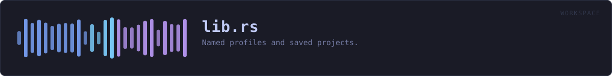
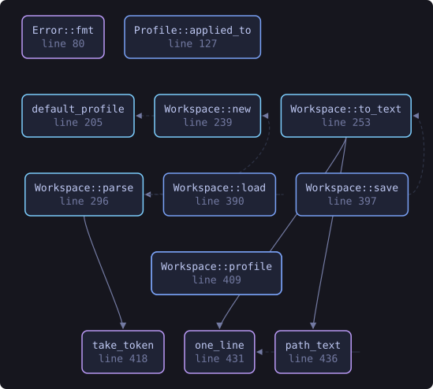
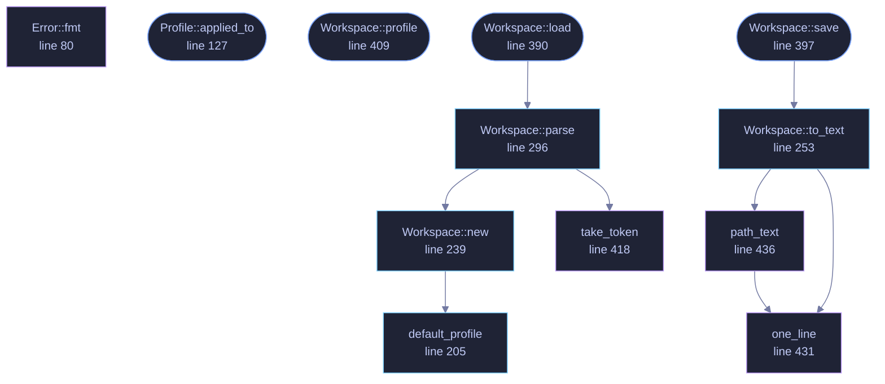

<!-- SPDX-License-Identifier: GPL-3.0-or-later -->
<!-- GENERATED by tools/docs/generate.py from the doc comments in the
     source. Do not edit this file: edit the `//!` and `///` comments in
     the .rs files and run the generator again. CI verifies it with
         python tools/docs/generate.py --check
-->

  

# `crates/veilvoice-workspace/src/lib.rs`

[`veilvoice-workspace`](../../../crates/veilvoice-workspace/README.md) &middot; 678 lines &middot; [read the source](https://github.com/tilas01/veilvoice/blob/main/crates/veilvoice-workspace/src/lib.rs)

## Contents

- [Why a project file is worth having here in particular](#why-a-project-file-is-worth-having-here-in-particular)
- [Plain text, and the same shape as a plan](#plain-text-and-the-same-shape-as-a-plan)
- [What a project file does not contain](#what-a-project-file-does-not-contain)
- [In plain words](#in-plain-words)
  - [What this file contains](#what-this-file-contains)
  - [What calls what](#what-calls-what)
  - [Items](#items)

Named profiles and saved projects.

Two things, which sound alike and are not:

* A `Profile` is a **way of working** — a named set of settings you can
switch to. "Anonymise one person, as thoroughly as this can." "A group,
everybody the same voice." Three are built in and you can save your own.
* A `Workspace` is **one piece of work** — which recording, which plan,
who is in it and what they are called, and the profile it was done under.
Saved beside the recording, so opening it a week later puts everything
back where it was.

# Why a project file is worth having here in particular

Setting up a group recording is a dozen small decisions: who is in it, what
each is called, what colour each is drawn in, whether they share a voice.
Getting halfway through and having to stop is ordinary. Losing all of it
because the window was closed is not, and it is worse than usual here,
because the *recording* may be the only copy of something that cannot be
made again.

# Plain text, and the same shape as a plan

`VEILWORK1`, then one `key  value` per line. The same format
`veilvoice-conversation` uses for a plan, for the same reasons: it is
readable, diffable, greppable, and has no syntax in which something
surprising can hide. A project file is a description of your work; it should
not require this program to read it.

# What a project file does **not** contain

**No audio and no passwords.** It records the *path* to a recording, not the
recording, and nothing about how anything is encrypted. A workspace is a
thing you might send somebody so they can set their machine up the same way;
if it carried a passphrase, sending it would be handing over the recordings
too, and people would find that out afterwards.

Speaker names *are* in it, because the whole point is to put them back — and
a name is a name. The file says so.

# In plain words

This is the "save my project" and "load my setup" part.

Profiles are named ways of working you can flip between: one for anonymising
a single person as thoroughly as possible, one for a group where everybody
keeps their own disguised voice, one for a group where everybody sounds
identical and only the names tell you who is speaking.

A project file remembers the rest: which recording you were working on, who
is in it, what you called them and what colour each one is. Open it next
week and everything is where you left it.

It does not contain the recording itself and it does not contain any
password. It does contain the names you typed, because putting those back is
the point of it.

## What this file contains

678 lines defining **13 functions** (9 public), **4 types** and **5 constants**. Everything below is read out of the source, so it cannot disagree with the code.

**The types it owns.**

- `enum Error` (line 72) -- Something that could not be read.
- `struct Profile` (line 98) -- A named way of working.
- `struct Member` (line 211) -- One person in a saved project.
- `struct Workspace` (line 220) -- One piece of work, saved.

**What happens when it runs.** These are the ways in: public, and nothing else in this file calls them, so they are what an outside caller reaches first.

- `Profile::applied_to` (line 127) -- The engine settings this profile asks for, over a starting point.
- `profile` (line 200) -- The profile with this identifier.
- `Workspace::load` (line 390) -- Read a project file.
  - reaches: `parse`, `new`, `take_token`, `default_profile`
- `Workspace::save` (line 397) -- Write a project file, creating the directory if needed.
  - reaches: `to_text`, `one_line`, `path_text`
- `Workspace::profile` (line 409) -- The profile this project names, if this build has it.

## What calls what

The functions this file defines, and the calls between them. Both
are read out of the source: an edge means the callee's name appears,
called, inside the caller's body. It is a syntactic reading, not a
type-resolved one, so a call made through a trait object or a macro
will not appear.

_Colour key: **entry** -- a way in: public, and nothing in this file calls it; **api** -- public, and also used inside this file; **helper** -- private to this file._

  

The same graph as Mermaid source

## Items

| Item | Line | Documentation |
|---|---:|---|
| `MAGIC` const | [68](https://github.com/tilas01/veilvoice/blob/main/crates/veilvoice-workspace/src/lib.rs#L68) | The first line of a project file. |
| `Error` pub enum | [72](https://github.com/tilas01/veilvoice/blob/main/crates/veilvoice-workspace/src/lib.rs#L72) | Something that could not be read. |
| `Error::fmt` fn | [80](https://github.com/tilas01/veilvoice/blob/main/crates/veilvoice-workspace/src/lib.rs#L80) |  |
| `Profile` pub struct | [98](https://github.com/tilas01/veilvoice/blob/main/crates/veilvoice-workspace/src/lib.rs#L98) | A named way of working. |
| `Profile::applied_to` pub fn | [127](https://github.com/tilas01/veilvoice/blob/main/crates/veilvoice-workspace/src/lib.rs#L127) | The engine settings this profile asks for, over a starting point. |
| `INDIVIDUAL` pub const | [136](https://github.com/tilas01/veilvoice/blob/main/crates/veilvoice-workspace/src/lib.rs#L136) | Anonymise one person, with everything this engine has turned on. |
| `GROUP_VOICES` pub const | [154](https://github.com/tilas01/veilvoice/blob/main/crates/veilvoice-workspace/src/lib.rs#L154) | A group, each person with their own disguised voice. |
| `GROUP_ONE_VOICE` pub const | [172](https://github.com/tilas01/veilvoice/blob/main/crates/veilvoice-workspace/src/lib.rs#L172) | A group where nobody can be picked out by sound at all. |
| `BUILT_IN` pub const | [193](https://github.com/tilas01/veilvoice/blob/main/crates/veilvoice-workspace/src/lib.rs#L193) | The profiles that ship, in the order a picker shows them. |
| `profile` pub fn | [200](https://github.com/tilas01/veilvoice/blob/main/crates/veilvoice-workspace/src/lib.rs#L200) | The profile with this identifier. |
| `default_profile` pub fn | [205](https://github.com/tilas01/veilvoice/blob/main/crates/veilvoice-workspace/src/lib.rs#L205) | The profile a fresh install starts in. |
| `Member` pub struct | [211](https://github.com/tilas01/veilvoice/blob/main/crates/veilvoice-workspace/src/lib.rs#L211) | One person in a saved project. |
| `Workspace` pub struct | [220](https://github.com/tilas01/veilvoice/blob/main/crates/veilvoice-workspace/src/lib.rs#L220) | One piece of work, saved. |
| `Workspace::new` pub fn | [239](https://github.com/tilas01/veilvoice/blob/main/crates/veilvoice-workspace/src/lib.rs#L239) | A new, empty project under the default profile. |
| `Workspace::to_text` pub fn | [253](https://github.com/tilas01/veilvoice/blob/main/crates/veilvoice-workspace/src/lib.rs#L253) | Serialise to the text format. |
| `Workspace::parse` pub fn | [296](https://github.com/tilas01/veilvoice/blob/main/crates/veilvoice-workspace/src/lib.rs#L296) | Parse the text format. |
| `Workspace::load` pub fn | [390](https://github.com/tilas01/veilvoice/blob/main/crates/veilvoice-workspace/src/lib.rs#L390) | Read a project file. |
| `Workspace::save` pub fn | [397](https://github.com/tilas01/veilvoice/blob/main/crates/veilvoice-workspace/src/lib.rs#L397) | Write a project file, creating the directory if needed. |
| `Workspace::profile` pub fn | [409](https://github.com/tilas01/veilvoice/blob/main/crates/veilvoice-workspace/src/lib.rs#L409) | The profile this project names, if this build has it. |
| `take_token` fn | [418](https://github.com/tilas01/veilvoice/blob/main/crates/veilvoice-workspace/src/lib.rs#L418) | The first whitespace-delimited token, and everything after it. |
| `one_line` fn | [431](https://github.com/tilas01/veilvoice/blob/main/crates/veilvoice-workspace/src/lib.rs#L431) | A value with no line break in it. |
| `path_text` fn | [436](https://github.com/tilas01/veilvoice/blob/main/crates/veilvoice-workspace/src/lib.rs#L436) | A path as one line, with Windows separators normalised. |

---

Generated from `crates/veilvoice-workspace/src/lib.rs`. On the website: [`website/reference/veilvoice-workspace/lib.html`](../../../website/reference/veilvoice-workspace/lib.html).

Signing key fingerprint `8101FB3BB28D02FB239E0CDF9CC1C7E7A9B5833A`.
