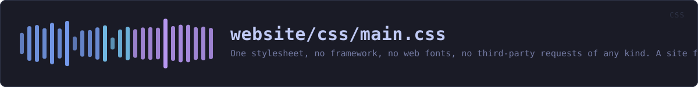

<!-- SPDX-License-Identifier: GPL-3.0-or-later -->
<!-- GENERATED by tools/docs/sources.py from the header comment in the
     source. Do not edit this file: edit the comment at the top of the
     source file and run the generator again. CI verifies it with
         python tools/docs/sources.py --check
-->

  

# `website/css/main.css`

[the source](https://github.com/tilas01/veilvoice/blob/main/website/css/main.css) &middot; 1891 lines

## What it does

One stylesheet, no framework, no web fonts, no third-party requests of any kind. A site for a privacy tool has no business loading a CDN: every remote asset is a request that tells someone else you were here.

Typography is monospace throughout, from the fonts the reader already has.

## In plain words

This is what the site looks like: the spacing, the type, the buttons, the diagrams and the animations.

There is no framework and no font downloaded from anywhere else. Every remote thing a page loads is a request that tells somebody else you were here, and a site for a privacy tool has no business making them. The type you see is one you already have.

## The sections it is made of

| Section | Line |
|---|---:|
| header | 102 |
| header on a phone | 166 |
| hero | 248 |
| the banner, drawn in CSS | 287 |
| the journey: a file in, a file out | 468 |
| the demonstration | 677 |
| tooltips | 806 |
| the cycling fact line | 936 |
| the veil animation | 1003 |
| reveal on scroll | 1040 |
| the walkthrough | 1059 |
| buttons | 1120 |
| sections | 1142 |
| verifier | 1254 |
| repo panel | 1302 |
| the repository panel, while it loads | 1309 |
| the screenshot gallery | 1360 |
| wiki | 1400 |
| footer | 1441 |
| welcome / legal gate | 1466 |
| search | 1579 |
| the JavaScript edition toggle | 1749 |
