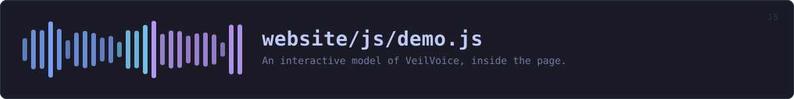
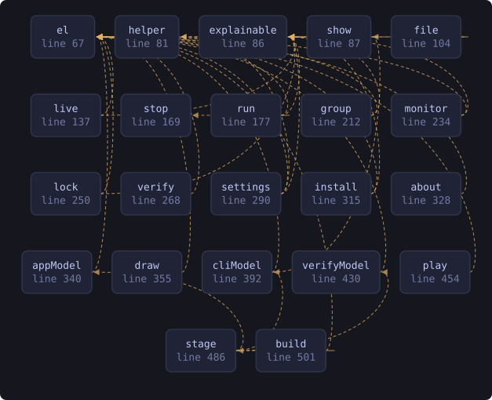

<!-- SPDX-License-Identifier: GPL-3.0-or-later -->
<!-- GENERATED by tools/docs/sources.py from the header comment in the
     source. Do not edit this file: edit the comment at the top of the
     source file and run the generator again. CI verifies it with
         python tools/docs/sources.py --check
-->

  

# `website/js/demo.js`

[the source](https://github.com/tilas01/veilvoice/blob/main/website/js/demo.js) &middot; 612 lines

## What it does

An interactive model of VeilVoice, inside the page.

# What this is for

Everything else on this site describes the program. The screenshots are photographs of it, which are honest and are still pictures: a reader cannot find out what happens when they change a setting, or what the command line answers, without downloading and running something. For a tool whose whole argument is "check this yourself", asking somebody to install it before they can look at it is the wrong way round.

So there is a model. Four of them, chosen from a strip at the top: the desktop application, the command line, both side by side, and the release verifier. They respond to clicks, they explain themselves as you go, and they run entirely in the page.

# The label, which is not optional

**This is a drawing, not the program.** The panels are written by hand, the device names and levels in them are illustrations, and nothing here veils any audio. That sentence is printed at the top of the overlay where a reader meets it, not buried in a comment, because a demonstration that lets somebody believe they have used the software is a demonstration that has misled them.

What is *not* invented is checked: the tabs come from the application's own source and the terminal replays exactly what each command printed, both through `demo-data.js`, which `tools/site/demo.py` generates and CI verifies. A model that drifts from the program is a claim rather than an omission.

# Why it is built here rather than shipped as a page

One overlay over whichever page the reader is on, so the demonstration is a thing you open and close rather than a place you navigate to and have to find your way back from. It is created on first open and reused after that, so a reader who never opens it pays for nothing but this file.

# No JavaScript

The buttons that open it are drawn only when scripts are running, through the `js` class `theme.js` sets on `<html>` from a blocking head script. A button that does nothing is worse than no button, and the scripts-off edition has the photographs, which is the honest alternative.

## In plain words

A pretend version of VeilVoice that you can click around in without installing anything: the app with its tabs, the command line with its real output, and the tool that checks a download.

It is a drawing. It says so at the top. Nothing you do in it touches any audio, and the numbers in it are made up for the picture. What is real is the list of tabs and what each command prints, both taken from the source code so this cannot quietly fall out of step with the program.

## What calls what

Read out of the source: an edge means the callee's name appears,
called, inside the caller's body. It is a syntactic reading, not a
resolved one, so a call made through a variable will not appear.

  

| Function | Line |
|---|---:|
| `el` | 67 |
| `helper` | 81 |
| `explainable` | 86 |
| `show` | 87 |
| `file` | 104 |
| `live` | 137 |
| `stop` | 169 |
| `run` | 177 |
| `group` | 212 |
| `monitor` | 234 |
| `lock` | 250 |
| `verify` | 268 |
| `settings` | 290 |
| `install` | 315 |
| `about` | 328 |
| `appModel` | 340 |
| `draw` | 355 |
| `cliModel` | 392 |
| `verifyModel` | 430 |
| `play` | 454 |
| `stage` | 486 |
| `build` | 501 |
| `onKey` | 550 |
| `hide` | 572 |
| `fromFragment` | 594 |
