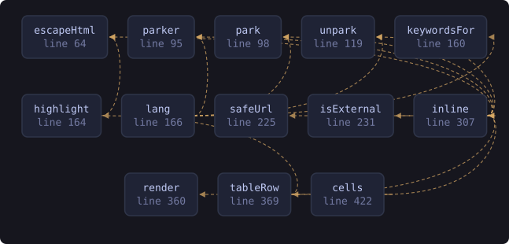

<!-- SPDX-License-Identifier: GPL-3.0-or-later -->
<!-- GENERATED by tools/docs/sources.py from the header comment in the
     source. Do not edit this file: edit the comment at the top of the
     source file and run the generator again. CI verifies it with
         python tools/docs/sources.py --check
-->

  

# `website/js/markdown.js`

[the source](https://github.com/tilas01/veilvoice/blob/main/website/js/markdown.js) &middot; 489 lines

## What it does

A small Markdown renderer and syntax highlighter.

# Why not a library

Pulling `marked` and `highlight.js` off a CDN would be three lines. It would also mean every visitor to a privacy tool's website makes requests to a third party that learns their IP address and what they were reading, and it would mean trusting code nobody here has read. This is a few hundred lines that does what this page needs and nothing else.

# Escaping

Everything is HTML-escaped *first*, and only the tags this renderer itself emits are ever introduced. Raw HTML in the source Markdown is shown as text rather than injected, so the README cannot inject script into this page even if it were altered upstream.

## In plain words

This turns the project's plain-text documents into the formatted pages you read, including the colours in the code examples.

Most sites borrow somebody else's code from another company's server to do this. That would tell that company your address and what you were reading. This is a few hundred lines written here instead, so nothing about your visit leaves this site.

## What calls what

Read out of the source: an edge means the callee's name appears,
called, inside the caller's body. It is a syntactic reading, not a
resolved one, so a call made through a variable will not appear.

  

| Function | Line |
|---|---:|
| `escapeHtml` | 64 |
| `parker` | 95 |
| `park` | 98 |
| `unpark` | 119 |
| `keywordsFor` | 160 |
| `highlight` | 164 |
| `lang` | 166 |
| `safeUrl` | 225 |
| `isExternal` | 231 |
| `inline` | 307 |
| `render` | 360 |
| `tableRow` | 366 |
| `cells` | 419 |
