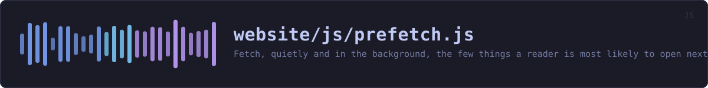
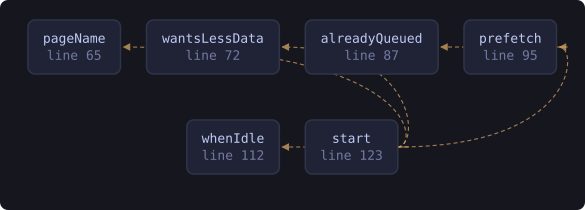

<!-- SPDX-License-Identifier: GPL-3.0-or-later -->
<!-- GENERATED by tools/docs/sources.py from the header comment in the
     source. Do not edit this file: edit the comment at the top of the
     source file and run the generator again. CI verifies it with
         python tools/docs/sources.py --check
-->

  

# `website/js/prefetch.js`

[the source](https://github.com/tilas01/veilvoice/blob/main/website/js/prefetch.js) &middot; 146 lines

## What it does

Fetch, quietly and in the background, the few things a reader is most likely to open next -- so that clicking them is instant instead of a wait.

# Why any of this is in JavaScript at all

Most of it is not. The pages carry `<link rel="prefetch">` in their markup, which is declarative, costs no script, and works in the JavaScript-free edition exactly as it does here. That is deliberate: a reader who runs no scripts should not get a slower site as a punishment.

This file exists for the one thing that should *not* be declared in markup: `search-index.json` is about a megabyte. A `<link rel="prefetch">` for it would be fetched by every visitor on every page, including somebody on a metered phone connection who never opens the search. So it is fetched from script, where the conditions below can be checked first.

# The conditions, and why each one

- `Save-Data`. If the reader has asked their browser to use less data, downloading a megabyte they did not ask for is precisely the thing they asked not to happen. - `prefers-reduced-data`. The same request expressed as a media query, which is what Safari implements. - `effectiveType`. On 2G, a megabyte in the background competes with the page the reader is actually trying to read. - Idle time. `requestIdleCallback` means this never runs while the browser has something better to do. Without it a prefetch can delay the very page it was meant to make faster.

# Same origin only

Every URL here is a path on this site. This is stated because a prefetch is a real network request, and a privacy tool that quietly reached a third party to make itself feel fast would be undermining its own argument. There is no third-party host in this file and there is nothing to configure.

## In plain words

This quietly fetches the one or two pages you are most likely to click next, so that when you do, they are already there.

Almost all of it is done by the pages themselves without any code at all. This file exists for the search index, which is about a megabyte -- too much to pull down on a phone on a slow connection for something you might never open. So it asks the browser how good the connection is, and skips it when the answer is "not very".

## What calls what

Read out of the source: an edge means the callee's name appears,
called, inside the caller's body. It is a syntactic reading, not a
resolved one, so a call made through a variable will not appear.

  

| Function | Line |
|---|---:|
| `pageName` | 65 |
| `wantsLessData` | 72 |
| `alreadyQueued` | 87 |
| `prefetch` | 95 |
| `whenIdle` | 112 |
| `start` | 123 |
