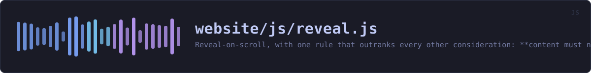
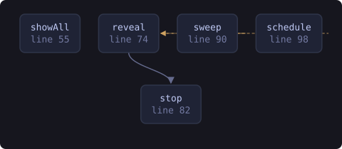

<!-- SPDX-License-Identifier: GPL-3.0-or-later -->
<!-- GENERATED by tools/docs/sources.py from the header comment in the
     source. Do not edit this file: edit the comment at the top of the
     source file and run the generator again. CI verifies it with
         python tools/docs/sources.py --check
-->

  

# `website/js/reveal.js`

[the source](https://github.com/tilas01/veilvoice/blob/main/website/js/reveal.js) &middot; 125 lines

## What it does

Reveal-on-scroll, with one rule that outranks every other consideration: **content must never stay invisible.**

The first version of this file broke that rule, and it took rendering the page to notice. An IntersectionObserver fires when an element's intersection ratio crosses a threshold. If the viewport *jumps* -- an anchor link from the nav, a browser restoring your scroll position when you come back, a find-in-page hit -- an element can go from below the viewport to above it between two frames. It was not intersecting before and is not intersecting after, the ratio never left zero, and no callback ever runs. Because a reveal that re-hides on scroll-up is a gimmick, nothing ever showed it again.

Three paragraphs of the walkthrough were invisible that way, and one of them was the box explaining that the app lock is not tamper-proof. A page whose entire argument is that it states its limits had made a limit unreadable.

So there are two mechanisms here, and they are not redundant:

1. The observer, which does the animation and costs nothing while idle. 2. A sweep, which asks a much simpler question -- "is this element at or above the bottom of the viewport?" -- and reveals anything that is, whether or not the observer ever saw it cross. It runs on scroll and resize, coalesced into one animation frame, and **both listeners and the observer detach the moment the last element is revealed.** On an ordinary read that is a fraction of a second of work in total, and none at all thereafter.

The other constraints, unchanged:

- Never hide what cannot then be shown. The `.reveal` rule is scoped to `html.js`, set by `theme.js` from a blocking head script, so a reader without JavaScript sees everything immediately. - Animate only `opacity` and `transform`, which the compositor handles without laying out the page again. - Obey `prefers-reduced-motion`: someone who asked the system for less movement gets the content with no movement at all.

## In plain words

This is the gentle fade as sections of the page come into view.

It is written around one rule that matters more than the effect: text must never end up invisible. An earlier version could leave whole paragraphs hidden if you jumped down the page, which was found by looking at the page rather than by any test. If anything at all goes wrong now, everything simply shows.

If you have asked your computer for less movement, there is no fade at all.

## What calls what

Read out of the source: an edge means the callee's name appears,
called, inside the caller's body. It is a syntactic reading, not a
resolved one, so a call made through a variable will not appear.

  

| Function | Line |
|---|---:|
| `showAll` | 55 |
| `reveal` | 74 |
| `stop` | 82 |
| `sweep` | 90 |
| `schedule` | 98 |
