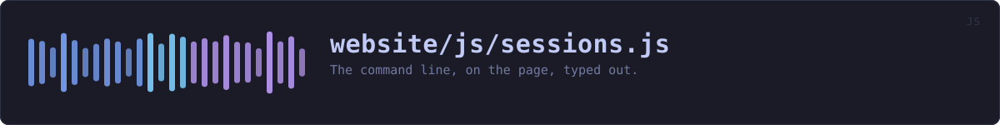
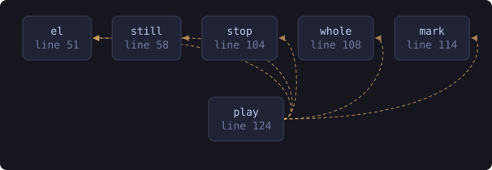

<!-- SPDX-License-Identifier: GPL-3.0-or-later -->
<!-- GENERATED by tools/docs/sources.py from the header comment in the
     source. Do not edit this file: edit the comment at the top of the
     source file and run the generator again. CI verifies it with
         python tools/docs/sources.py --check
-->

  

# `website/js/sessions.js`

[the source](https://github.com/tilas01/veilvoice/blob/main/website/js/sessions.js) &middot; 219 lines

## What it does

The command line, on the page, typed out.

# What this plays, and why it is not a drawing

Five recordings of the real programs: the bytes `veilvoice` wrote on a real terminal, with the passphrases typed at the real prompts. `tools/shots/ sessions.py` records them into `assets/screenshots/session-*.txt` and `tools/site/demo.py` turns those into `window.VEILVOICE_DEMO.sessions`, which CI regenerates and compares. Nothing here is written by hand, so nothing here can quietly stop matching the program.

The one invented thing is the pacing. A session that arrives all at once is a paste rather than a session, so the typing is played at about the speed somebody types and the output at about the speed a terminal fills. That is the whole of the fiction and it is stated here rather than implied.

# What used to be here instead

A hand-built model of the desktop application, drawn in CSS, opened from a button as an overlay over whichever page the reader was on. It responded to clicks and it was a drawing: the device names, the levels and the panels were all written by hand, and it veiled no audio. It was labelled as a drawing, and a label is a weaker thing than not needing one.

It was also redundant. The real window is photographed on every build, nine captures, one per screen, and those are on this page too. Offering a reader a drawing of an interface *and* photographs of the same interface asks them to work out which one to believe, on a site whose argument is that they should not have to take anybody's word for anything.

So the drawing is gone and this is what replaced it: the recordings, on the page rather than behind a button, above the photographs of the window.

## In plain words

Plays back real terminal sessions at typing speed, so you can see what the program actually prints without installing it.

## What calls what

Read out of the source: an edge means the callee's name appears,
called, inside the caller's body. It is a syntactic reading, not a
resolved one, so a call made through a variable will not appear.

  

| Function | Line |
|---|---:|
| `el` | 51 |
| `still` | 58 |
| `stop` | 104 |
| `whole` | 108 |
| `mark` | 114 |
| `play` | 124 |
